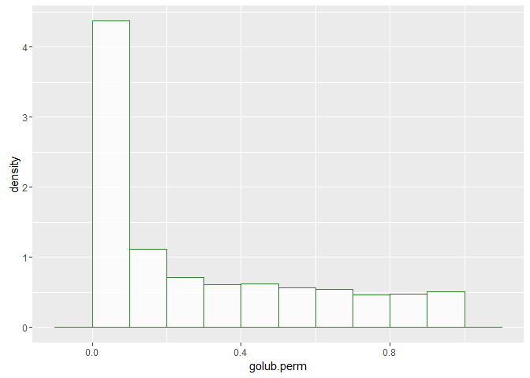

# Computer Intensive Methods for Bioinformatics - Homework 1
Pieter Moris  
17 november 2015  

#Question 1: Permutations P-value

We will investigate the influence of the number of permutations on tests of inference. We will use the golub dataset as an example. This dataset consists of the gene expression levels for **3051 genes** from a leukemia microarray study. There are **two tumor classes** in the samples: 27 originate from acute lymphoblastic leukemia (ALL), whereas the remaining 11 samples came from acute myeloid leukemia (AML) tumors. The question of interest is which of these 3051 genes are **differentially expressed** across the two conditions, i.e. $H_0: \mu_{healthy} = \mu_{diseased} \text{ vs } H_a: \mu_{healthy} \ne \mu_{diseased}$. We will use a significance level $\alpha = 0.1$ for all the following tests.


```r
library(Biobase)
library("multtest")
```

```r
data(golub)
head(golub)
```

```
##          [,1]     [,2]     [,3]     [,4]     [,5]     [,6]     [,7]
## [1,] -1.45769 -1.39420 -1.42779 -1.40715 -1.42668 -1.21719 -1.37386
## [2,] -0.75161 -1.26278 -0.09052 -0.99596 -1.24245 -0.69242 -1.37386
## [3,]  0.45695 -0.09654  0.90325 -0.07194  0.03232  0.09713 -0.11978
## [4,]  3.13533  0.21415  2.08754  2.23467  0.93811  2.24089  3.36576
## [5,]  2.76569 -1.27045  1.60433  1.53182  1.63728  1.85697  3.01847
## [6,]  2.64342  1.01416  1.70477  1.63845 -0.36075  1.73451  3.36576
##          [,8]     [,9]    [,10]    [,11]    [,12]    [,13]    [,14]
## [1,] -1.36832 -1.47649 -1.21583 -1.28137 -1.03209 -1.36149 -1.39979
## [2,] -0.50803 -1.04533 -0.81257 -1.28137 -1.03209 -0.74005 -0.83161
## [3,]  0.23381  0.23987  0.44201 -0.39560 -0.62533  0.45181  1.09519
## [4,]  1.97859  2.66468 -1.21583  0.59110  3.26050 -1.36149  0.64180
## [5,]  1.12853  2.17016 -1.21583 -1.10133  2.59982 -1.36149  0.22853
## [6,]  0.96870  2.72368 -1.21583  1.20192  2.83418 -1.36149  1.32744
##        [,15]    [,16]    [,17]    [,18]    [,19]    [,20]    [,21]
## [1,] 0.17628 -1.40095 -1.56783 -1.20466 -1.24482 -1.60767 -1.06221
## [2,] 0.41200 -1.27669 -0.74370 -1.20466 -1.02380 -0.38779 -1.06221
## [3,] 1.09318  0.34300  0.20010  0.38992  0.00641  1.10932  0.21952
## [4,] 2.32621 -1.40095 -1.56783  0.83502 -1.24482 -1.60767 -1.06221
## [5,] 2.34494 -1.40095 -1.56783  0.94532 -1.24482 -1.60767 -1.06221
## [6,] 1.52458 -1.40095 -1.56783 -0.23780 -1.24482 -1.60767 -1.06221
##         [,22]    [,23]    [,24]    [,25]    [,26]    [,27]    [,28]
## [1,] -1.12665 -1.20963 -1.48332 -1.25268 -1.27619 -1.23051 -1.43337
## [2,] -1.12665 -1.20963 -1.12185 -0.65264 -1.27619 -1.23051 -1.18065
## [3,] -0.72267  0.51690  0.28577  0.61937  0.20085  0.29278  0.26624
## [4,]  3.69445  3.70837 -1.48332  2.36698 -1.27619  2.89604  0.71990
## [5,]  3.52458  3.70837 -1.48332  1.79168 -1.27619  2.24892  0.02799
## [6,]  3.25470  2.73916 -1.48332  2.23430 -1.27619  1.83594  1.31110
##         [,29]    [,30]    [,31]    [,32]    [,33]    [,34]    [,35]
## [1,] -1.08902 -1.29865 -1.26183 -1.44434  1.10147 -1.34158 -1.22961
## [2,] -1.08902 -1.05094 -1.26183 -1.25918  0.97813 -0.79357 -1.22961
## [3,] -0.43377 -0.10823 -0.29385  0.05067  1.69430 -0.12472  0.04609
## [4,]  0.29598 -1.29865  2.76869  2.08960  0.70003  0.13854  1.75908
## [5,] -1.08902 -1.29865  2.00518  1.17454 -1.47218 -1.34158  1.55086
## [6,] -1.08902 -1.29865  1.73780  0.89347 -0.52883 -1.22168  0.90832
##         [,36]   [,37]    [,38]
## [1,] -0.75919 0.84905 -0.66465
## [2,] -0.71792 0.45127 -0.45804
## [3,]  0.24347 0.90774  0.46509
## [4,]  0.06151 1.30297  0.58186
## [5,] -1.18107 1.01596  0.15788
## [6,] -1.39906 0.51266  1.36249
```

```r
golub.cl # 0 ALL vs 1 AML
```

```
##  [1] 0 0 0 0 0 0 0 0 0 0 0 0 0 0 0 0 0 0 0 0 0 0 0 0 0 0 0 1 1 1 1 1 1 1 1
## [36] 1 1 1
```

We could perform a simple t-test for each gene (or hypothesis) separetely:


```r
library(ggplot2)
```

```
## Warning: package 'ggplot2' was built under R version 3.2.3
```

```r
tstatistics <- mt.teststat(X=golub,classlabel = golub.cl,test="t.equalvar")
pvalues<- 1 - pt(abs(tstatistics),df=dim(golub)[2]-2)
ggplot() + geom_point(aes(x=seq_along(tstatistics),y=tstatistics,colour=pvalues>0.1))
```


```r
ggplot() + geom_histogram(aes(x=pvalues,y=..density..),binwidth=0.1,alpha=0.8,colour='darkgreen',fill='white')
```


However, because we are conducting a large amount of tests we are **inflating the type 1 error**: the chance of finding at least one false positive quickly approaches 1 as the number of tests increases $1-(1-\alpha)^m$, where $m$ is the number of tests and $1-\alpha$ is the confidence level for 1 test, i.e. the probability of not making any type one errors.

To remedy this we will **adjust for multiplicity** by adjusting either the **family wise error rate**, which controls the probability of making at least 1 type one error, or the **false discovery rate**, which controls the proportion of false positives amongst all rejected hypotheses.


```r
adjusted = mt.rawp2adjp(pvalues, proc=c("Bonferroni", "Holm", "BH"),alpha=0.1)
adjusted$adjp[1:10, ] # ordered from low to high!
```

```
##               rawp   Bonferroni         Holm           BH
##  [1,] 1.574296e-12 4.803178e-09 4.803178e-09 4.803178e-09
##  [2,] 2.288957e-10 6.983607e-07 6.981318e-07 3.491804e-07
##  [3,] 5.175171e-10 1.578945e-06 1.577910e-06 5.263149e-07
##  [4,] 8.864107e-10 2.704439e-06 2.701780e-06 6.743409e-07
##  [5,] 1.282689e-09 3.913483e-06 3.908353e-06 6.743409e-07
##  [6,] 1.354286e-09 4.131928e-06 4.125157e-06 6.743409e-07
##  [7,] 1.738837e-09 5.305193e-06 5.294760e-06 6.743409e-07
##  [8,] 1.768183e-09 5.394727e-06 5.382350e-06 6.743409e-07
##  [9,] 2.447666e-09 7.467829e-06 7.448247e-06 8.297587e-07
## [10,] 1.183402e-08 3.610560e-05 3.599909e-05 3.449761e-06
```

```r
mt.plot(adjusted$adjp,tstatistics,plottype="pvsr",proc=dimnames(adjusted$adjp)[[2]],leg=c(1700,0.95),lty=1,col=1:4,lwd=2)
```


```r
treject <- sum(adjusted$adjp[,4]< 0.1)
```

The above tests rely on distributional assumptions of the t-statistic. We can avoid this by utilising **resampling** methods. In the following we will use a permutation strategy to approximate the sampling distribution of the t-statistic **under the null hypothesis** of no differential expression, i.e. each sample could belong to either the ALL or AML group.


```r
permutationPvalues <- function(x,B,grouping) {
  genes <- dim(x)[1]
  nsamples <- ncol(x)
  t.perm <- matrix(nrow=genes,ncol=B)
  
  for(b in 1:B) {
    permutedColumns <- sample(nsamples,replace=FALSE) # permutation of 1:n by which we will select matrix columns
    group1.col.perm <- permutedColumns[grouping == 0] # assign first n1 samples to group 1
    group1.perm <- x[,group1.col.perm]
    group2.col.perm <- permutedColumns[grouping == 1] # assign remaining n2 samples to group 2
    group2.perm <- x[,group2.col.perm]
    x.perm <- cbind(group1.perm,group2.perm) # new matrix with permutated columns
    t.perm[,b] <- mt.teststat(X=x.perm,classlabel = grouping,test="t.equalvar") # perform t-test for each row
    # each row of this matrix contains a row of B t statistics, one row per gene, 
    # based on samples that were permuted across conditions.
  }
  # calculate the observed test statistic per gene/row
  t.obs <-mt.teststat(X=x,classlabel = grouping,test="t.equalvar")
  
  # calculate the number of test statistics that are larger
  # in absolute value than the observed test statistic of each gene,
  # this gives us the p-values (using the joint distribution)
  p.perm <- c(1:genes) # vector containing a p-value for each gene
  p.perm <- sapply(t.obs, function(x) sum( abs(t.perm) > abs(x) ) / (B * genes) )
#   for (gene in 1:genes) {
#     p.perm[gene] <- sum(abs(t.perm) > abs(t.obs[gene])) / (B * genes)
#     }
  return(p.perm)
} 

golub.perm <- permutationPvalues(golub,50,golub.cl)
ggplot() + geom_histogram(aes(x=golub.perm,y=..density..),binwidth=0.1,alpha=0.8,colour='darkgreen',fill='white')
```



Just as before, we should apply a **multiplicity** correction:


```r
adjusted.perm = mt.rawp2adjp(golub.perm, proc=c("Bonferroni", "Holm", "BH"),alpha=0.1)
adjusted.perm$adjp[1:10, ] # ordered from low to high!
```

```
##       rawp Bonferroni Holm BH
##  [1,]    0          0    0  0
##  [2,]    0          0    0  0
##  [3,]    0          0    0  0
##  [4,]    0          0    0  0
##  [5,]    0          0    0  0
##  [6,]    0          0    0  0
##  [7,]    0          0    0  0
##  [8,]    0          0    0  0
##  [9,]    0          0    0  0
## [10,]    0          0    0  0
```

```r
mt.plot(adjusted.perm$adjp,tstatistics,plottype="pvsr",proc=dimnames(adjusted$adjp)[[2]],leg=c(1700,0.95),lty=1,col=1:4,lwd=2)
```


Where are these zeros coming from? Well, we only used 50 permutations, so there are a number of genes for which none of the permuted test statistics are more extreme than the observed one, resulting in a p-value of zero. Let's see if we can improve our result by increasing the number of permutations.


```r
Sys.time()->start;
i = 1
golub.perm = list()
adjusted.perm = list()
rejected <- c()
for(B in c(50,75,100,500,1000)){
  golub.perm[[i]] <- permutationPvalues(golub,B,golub.cl)
  print(ggplot() + geom_histogram(aes(x=golub.perm[[i]],y=..density..),binwidth=0.1,alpha=0.8,colour='darkgreen',fill='white'))
  adjusted.perm[[i]] = mt.rawp2adjp(golub.perm[[i]], proc=c("BH"),alpha=0.1)
  print(adjusted.perm[[i]]$adjp[1:10, ]) # ordered from low to high!
  mt.plot(adjusted.perm[[1]]$adjp,tstatistics,plottype="pvsr",proc=dimnames(adjusted.perm[[i]]$adjp)[[2]],leg=c(1700,0.95),lty=1,col=1:4,lwd=2)
  rejected[i] <- sum(golub.perm[[i]] < 0.1)
  i = i+1
}
```


```
##       rawp BH
##  [1,]    0  0
##  [2,]    0  0
##  [3,]    0  0
##  [4,]    0  0
##  [5,]    0  0
##  [6,]    0  0
##  [7,]    0  0
##  [8,]    0  0
##  [9,]    0  0
## [10,]    0  0
```


```
##       rawp BH
##  [1,]    0  0
##  [2,]    0  0
##  [3,]    0  0
##  [4,]    0  0
##  [5,]    0  0
##  [6,]    0  0
##  [7,]    0  0
##  [8,]    0  0
##  [9,]    0  0
## [10,]    0  0
```


```
##       rawp BH
##  [1,]    0  0
##  [2,]    0  0
##  [3,]    0  0
##  [4,]    0  0
##  [5,]    0  0
##  [6,]    0  0
##  [7,]    0  0
##  [8,]    0  0
##  [9,]    0  0
## [10,]    0  0
```


```
##       rawp BH
##  [1,]    0  0
##  [2,]    0  0
##  [3,]    0  0
##  [4,]    0  0
##  [5,]    0  0
##  [6,]    0  0
##  [7,]    0  0
##  [8,]    0  0
##  [9,]    0  0
## [10,]    0  0
```


```
##       rawp BH
##  [1,]    0  0
##  [2,]    0  0
##  [3,]    0  0
##  [4,]    0  0
##  [5,]    0  0
##  [6,]    0  0
##  [7,]    0  0
##  [8,]    0  0
##  [9,]    0  0
## [10,]    0  0
```


```r
ggplot() + geom_line(aes(y=rejected,x=c(50,75,100,500,1000)),alpha=0.8,colour='darkgreen') + ylab("Number of rejected hypotheses") + xlab('Number of permutations')
```


```r
print(Sys.time()-start);
```

```
## Time difference of 4.850177 mins
```

```r
treject # rejected hypotheses by t-test
```

```
## [1] 1204
```
