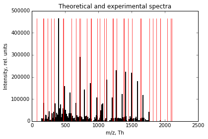

# MS2 experimental spectrum to database search

This documentation describes the various methods implemented in the ms2matcher package. First we will provide a short demonstration on how to use the package and later we will show how the underlying functions work and the intermediate output that they provide.

In addition to this document, the main functions can all be found in the \ms2matcher folder in the main module file ms2matcher.py. All methods are documented according to the  NumPy/SciPy style convention (https://github.com/numpy/numpy/blob/master/doc/HOWTO_DOCUMENT.rst.txt), providing a clear overview of the required inputs and delivered outputs for each method, as well as the design philosephy and inter-dependencies between the methods.

# Using the software

The package can be run via the command line by calling 'python main.py' followed by the absolute path to an experimental spectrum .dta file and optionally the MS1 ( '-t1 --toleranceMS1' ) and MS2 mass tolerance ( '-t2 --toleranceMS2' ). The default values are 50 ppm and 0.1 Dalton respectively.

<pre>
python main.py path/to/file.dta -t1 50 -t2 01
</pre>

Running 'python main.py --help' also provides an overview of the accepted arguments.

# Step-by-step walkthrough

## Importing protein and peptide databases (in .fasta format)

First the package will read in the protein and peptide digests databases which are located in the /data folder of the package. The following lines of code show how the relative paths are defined.


```python
import os,sys
import inspect
currentdir = os.path.dirname(os.path.abspath(inspect.getfile(inspect.currentframe())))
parentdir = os.path.dirname(currentdir)
moduledir = os.path.normpath(os.path.join(parentdir, 'ms2matcher'))
sys.path.insert(0,moduledir)
import ms2matcher as ms

data_path = 'data'
database_path = 'database'
spectra_path = 'spectra'
proteinDatabasePath = os.path.normpath(os.path.join(parentdir, data_path,database_path,'studentP.fasta'))
peptideDatabasePath = os.path.normpath(os.path.join(parentdir, data_path,database_path,'studentP_peptides.fasta'))
decoyDatabasePath = os.path.normpath(os.path.join(parentdir, data_path,database_path,'studentD.fasta'))
decoyPeptideDatabasePath = os.path.normpath(os.path.join(parentdir, data_path,database_path,'studentD_peptides.fasta'))
```

The .fasta databases are imported into a pandas DataFrame. One column contains the sequences of the peptides/proteins, while the other contains either the UniProtKB/Swiss-Prot identifiers (for the proteins) or the **monoisotopic masses** (for the peptides).


```python
# read in protein, peptide and decoy databases
proteinData = ms.importProteins(proteinDatabasePath)
peptideData = ms.importPeptides(peptideDatabasePath)
decoyPeptideData = ms.importPeptides(decoyPeptideDatabasePath)
decoyData = ms.importProteins(decoyDatabasePath)
```


```python
print(peptideData[:10])
```

       Monoisotopic Mass         Sequence
    0         1598.71340  SMGETESGDAFLDLK
    1          626.37516           KPPASK
    2          511.23254             CPHR
    3          858.46985          EELLDIK
    4          709.37589           ELPHSK
    5         1046.51790        QRPSCLSEK
    6         1309.54630      YDSDGVWDPEK
    7         1243.60980      WHASLYPASGR
    8          845.44945         SSPVESLK
    9         1299.67830      ELDTDRPSLVR
    

## Importing experimental spectra (.dta)

Experimental spectra are imported into numpy arrays. Normally, the path to the file is specified when the tool is run via the command line, but for demonstration purposes the underlying function is shown here.

The .dta file is a tab-deliminated file where the first line contains the precursor m/z value (in (M+H)^+1 format) and the charge, and all the following lines contain **m/z values and intensities**.


```python
expSpec = ms.importExperimentalSpectrum(os.path.normpath(os.path.join(parentdir, data_path,spectra_path,'hela1ugul.2404.2404.2.dta')))
print(expSpec[:10])
```

    [[  2.10287407e+03   2.00000000e+00]
     [  1.47075820e+02   1.32865000e+04]
     [  1.56076000e+02   2.53626000e+03]
     [  1.57060290e+02   1.16938000e+04]
     [  1.58091720e+02   2.67873000e+03]
     [  1.63059860e+02   2.38194000e+03]
     [  1.68064500e+02   4.42759000e+03]
     [  1.72071260e+02   1.04343000e+04]
     [  1.75070980e+02   3.96961000e+04]
     [  1.75118410e+02   8.27672000e+04]]
    

For easy retrieval later on the information regarding the precursor ion and the fragmentation peaks are separated.

Note that the **precursor mass** in the .dta file is the charged parent ion (i.e. (M+H)+1 ) monoisotopic mass. We subtract the mass of one proton (1.0072764) to obtain the **uncharged monoisotopic parent mass** from this.


```python
precursorMass = ms.getPrecursorMass(expSpec)
precursorCharge = ms.getPrecursorCharge(expSpec) if ms.getPrecursorCharge(expSpec)==1 else ms.getPrecursorCharge(expSpec)-1
expMZ = ms.getExperimentalMZs(expSpec)
print(precursorMass)
print(precursorCharge)
```

    2101.8667935999997
    1
    

## Peptide candidates - mass filter

The peptide database is filtered for potential **peptide candidates** based on the monoisotopic mass of the experimental parent peptide. The default **mass tolerance** is 50 ppm, but this can be specified in the command line using the argument -t1. 

For example, for the given spectrum, the theoretical peptides can deviate, in either direction, with a value of: $$\frac{\text{Precursor Mass}\times 50}{10^6} = \frac{2101.8667936\times50}{10^6} = 0.10509333968$$


```python
print(precursorMass*50/1000000)
```

    0.10509333968
    

This results in the following peptide candidates in the database.


```python
peptideCands = ms.peptideCandidates(precursorMass,peptideDatabase=peptideData,massAccuracy=50)
print(peptideCands)
```

          Monoisotopic Mass                   Sequence
    1645          2101.9246         AVDWWGLGVVMYEMMCGR
    1657          2101.8744  SSGNSSSSGSGSGSTSAGSSSPGAR
    1730          2101.9246         AVDWWGLGVVMYEMMCGR
    1773          2101.9246         AVDWWGLGVVMYEMMCGR
    1812          2101.8456        GDDEEGECSIDYVEMAVNK
    2192          2101.9341        DFNGSDASTQLNTHYAFSK
    3325          2101.8744  SSGNSSSSGSGSGSTSAGSSSPGAR
    

## Peptide candidates - fragmenting into b and y ions

For each of the candidate peptides in the filtered pandas DataFrame, the b and y ions are generated and the **monoisotopic masses** are calculated for the specified charge (default value is precursor charge minus 1, or 1 for those with charge 1). The resulting masses are stored in separate numpy arrays for the b and y ions and both are combined into a dictionary.


```python
seq = 'AVDWWGLGVVMYEMMCGR'
print('y ions',[seq[i:] for i in range(len(seq))])
print('b ions:',[seq[:i+1] for i in range(len(seq))])

print(ms.getAllFragmentsChargeX(sequence='AVDWWGLGVVMYEMMCGR',charge=precursorCharge))
```

    y ions ['AVDWWGLGVVMYEMMCGR', 'VDWWGLGVVMYEMMCGR', 'DWWGLGVVMYEMMCGR', 'WWGLGVVMYEMMCGR', 'WGLGVVMYEMMCGR', 'GLGVVMYEMMCGR', 'LGVVMYEMMCGR', 'GVVMYEMMCGR', 'VVMYEMMCGR', 'VMYEMMCGR', 'MYEMMCGR', 'YEMMCGR', 'EMMCGR', 'MMCGR', 'MCGR', 'CGR', 'GR', 'R']
    b ions: ['A', 'AV', 'AVD', 'AVDW', 'AVDWW', 'AVDWWG', 'AVDWWGL', 'AVDWWGLG', 'AVDWWGLGV', 'AVDWWGLGVV', 'AVDWWGLGVVM', 'AVDWWGLGVVMY', 'AVDWWGLGVVMYE', 'AVDWWGLGVVMYEM', 'AVDWWGLGVVMYEMM', 'AVDWWGLGVVMYEMMC', 'AVDWWGLGVVMYEMMCG', 'AVDWWGLGVVMYEMMCGR']
    {'bIons+1': array([   72.04439025,   171.11280416,   286.13974719,   472.21906014,
             658.29837309,   715.31983681,   828.40390079,   885.42536451,
             984.49377842,  1083.56219233,  1214.60267725,  1377.66600578,
            1506.70859887,  1637.74908378,  1768.78956869,  1871.79875348,
            1928.8202172 ,  2084.92132822]), 'yIons+1': array([ 2102.9318929 ,  2031.89477912,  1932.82636521,  1817.79942218,
            1631.72010923,  1445.64079628,  1388.61933256,  1275.53526859,
            1218.51380486,  1119.44539095,  1020.37697704,   889.33649213,
             726.27316359,   597.23057051,   466.19008559,   335.14960068,
             232.14041589,   175.11895217])}
    

The **monoisotopic masses** are calculated using the pyteomics package. For more information, please check it documentation: https://pythonhosted.org/pyteomics/mass.html


```python
from pyteomics import mass
print(mass.calculate_mass(sequence='R',ion_type='y',charge=1))
print(mass.calculate_mass(sequence='R',ion_type='b',charge=1))
```

    175.11895217407
    157.10838749037
    

## Experimental peak matching

**For each experimental m/z value**, the **theoretical fragment masses** are queried to find a corresponding mass. The matching tolerance defaults to 0.1 Dalton, but can be specified in the command line using the parameter -t2.

If a matching value is found, in either the b or y ion array, the score is incremented by 1. A match in both the y and b ions would still count as a score of 1, although we do not expect this to occurr often, since there are no amino acids that differ by exactly 18 Da. 

This procedure is then performed for **every candidate peptide** and the scores are appended to the pandas DataFrame.


```python
peptideCands = ms.matchExpSpectrumToCandidatePeptides(expMZ,peptideCands,charge=precursorCharge,ms2tolerance=0.1)
print(peptideCands)
```

          Monoisotopic Mass                   Sequence  Score
    1645          2101.9246         AVDWWGLGVVMYEMMCGR      9
    1657          2101.8744  SSGNSSSSGSGSGSTSAGSSSPGAR     41
    1730          2101.9246         AVDWWGLGVVMYEMMCGR      9
    1773          2101.9246         AVDWWGLGVVMYEMMCGR      9
    1812          2101.8456        GDDEEGECSIDYVEMAVNK      5
    2192          2101.9341        DFNGSDASTQLNTHYAFSK      6
    3325          2101.8744  SSGNSSSSGSGSGSTSAGSSSPGAR     41
    

** explain: isotopic peaks missed + divide score by total spectrum mz?**

Note that we are matching experimental to theoretical fragments here. Our motivation for this is the following:

- Our main point of interest is the observed experimental spectrum. We aim to explain this data as good as possible. Any peak that can be found in the theoretical database is a peak that can be explained. 
- The reverse, checking how many of the theoretical peaks are actually observed, is of less importances in our opinion. Indeed, there could be many reasons why a certain theoretically predicted y or b ion might not be observed. But this does not mean that the experimental spectrum did not originate from the peptide in question.
- Any noise or contamination in the experimental spectrum might result in erroneous matches, but we are working under the assumption that the signal of the peptide that was selected during MS1 will be stronger than any of the noise.

Visually, the following is happening: all black peaks (experimental peaks) that overlap (given a certain error tolerance) with the red peaks (theoretical fragment masses) are counted.


```python
%matplotlib inline
import numpy as np
import pylab
pylab.figure()
pylab.title('Theoretical and experimental spectra')
pylab.xlabel('m/z, Th')
pylab.ylabel('Intensity, rel. units')
pylab.bar(expSpec[:,0], expSpec[:,1], width=0.1, linewidth=2,edgecolor='black')
theor_spectrum = list(ms.getAllFragmentsChargeX(peptideCands.loc[1645,'Sequence'],1).values())
theor_spectrum = np.vstack(theor_spectrum).flatten()
pylab.bar(theor_spectrum,[expSpec[:,1].max()]*len(theor_spectrum),width=0.1, edgecolor='red', alpha=0.7)
```


    <Container object of 36 artists>





## Decoy peak matching

The **decoy peptides** are filtered and the *in silico* y/b ions are derived in exactly the same manner as above.


```python
decoyCands = ms.peptideCandidates(precursorMass,peptideDatabase=decoyPeptideData,massAccuracy=50)
decoyCands = ms.matchExpSpectrumToCandidatePeptides(expMZ,decoyCands,charge=precursorCharge,ms2tolerance=0.1)
print(decoyCands)
```

# Confidence assignment


```python
peptideCands.loc[:,'P-value'] = peptideCands.apply(lambda row: (row['Score'] <= decoyCands.Score).sum() / decoyCands.Score.size,axis=1)


print(peptideCands)

```


```python

```
