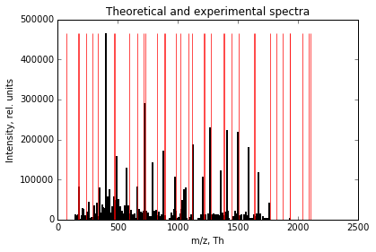

# Tandem MS database search using a decoy-based strategy

This documentation describes the various methods implemented in the ms2matcher package. First we will provide a short demonstration on how to use the package and later we will show how the underlying functions work and the intermediate output that they provide.

In addition to this document, the main functions can all be found in the \ms2matcher folder in the main module file ms2matcher.py. All methods are documented according to the  NumPy/SciPy style convention (https://github.com/numpy/numpy/blob/master/doc/HOWTO_DOCUMENT.rst.txt), providing a clear overview of the required inputs and delivered outputs for each method, as well as the design philosephy and inter-dependencies between the methods.

# Brief Overview
This tool implements a simple version of tandem mass spectrometry (MS2 or MS/MS) using a target-decoy database search strategy for the identification of experimentally derived mass spectra of fragmented peptides. For an introduction to tandem MS, please refer to Sadygov, Cociorva & Yates (2004), for a primer on decoy databases, see Käll et al. (2008), and for other topics please refer to the reference list at the end of this document.

# Using the software

The package can be run via the command line by calling 'python main.py' followed by the absolute path to a folder containing the experimental spectrum .dta files and optionally the MS1 ( '-t1 --toleranceMS1' ) and MS2 mass tolerance ( '-t2 --toleranceMS2' ). The default values are 50 ppm and 0.1 Dalton respectively.

<pre>
python main.py path/to/spectraFolder -t1 50 -t2 01
</pre>

Running 'python main.py --help' also provides an overview of the accepted arguments.

## Dependencies

This tool relies on the following packages:

- numpy (http://www.numpy.org/)
- pandas (http://pandas.pydata.org/)
- biopython (http://biopython.org/wiki/Main_Page)
- pyteomics (https://pythonhosted.org/pyteomics/)

Please refer to the packages' manuals, pip (https://docs.python.org/3.6/installing/index.html) or a package management system such as Conda (http://conda.pydata.org/docs/) for more information on how to install additional python packages.

# Step-by-step walkthrough

## Importing protein and peptide databases (in .fasta format)

First the package will read in the protein, peptide digests and reverse decoy databases which are located in the /data/database/ folder of the package. The following lines of code simply show how the relative paths are defined.


```python
import os,sys
import inspect
currentdir = os.path.dirname(os.path.abspath(inspect.getfile(inspect.currentframe())))
parentdir = os.path.dirname(currentdir)
moduledir = os.path.normpath(os.path.join(parentdir, 'ms2matcher'))
sys.path.insert(0,moduledir)
import ms2matcher as ms

data_path = 'data'
database_path = 'database'
spectra_path = 'spectra'
proteinDatabasePath = os.path.normpath(os.path.join(parentdir, data_path,database_path,'studentP.fasta'))
peptideDatabasePath = os.path.normpath(os.path.join(parentdir, data_path,database_path,'studentP_peptides.fasta'))
decoyDatabasePath = os.path.normpath(os.path.join(parentdir, data_path,database_path,'studentD.fasta'))
decoyPeptideDatabasePath = os.path.normpath(os.path.join(parentdir, data_path,database_path,'studentD_peptides.fasta'))
spectraFilePath = os.path.normpath(os.path.join(parentdir,data_path,spectra_path))
```

The .fasta databases are imported into a pandas dataframes. One column contains the sequences of the peptides/proteins, while the other contains either the UniProtKB/Swiss-Prot identifiers (for the proteins) or the **monoisotopic masses (M)** (for the peptides).


```python
proteinData = ms.importProteins(proteinDatabasePath)
peptideData = ms.importPeptides(peptideDatabasePath)
decoyPeptideData = ms.importPeptides(decoyPeptideDatabasePath)
decoyData = ms.importProteins(decoyDatabasePath)
```


```python
from IPython.display import display
display(peptideData[:5])
```


<div>
<table border="1" class="dataframe">
  <thead>
    <tr style="text-align: right;">
      <th></th>
      <th>Monoisotopic Mass</th>
      <th>Sequence</th>
    </tr>
  </thead>
  <tbody>
    <tr>
      <th>0</th>
      <td>1598.71340</td>
      <td>SMGETESGDAFLDLK</td>
    </tr>
    <tr>
      <th>1</th>
      <td>626.37516</td>
      <td>KPPASK</td>
    </tr>
    <tr>
      <th>2</th>
      <td>511.23254</td>
      <td>CPHR</td>
    </tr>
    <tr>
      <th>3</th>
      <td>858.46985</td>
      <td>EELLDIK</td>
    </tr>
    <tr>
      <th>4</th>
      <td>709.37589</td>
      <td>ELPHSK</td>
    </tr>
  </tbody>
</table>
</div>


## Importing experimental spectra (.dta)

Experimental spectra are imported into numpy arrays. Normally, the path to the file is specified when the tool is run via the command line, but for demonstration purposes the underlying function is shown here.

The .dta file is a tab-deliminated file where the first line contains the precursor m/z value (in (M+H)^+1 format) and the charge, and all the following lines contain **m/z values and intensities**.


```python
expSpec = ms.importExperimentalSpectrum(os.path.normpath(os.path.join(spectraFilePath,'hela1ugul.2404.2404.2.dta')))
print(expSpec[:10])
```


    array([[  2.10287407e+03,   2.00000000e+00],
           [  1.47075820e+02,   1.32865000e+04],
           [  1.56076000e+02,   2.53626000e+03],
           [  1.57060290e+02,   1.16938000e+04],
           [  1.58091720e+02,   2.67873000e+03],
           [  1.63059860e+02,   2.38194000e+03],
           [  1.68064500e+02,   4.42759000e+03],
           [  1.72071260e+02,   1.04343000e+04],
           [  1.75070980e+02,   3.96961000e+04],
           [  1.75118410e+02,   8.27672000e+04]])


    ---------------------------------------------------------------------------

    AttributeError                            Traceback (most recent call last)

    <ipython-input-40-6be61bdb9731> in <module>()
          1 expSpec = ms.importExperimentalSpectrum(os.path.normpath(os.path.join(spectraFilePath,'hela1ugul.2404.2404.2.dta')))
          2 display(expSpec[:10])
    ----> 3 HTML(expSpec[:10].to_html())
    

    AttributeError: 'numpy.ndarray' object has no attribute 'to_html'


For easy retrieval later on the information regarding the precursor ion and the fragmentation peaks are separated.

Note that the **precursor mass** in the .dta file is the charged parent ion (i.e. (M+H)+1 ) monoisotopic mass. We subtract the mass of one proton (1.0072764) to obtain the **uncharged monoisotopic parent mass (M)** from this, because this is the same format the peptide database has.


```python
precursorMass = ms.getPrecursorMass(expSpec)
precursorCharge = ms.getPrecursorCharge(expSpec) if ms.getPrecursorCharge(expSpec)==1 else ms.getPrecursorCharge(expSpec)-1
expMZ = ms.getExperimentalMZs(expSpec)
print(precursorMass)
print(precursorCharge)
```

    2101.8667935999997
    1
    

## Peptide candidates - mass filter

The peptide database is filtered for potential **peptide candidates** based on the monoisotopic mass of the experimental parent peptide. This step is done to reduce the search space to a more manageable size.

The default **mass tolerance** is 50 ppm, but this can be specified in the command line using the argument -t1. 

For example, for the given spectrum, the theoretical peptides can deviate, in either direction, with a value of: $$\frac{\text{Precursor Mass}\times 50}{10^6} = \frac{2101.8667936\times50}{10^6} = 0.10509333968$$


```python
print(precursorMass*50/1000000)
```

    0.10509333968
    

This results in the following peptide candidates in the database: these are all the sequences that fall inside an 0.10 window of the parent monoisotopic mass (M).


```python
peptideCands = ms.peptideCandidates(precursorMass,peptideDatabase=peptideData,massAccuracy=50)
print(peptideCands)
```

          Monoisotopic Mass                   Sequence
    1645          2101.9246         AVDWWGLGVVMYEMMCGR
    1657          2101.8744  SSGNSSSSGSGSGSTSAGSSSPGAR
    1730          2101.9246         AVDWWGLGVVMYEMMCGR
    1773          2101.9246         AVDWWGLGVVMYEMMCGR
    1812          2101.8456        GDDEEGECSIDYVEMAVNK
    2192          2101.9341        DFNGSDASTQLNTHYAFSK
    3325          2101.8744  SSGNSSSSGSGSGSTSAGSSSPGAR
    

## Peptide candidates - fragmenting into b and y ions

For each of the candidate peptides in the filtered pandas DataFrame, the b and y ions are generated and the **monoisotopic m/z values** are calculated for the specified charge (default value is precursor charge minus 1, or 1 for those with charge 1). The resulting masses are stored in separate numpy arrays for the b and y ions, and in the end both are combined into a dictionary.


```python
seq = 'AVDWWGLGVVMYEMMCGR'
print('y ions',[seq[i:] for i in range(len(seq))])
print('b ions:',[seq[:i+1] for i in range(len(seq))])

print(ms.getAllFragmentsChargeX(sequence='AVDWWGLGVVMYEMMCGR',charge=precursorCharge))
```

    y ions ['AVDWWGLGVVMYEMMCGR', 'VDWWGLGVVMYEMMCGR', 'DWWGLGVVMYEMMCGR', 'WWGLGVVMYEMMCGR', 'WGLGVVMYEMMCGR', 'GLGVVMYEMMCGR', 'LGVVMYEMMCGR', 'GVVMYEMMCGR', 'VVMYEMMCGR', 'VMYEMMCGR', 'MYEMMCGR', 'YEMMCGR', 'EMMCGR', 'MMCGR', 'MCGR', 'CGR', 'GR', 'R']
    b ions: ['A', 'AV', 'AVD', 'AVDW', 'AVDWW', 'AVDWWG', 'AVDWWGL', 'AVDWWGLG', 'AVDWWGLGV', 'AVDWWGLGVV', 'AVDWWGLGVVM', 'AVDWWGLGVVMY', 'AVDWWGLGVVMYE', 'AVDWWGLGVVMYEM', 'AVDWWGLGVVMYEMM', 'AVDWWGLGVVMYEMMC', 'AVDWWGLGVVMYEMMCG', 'AVDWWGLGVVMYEMMCGR']
    {'yIons+1': array([ 2102.9318929 ,  2031.89477912,  1932.82636521,  1817.79942218,
            1631.72010923,  1445.64079628,  1388.61933256,  1275.53526859,
            1218.51380486,  1119.44539095,  1020.37697704,   889.33649213,
             726.27316359,   597.23057051,   466.19008559,   335.14960068,
             232.14041589,   175.11895217]), 'bIons+1': array([   72.04439025,   171.11280416,   286.13974719,   472.21906014,
             658.29837309,   715.31983681,   828.40390079,   885.42536451,
             984.49377842,  1083.56219233,  1214.60267725,  1377.66600578,
            1506.70859887,  1637.74908378,  1768.78956869,  1871.79875348,
            1928.8202172 ,  2084.92132822])}
    

The **monoisotopic masses** are calculated using the pyteomics package. For more information, please check its documentation: https://pythonhosted.org/pyteomics/mass.html


```python
from pyteomics import mass
print(mass.calculate_mass(sequence='R',ion_type='y',charge=1))
print(mass.calculate_mass(sequence='R',ion_type='b',charge=1))
```

    175.11895217407
    157.10838749037
    

## Experimental peak matching

**For each experimental m/z value**, the **theoretical fragment masses** are queried to find a corresponding mass. The matching tolerance defaults to 0.1 Dalton, but can be specified in the command line using the parameter -t2.

If a matching value is found, in either the b or y ion array, the score is incremented by 1. A match in both the y and b ions would still only count as an increment of 1, although we do not expect this to occurr often, since the ion residu masses would have to differ by exactly 18 Da. 

After counting all the peaks, this sum is then divided by the total number of experimental peaks.

This procedure is then performed for **every candidate peptide** and the scores are appended to the pandas DataFrame. Note that duplicates are removed in case the peptide database is not unique.


```python
peptideCands = ms.matchExpSpectrumToCandidatePeptides(expMZ,peptideCands,charge=precursorCharge,ms2tolerance=0.1)
print(peptideCands)
```

          Monoisotopic Mass                   Sequence     Score
    1645          2101.9246         AVDWWGLGVVMYEMMCGR  0.024658
    1657          2101.8744  SSGNSSSSGSGSGSTSAGSSSPGAR  0.112329
    1812          2101.8456        GDDEEGECSIDYVEMAVNK  0.013699
    2192          2101.9341        DFNGSDASTQLNTHYAFSK  0.016438
    

### Motivation for using the percentage count as a score

Note that we are matching experimental to theoretical fragments here. We divided the number of matches by the total number of experimental peaks, as opposed to those in the theoretical spectrum. Our motivation for this is the following:

- Our main point of interest is the observed experimental spectrum. We aim to explain this data as good as possible. Any peak that can be found in the theoretical database is a peak that can be explained. 
- The reverse, checking how many of the theoretical peaks are actually observed, is of less importances in our opinion. Indeed, there could be many reasons why a certain theoretically predicted y or b ion might not be observed, e.g. incomplete fragmentation leads to missing ions. But this does not mean that the experimental spectrum did not originate from the peptide in question.
- By dividing by the number of expected theoretical peaks, we are penalizing observed spectra where for example the shortest or longest ions were not observed, but this should not be indicative of a worse match.
- The opposite does not hold either: a theoretical spectrum with only a few peaks might obtain a high score, if almost all of these can be matched to the theoretical spectrum. However, all the other true peaks in the theoretical spectrum cannot be explained by the theoretical one, yet we are not penalizing the score if we divide by the number of theoretical peaks. This peptide would obtain the same score as a peptide which matches additional theoretical peaks, or a lower score than a peptide which matches additional ones, but also lacks a few.
- Any electrical noise or chemical noise (contamination) in the experimental spectrum might result in erroneous matches, but we are working under the assumption that the signal of the peptide that was selected during MS1 will be stronger than the noise.
- Finally, if we would not use the percentage as a score, but rather the raw counts, the score would become less suitable for comparison across spectra, since short peptides would always result in lower scores. 

### Shortcomings
We do note that there are a few shortcomings to this method, which are addressed in other scoring functions such as the X!Tandem cross correlation score.

### A note about isotopic peaks

Our score does not take into account isotopic peaks in the theoretical spectrum, but we believe this is likely not a big issue:

- First of all, all theoretical spectra consist of only the monoisotopic m/z values.
- Consequently, all peptide candidates will fail to match to the higher mass isotopic peaks in the theoretical fragment (unless a different y/b ion has the same m/z as a higher order isotopic peak of a different ion). The scores of the peptides will systematically be lower by the same amount, i.e. their ranking will be consistent.

An alternative strategy would be to first de-isotope the experimental spectrum, but this would require accuracte calling of true peaks and can be difficult if there is noise or overlap between the b/y ion series.

### Visualisation of peak matching
Visually, the following is happening: all black peaks (experimental peaks) that overlap (given a certain error tolerance) with the red peaks (theoretical fragment masses) are counted.


```python
%matplotlib inline
import numpy as np
import pylab
pylab.figure()
pylab.title('Theoretical and experimental spectra')
pylab.xlabel('m/z, Th')
pylab.ylabel('Intensity, rel. units')
pylab.bar(expSpec[:,0], expSpec[:,1], width=0.1, linewidth=2,edgecolor='black')
theor_spectrum = list(ms.getAllFragmentsChargeX(peptideCands.loc[1645,'Sequence'],1).values())
theor_spectrum = np.vstack(theor_spectrum).flatten()
pylab.bar(theor_spectrum,[expSpec[:,1].max()]*len(theor_spectrum),width=0.1, edgecolor='red', alpha=0.7)
```


    <Container object of 36 artists>





## Decoy peak matching

The **reversed decoy peptides** are filtered and the *in silico* y/b ions are derived in exactly the same manner as above.


```python
decoyCands = ms.peptideCandidates(precursorMass,peptideDatabase=decoyPeptideData,massAccuracy=50)
decoyCands = ms.matchExpSpectrumToCandidatePeptides(expMZ,decoyCands,charge=precursorCharge,ms2tolerance=0.1)
print(decoyCands)
```

          Monoisotopic Mass             Sequence     Score
    1660          2101.9246   GCMMEYMVVGLGWWDVAR  0.019178
    2146          2101.9341  SFAYHTNLQTSADSGNFDK  0.013699
    

## Peptide Spectrum Match

For each spectrum, the top scoring peptide is selected as the **peptide spectrum match** (or PSM). Doing this for both the target and decoy database results in a target and decoy PSM as follows:


```python
targetPSM = peptideCands.loc[peptideCands['Score'].idxmax()].copy()
targetPSM['Type'] = 'Target'
targetPSM['Spectrum'] = 'hela1ugul.2404.2404.2.dta'
targetPSM = targetPSM.drop('Monoisotopic Mass')

decoyPSM =decoyCands.loc[decoyCands['Score'].idxmax()].copy()
decoyPSM['Type'] = 'Decoy'
decoyPSM['Spectrum'] = 'hela1ugul.2404.2404.2.dta'
decoyPSM = decoyPSM.drop('Monoisotopic Mass')

print(targetPSM,'\n')
print(decoyPSM)
```

    Sequence    SSGNSSSSGSGSGSTSAGSSSPGAR
    Score                        0.112329
    Type                           Target
    Spectrum    hela1ugul.2404.2404.2.dta
    Name: 1657, dtype: object 
    
    Sequence           GCMMEYMVVGLGWWDVAR
    Score                       0.0191781
    Type                            Decoy
    Spectrum    hela1ugul.2404.2404.2.dta
    Name: 1660, dtype: object
    

## Retrieving peptide spectrum matches for all the spectra

The following functions perform all of the procedures we described above, for all the specified spectra. When running this tool in the command line, all the .dta files in the specified folder will be considered.

All the intermediate steps (i.e. peptide scoring within a spectrum) are printed here for illustration purposes. The final dataframe at the bottom contains the **top target and decoy PSM's for each spectrum**.


```python
import pandas as pd
def getPSM(spectrumFile,folderPath,ms1Tolerance,ms2Tolerance):
    """
    For the provided spectrum, the peptide spectrum match (PSM) and associated
    score will be computed by filtering peptide candidates from the peptide database,
    using the ms1 tolerance (default = 50 ppm), generating b/y ions
    and calculating their m/z values (with the parent charge minus 1, or 1 for singly charged parents),
    and finally counting the number of matching peaks between the experimental and
    theoretical peptide spectrum (using the ms2 tolerance 0.1 Da).
    The same procedure is repeated by searching against the decoy peptide database.

    Parameters
    ----------
    spectrumFile : str
        The file name of experimental spectrum .dta file.
    folderPath : str
        The folder containing the experimental spectra .dta files.
        Provided by the calling function matchAllSpectra().
    ms1tolerance : float
        The ms1 mass filtering error tolerance to use, in ppm.
    ms2tolerance : float
        The ms2 error tolerance to use during peak matching, in Dalton.

    Returns
    -------
    targetPSM : Series
        A pandas series containing the target PSM score and sequence.
    decoyPSM : Series
        A pandas series containing the decoy PSM score and sequence.
    """

    # Read in experimental spectrum
    expSpec = ms.importExperimentalSpectrum(os.path.normpath(os.path.join(folderPath,spectrumFile)))

    # Retrieve parent mass (M) and charge to use: parent charge minus 1 unless parent charge is 1 already
    precursorMass = ms.getPrecursorMass(expSpec)
    precursorCharge = ms.getPrecursorCharge(expSpec) if ms.getPrecursorCharge(expSpec)==1 else ms.getPrecursorCharge(expSpec)-1

    # Retrieve experimental m/z values
    expMZ = ms.getExperimentalMZs(expSpec)

    # Find peptide candidates in database
    peptideCands = ms.peptideCandidates(precursorMass,peptideDatabase=peptideData,massAccuracy=ms1Tolerance)

    # Calculate scores for peptide candidates - use precursor charge -1
    peptideCands = ms.matchExpSpectrumToCandidatePeptides(expMZ,peptideCands,charge=precursorCharge,ms2tolerance=ms2Tolerance)

    # Retrieve highest score = target peptide spectrum match
    targetPSM = peptideCands.loc[peptideCands['Score'].idxmax()].copy()
    targetPSM['Type'] = 'Target'
    targetPSM['Spectrum'] = spectrumFile
    targetPSM = targetPSM.drop('Monoisotopic Mass')

    # Find peptide candidates in decoys
    decoyCands = ms.peptideCandidates(precursorMass,peptideDatabase=decoyPeptideData,massAccuracy=ms1Tolerance)

    # Calculate scores for peptide candidates - use precursor charge -1
    decoyCands = ms.matchExpSpectrumToCandidatePeptides(expMZ,decoyCands,charge=precursorCharge,ms2tolerance=ms2Tolerance)

    # Retrieve highest decoy score = decoy peptide spectrum match
    decoyPSM =decoyCands.loc[decoyCands['Score'].idxmax()].copy()
    decoyPSM['Type'] = 'Decoy'
    decoyPSM['Spectrum'] = spectrumFile
    decoyPSM = decoyPSM.drop('Monoisotopic Mass')
    
    print('Peptide matching scores for experimental spectrum ',spectrumFile)
    print(peptideCands,'\n')
    print('Target PSM: ',targetPSM,'\n')
    print('Decoy matching scores for experimental spectrum ',spectrumFile)
    print(decoyCands,'\n')
    print('Decoy PSM: ',decoyPSM,'\n')

    return targetPSM,decoyPSM

def matchAllSpectra(pathToSpectra,ms1Tolerance,ms2Tolerance):
    """
    For all the provided spectra files, the target and decoy peptide spectrum match (PSM)
    is returned.

    See the function getPSM() for more details.

    Parameters
    ----------
    pathToSpectra : The absolute path to the spectra .dta files.
    ms1tolerance : float
        The ms1 mass filtering error tolerance to use, in ppm.
    ms2tolerance : float
        The ms2 error tolerance to use during peak matching, in Dalton.

    Returns
    -------
    spectrumScoreDatabase : DataFrame
        A pandas DataFrame containing target and decoy PSM scores for all spectra.
    """

    # Initialise dataframe to store results
    spectrumScoreDatabase = pd.DataFrame()

    for f in os.listdir(pathToSpectra):
        print('Processing',f)
        if f.endswith(".dta"):
            target,decoy = getPSM(f,folderPath=pathToSpectra,ms1Tolerance=ms1Tolerance,ms2Tolerance=ms2Tolerance)
            spectrumScoreDatabase = spectrumScoreDatabase.append([target,decoy])
        else:
            continue

    # sort scores
    spectrumScoreDatabase = spectrumScoreDatabase.sort_values('Score',ascending=False)

    return spectrumScoreDatabase
PSM = matchAllSpectra(spectraFilePath,ms1Tolerance=50,ms2Tolerance=0.1)
print(PSM)
display(PSM)
HTML(PSM.to_html())
```

    Processing hela1ugul.12566.12566.2.dta
    Peptide matching scores for experimental spectrum  hela1ugul.12566.12566.2.dta
          Monoisotopic Mass             Sequence     Score
    632           1899.8904    GPNPAFWWVNGQGDEVK  0.018557
    1659          1899.8010   LGIYDADGDGDFDVDDAK  0.053608
    2035          1899.8495    ANPMYNAVSNADLMDFK  0.008247
    2657          1899.8363      NNFEFCEAHIPFYNR  0.014433
    3030          1899.8017  TSSSSCSAHSSFSSTGQPR  0.012371
    3379          1899.7855     CFSLDAFCHHFSNMNK  0.014433 
    
    Target PSM:  Sequence             LGIYDADGDGDFDVDDAK
    Score                         0.0536082
    Type                             Target
    Spectrum    hela1ugul.12566.12566.2.dta
    Name: 1659, dtype: object 
    
    Decoy matching scores for experimental spectrum  hela1ugul.12566.12566.2.dta
          Monoisotopic Mass            Sequence     Score
    1730          1899.8010  ADDVDFDGDGDADYIGLK  0.039175
    3429          1899.7855    NMNSFHHCFADLSFCK  0.012371 
    
    Decoy PSM:  Sequence             ADDVDFDGDGDADYIGLK
    Score                         0.0391753
    Type                              Decoy
    Spectrum    hela1ugul.12566.12566.2.dta
    Name: 1730, dtype: object 
    
    Processing hela1ugul.16509.16509.3.dta
    Peptide matching scores for experimental spectrum  hela1ugul.16509.16509.3.dta
          Monoisotopic Mass                 Sequence     Score
    102           2228.2093   LAPDPSLVIYAIFPSGGVVADK  0.020718
    389           2228.1338      AFNSHTWEQLGTLQLLSQR  0.012431
    812           2228.2430     LLLENVLPAHVAPQFIGQNR  0.019337
    1204          2228.0597  TEVEAGASGYSVTGGGDQGIFVK  0.023481
    1669          2228.1576    GAIETYQEVASLPDVPADLLK  0.029006
    2232          2228.1736    TALHLACANGHPEVVTLLVDR  0.020718
    2833          2228.0862    FWAANVPPSEALQPSSSPSTR  0.019337
    3162          2228.1107    HENNLSVLAISNMEASSTLAK  0.011050 
    
    Target PSM:  Sequence          GAIETYQEVASLPDVPADLLK
    Score                         0.0290055
    Type                             Target
    Spectrum    hela1ugul.16509.16509.3.dta
    Name: 1669, dtype: object 
    
    Decoy matching scores for experimental spectrum  hela1ugul.16509.16509.3.dta
          Monoisotopic Mass                 Sequence     Score
    796           2228.2430     NQGIFQPAVHAPLVNELLLR  0.015193
    1639          2228.0597  VFIGQDGGGTVSYGSAGAEVETK  0.012431
    2395          2228.1736    DVLLTVVEPHGNACALHLATR  0.013812
    2879          2228.0862    TSPSSSPQLAESPPVNAAWFR  0.019337 
    
    Decoy PSM:  Sequence          TSPSSSPQLAESPPVNAAWFR
    Score                          0.019337
    Type                              Decoy
    Spectrum    hela1ugul.16509.16509.3.dta
    Name: 2879, dtype: object 
    
    Processing hela1ugul.2404.2404.2.dta
    Peptide matching scores for experimental spectrum  hela1ugul.2404.2404.2.dta
          Monoisotopic Mass                   Sequence     Score
    1645          2101.9246         AVDWWGLGVVMYEMMCGR  0.024658
    1657          2101.8744  SSGNSSSSGSGSGSTSAGSSSPGAR  0.112329
    1812          2101.8456        GDDEEGECSIDYVEMAVNK  0.013699
    2192          2101.9341        DFNGSDASTQLNTHYAFSK  0.016438 
    
    Target PSM:  Sequence    SSGNSSSSGSGSGSTSAGSSSPGAR
    Score                        0.112329
    Type                           Target
    Spectrum    hela1ugul.2404.2404.2.dta
    Name: 1657, dtype: object 
    
    Decoy matching scores for experimental spectrum  hela1ugul.2404.2404.2.dta
          Monoisotopic Mass             Sequence     Score
    1660          2101.9246   GCMMEYMVVGLGWWDVAR  0.019178
    2146          2101.9341  SFAYHTNLQTSADSGNFDK  0.013699 
    
    Decoy PSM:  Sequence           GCMMEYMVVGLGWWDVAR
    Score                       0.0191781
    Type                            Decoy
    Spectrum    hela1ugul.2404.2404.2.dta
    Name: 1660, dtype: object 
    
    Processing hela1ugul.2406.2406.3.dta
    Peptide matching scores for experimental spectrum  hela1ugul.2406.2406.3.dta
          Monoisotopic Mass                   Sequence     Score
    1645          2101.9246         AVDWWGLGVVMYEMMCGR  0.012270
    1657          2101.8744  SSGNSSSSGSGSGSTSAGSSSPGAR  0.027607
    1812          2101.8456        GDDEEGECSIDYVEMAVNK  0.018405
    2192          2101.9341        DFNGSDASTQLNTHYAFSK  0.021472 
    
    Target PSM:  Sequence    SSGNSSSSGSGSGSTSAGSSSPGAR
    Score                       0.0276074
    Type                           Target
    Spectrum    hela1ugul.2406.2406.3.dta
    Name: 1657, dtype: object 
    
    Decoy matching scores for experimental spectrum  hela1ugul.2406.2406.3.dta
          Monoisotopic Mass             Sequence     Score
    1660          2101.9246   GCMMEYMVVGLGWWDVAR  0.015337
    2146          2101.9341  SFAYHTNLQTSADSGNFDK  0.018405 
    
    Decoy PSM:  Sequence          SFAYHTNLQTSADSGNFDK
    Score                       0.0184049
    Type                            Decoy
    Spectrum    hela1ugul.2406.2406.3.dta
    Name: 2146, dtype: object 
    
    Processing hela1ugul.3746.3746.2.dta
    Peptide matching scores for experimental spectrum  hela1ugul.3746.3746.2.dta
          Monoisotopic Mass     Sequence     Score
    178           1177.5404    AQSYEYVYR  0.011142
    699           1177.5015    DGYFWFMGR  0.027855
    886           1177.4636   GHEDDSYEAR  0.016713
    1981          1177.5074   QEDSPFQCPK  0.038997
    2062          1177.5372    LMQVWCDQR  0.019499
    2490          1177.5364  ASSPQGFDVDR  0.027855
    3067          1177.4427  NGGCNHMQCSK  0.022284
    3486          1177.5285  AEQEALTGECK  0.016713 
    
    Target PSM:  Sequence                   QEDSPFQCPK
    Score                       0.0389972
    Type                           Target
    Spectrum    hela1ugul.3746.3746.2.dta
    Name: 1981, dtype: object 
    
    Decoy matching scores for experimental spectrum  hela1ugul.3746.3746.2.dta
          Monoisotopic Mass     Sequence     Score
    1532          1177.5285   DALSMDEELR  0.030641
    2094          1177.5372    QDCWVQMLR  0.033426
    3095          1177.4427  SCQMHNCGGNK  0.013928 
    
    Decoy PSM:  Sequence                    QDCWVQMLR
    Score                       0.0334262
    Type                            Decoy
    Spectrum    hela1ugul.3746.3746.2.dta
    Name: 2094, dtype: object 
    
                           Sequence     Score    Type                     Spectrum
    1657  SSGNSSSSGSGSGSTSAGSSSPGAR  0.112329  Target    hela1ugul.2404.2404.2.dta
    1659         LGIYDADGDGDFDVDDAK  0.053608  Target  hela1ugul.12566.12566.2.dta
    1730         ADDVDFDGDGDADYIGLK  0.039175   Decoy  hela1ugul.12566.12566.2.dta
    1981                 QEDSPFQCPK  0.038997  Target    hela1ugul.3746.3746.2.dta
    2094                  QDCWVQMLR  0.033426   Decoy    hela1ugul.3746.3746.2.dta
    1669      GAIETYQEVASLPDVPADLLK  0.029006  Target  hela1ugul.16509.16509.3.dta
    1657  SSGNSSSSGSGSGSTSAGSSSPGAR  0.027607  Target    hela1ugul.2406.2406.3.dta
    2879      TSPSSSPQLAESPPVNAAWFR  0.019337   Decoy  hela1ugul.16509.16509.3.dta
    1660         GCMMEYMVVGLGWWDVAR  0.019178   Decoy    hela1ugul.2404.2404.2.dta
    2146        SFAYHTNLQTSADSGNFDK  0.018405   Decoy    hela1ugul.2406.2406.3.dta
    


<div>
<table border="1" class="dataframe">
  <thead>
    <tr style="text-align: right;">
      <th></th>
      <th>Sequence</th>
      <th>Score</th>
      <th>Type</th>
      <th>Spectrum</th>
    </tr>
  </thead>
  <tbody>
    <tr>
      <th>1657</th>
      <td>SSGNSSSSGSGSGSTSAGSSSPGAR</td>
      <td>0.112329</td>
      <td>Target</td>
      <td>hela1ugul.2404.2404.2.dta</td>
    </tr>
    <tr>
      <th>1659</th>
      <td>LGIYDADGDGDFDVDDAK</td>
      <td>0.053608</td>
      <td>Target</td>
      <td>hela1ugul.12566.12566.2.dta</td>
    </tr>
    <tr>
      <th>1730</th>
      <td>ADDVDFDGDGDADYIGLK</td>
      <td>0.039175</td>
      <td>Decoy</td>
      <td>hela1ugul.12566.12566.2.dta</td>
    </tr>
    <tr>
      <th>1981</th>
      <td>QEDSPFQCPK</td>
      <td>0.038997</td>
      <td>Target</td>
      <td>hela1ugul.3746.3746.2.dta</td>
    </tr>
    <tr>
      <th>2094</th>
      <td>QDCWVQMLR</td>
      <td>0.033426</td>
      <td>Decoy</td>
      <td>hela1ugul.3746.3746.2.dta</td>
    </tr>
    <tr>
      <th>1669</th>
      <td>GAIETYQEVASLPDVPADLLK</td>
      <td>0.029006</td>
      <td>Target</td>
      <td>hela1ugul.16509.16509.3.dta</td>
    </tr>
    <tr>
      <th>1657</th>
      <td>SSGNSSSSGSGSGSTSAGSSSPGAR</td>
      <td>0.027607</td>
      <td>Target</td>
      <td>hela1ugul.2406.2406.3.dta</td>
    </tr>
    <tr>
      <th>2879</th>
      <td>TSPSSSPQLAESPPVNAAWFR</td>
      <td>0.019337</td>
      <td>Decoy</td>
      <td>hela1ugul.16509.16509.3.dta</td>
    </tr>
    <tr>
      <th>1660</th>
      <td>GCMMEYMVVGLGWWDVAR</td>
      <td>0.019178</td>
      <td>Decoy</td>
      <td>hela1ugul.2404.2404.2.dta</td>
    </tr>
    <tr>
      <th>2146</th>
      <td>SFAYHTNLQTSADSGNFDK</td>
      <td>0.018405</td>
      <td>Decoy</td>
      <td>hela1ugul.2406.2406.3.dta</td>
    </tr>
  </tbody>
</table>
</div>


<table border="1" class="dataframe">
  <thead>
    <tr style="text-align: right;">
      <th></th>
      <th>Sequence</th>
      <th>Score</th>
      <th>Type</th>
      <th>Spectrum</th>
    </tr>
  </thead>
  <tbody>
    <tr>
      <th>1657</th>
      <td>SSGNSSSSGSGSGSTSAGSSSPGAR</td>
      <td>0.112329</td>
      <td>Target</td>
      <td>hela1ugul.2404.2404.2.dta</td>
    </tr>
    <tr>
      <th>1659</th>
      <td>LGIYDADGDGDFDVDDAK</td>
      <td>0.053608</td>
      <td>Target</td>
      <td>hela1ugul.12566.12566.2.dta</td>
    </tr>
    <tr>
      <th>1730</th>
      <td>ADDVDFDGDGDADYIGLK</td>
      <td>0.039175</td>
      <td>Decoy</td>
      <td>hela1ugul.12566.12566.2.dta</td>
    </tr>
    <tr>
      <th>1981</th>
      <td>QEDSPFQCPK</td>
      <td>0.038997</td>
      <td>Target</td>
      <td>hela1ugul.3746.3746.2.dta</td>
    </tr>
    <tr>
      <th>2094</th>
      <td>QDCWVQMLR</td>
      <td>0.033426</td>
      <td>Decoy</td>
      <td>hela1ugul.3746.3746.2.dta</td>
    </tr>
    <tr>
      <th>1669</th>
      <td>GAIETYQEVASLPDVPADLLK</td>
      <td>0.029006</td>
      <td>Target</td>
      <td>hela1ugul.16509.16509.3.dta</td>
    </tr>
    <tr>
      <th>1657</th>
      <td>SSGNSSSSGSGSGSTSAGSSSPGAR</td>
      <td>0.027607</td>
      <td>Target</td>
      <td>hela1ugul.2406.2406.3.dta</td>
    </tr>
    <tr>
      <th>2879</th>
      <td>TSPSSSPQLAESPPVNAAWFR</td>
      <td>0.019337</td>
      <td>Decoy</td>
      <td>hela1ugul.16509.16509.3.dta</td>
    </tr>
    <tr>
      <th>1660</th>
      <td>GCMMEYMVVGLGWWDVAR</td>
      <td>0.019178</td>
      <td>Decoy</td>
      <td>hela1ugul.2404.2404.2.dta</td>
    </tr>
    <tr>
      <th>2146</th>
      <td>SFAYHTNLQTSADSGNFDK</td>
      <td>0.018405</td>
      <td>Decoy</td>
      <td>hela1ugul.2406.2406.3.dta</td>
    </tr>
  </tbody>
</table>


## Some notes about target-decoy search strategy

For each experimental spectrum we selected the highest scoring theoretical spectrum as the best match (PSM), but in reality not all of these will be correct matches. Some of the experimental spectra might not be derived from peptide digests of the original protein, but instead stem from contaminating (bio)-molecules. In addition, the correct peptide sequence might not be present in the database or the experimental spectrum might be of poor quality (Elias & Gygi, 2007). 

Because of these issues we need a statistically sound method of calling a match significant. Furthermore, when processing multiple spectra, we should guard ourselves against multiple testing issue, for example by controlling the false discovery rate (FDR) (although P-value or Expectation value based approaches also exist

The peptide decoy dataset provides an intuitive representation of the **null hypothesis**: any experimental spectrum that is queried against the decoys will result in decoy matches which are by definition incorrect (Elias & Gygi, 2007; Käll et al., 2008). Decoys can be obtained by reversing the original target databases, like was done here, but also by shuffling or stochastically (e.g. using Markov models), and while there is no clear choice for this, the methods generally perform similarly (Jeong, Kim & Bandeira, 2012).

### P-value calculation
The decoy search allows us to calculate p-values by counting how many decoy PSM scores are greater than each target PSM score (Käll et al., 2008). However, note that, similar to Monte Carlo p-values, the accuracy depends on the size of the decoy database. In our case the p-values will only be able to take on five different values, but they are still illustrative.


```python
PSM.loc[:,'P-value'] = PSM.apply(lambda row: (row['Score'] <= PSM.loc[PSM['Type'] == 'Decoy','Score']).sum() / PSM.loc[PSM['Type'] == 'Decoy','Score'].size ,axis=1)
print(PSM)
```

                           Sequence     Score    Type  \
    1657  SSGNSSSSGSGSGSTSAGSSSPGAR  0.112329  Target   
    1659         LGIYDADGDGDFDVDDAK  0.053608  Target   
    1730         ADDVDFDGDGDADYIGLK  0.039175   Decoy   
    1981                 QEDSPFQCPK  0.038997  Target   
    2094                  QDCWVQMLR  0.033426   Decoy   
    1669      GAIETYQEVASLPDVPADLLK  0.029006  Target   
    1657  SSGNSSSSGSGSGSTSAGSSSPGAR  0.027607  Target   
    2879      TSPSSSPQLAESPPVNAAWFR  0.019337   Decoy   
    1660         GCMMEYMVVGLGWWDVAR  0.019178   Decoy   
    2146        SFAYHTNLQTSADSGNFDK  0.018405   Decoy   
    
                             Spectrum  P-value  
    1657    hela1ugul.2404.2404.2.dta      0.0  
    1659  hela1ugul.12566.12566.2.dta      0.0  
    1730  hela1ugul.12566.12566.2.dta      0.2  
    1981    hela1ugul.3746.3746.2.dta      0.2  
    2094    hela1ugul.3746.3746.2.dta      0.4  
    1669  hela1ugul.16509.16509.3.dta      0.4  
    1657    hela1ugul.2406.2406.3.dta      0.4  
    2879  hela1ugul.16509.16509.3.dta      0.6  
    1660    hela1ugul.2404.2404.2.dta      0.8  
    2146    hela1ugul.2406.2406.3.dta      1.0  
    

### Multiple testing and false discovery

The decoy search also provides an elegant way to estimate the false discovery rate (FDR) and guard against multiple testing issues. The FDR describes the expected number of false positives among all significant/accepted PSM's. By setting a scoring or p-value threshold, the FDR is simply the number of decoys PSM's higher than this threshold, divided by the number of target PSM's (Käll et al., 2008): $$ FDR_{t} = \frac{N_{decoy}}{N_{target}} $$ 

where $N_{decoy}$ and $N_{target}$ are the number of PSM scores larger than the threshold $t$.


Note that the top three scores/p-values are all target PSM's, but the fourth is already a high scoring decoy PSM.

### Concatenated versus separate decoy search

We have performed a separate search against the decoy and target database, but it has been suggested that it is more sensible to perform a concatenated search for the purposes of FDR estimation. In this setting decoy and target PSM scores for the same spectrum are competing directly with each other, which avoids too conservative FDR estimation (Elias & Gygi, 2007; Jeong, Kim & Bandeira, 2012). On the other hand, in our simple setting this would have reduced the number of PSM's to five instead of ten, which would have made inference even more difficult.

### FDR

# Confidence assignment


```python
peptideCands.loc[:,'P-value'] = peptideCands.apply(lambda row: (row['Score'] <= decoyCands.Score).sum() / decoyCands.Score.size,axis=1)


print(peptideCands)

```

          Monoisotopic Mass                   Sequence     Score  P-value
    1645          2101.9246         AVDWWGLGVVMYEMMCGR  0.024658      0.0
    1657          2101.8744  SSGNSSSSGSGSGSTSAGSSSPGAR  0.112329      0.0
    1812          2101.8456        GDDEEGECSIDYVEMAVNK  0.013699      1.0
    2192          2101.9341        DFNGSDASTQLNTHYAFSK  0.016438      0.5
    

This is a recommendation to repeat the search, using identical search parameters, against a database in which the sequences have been reversed or randomised. You do not expect to get any true matches from the "decoy" database. So, the number of matches that are found is an excellent estimate of the number of false positives that are present in the results from the real or "target" database


intensities! other ion series! completeness of ion series! neutral losses H2O, ammonia, immonium ions

allow charge specification

here: too small dataset for reliable estimate


https://www.ncbi.nlm.nih.gov/pmc/articles/PMC2922680/
Unfiltered sets of peptide identifications produced in this manner are necessarily imperfect for three reasons: (1) not all peptide species in a sample are represented in the search space; (2) spectra derived from background nonpeptide species will often be given a peptide assignment; and (3) incorrect candidate peptide sequences occasionally may outscore correct sequences. For many search engines, nearly all input MS/MS spectra will be assigned a peptide match if there are any that lie within the supplied mass tolerance. Thus, the primary task of proteomics researchers is to distinguish incorrect from correct peptide assignments.

elias Target-decoy search strategy for increased
confidence in large-scale protein
identifications by mass spectrometry
concatenated database decoy search is better
Once a target-decoy sequence list has been generated, the analysis of a set of MS/MS spectra can begin. The generally accepted means to do this is to supply the search engine with a single protein sequence list consisting of both target and decoy sequences. For each spectrum, the search engine must then choose between target and decoy sequences. Correctly-identified peptides will exclusively be selected from target protein sequences, while incorrect peptide matches will be randomly drawn from target and decoy sequences. If the number of target and decoy sequences considered by the search engine are equal, there should be a one-to-one correlation between target and decoy sequences among incorrect identifications. If the number of target and decoy sequences are unequal, the correlation between target and decoy sequences should reflect this bias. It should be noted that some groups advocate searching target sequences separately from decoy sequences. For a variety of reasons, this procedure can lead to an overly conservative interpretation of search results (14) (see Note 3).


 There are many properties in MS/MS spectrum which provide useful information for identification. Peak height intensity, intensity distribution,  presence of both b & y ion pair are examples. 
 
 cfr sequest: consecutive ions series
 
 elias nature methods
 Concatenated database searches are preferable to separate
searches
Several research groups have adopted a target-decoy strategy simi-
lar to its first description 4 in which decoy sequences are searched
separately in order to assess score distributions obtained from appar-
ently random matches 9–12 . Ostensibly, this strategy seems reason-
able: if decoy sequences are incorrect, they should behave identically
whether they are considered with target sequences or by themselves.
However, when MS/MS spectra are searched in this way, target and
decoy sequences cannot compete for the top-ranked score in a single
search. Without competition, decoy sequences that partially match
to high-quality MS/MS spectra may often receive elevated scores rel-
ative to other top-ranked hits from the search, suggesting high filter-
ing thresholds need to be applied (Supplementary Fig. 3 online).
Another option is to search MS/MS spectra once against a single
database consisting of target and decoy sequences. Besides decreas-
ing search times by 20–30% relative to two separate searches (data
not shown), target and decoy sequences directly compete for the
algorithm-assigned top rank for a given MS/MS spectrum. Under
these circumstances, target and decoy sequences can usually be easily
distinguished despite a relatively high decoy score (Supplementary
Fig. 3). Because relatively high-scoring decoy sequences rarely out-
score correct identifications in the composite database scenario 1 ,
researchers will not be misled to set inappropriately high scoring
criteria.
Notably, sep


Clearly, the greater the number of peptides being matched to any one protein and the greater the sequence coverage, the greater the probability of a correct identification. http://www.mcponline.org/content/3/1/1.full


(Sadygov, Cociorva & Yates, 2004)  The distribution of intensities between b- and y-ions is
the subject of intensive studies, and this distribution can vary by
type of instrument (for example, ion trap as compared to Q-TOF),
but this information is not yet fully exploited in most matching
models


## Protein Inference

We have controlled the FDR at the level of the PSM's, but this does not tell us anything about the FDR at the protein-level!

protein inference; protein fdr not the same as peptide, not controlled here
http://www.sciencedirect.com/science/article/pii/S1874391911002053

the more peptide matches to this protein, the more confident we can be

separated sample or mixture?\


more info http://www.mcponline.org/content/8/11/2405.full protein-level fdr
http://bioinformatics.oxfordjournals.org/content/early/2013/08/14/bioinformatics.btt431.full

# References

- Elias, J., & Gygi, S. (2007). Target-decoy search strategy for increased confidence in large-scale protein identifications by mass spectrometry. Nature Methods, 4(3), 207-214. http://dx.doi.org/10.1038/nmeth1019
- Jeong, K., Kim, S., & Bandeira, N. (2012). False discovery rates in spectral identification. BMC Bioinformatics, 13(Suppl 16), S2. http://dx.doi.org/10.1186/1471-2105-13-s16-s2
- Käll, L., Storey, J., MacCoss, M., & Noble, W. (2008). Assigning Significance to Peptides Identified by Tandem Mass Spectrometry Using Decoy Databases. J. Proteome Res., 7(1), 29-34. http://dx.doi.org/10.1021/pr700600n
- Sadygov, R., Cociorva, D., & Yates, J. (2004). Large-scale database searching using tandem mass spectra: Looking up the answer in the back of the book. Nature Methods, 1(3), 195-202. http://dx.doi.org/10.1038/nmeth725


```python

```
