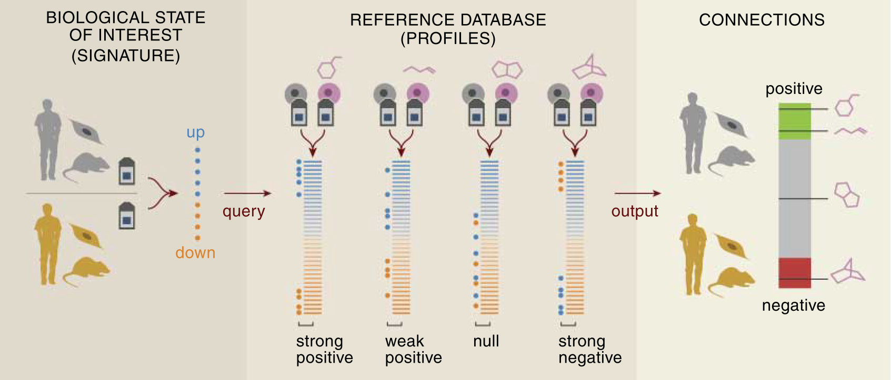

```{r setup, include=FALSE}
knitr::opts_chunk$set(echo = FALSE,cache=TRUE,error=TRUE,warning=F)
set.seed(718453)
```

## Unraveling the connection between chemical structure and gene expression.
<!-- <style type="text/css"> -->
<!-- p { text-align: left; } -->
<!-- </style> -->

**Aim**: Investigate association between *chemical fingerprint* or *biological target* predictions of chemical compounds and the effects they induce in a *gene expression* assay.

**How?** Assess gene expression connectivity scores [@lamb_connectivity_2006; @zhang_simple_2008], but for groupings of compounds not based on their structure.

**Data**: Connectivity Map's MCF-7 dataset, a breast cancer cell line exposed to several bio-active small molecules.

## Connectivity scores

- Contrast a number of query expression profiles with a set of reference profiles.
- Similarity in terms of which genes are up- or down-regulated.
- Can be positive or negative.

<!--  -->
<div align="center">
<p><small>[@lamb_connectivity_2006].</small><p>
</div> 

# Agglomerative hierarchical clustering


## Chemical fingerprints and target predictions are binary matrices
```{r,echo=FALSE}
load("MCF7Data.RData")
fingerprintMat <- fingerprintMat*1 # convert logical matrix to binary integer matrix
head(fingerprintMat[,1:4])
```

## Tanimoto coefficient is an appropriate measure of similarity

- Often used in cheminformatics [[@maccuish_clustering_2011]](#chem). 
- Contrasts two objects *x* and *y* of dimension *k* in terms of the number of common attributes, *c*, versus the number of attributes unique to either object, *a* and *b*. 

$$s = \frac{c}{a+b-c}$$

```{r, results="hide"}
tanimoto = function(m){
  S = matrix(0,nrow=dim(m)[1],ncol=dim(m)[1])
  m=as.matrix(m)
  N.C=m %*% t(m)
  N.A=m %*% (1-t(m))
  N.B=(1-m) %*% t(m)
  S=N.C/(N.A+N.B+N.C)
  D = 1 - S
  return(D)
}
dist.fingerprintMat <- tanimoto(fingerprintMat)
head(dist.fingerprintMat[,1:4])
```

## Agglomerative hierarchical clustering

- Bottom-up approach: repeated merging pairs of similar clusters.
- `agnes` function provided by the `cluster` package.
- Agglomeration method: flexible-Beta with $\alpha = 0.625$ (out-performed average link).
- Prune tree using Gap statistic [@hastie_elements_2009-1].

----

```{r, results="hide"}
library(cluster)

FUNcluster = function(x,k,inputcluster){
  # Function that requires the original observations (x), 
  # the number of desired clusters (k),
  # and a cluster object 
	out = list( cluster = cutree(inputcluster,k=k))
	return(out)
}
cluster.fingerprintMat <- agnes(as.dist(dist.fingerprintMat),method = "flexible",par.method = 0.625)
gap <- clusGap(fingerprintMat,FUNcluster = FUNcluster,inputcluster=cluster.fingerprintMat,K.max = 20,B = 500)
gapdata <- as.data.frame(gap$Tab)
k.fingerprint <- maxSE(gapdata[,3],gapdata[,4],"Tibs2001SEmax")
pltree(cluster.fingerprintMat,main='Hierarchical clustering of compounds based on their chemical fingerprints',hang=-1,col = "#487AA1", col.main = "#F38630", col.lab = "#F38630", col.axis = "#7C8071",xlab="Compounds",sub="", lwd = 2) # calls as.hclust plot method
axis(side = 2, at = seq(0, 400, 100), col = "#F38630", labels = TRUE, lwd = 2)
rect.hclust(cluster.fingerprintMat,k=k.fingerprint)
cut.cluster.fingerprintMat <- cutree(cluster.fingerprintMat,k=k.fingerprint) # get vector with cluster membership for compounds
```

----

```{r, results="hide"}
dist.targetMat <- tanimoto(targetMat)
cluster.targetMat <- agnes(as.dist(dist.targetMat),method = "flexible",par.method = 0.625)
gap <- clusGap(targetMat,FUNcluster = FUNcluster,inputcluster=cluster.targetMat,K.max = 20,B = 500)
gapdata <- as.data.frame(gap$Tab)
k.target <- maxSE(gapdata[,3],gapdata[,4],"Tibs2001SEmax")
pltree(cluster.targetMat,main='Hierarchical clustering of compounds based on their target predictions',col = "#487AA1", col.main = "#F38630", col.lab = "#F38630", col.axis = "#7C8071",xlab="Compounds",sub="", lwd = 2) # calls as.hclust plot method
rect.hclust(cluster.targetMat,k=k.target)
cut.cluster.targetMat <- cutree(cluster.targetMat,k=k.target)
```

# Connectivity scores using multiple factor analysis

## Multiple factor analysis
- Normalize both the reference and query dataset by dividing each by their first singular value.
- PCA is performed on the combined datasets.
- Factor loadings of compounds represent importance or **connectivity score**.
- **Connectivity sets** represent a local structure or connectivity pattern.
- **Factor scores** of the genes reveal which genes are driving this connectivity.

----

We are hoping to find high contributions of the **reference compounds** (to a certain component) and also a high loading of the **query compound** on this factor, which would indicate **similarity in gene expression**. 

# Within-cluster connectivity

## Within-cluster connectivity
- How well connected are the fingerprint and target clusters based on gene expression?
- **Leave-one-out procedure**: query set contains the full cluster, reference set contains all but one compound.

## Demonstration for cluster 7 based on fingerprints, left-out compound thioridazine
```{r,message=F,warning=F}
library(CSFA)
```

```{r, results="hide", fig.height=5}
n.cluster.fingerprint <- unique(cut.cluster.fingerprintMat) # number of clusters
connectivity.fingerprint <- lapply(n.cluster.fingerprint, function(x) sapply(rownames(fingerprintMat[cut.cluster.fingerprintMat==x,,drop=F]),function(y) NULL)) # initialize list to store MFA results
for (i in 1:length(connectivity.fingerprint)) { # loop through clusters
  cluster.names <- rownames(fingerprintMat[cut.cluster.fingerprintMat==i,,drop=F])
  for (j in 1:length(cluster.names)) { # loop through compounds in a cluster
    connectivity.fingerprint[[i]][[j]][['refMat']] <- geneMat[,cluster.names[-c(j)]] # reference contains all but j'th compound
    connectivity.fingerprint[[i]][[j]][['querMat']] <- geneMat[,cluster.names] # query set contains all compounds in cluster
    connectivity.fingerprint[[i]][[j]]['MFA'] <- CSanalysis(connectivity.fingerprint[[i]][[j]][['refMat']],
                                                     connectivity.fingerprint[[i]][[j]][['querMat']],
                                                     "CSmfa",which=c(),factor.plot=1) # MFA analysis
  }
}
```
```{r, results="hide", fig.height=4}
CSanalysis(connectivity.fingerprint[[7]][[1]][['refMat']],
                   connectivity.fingerprint[[7]][[1]][['querMat']],
                  "CSmfa",factor.plot=1,which=c(2),
                   result.available=connectivity.fingerprint[[7]][[1]][['MFA']],
                    plot.type='sweave')
```

<!-- # Average within-cluster connectivity -->
## Average within-cluster connectivity calculation

We use the average of the absolute values of the loadings for the left-out query compound as a measure of the cluster's **uniformity in terms of its gene expression**. 

# Average within-cluster connectivity based on chemical fingerprint clustering
<!-- Let's calculate the average connectivity for the clusters for the first and second component separately. We will use the mean of the absolute values as the connectivity measure, but it could be argued that the reverse, the absolute value of the mean is more appropriate. The difference is whether compounds with opposite effects on gene expression will be considered similar or not. -->
----

```{r, results="hide", fig.height=5}
average.connectivity.fingerprint.pc1 <- sapply(sapply(connectivity.fingerprint, function(y) sapply(seq_along(y), function(x,n) y[[x]][['MFA']]@CS$CS.query[n[x],] ,n=names(y))), function(z) mean(abs(z)))

plot(average.connectivity.fingerprint.pc1,xlab='Cluster',ylab='Average connectivity score for PC1',main = 'Factor 1 - chemical fingerprint clusters')
```

----

```{r, results="hide", fig.height=5,warning=F}
redo_MFA_fingerprint_within = function(cluster,compound,factor){
  # Plots result for already calculated MFA objects
  mfa <- CSanalysis(connectivity.fingerprint[[cluster]][[compound]][['refMat']],
                    connectivity.fingerprint[[cluster]][[compound]][['querMat']],
                    "CSmfa",factor.plot=factor,which=c(),
                    result.available=connectivity.fingerprint[[cluster]][[compound]][['MFA']],
                    plot.type='sweave')
  return(mfa)
}
average.connectivity.fingerprint.pc2 <- sapply(sapply(seq_along(connectivity.fingerprint), 
       function(y) sapply(seq_along(connectivity.fingerprint[[y]]),
                          function(x,n) redo_MFA_fingerprint_within(y,n[x],2)@CS$CS.query[n[x],] ,
                          n=names(connectivity.fingerprint[[y]]))), function(z) mean(abs(z)))
plot(average.connectivity.fingerprint.pc2,xlab='Cluster',ylab='Average connectivity score',main = 'Factor 2 - chemical fingerprint clusters')
```

## Cluster 7 shows high within-connectivity for the first factor

This means that all the compounds in this cluster likely induce a similar gene expression. This can be seen from the fact that the left-out cluster always has a relatively high loading compared to the references.

Cluster 7 contains the following compounds: `r colnames(geneMat)[cut.cluster.fingerprintMat == 1]`

----

```{r, results="hide", fig.height=2.8,warning=F}
library(scales)
library(ggplot2)
library(ggrepel)
compound.names <- rownames(fingerprintMat[cut.cluster.fingerprintMat==7,,drop=F])
for (i in 1:2){
  mfa <- CSanalysis(connectivity.fingerprint[[7]][[i]][['refMat']],
                    connectivity.fingerprint[[7]][[i]][['querMat']],
                    "CSmfa",factor.plot=1,which=c(),
                    result.available=connectivity.fingerprint[[7]][[i]][['MFA']])
  
  colour.factor <- rownames(mfa@CS$CS.query) == compound.names[i]
  
  print(ggplot(mfa@CS$CS.query,aes(x=seq_along(Factor1),y=Factor1,
                             label=rownames(mfa@CS$CS.query))) +
  # geom_point(aes(fill=colour.factor),colour='black',pch=21,size=5) +
  geom_point(aes(colour=colour.factor),size=5) +
  geom_point(colour = "black",shape=1,size=5) +
  # geom_text(vjust="inward",hjust="inward",#nudge_y = -0.01,
            # aes(colour=colour.factor),show.legend = F) +
  geom_text_repel(aes(colour=colour.factor),show.legend = F,box.padding = unit(0.8, "lines"))+
  # scale_colour_discrete(name=NULL,labels=c('Reference compound','Leave-one-out compound')) +
  scale_colour_brewer(name=NULL,palette='Set1',
                      labels=c('Reference compound','Leave-one-out compound')) +
  scale_x_continuous(breaks=pretty_breaks(),name="Compound Index") + 
  scale_y_continuous(name="Compound Loadings - Factor 1") +
  ggtitle(paste("Cluster",7,"- Left out compound",compound.names[i])) + theme_bw() )
}
```

----

```{r, results="hide", fig.height=2.8,warning=F}
for (i in 3:4){
  mfa <- CSanalysis(connectivity.fingerprint[[7]][[i]][['refMat']],
                    connectivity.fingerprint[[7]][[i]][['querMat']],
                    "CSmfa",factor.plot=1,which=c(),
                    result.available=connectivity.fingerprint[[7]][[i]][['MFA']])
  
  colour.factor <- rownames(mfa@CS$CS.query) == compound.names[i]
  
  print(ggplot(mfa@CS$CS.query,aes(x=seq_along(Factor1),y=Factor1,
                             label=rownames(mfa@CS$CS.query))) +
  # geom_point(aes(fill=colour.factor),colour='black',pch=21,size=5) +
  geom_point(aes(colour=colour.factor),size=5) +
  geom_point(colour = "black",shape=1,size=5) +
  # geom_text(vjust="inward",hjust="inward",#nudge_y = -0.01,
            # aes(colour=colour.factor),show.legend = F) +
  geom_text_repel(aes(colour=colour.factor),show.legend = F,box.padding = unit(0.8, "lines"))+
  # scale_colour_discrete(name=NULL,labels=c('Reference compound','Leave-one-out compound')) +
  scale_colour_brewer(name=NULL,palette='Set1',
                      labels=c('Reference compound','Leave-one-out compound')) +
  scale_x_continuous(breaks=pretty_breaks(),name="Compound Index") + 
  scale_y_continuous(name="Compound Loadings - Factor 1") +
  ggtitle(paste("Cluster",7,"- Left out compound",compound.names[i])) + theme_bw() )
}
```

----

```{r, results="hide", fig.height=2.8,warning=F}
i=5
  mfa <- CSanalysis(connectivity.fingerprint[[7]][[i]][['refMat']],
                    connectivity.fingerprint[[7]][[i]][['querMat']],
                    "CSmfa",factor.plot=1,which=c(),
                    result.available=connectivity.fingerprint[[7]][[i]][['MFA']])
  
  colour.factor <- rownames(mfa@CS$CS.query) == compound.names[i]
  
  print(ggplot(mfa@CS$CS.query,aes(x=seq_along(Factor1),y=Factor1,
                             label=rownames(mfa@CS$CS.query))) +
  # geom_point(aes(fill=colour.factor),colour='black',pch=21,size=5) +
  geom_point(aes(colour=colour.factor),size=5) +
  geom_point(colour = "black",shape=1,size=5) +
  # geom_text(vjust="inward",hjust="inward",#nudge_y = -0.01,
            # aes(colour=colour.factor),show.legend = F) +
  geom_text_repel(aes(colour=colour.factor),show.legend = F,box.padding = unit(0.8, "lines"))+
  # scale_colour_discrete(name=NULL,labels=c('Reference compound','Leave-one-out compound')) +
  scale_colour_brewer(name=NULL,palette='Set1',
                      labels=c('Reference compound','Leave-one-out compound')) +
  scale_x_continuous(breaks=pretty_breaks(),name="Compound Index") + 
  scale_y_continuous(name="Compound Loadings - Factor 1") +
  ggtitle(paste("Cluster",7,"- Left out compound",compound.names[i])) + theme_bw() )

```


# Average within-cluster connectivity based on target prediction clustering

```{r, results="hide"}
n.cluster.target <- unique(cut.cluster.targetMat) # number of clusters
connectivity.target <- lapply(n.cluster.target, function(x) sapply(rownames(targetMat[cut.cluster.targetMat==x,,drop=F]),function(y) NULL))
for (i in 1:length(connectivity.target)) { # loop through clusters
  cluster.names <- rownames(targetMat[cut.cluster.targetMat==i,,drop=F])
  for (j in 1:length(cluster.names)) { # loop through compounds in a cluster
    connectivity.target[[i]][[j]][['refMat']] <- geneMat[,cluster.names[-c(j)]]
    connectivity.target[[i]][[j]][['querMat']] <- geneMat[,cluster.names]
    connectivity.target[[i]][[j]]['MFA'] <- CSanalysis(connectivity.target[[i]][[j]][['refMat']],
                                                     connectivity.target[[i]][[j]][['querMat']],
                                                     "CSmfa",which=c(),factor.plot=1)
  }
}
```
```{r}
redo_MFA_target_within = function(cluster,compound,factor){
  # Plots result for already calculated MFA objects
  mfa <- CSanalysis(connectivity.target[[cluster]][[compound]][['refMat']],
                    connectivity.target[[cluster]][[compound]][['querMat']],
                    "CSmfa",factor.plot=factor,which=c(),
                    result.available=connectivity.target[[cluster]][[compound]][['MFA']],
                    plot.type='sweave')
  return(mfa)
}
```

----

```{r, results="hide", fig.height=5}
average.connectivity.target.pc1 <- sapply(sapply(connectivity.target, function(y) sapply(seq_along(y), function(x,n) y[[x]][['MFA']]@CS$CS.query[n[x],] ,n=names(y))),  function(z) mean(abs(z)))

plot(average.connectivity.target.pc1,xlab='Cluster',ylab='Average connectivity score for PC1',main = 'Factor 1 - target prediction clusters')
```

----

```{r, results="hide", fig.height=5}
average.connectivity.target.pc2 <- sapply(sapply(seq_along(connectivity.target), 
       function(y) sapply(seq_along(connectivity.target[[y]]),
                          function(x,n) redo_MFA_target_within(y,n[x],2)@CS$CS.query[n[x],] ,
                          n=names(connectivity.target[[y]]))),  function(z) mean(abs(z)))
plot(average.connectivity.target.pc2,xlab='Cluster',ylab='Average connectivity score target prediction PC2',main = 'Factor 2 - target prediction clusters')
```

## Cluster 3 contains a known group of antipsychotic drugs
`r colnames(geneMat)[cut.cluster.targetMat == 3]`

----

```{r, results="hide", fig.height=2.8,warning=F}
compound.names <- rownames(targetMat[cut.cluster.targetMat==3,,drop=F])
for (i in 1:2){
  mfa <- CSanalysis(connectivity.target[[3]][[i]][['refMat']],
                    connectivity.target[[3]][[i]][['querMat']],
                    "CSmfa",factor.plot=1,which=c(),
                    result.available=connectivity.target[[3]][[i]][['MFA']])
  
  colour.factor <- rownames(mfa@CS$CS.query) == compound.names[i]
  
  print(ggplot(mfa@CS$CS.query,aes(x=seq_along(Factor1),y=Factor1,
                             label=rownames(mfa@CS$CS.query))) +
  # geom_point(aes(fill=colour.factor),colour='black',pch=21,size=5) +
  geom_point(aes(colour=colour.factor),size=5) +
  geom_point(colour = "black",shape=1,size=5) +
  # geom_text(vjust="inward",hjust="inward",#nudge_y = -0.01,
            # aes(colour=colour.factor),show.legend = F) +
  geom_text_repel(aes(colour=colour.factor),show.legend = F,box.padding = unit(0.8, "lines"))+
  # scale_colour_discrete(name=NULL,labels=c('Reference compound','Leave-one-out compound')) +
  scale_colour_brewer(name=NULL,palette='Set1',
                      labels=c('Reference compound','Leave-one-out compound')) +
  scale_x_continuous(breaks=pretty_breaks(),name="Compound Index") + 
  scale_y_continuous(name="Compound Loadings - Factor 1") +
  ggtitle(paste("Cluster",3,"- Left out compound",compound.names[i])) + theme_bw() )
}
```

----

```{r, results="hide", fig.height=2.8,warning=F}
for (i in 3:4){
 mfa <- CSanalysis(connectivity.target[[3]][[i]][['refMat']],
                    connectivity.target[[3]][[i]][['querMat']],
                    "CSmfa",factor.plot=1,which=c(),
                    result.available=connectivity.target[[3]][[i]][['MFA']])
  
  colour.factor <- rownames(mfa@CS$CS.query) == compound.names[i]
  
  print(ggplot(mfa@CS$CS.query,aes(x=seq_along(Factor1),y=Factor1,
                             label=rownames(mfa@CS$CS.query))) +
  # geom_point(aes(fill=colour.factor),colour='black',pch=21,size=5) +
  geom_point(aes(colour=colour.factor),size=5) +
  geom_point(colour = "black",shape=1,size=5) +
  # geom_text(vjust="inward",hjust="inward",#nudge_y = -0.01,
            # aes(colour=colour.factor),show.legend = F) +
  geom_text_repel(aes(colour=colour.factor),show.legend = F,box.padding = unit(0.8, "lines"))+
  # scale_colour_discrete(name=NULL,labels=c('Reference compound','Leave-one-out compound')) +
  scale_colour_brewer(name=NULL,palette='Set1',
                      labels=c('Reference compound','Leave-one-out compound')) +
  scale_x_continuous(breaks=pretty_breaks(),name="Compound Index") + 
  scale_y_continuous(name="Compound Loadings - Factor 1") +
  ggtitle(paste("Cluster",3,"- Left out compound",compound.names[i])) + theme_bw() )
}
```

----

```{r, results="hide", fig.height=2.8,warning=F}
i=5
 mfa <- CSanalysis(connectivity.target[[3]][[i]][['refMat']],
                    connectivity.target[[3]][[i]][['querMat']],
                    "CSmfa",factor.plot=1,which=c(),
                    result.available=connectivity.target[[3]][[i]][['MFA']])
  
  colour.factor <- rownames(mfa@CS$CS.query) == compound.names[i]
  
  print(ggplot(mfa@CS$CS.query,aes(x=seq_along(Factor1),y=Factor1,
                             label=rownames(mfa@CS$CS.query))) +
  # geom_point(aes(fill=colour.factor),colour='black',pch=21,size=5) +
  geom_point(aes(colour=colour.factor),size=5) +
  geom_point(colour = "black",shape=1,size=5) +
  # geom_text(vjust="inward",hjust="inward",#nudge_y = -0.01,
            # aes(colour=colour.factor),show.legend = F) +
  geom_text_repel(aes(colour=colour.factor),show.legend = F,box.padding = unit(0.8, "lines"))+
  # scale_colour_discrete(name=NULL,labels=c('Reference compound','Leave-one-out compound')) +
  scale_colour_brewer(name=NULL,palette='Set1',
                      labels=c('Reference compound','Leave-one-out compound')) +
  scale_x_continuous(breaks=pretty_breaks(),name="Compound Index") + 
  scale_y_continuous(name="Compound Loadings - Factor 1") +
  ggtitle(paste("Cluster",3,"- Left out compound",compound.names[i])) + theme_bw() )

```


# Between-cluster connectivity

```{r, results='hide'}
connectivity.fingerprint.betw <- lapply(n.cluster.fingerprint, function(x) NULL)
for (i in 1:length(connectivity.fingerprint.betw)) { # loop through clusters
  connectivity.fingerprint.betw[[i]][['refMat']] <- geneMat[,cut.cluster.fingerprintMat==i] # reference contains i'th cluster
  connectivity.fingerprint.betw[[i]][['querMat']] <- geneMat[,cut.cluster.fingerprintMat!=i] # query set contains all other clusters
  connectivity.fingerprint.betw[[i]][['MFA']] <- CSanalysis(connectivity.fingerprint.betw[[i]][['refMat']],
                                                     connectivity.fingerprint.betw[[i]][['querMat']],
                                                     "CSmfa",which=c(),factor.plot=1) # MFA analysis
}
```

## Between-cluster connectivity

- One cluster as a reference set
- All the other clusters as the query set

Are there **clusters** of different compounds with **similar effects on gene expression**?

## Average between-cluster connectivity

- Average the query loadings per cluster (rows), once for each reference cluster (columns).
- It is most informative to use uniform clusters as a reference:
- i.e. clusters which showed high within-cluster connectivity.

## Chemical fingerprints - first component

```{r}
# library(xtable)
# xtable(sapply(n.cluster.fingerprint, function(x)
#   sapply(
#     sapply(n.cluster.fingerprint, function(y)
#     connectivity.fingerprint.betw[[x]][['MFA']]@CS$CS.query[colnames(geneMat[,cut.cluster.fingerprintMat==y]),]),
#     function(z) mean(abs(z)))),type='html')
library(pander)
pander(sapply(n.cluster.fingerprint, function(x) 
  sapply(
    sapply(n.cluster.fingerprint, function(y)
    connectivity.fingerprint.betw[[x]][['MFA']]@CS$CS.query[colnames(geneMat[,cut.cluster.fingerprintMat==y]),]),
    function(z) mean(abs(z)))))
```

<small>Recall that cluster 7, and to a lesser extent cluster 3, had relatively high within-cluster connectivity for the first factor, and cluster 1 for the second factor.</small>

## Chemical fingerprints - second component
```{r, results='hide'}
redo_MFA_fingerprint_between = function(cluster,factor){
  mfa <- CSanalysis(connectivity.fingerprint.betw[[cluster]][['refMat']],
                    connectivity.fingerprint.betw[[cluster]][['querMat']],
                    "CSmfa",factor.plot=factor,which=c(),
                    result.available=connectivity.fingerprint.betw[[cluster]][['MFA']],
                    plot.type='sweave')
  return(mfa)
}
betw.avg.connectivity.finger.pc2 <- sapply(n.cluster.fingerprint, function(x) sapply(sapply(n.cluster.fingerprint, function(y) redo_MFA_fingerprint_between(x,2)@CS$CS.query[colnames(geneMat[,cut.cluster.fingerprintMat==y]),]),function(z) mean(abs(z))))
```

```{r}
pander(betw.avg.connectivity.finger.pc2)
```

<small>Recall that cluster 7, and to a lesser extent cluster 3, had relatively high within-cluster connectivity for the first factor, and cluster 1 for the second factor.</small>

## Target predictions - first component
```{r, results='hide'}
connectivity.target.betw <- lapply(n.cluster.target, function(x) NULL)
for (i in 1:length(connectivity.target.betw)) { # loop through clusters
  connectivity.target.betw[[i]][['refMat']] <- geneMat[,cut.cluster.targetMat==i] # reference contains i'th cluster
  connectivity.target.betw[[i]][['querMat']] <- geneMat[,cut.cluster.targetMat!=i] # query set contains all other clusters
  connectivity.target.betw[[i]][['MFA']] <- CSanalysis(connectivity.target.betw[[i]][['refMat']],
                                                     connectivity.target.betw[[i]][['querMat']],
                                                     "CSmfa",which=c(),factor.plot=1) # MFA analysis
}
```

```{r}
pander(sapply(n.cluster.target, function(x) sapply(sapply(n.cluster.target, function(y) connectivity.target.betw[[x]][['MFA']]@CS$CS.query[colnames(geneMat[,cut.cluster.targetMat==y]),]),function(z) mean(abs(z)))))
```

<small>Recall that cluster 3 had relatively high within-cluster connectivity for the first factor, and cluster 1 for the second factor.</small>

## Target predictions - second component
```{r,warning=F,results='hide',warning=F}
redo_MFA_target_between = function(cluster,factor){
  mfa <- CSanalysis(connectivity.target.betw[[cluster]][['refMat']],
                    connectivity.target.betw[[cluster]][['querMat']],
                    "CSmfa",factor.plot=factor,which=c(),
                    result.available=connectivity.target.betw[[cluster]][['MFA']],
                    plot.type='sweave')
  return(mfa)
}
betw.avg.connectivity.target.pc2 <- sapply(n.cluster.target, function(x) sapply(sapply(n.cluster.target, function(y) redo_MFA_target_between(x,2)@CS$CS.query[colnames(geneMat[,cut.cluster.targetMat==y]),]),function(z) mean(abs(z))))
```
```{r}
pander(betw.avg.connectivity.target.pc2)
```

# Visualisation of the between-cluster connectivity

## Visualisation of the between-cluster connectivity

Consider the third target-based cluster consisting of known antipsychotic drugs. 

How well **connected** is this cluster to the other clusters?

----

```{r,warning=F,results='hide',warning=F}
mfa <- CSanalysis(connectivity.target.betw[[3]][['refMat']],
                    connectivity.target.betw[[3]][['querMat']],
                    "CSmfa",factor.plot=1,which=c(),
                    result.available=connectivity.target.betw[[3]][['MFA']],
                    plot.type='sweave')
df <- mfa@CS$CS.query
df$clusters <- as.factor(cut.cluster.targetMat[!cut.cluster.targetMat==3])
df <- df[order(df$clusters),]
df.ref <- mfa@CS$CS.ref
df.ref$clusters <- as.factor(3)
df <- rbind(df.ref,df)
print(ggplot(df,aes(x=seq_along(Factor1),y=Factor1,
                           label=rownames(df))) +
geom_point(aes(colour=clusters),size=4) +
geom_point(colour = "black",shape=1,size=4) +
geom_text_repel(aes(colour=clusters),size=3,show.legend = F,box.padding = unit(0.4, "lines"))+
scale_colour_brewer(name='Clusters',palette='Dark2',
                    labels=levels(df$clusters)) +
scale_x_continuous(breaks=pretty_breaks(),name="Compound Index") +
scale_y_continuous(name="Compound Loadings - Factor 1") +
ggtitle(paste("Reference cluster 3 - target predictions - factor 1")) + theme_bw())
```

<small>Any of the query compounds or clusters that have high loadings represent a connectivity set: a local structure in the gene expression data of the reference set.</small>

## Which genes are driving this connectivity?

```{r,warning=F,results='hide',warning=F,fig.height=5}
mfa <- CSanalysis(connectivity.target.betw[[3]][['refMat']],
                    connectivity.target.betw[[3]][['querMat']],
                    "CSmfa",factor.plot=1,which=c(4),
                    result.available=connectivity.target.betw[[3]][['MFA']],
                    plot.type='sweave')
```

----

```{r,warning=F,results='hide',warning=F,fig.height=5}
mfa <- CSanalysis(connectivity.target.betw[[3]][['refMat']],
                    connectivity.target.betw[[3]][['querMat']],
                    "CSmfa",factor.plot=2,which=c(4),
                    result.available=connectivity.target.betw[[3]][['MFA']],
                    plot.type='sweave')
```
<small>The same genes also drive connectivity structure of second component.</small>

<!-- ---- -->
<!-- First cluster, second factor, targers -->
<!-- ```{r,warning=F,results='hide',warning=F} -->
<!-- mfa <- CSanalysis(connectivity.target.betw[[1]][['refMat']], -->
<!--                     connectivity.target.betw[[1]][['querMat']], -->
<!--                     "CSmfa",factor.plot=2,which=c(), -->
<!--                     result.available=connectivity.target.betw[[1]][['MFA']], -->
<!--                     plot.type='sweave') -->
<!-- df <- mfa@CS$CS.query -->
<!-- df$clusters <- as.factor(cut.cluster.targetMat[!cut.cluster.targetMat==1]) -->
<!-- df <- df[order(df$clusters),] -->
<!-- df.ref <- mfa@CS$CS.ref -->
<!-- df.ref$clusters <- as.factor(1) -->
<!-- df <- rbind(df.ref,df) -->
<!-- print(ggplot(df,aes(x=seq_along(Factor2),y=Factor2, -->
<!--                            label=rownames(df))) + -->
<!-- geom_point(aes(colour=clusters),size=4) + -->
<!-- geom_point(colour = "black",shape=1,size=4) + -->
<!-- geom_text_repel(aes(colour=clusters),size=3,show.legend = F,box.padding = unit(0.4, "lines"))+ -->
<!-- scale_colour_brewer(name='Clusters',palette='Dark2', -->
<!--                     labels=levels(df$clusters)) + -->
<!-- scale_x_continuous(breaks=pretty_breaks(),name="Compound Index") + -->
<!-- scale_y_continuous(name="Compound Loadings - Factor 2") + -->
<!-- ggtitle(paste("Reference cluster 1 - target predictions - factor 2")) + theme_bw()) -->
<!-- ``` -->

<!-- <small> The within-connectivity for cluster 1 is mostly driven by just two compounds and has little similarity to the other clusters. </small> -->

----

```{r,warning=F,results='hide',warning=F}
mfa <- CSanalysis(connectivity.fingerprint.betw[[7]][['refMat']],
                    connectivity.fingerprint.betw[[7]][['querMat']],
                    "CSmfa",factor.plot=1,which=c(),
                    result.available=connectivity.fingerprint.betw[[7]][['MFA']],
                    plot.type='sweave')
df <- mfa@CS$CS.query
df$clusters <- as.factor(cut.cluster.fingerprintMat[!cut.cluster.fingerprintMat==7])
df <- df[order(df$clusters),]
df.ref <- mfa@CS$CS.ref
df.ref$clusters <- as.factor(7)
df <- rbind(df.ref,df)
print(ggplot(df,aes(x=seq_along(Factor1),y=Factor1,
                           label=rownames(df))) +
geom_point(aes(colour=clusters),size=4) +
geom_point(colour = "black",shape=1,size=4) +
geom_text_repel(aes(colour=clusters),size=3,show.legend = F,box.padding = unit(0.4, "lines"))+
scale_colour_brewer(name='Clusters',palette='Dark2',
                    labels=levels(df$clusters)) +
scale_x_continuous(breaks=pretty_breaks(),name="Compound Index") +
scale_y_continuous(name="Compound Loadings - Factor 1") +
ggtitle(paste("Reference cluster 7 - fingerprints - factor 1")) + theme_bw())
```

----

```{r,warning=F,results='hide',warning=F}
mfa <- CSanalysis(connectivity.fingerprint.betw[[1]][['refMat']],
                    connectivity.fingerprint.betw[[1]][['querMat']],
                    "CSmfa",factor.plot=2,which=c(),
                    result.available=connectivity.fingerprint.betw[[1]][['MFA']],
                    plot.type='sweave')
df <- mfa@CS$CS.query
df$clusters <- as.factor(cut.cluster.fingerprintMat[!cut.cluster.fingerprintMat==1])
df <- df[order(df$clusters),]
df.ref <- mfa@CS$CS.ref
df.ref$clusters <- as.factor(7)
df <- rbind(df.ref,df)
print(ggplot(df,aes(x=seq_along(Factor2),y=Factor2,
                           label=rownames(df))) +
geom_point(aes(colour=clusters),size=4) +
geom_point(colour = "black",shape=1,size=4) +
geom_text_repel(aes(colour=clusters),size=3,show.legend = F,box.padding = unit(0.4, "lines"))+
scale_colour_brewer(name='Clusters',palette='Dark2',
                    labels=levels(df$clusters)) +
scale_x_continuous(breaks=pretty_breaks(),name="Compound Index") +
scale_y_continuous(name="Compound Loadings - Factor 1") +
ggtitle(paste("Reference cluster 1 - fingerprints - factor 2")) + theme_bw())
```

# Concluding remarks

## 

## A better cluster method might improve the results

Some of the clusters would have shown a much higher within-connectivity, if not for a few outlying compounds.

## It is not trivial to choose a factor.

## References
<section style="text-align: left;">
<small>


- Hastie, Trevor, Robert Tibshirani, and J. H. Friedman. 2009. The Elements of Statistical Learning: Data Mining, Inference, and Prediction. 2nd ed. Springer Series in Statistics. New York, NY: Springer.


- Lamb, J. 2006. “The Connectivity Map: Using Gene-Expression Signatures to Connect Small Molecules, Genes, and Disease.” Science 313 (5795): 1929–35. doi:10.1126/science.1132939.


- MacCuish, John D., and Norah E. MacCuish. 2011. Clustering in Bioinformatics and Drug Discovery. Chapman & Hall/CRC Mathematical and Computational Biology Series. Boca Raton, FL: CRC Press.


- Zhang, Shu-Dong, and Timothy W Gant. 2008. “A Simple and Robust Method for Connecting Small-Molecule Drugs Using Gene-Expression Signatures.” BMC Bioinformatics 9 (1): 258. doi:10.1186/1471-2105-9-258.


</small>