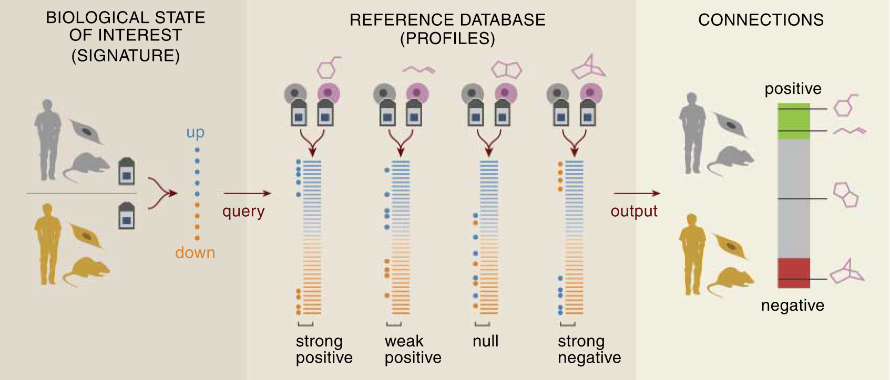

```{r setup, include=FALSE,cache=FALSE}
knitr::opts_chunk$set(echo = TRUE,cache = TRUE,error=TRUE)
set.seed(718453)
```

<!-- http://kbroman.org/knitr_knutshell/pages/Rmarkdown.html -->
<!-- https://github.com/jeromyanglim/rmarkdown-rmeetup-2012/issues/14 -->
<!-- http://yihui.name/knitr/demo/output/ -->

## Unraveling the connection between chemical structure and gene expression.

The aim of this analysis is to investigate the association between the structure of chemical compounds (or their predicted biological activity) and the effects they induce in a gene expression assay. We will group compounds with a similar structure (*chemical fingerprint*) or predicted bio-activity (*target prediction*) using clustering methods. Subsequently the *gene expression profiles* of the compounds within and between clusters will be contrasted with each other using a connectivity score approach based on the work of @lamb_connectivity_2006 and @zhang_simple_2008 on the [Connectivity Map](https://www.broadinstitute.org/cmap/). 

Their methods enable us to contrast a number of query expression profiles with a set of reference profiles and assess the *connectivity* between compounds in terms of which genes are regulated up or down. The connection between the query and reference data can be both positive and negative (see figure below, adapted from [@lamb_connectivity_2006]). In the former case, highly up-regulated genes in one set will also be up-regulated in the other set, and vice versa for down-regulated genes. In the latter case, genes with a high expression in one assay, might be strongly down-regulated in the other one. Both situations imply that the two compounds interfere with the same biological processes. If two sets are weakly connected, there is no correlation or overlap between the top genes of either set. We will use an extension of these methods that scores the connectivity between gene expression profiles using *multiple factor analysis* (MFA) [@abdi_multiple_2013]. In a nutshell, we will look at the principal axes of variation in the gene expression profiles and we hope to find components where both the reference and the query compounds have a high contribution. 



The dataset we will focus on is the Connectivity Map's MCF-7 dataset, which contains the gene-wide expression profiles for a breast cancer cell line that was exposed to several bio-active molecules. The chemical fingerprints and target predictions of these compounds were provided as well.

## Clustering chemical compounds based on chemical fingerprints
We will employ hierarchical clustering to group the chemical compounds based on their fingerprints or target predictions. In either case we are dealing with a binary 0/1 matrix where the rows correspond to different compounds. 

For the chemical fingerprints the columns indicate the presence or absence of specific chemical structures. Together this sequence of ones and zeros describes the entire molecular scaffolding of the compound. In essence we are dealing with a bit string for each compound.

Similarly, the binary target prediction matrix indicates whether or not a certain compound is predicted to bind to a certain molecular target, such as enzymes.

Let's take a look at the chemical fingerprints first. Here is a sneak peek of the data:

```{r,echo=FALSE}
load("MCF7Data.RData")
fingerprintMat <- fingerprintMat*1 # convert logical matrix to binary integer matrix
head(fingerprintMat[,1:4])
```

To properly cluster objects based on binary attributes, we need to define an adequate measure of similarity. The *Tanimoto coefficient* (sometimes called the *Jaccard coefficient*) is often used for this purpose in cheminformatics [[@maccuish_clustering_2011]](#chem). It contrasts two objects *x* and *y* of dimension *k* in terms of the number of common attributes, *c* versus the number of attributes unique to either object, *a* and *b*. $$s = \frac{c}{a+b-c}$$


<!-- *** -->
<!-- *To do: difference in definitions of Tanimoto, jaccard and soergel distance!* -->
<!-- http://www.sequentix.de/gelquest/help/distance_measures.htm -->
<!-- https://en.wikipedia.org/wiki/Jaccard_index Various forms of functions described as Tanimoto similarity and Tanimoto distance occur in the literature and on the Internet. Most of these are synonyms for Jaccard similarity and Jaccard distance, but some are mathematically different.  -->
<!-- https://books.google.be/books?id=ZDDNBQAAQBAJ&pg=PA41&lpg=PA41&dq=tanimoto+clustering&source=bl&ots=vsLen2ZmS5&sig=N16boAKkB5NWLJjeteC4shM6Brc&hl=en&sa=X&ved=0ahUKEwiaiZvsx4vLAhWBfxoKHf-9DrwQ6AEISzAH#v=onepage&q=tanimoto%20clustering&f=false Soergel distance -->
<!-- https://docs.tibco.com/pub/spotfire/6.0.0-november-2013/userguide-webhelp/hc/hc_tanimoto_coefficient.htm another different formula! -->
<!-- *** -->

Its complement ($1-s$), the *Soergel distance*, is what we will use for our clustering approach. This is what the distance matrix of the compounds based on their fingerprints will look like:

<!-- *To do: R's dist function using binary seems to provide almost the same result! Again, difference between jaccard/tanimoto definitions?* -->

```{r}
tanimoto = function(m){
  S = matrix(0,nrow=dim(m)[1],ncol=dim(m)[1])
  m=as.matrix(m)
  N.C=m %*% t(m)
  N.A=m %*% (1-t(m))
  N.B=(1-m) %*% t(m)
  S=N.C/(N.A+N.B+N.C)
  D = 1 - S
  return(D)
}
dist.fingerprintMat <- tanimoto(fingerprintMat)
head(dist.fingerprintMat[,1:4])

# alternative in base r? Slightly different formula?
# test.dist.fingerprintMat <- as.matrix(dist(fingerprintMat,method = 'binary'))
# test.dist.fingerprintMat == dist.fingerprintMat
```

Now we can go ahead and try to cluster these compounds based on their (dis)similarity in chemical fingerprints. We will use the `agnes` function provided by the `cluster` package, which implements a basic agglomerative hierarchical clustering analysis. Agglomerative hierarchical clustering attempts to form groups of similar objects through a bottom-up approach (as opposed to divisive methods). It starts by assigning each observation to its own cluster. Then, an hierarchy is created by repeatedly merging pairs of similar clusters at lower levels (i.e. those that are close according to our *distance* measure), until a single cluster is formed at the top level. Not only do we require an appropriate measure of distance, like the Tanimoto distance, but we also need to choose an agglomeration method. This method will define how the distance between clusters is calculated: e.g. do we only look at the largest distance between its members or do we take the average of all pairwise distances? We will try both the average method, which strikes a compromise between compactness and closeness of the clusters, and the flexible-Beta, a method often used in ecology (with $\alpha = 0.625$). 

### Average linkage

By applying this method to the Tanimoto distance matrix of the compound chemical fingerprints we obtain the following dendogram. Note that the height of each node signifies the dissimilarity between its daughter clusters.

```{r,fig.width=8, fig.height=8, message=FALSE}
### Base R method:
# cluster.fingerprintMat <- hclust(as.dist(dist.fingerprintMat), method = "average")
# plot(cluster.fingerprintMat,main='Hierarchical clustering of compounds based on their chemical fingerprints',hang=-1,col = "#487AA1", col.main = "#F38630", col.lab = "#F38630", col.axis = "#7C8071",xlab="Compounds",sub="", lwd = 2)
# axis(side = 2, at = seq(0, 400, 100), col = "#F38630", labels = TRUE, lwd = 2)

library(cluster)
cluster.a.fingerprintMat <- agnes(as.dist(dist.fingerprintMat),method = "average")
# plot(cluster.a.fingerprintMat,which.plots = 2)
pltree(cluster.a.fingerprintMat,main='Hierarchical clustering of compounds based on their chemical fingerprints',col = "#487AA1", col.main = "#F38630", col.lab = "#F38630", col.axis = "#7C8071",xlab="Compounds",sub="", lwd = 2) # calls as.hclust plot method (,hang=-1)
axis(side = 2, at = seq(0, 400, 100), col = "#F38630", labels = TRUE, lwd = 2)
```

Next, we need to decide on an appropriate number of clusters and prune the tree to this size. This is different from other cluster methods, such as k-means clustering, where the number of clusters is defined beforehand. We could eyeball it by looking at the dendogram, but in practice it is more appropriate to define the number of clusters based on the distance between certain groups. The Gap statistic can be used to make a more informed decision about this [@hastie_elements_2009-1]. The `cluster` package provides a method to calculate the Gap statistic using a bootstrap approach. Visually we are looking for a kink or elbow in a plot of the gap statistic versus the number of clusters. This indicates that the decrease in within-cluster similarity is levelling off. More formally we will rely on the `TibshiraniSEmax` criterium.

```{r}
FUNcluster = function(x,k,inputcluster){
  # Function that requires the original observations (x), 
  # the number of desired clusters (k),
  # and a cluster object 
	out = list( cluster = cutree(inputcluster,k=k))
	return(out)
}
gap <- clusGap(fingerprintMat,FUNcluster = FUNcluster,inputcluster=cluster.a.fingerprintMat,K.max = 20,B = 500)
plot(gap)
gapdata <- as.data.frame(gap$Tab)
maxSE(gapdata[,3],gapdata[,4],"Tibs2001SEmax")
```

```{r,echo=F,eval=F}
gap <- clusGap(fingerprintMat,FUNcluster = FUNcluster,inputcluster=cluster.a.fingerprintMat,K.max = 30,B = 500)
plot(gap)
gapdata <- as.data.frame(gap$Tab)
maxSE(gapdata[,3],gapdata[,4],"Tibs2001SEmax")
maxSE(gapdata[,3],gapdata[,4],"firstSEmax")
maxSE(gapdata[,3],gapdata[,4],"globalSEmax")
maxSE(gapdata[,3],gapdata[,4],"firstmax")
maxSE(gapdata[,3],gapdata[,4],"globalmax")

# iris
iris.cluster <- agnes(iris[1:4],diss = F,metric = "euclidian",method="average")
iris.gap <- clusGap(iris[1:4],FUNcluster = FUNcluster,inputcluster=iris.cluster,K.max = 10,B = 500)
plot(iris.gap)
iris.gapdata <- as.data.frame(iris.gap$Tab)
maxSE(iris.gapdata[,3],iris.gapdata[,4],"Tibs2001SEmax")
```

Unfortunately, the criteria suggests that we should only utilise one cluster. This can also be seen in the dendogram, where most splits tend to occur at a similar level of distance. 

### Flexible link

Now let's try the flexible beta agglomeration method.

```{r,fig.width=8, fig.height=8}
cluster.fingerprintMat <- agnes(as.dist(dist.fingerprintMat),method = "flexible",par.method = 0.625)
pltree(cluster.fingerprintMat,main='Hierarchical clustering of compounds based on their chemical fingerprints',col = "#487AA1", col.main = "#F38630", col.lab = "#F38630", col.axis = "#7C8071",xlab="Compounds",sub="", lwd = 2) # calls as.hclust plot method
axis(side = 2, at = seq(0, 400, 100), col = "#F38630", labels = TRUE, lwd = 2)
gap <- clusGap(fingerprintMat,FUNcluster = FUNcluster,inputcluster=cluster.fingerprintMat,K.max = 20,B = 500)
plot(gap)
gapdata <- as.data.frame(gap$Tab)
k.fingerprint <- maxSE(gapdata[,3],gapdata[,4],"Tibs2001SEmax")
k.fingerprint
```

It's already obvious from the dendogram that some of the splits happen at much larger distances than others, which makes it easier to decide on appropriate groups. The `TibshiraniSEmax` suggests that seven clusters is optimal.

```{r,fig.width=8, fig.height=8}
pltree(cluster.fingerprintMat,main='Hierarchical clustering of compounds based on their chemical fingerprints',hang=-1,col = "#487AA1", col.main = "#F38630", col.lab = "#F38630", col.axis = "#7C8071",xlab="Compounds",sub="", lwd = 2) # calls as.hclust plot method
axis(side = 2, at = seq(0, 400, 100), col = "#F38630", labels = TRUE, lwd = 2)
rect.hclust(cluster.fingerprintMat,k=k.fingerprint)
```

Here is a list of the clusters we obtained:

```{r}
cut.cluster.fingerprintMat <- cutree(cluster.fingerprintMat,k=k.fingerprint) # get vector with cluster membership for compounds
sapply(unique(cut.cluster.fingerprintMat), function(x) colnames(geneMat)[cut.cluster.fingerprintMat==x])
```

<!-- We can also inspect how many entries are in each cluster for various cluster sizes. Fortunately 7 clusters does not lead to any clusters of just one or two compounds, because this could complicate things later on. -->

<!-- ```{r} -->
<!-- # http://www.stat.berkeley.edu/~s133/Cluster2a.html -->
<!-- counts = sapply(2:15,function(ncl)table(cutree(cluster.fingerprintMat,ncl))) -->
<!-- names(counts) = 2:15 -->
<!-- counts -->
<!-- ``` -->

Finally, we will repeat the same procedure for the target predictions.

```{r,fig.width=8, fig.height=8}
dist.targetMat <- tanimoto(targetMat)
cluster.targetMat <- agnes(as.dist(dist.targetMat),method = "flexible",par.method = 0.625)

gap <- clusGap(targetMat,FUNcluster = FUNcluster,inputcluster=cluster.targetMat,K.max = 20,B = 500)
plot(gap)
gapdata <- as.data.frame(gap$Tab)
k.target <- maxSE(gapdata[,3],gapdata[,4],"Tibs2001SEmax")

pltree(cluster.targetMat,main='Hierarchical clustering of compounds based on their target predictions',col = "#487AA1", col.main = "#F38630", col.lab = "#F38630", col.axis = "#7C8071",xlab="Compounds",sub="", lwd = 2) # calls as.hclust plot method
rect.hclust(cluster.targetMat,k=k.target)
```

```{r}
cut.cluster.targetMat <- cutree(cluster.targetMat,k=k.target)
sapply(unique(cut.cluster.targetMat), function(x) colnames(geneMat)[cut.cluster.targetMat==x])
```

## Connectivity scoring using multiple factor analysis

Now that we have identified clusters of compounds that are similar in terms of their structure (chemical fingerprint or target prediction), we will investigate whether or not they are also similar according to the gene expression profiles they induce *in vitro*. To do this, we will use MFA to compare the gene expression profile of a certain compound (the query) with the profiles of all the other compounds in its cluster (the reference database), i.e. a leave-one-out approach to evaluate the within-cluster connectivity. This will be done once for each compound in a cluster, for every cluster we defined earlier. Afterwards, it might also be interesting to contrast entire clusters with one another, i.e. by using one cluster as a query dataset and comparing it with the other clusters, i.e. the between cluster connectivity.

### Within cluster connectivity

**The question we are interested in is if the same genes are being regulated in the same or opposite way for the compounds in a cluster, i.e. if there is a connection between chemical structure and biological effects.**

#### Demo for first cluster

As a proof of concept, we shall perform the leave-one-out procedure on the first cluster.

```{r,message=F}
colnames(geneMat)[cut.cluster.fingerprintMat == 1]
```

We first define the set of reference profiles as all the compounds in the cluster, except for one (*metformin* in this example). Next, the query set contains all the compounds in the cluster. This can be thought of conceptually as treating the reference set as the known profile or the profile of interest, and searching for similar profiles in the query set. For the MFA, it is important to keep in mind that the compounds are treated as variables or features, whereas the genes are observations. The genes are shared between the reference and query set, but the variables (compounds) will differ. 

```{r}
refMat <- geneMat[,cut.cluster.fingerprintMat==1][,-c(1)]
querMat <- geneMat[,cut.cluster.fingerprintMat==1]
colnames(refMat)
colnames(querMat)
```

In the first step, MFA will normalize both the reference and query dataset by dividing each by their first singular value. Next, a PCA is performed on the combined datasets. This will creates principal axes of variations, which are orthogonal and still explain the entire structure of the data. The principal axes, often called components or factors, are linear combinations of the original variables (or compounds in our setting). We hope to find high contributions, termed loadings, of the reference compounds to a factor and also a high loading of the left out compound on this factor. This would mean that it is also similar in terms of gene expression. The factor loadings are the actual connectivity scores we are interested in. The coordinates of the observations (genes) are called factor scores. The subset of compounds and genes with high factor loadings and scores are called a connectivity set.

We will repeat the MFA, each time leaving out another compound of the cluster in the reference set. Afterwards, we will average the connectivity scores of the left-out compounds, and use this as the global connectivity score within the cluster.

```{r,results='hide', message=FALSE}
library(CSFA)
# MFA.fingerprint <- CSanalysis(refMat, querMat,"CSmfa",which = c(1:7))
# 2 = principal components for reference compounds
# 3 = factor scores for genes (1vs2) + compound loadings (1v2)
# 4 = factor scores for genes (pc1) interactive
# 5 = compound loadings (pc1)
# 6 = interactive (crash?)
# 7 = CS rank score
factor1.out_MFA <-  CSanalysis(refMat, querMat,"CSmfa",which=c(2,3),factor.plot=1,plot.type='sweave')
```

Already things have become a bit more complex. As you can see in the first plot showing the loadings for the different factors, there is no single factor with high loadings for all of the compounds, which is what we would expect if all the reference compounds are indeed inducing similar gene expression profiles. This indicates that there is no single dominating structure in the reference dataset, rather there are multiple sub-structures, corresponding to only a few compounds of the reference set. We call these substructures connectivity sets. 

For example, the largest structure is dominated by the compounds phenformin and phenyl biguanide, whereas the second is made up of tioguanine and tetraethylenepentamine. 

As such there are also multiple connectivity scores for the left out compound, metformin, each belonging to a different connectivity set. For example, the connectivity score for metformin for the first connectivity set is about 0.1.

```{r,}
factor1.out_MFA@CS$CS.query
```

We could also look at the second component, which is a set consisting of tioguanine (high) and tetraethylenepentamine (low). For this connectivity set metformin scores a bit higher, with a loading around 0.6.

```{r,results='hide'}
factor2.out_MFA <-  CSanalysis(refMat, querMat,"CSmfa",which=c(),factor.plot=2,plot.type='sweave')
```

```{r}
factor2.out_MFA@CS$CS.query
```

#### Within-connectivity based on fingerprint clustering
Now we will perform this leave-one-out and average procedure for each fingerprint-based cluster, leaving out a single compound each time.

```{r fingerprint_within_MFA_loop,results='hide'}
n.cluster.fingerprint <- unique(cut.cluster.fingerprintMat) # number of clusters

connectivity.fingerprint <- lapply(n.cluster.fingerprint, function(x) sapply(rownames(fingerprintMat[cut.cluster.fingerprintMat==x,,drop=F]),function(y) NULL)) # initialize list to store MFA results

ptm <- proc.time()
for (i in 1:length(connectivity.fingerprint)) { # loop through clusters
  cluster.names <- rownames(fingerprintMat[cut.cluster.fingerprintMat==i,,drop=F])
  for (j in 1:length(cluster.names)) { # loop through compounds in a cluster
    connectivity.fingerprint[[i]][[j]][['refMat']] <- geneMat[,cluster.names[-c(j)]] # reference contains all but j'th compound
    connectivity.fingerprint[[i]][[j]][['querMat']] <- geneMat[,cluster.names] # query set contains all compounds in cluster
    connectivity.fingerprint[[i]][[j]]['MFA'] <- CSanalysis(connectivity.fingerprint[[i]][[j]][['refMat']],
                                                     connectivity.fingerprint[[i]][[j]][['querMat']],
                                                     "CSmfa",which=c(),factor.plot=1) # MFA analysis
  }
}
proc.time() - ptm
```

We'll take a look at the results for the first cluster, i.e. leaving out one of the compounds each time, for the first component.

```{r fingerprint_pc1}
for (j in rownames(fingerprintMat[cut.cluster.fingerprintMat==1,,drop=F])){
  print(paste('Query compound is',j))
  print(connectivity.fingerprint[[1]][[j]][['MFA']]@CS$CS.query)
}
```

The same can be done for the second component (note: the print-out of CSanalysis is not suppressed unfortunately):

```{r fingerprint_pc2,warning=F}
# b <- connectivity.fingerprint[[1]][[1]][['MFA']]
# a<-CSanalysis(connectivity.fingerprint[[1]][[1]][['refMat']],
#                     connectivity.fingerprint[[1]][[1]][['querMat']],
#                     "CSmfa",factor.plot=2,which=c(2,3),
#                     result.available=connectivity.fingerprint[[1]][[1]][['MFA']],plot.type='sweave')
# b@CS$CS.query
# a@CS$CS.query
# connectivity.fingerprint[[1]][[1]][['MFA']]@CS$CS.query
## Warning in .local(refMat, querMat, type, ...): CS, GS and CSRankScores Slot
## in CSresult will be overwritten due to different factor choice.

redo_MFA_fingerprint_within = function(cluster,compound,factor){
  # Plots result for already calculated MFA objects
  mfa <- CSanalysis(connectivity.fingerprint[[cluster]][[compound]][['refMat']],
                    connectivity.fingerprint[[cluster]][[compound]][['querMat']],
                    "CSmfa",factor.plot=factor,which=c(),
                    result.available=connectivity.fingerprint[[cluster]][[compound]][['MFA']],
                    plot.type='sweave')
  return(mfa)
}

for (j in rownames(fingerprintMat[cut.cluster.fingerprintMat==1,,drop=F])){
  print(paste('Query compound is',j))
  print(redo_MFA_fingerprint_within(1,j,2)@CS$CS.query)
}
```
**It's apparent that there is not just one main structure or connectivity set in this cluster. Both the first and second connectivity scores could be taken into account when calculating the average connectivity.**

<!-- Here are the related plots: -->

<!-- ```{r fingerprint_clust1_plots} -->
<!-- plot_MFA_fingerprint_within = function(cluster,compound,factor){ -->
<!--   # Plots result for already calculated MFA objects -->
<!--   mfa <- CSanalysis(connectivity.fingerprint[[cluster]][[compound]][['refMat']], -->
<!--                     connectivity.fingerprint[[cluster]][[compound]][['querMat']], -->
<!--                     "CSmfa",factor.plot=factor,which=c(2,3), -->
<!--                     result.available=connectivity.fingerprint[[cluster]][[compound]][['MFA']], -->
<!--                     plot.type='sweave') -->
<!--   return(mfa) -->
<!-- } -->
<!-- # plot_MFA_fingerprint_within(1,'metformin') -->
<!-- for (j in rownames(fingerprintMat[cut.cluster.fingerprintMat==1,,drop=F])){ -->
<!--   print(paste('Query compound is',j)) -->
<!--   plot_MFA_fingerprint_within(1,j,1) -->
<!-- } -->
<!-- ``` -->


##### Average within-cluster connectivity plots for fingerprints

Let's calculate the average connectivity for the clusters for the first and second component separately. We will use the mean of the absolute values as the connectivity measure, but it could be argued that the reverse, the absolute value of the mean is more appropriate. The difference is whether compounds with opposite effects on gene expression will be considered similar or not.

The average scores for each cluster are shown below:

```{r fingerprint_within_MFA_average_connectivity_pc1}

# inner sapply x retrieves query loading for each leave-one-out MFA: returns list of query loadings
# middle sapply y loops through clusters and returns list of query loadings for each cluster
# outer sapply z takes mean absolute value of each list
average.connectivity.fingerprint.pc1 <- sapply(sapply(connectivity.fingerprint, function(y) sapply(seq_along(y), function(x,n) y[[x]][['MFA']]@CS$CS.query[n[x],] ,n=names(y))), function(z) mean(abs(z)))

plot(average.connectivity.fingerprint.pc1,xlab='Cluster',ylab='Average connectivity score for PC1')
```

These are the results when the absolute value of the means is used: the overall pattern remains unchanged.

```{r}
test.average.connectivity.fingerprint.pc1 <- abs(sapply(sapply(connectivity.fingerprint, function(y) sapply(seq_along(y), function(x,n) y[[x]][['MFA']]@CS$CS.query[n[x],] ,n=names(y))), mean))

plot(test.average.connectivity.fingerprint.pc1,xlab='Cluster',ylab='Average connectivity score for PC1')
```

Cluster 7 looks the most promising, it consists of the following compounds:

```{r}
colnames(geneMat)[cut.cluster.fingerprintMat == 7]
```

<!-- And the query loadings are similar to the reference loadings for each leave-one-out iteration: -->

<!-- ```{r} -->
<!-- for (j in rownames(fingerprintMat[cut.cluster.fingerprintMat==7,,drop=F])){ -->
<!--   print(paste('Query compound is',j)) -->
<!--   print(connectivity.fingerprint[[7]][[j]][['MFA']]@CS$CS.query) -->
<!-- } -->
<!-- ``` -->

<!-- The plots for cluster 7 are shown below: -->

<!-- ```{r fingerprint_within_MFA_cluster7_plots} -->
<!-- for (j in rownames(fingerprintMat[cut.cluster.fingerprintMat==7,,drop=F])){ -->
<!--   print(paste('Query compound is',j)) -->
<!--   plot_MFA_fingerprint_within(7,j,1) -->
<!-- } -->
<!-- ``` -->

These are the results when we consider the second component for each cluster.

```{r fingerprint_within_MFA_average_connectivity_pc2, results='hide', warning=F}
average.connectivity.fingerprint.pc2 <- sapply(sapply(seq_along(connectivity.fingerprint), 
       function(y) sapply(seq_along(connectivity.fingerprint[[y]]),
                          function(x,n) redo_MFA_fingerprint_within(y,n[x],2)@CS$CS.query[n[x],] ,
                          n=names(connectivity.fingerprint[[y]]))), function(z) mean(abs(z)))
# ## Warning in .local(refMat, querMat, type, ...): CS, GS and CSRankScores Slot
## in CSresult will be overwritten due to different factor choice.
```

```{r fingerprint_within_MFA_average_connectivity_pc2_plot}
plot(average.connectivity.fingerprint.pc2,xlab='Cluster',ylab='Average connectivity score')
```

For the second component, which likely represents a weaker structure than the first component, the first cluster looks interesting again.


```{r}
colnames(geneMat)[cut.cluster.fingerprintMat == 1]
```

<!-- And the query loadings are similar to the reference loadings for each leave-one-out iteration: -->

<!-- ```{r, warning=F} -->
<!-- for (j in rownames(fingerprintMat[cut.cluster.fingerprintMat==1,,drop=F])){ -->
<!--   print(paste('Query compound is',j)) -->
<!--   print(redo_MFA_fingerprint_within(1,j,2)@CS$CS.query) -->
<!-- } -->
<!-- ``` -->

#### Within-cluster connectivity based on target predictions

Here is the same procedure for the clusters based on target prediction:

<!-- ```{r} -->
<!-- refMat <- geneMat[,cut.cluster.targetMat==3][,-c(3)] -->
<!-- querMat <- geneMat[,cut.cluster.targetMat==3] -->
<!-- factor1.out_MFA <-  CSanalysis(refMat, querMat,"CSmfa",which=c(2,3),factor.plot=1) -->
<!-- CSanalysis(refMat, querMat,"CSmfa",factor.plot=1,which=c(2,3),result.available = factor1.out_MFA,plot.type=sweave) -->

<!-- test <- vector('list',sum(cut.cluster.targetMat==3)) -->
<!-- compounds.in.cluster.target <- rownames(targetMat[cut.cluster.targetMat==3,,drop=F]) -->
<!-- test[[i]] <- sapply( c('average',compounds.in.cluster.target), function(j) NULL) -->
<!-- test[[i]][['compounds']] <- compounds.in.cluster.target -->


<!-- for (j in 1:length(test[[i]]$compounds)) { # loop through compounds in a cluster -->
<!--     refMat <- geneMat[,test[[i]]$compounds[-c(j)]] -->
<!--     querMat <- geneMat[,test[[i]]$compounds] -->
<!--     test[[i]][[test[[i]]$compounds[[j]]]] <- CSanalysis(refMat,querMat,"CSmfa",which=c(),factor.plot=1) -->
<!-- } -->


<!-- ``` -->

<!-- ```{r} -->
<!-- # OLD FRAMEWORK -->
<!-- # get_refMat = function(cluster,compound){ -->
<!-- #   refMat <- geneMat[,colnames(geneMat)[cut.cluster.targetMat == cluster][-which(colnames(geneMat)[cut.cluster.targetMat == 1] %in% compound)]] -->
<!-- # 	return(refMat) -->
<!-- # } -->
<!-- # get_querMat = function(x,k,inputcluster){ -->
<!-- #   querMat <- geneMat[,colnames(geneMat)[cut.cluster.targetMat == 1][-c(j)]] -->
<!-- # 	return(querMat) -->
<!-- # } -->
<!-- # -->
<!--       # for (j in 1:length(rownames(targetMat[cut.cluster.targetMat==i,,drop=F]))) { # loop through compounds in a cluster -->


<!--     # refMat <- geneMat[,colnames(geneMat)[cut.cluster.targetMat == 1][-c(j)]] # reference set contains all but one compound -->
<!--     # querMat <- geneMat[,colnames(geneMat)[cut.cluster.targetMat == 1]] # query set contains all compounds in cluster -->
<!--     # connectivity.target[[i]][[rownames(targetMat[cut.cluster.targetMat==i,,drop=F])[j]]] <- CSanalysis(refMat,querMat,"CSmfa",which=c(),factor.plot=1) -->
<!-- ``` -->

```{r pred_within_MFA,results='hide'}
n.cluster.target <- unique(cut.cluster.targetMat) # number of clusters
connectivity.target <- lapply(n.cluster.target, function(x) sapply(rownames(targetMat[cut.cluster.targetMat==x,,drop=F]),function(y) NULL))
# sapply(c('refMat','querMat','MFA'), function(z) NULL) does not work?
ptm <- proc.time()
for (i in 1:length(connectivity.target)) { # loop through clusters
  cluster.names <- rownames(targetMat[cut.cluster.targetMat==i,,drop=F])
  for (j in 1:length(cluster.names)) { # loop through compounds in a cluster
    connectivity.target[[i]][[j]][['refMat']] <- geneMat[,cluster.names[-c(j)]]
    connectivity.target[[i]][[j]][['querMat']] <- geneMat[,cluster.names]
    connectivity.target[[i]][[j]]['MFA'] <- CSanalysis(connectivity.target[[i]][[j]][['refMat']],
                                                     connectivity.target[[i]][[j]][['querMat']],
                                                     "CSmfa",which=c(),factor.plot=1)
  }
}
proc.time() - ptm
```

##### Average within-cluster connectivity plots for target predictions

The average connectivity scores for the first and second components are calculated below:

```{r target_within_MFA_average_connectivity_pc1}
average.connectivity.target.pc1 <- sapply(sapply(connectivity.target, function(y) sapply(seq_along(y), function(x,n) y[[x]][['MFA']]@CS$CS.query[n[x],] ,n=names(y))),  function(z) mean(abs(z)))

plot(average.connectivity.target.pc1,xlab='Cluster',ylab='Average connectivity score for PC1')
```

```{r target_within_MFA_average_connectivity_pc2, warning=F,results='hide'}
average.connectivity.target.pc2 <- sapply(sapply(seq_along(connectivity.target), 
       function(y) sapply(seq_along(connectivity.target[[y]]),
                          function(x,n) redo_MFA_target_within(y,n[x],2)@CS$CS.query[n[x],] ,
                          n=names(connectivity.target[[y]]))),  function(z) mean(abs(z)))
```

```{r target_within_MFA_average_connectivity_pc2_plot}
plot(average.connectivity.target.pc2,xlab='Cluster',ylab='Average connectivity score target prediction PC2')
```

Cluster 3 looks interesting based on the first component, but when considering the structure defined by the second component, cluster 1 is most similar.

Let's check out the third cluster, which contains a number of known antipsychotic drugs:

```{r}
colnames(geneMat)[cut.cluster.targetMat == 3]
```

The loadings for the first and second components are shown below:

```{r pred_within_MFA_cluster3_pc1_2,warning=F}
for (j in rownames(targetMat[cut.cluster.targetMat==3,,drop=F])){
  print(paste('Query compound is',j))
  print(connectivity.target[[3]][[j]][['MFA']]@CS$CS.query)
}

redo_MFA_target_within = function(cluster,compound,factor){
  # Plots result for already calculated MFA objects
  mfa <- CSanalysis(connectivity.target[[cluster]][[compound]][['refMat']],
                    connectivity.target[[cluster]][[compound]][['querMat']],
                    "CSmfa",factor.plot=factor,which=c(),
                    result.available=connectivity.target[[cluster]][[compound]][['MFA']],
                    plot.type='sweave')
  return(mfa)
}

for (j in rownames(targetMat)[cut.cluster.targetMat==3,drop=F]){
  print(paste('Query compound is',j))
  print(redo_MFA_target_within(3,j,2)@CS$CS.query)
}
```

<!-- And the relevant figures: -->

<!-- ```{r pred_within_MFA_cluster3_plot} -->
<!-- plot_MFA_target_within = function(cluster,compound,factor){ -->
<!--   mfa <- CSanalysis(connectivity.target[[cluster]][[compound]][['refMat']], -->
<!--                     connectivity.target[[cluster]][[compound]][['querMat']], -->
<!--                     "CSmfa",factor.plot=factor,which=c(2,3), -->
<!--                     result.available=connectivity.target[[cluster]][[compound]][['MFA']], -->
<!--                     plot.type='sweave') -->
<!--   return(mfa) -->
<!-- } -->

<!-- for (j in rownames(targetMat[cut.cluster.targetMat==3,,drop=F])){ -->
<!--   print(paste('Query compound is',j)) -->
<!--   plot_MFA_target_within(3,j,1) -->
<!-- } -->
<!-- ``` -->

<!-- ```{r, warning=F} -->
<!-- for (j in rownames(targetMat)[cut.cluster.targetMat==3,drop=F]){ -->
<!--   print(paste('Query compound is',j)) -->
<!--   print(mean(abs(redo_MFA_target_within(3,j,2)@CS$CS.query$Factor2))) -->
<!-- } -->
<!-- mean(abs(redo_MFA_target_within(3,j,2)@CS$CS.query$Factor2)) -->

<!-- # cluster 3 has a relatively low within-connectivity score for the second factor -->
<!-- # but is much larger when considering the set as a whole! -->
<!-- mean(abs(CSanalysis(connectivity.target.betw[[3]][['refMat']], -->
<!--                     connectivity.target.betw[[3]][['querMat']], -->
<!--                     "CSmfa",factor.plot=2,which=c(2,3), -->
<!--                     result.available=connectivity.target.betw[[3]][['MFA']], -->
<!--                     plot.type='sweave')@CS$CS.ref$Factor2)) -->
<!-- ``` -->

#### Visualisation for within-cluster connectivity based on target predictions

The following plots attempt to visualise the patterns for the third cluster based on target predictions. As we saw, the average connectivity based on the first component was quite large for this cluster. This means that all the compounds in this cluster likely induce a similar gene expression. This can be seen from the fact that the left-out cluster always has a relatively high loading compared to the references. The only deviating compounds are verapamil and amitriptyline.

```{r, results='hide',include=T}
library(scales)
library(ggplot2)
library(ggrepel)
compound.names <- rownames(targetMat[cut.cluster.targetMat==3,,drop=F])
for (i in 1:length(compound.names)){
  mfa <- CSanalysis(connectivity.target[[3]][[i]][['refMat']],
                    connectivity.target[[3]][[i]][['querMat']],
                    "CSmfa",factor.plot=1,which=c(),
                    result.available=connectivity.target[[3]][[i]][['MFA']])
  
  colour.factor <- rownames(mfa@CS$CS.query) == compound.names[i]
  
  print(ggplot(mfa@CS$CS.query,aes(x=seq_along(Factor1),y=Factor1,
                             label=rownames(mfa@CS$CS.query))) +
  # geom_point(aes(fill=colour.factor),colour='black',pch=21,size=5) +
  geom_point(aes(colour=colour.factor),size=5) +
  geom_point(colour = "black",shape=1,size=5) +
  # geom_text(vjust="inward",hjust="inward",#nudge_y = -0.01,
            # aes(colour=colour.factor),show.legend = F) +
  geom_text_repel(aes(colour=colour.factor),show.legend = F,box.padding = unit(0.8, "lines"))+
  # scale_colour_discrete(name=NULL,labels=c('Reference compound','Leave-one-out compound')) +
  scale_colour_brewer(name=NULL,palette='Set1',
                      labels=c('Reference compound','Leave-one-out compound')) +
  scale_x_continuous(breaks=pretty_breaks(),name="Compound Index") + 
  scale_y_continuous(name="Compound Loadings - Factor 1") +
  ggtitle(paste("Cluster",3,"- Left out compound",compound.names[i])) + theme_bw() )
}
```

We can do the same for the first cluster and the second component:

```{r, results='hide',include=T,warning=F}
compound.names <- rownames(targetMat[cut.cluster.targetMat==1,,drop=F])
for (i in 1:length(compound.names)){
  mfa <- CSanalysis(connectivity.target[[1]][[i]][['refMat']],
                    connectivity.target[[1]][[i]][['querMat']],
                    "CSmfa",factor.plot=2,which=c(),
                    result.available=connectivity.target[[1]][[i]][['MFA']])
  
  colour.factor <- rownames(mfa@CS$CS.query) == compound.names[i]
  
  print(ggplot(mfa@CS$CS.query,aes(x=seq_along(Factor2),y=Factor2,
                             label=rownames(mfa@CS$CS.query))) +
  geom_point(aes(colour=colour.factor),size=5) +
  geom_point(colour = "black",shape=1,size=5) +
  geom_text_repel(aes(colour=colour.factor),show.legend = F,box.padding = unit(0.8, "lines")) +
  scale_colour_brewer(name=NULL,palette='Set1',
                      labels=c('Reference compound','Leave-one-out compound'))+
  scale_x_continuous(breaks=pretty_breaks(),name="Compound Index") + 
  scale_y_continuous(name="Compound Loadings - Factor 2") +
  ggtitle(paste("Cluster",2,"- Left out compound",compound.names[i]))+ theme_bw())
}
```

### Between-cluster connectivity

#### Demo for first cluster

For the between-cluster connectivity we will use a certain cluster as a reference set and contrast it with all the other clusters (the query set). In contrast to the within-cluster calculations there will no longer be any overlap between the reference and query sets.

As a demonstration, consider the seventh cluster based on the fingerprints. We chose this cluster because it had a relatively high within-cluster connectivity for the first factor, i.e. the compounds share a (local) pattern in their expression matrix.

```{r between_finger_demo_cluster7}
refMat <- geneMat[,cut.cluster.fingerprintMat==7]
querMat <- geneMat[,cut.cluster.fingerprintMat!=7]
colnames(refMat)
colnames(querMat)
```

```{r between_finger_demo_cluster_7_plots,results='hide'}
# which = 4 gene scores for certain factor
# which =3, gene scores for both factors at once + loadings for both factors
# 5 factor 1 loadings
# 2 both loadings
# 6 expression profiles selection
betw.finger.factor1.demo <-  CSanalysis(refMat, querMat,"CSmfa",which=c(2,3),factor.plot=1,plot.type='sweave')
```

The first figure showing the compounds according to the component loadings is of most interest. We can see that the reference compounds have similar loadings in both components, which was to be expected because of the high intra-cluster similarity we observed before. Any of the query compounds or clusters that have high loadings (in either component) represent a connectivity set: a local structure in the gene expression data of the reference set.

The loadings for the queries, per cluster, for the first component are:

```{r between_finger_demo_loadings}
sapply(n.cluster.fingerprint, function(y) betw.finger.factor1.demo@CS$CS.query[colnames(geneMat[,cut.cluster.fingerprintMat==y]),])
```

```{r between_finger_demo_loadings_plot,results='hide'}
loadings <- CSanalysis(refMat,querMat,"CSmfa",factor.plot=1,which=c(5),
                    result.available=betw.finger.factor1.demo,plot.type='sweave')
```

When we look at the averaged absolute values per cluster, for the first component, it seems that the third cluster is most similar to the reference cluster 7.

```{r between_finger_demo_loadings_averages,results='hide'}
sapply(sapply(n.cluster.fingerprint, function(y) betw.finger.factor1.demo@CS$CS.query[colnames(geneMat[,cut.cluster.fingerprintMat==y]),]),function(x) mean(abs(x)))
```

The genes that have the highest factor scores for the first component are GDF15, DDIT4 and MSMO1.

```{r}
genes<-CSanalysis(refMat,querMat,"CSmfa",factor.plot=1,which=c(4),
                    result.available=betw.finger.factor1.demo,plot.type='sweave')
```

When we consider the second component, the same genes and clusters still appear.

```{r between_finger_demo_loadings_pc2_calc, results='hide'}
betw.finger.factor2.demo <-  CSanalysis(refMat, querMat,"CSmfa",which=c(),factor.plot=2,plot.type='sweave')
```
```{r between_finger_demo_loadings_pc2}
sapply(n.cluster.fingerprint, function(y) betw.finger.factor2.demo@CS$CS.query[colnames(geneMat[,cut.cluster.fingerprintMat==y]),])
```

```{r between_finger_demo_loadings_pc2_average}
sapply(sapply(n.cluster.fingerprint, function(y) betw.finger.factor2.demo@CS$CS.query[colnames(geneMat[,cut.cluster.fingerprintMat==y]),]),function(x) mean(abs(x)))
```

```{r between_finger_demo_loadings_pc2_average_plot,results='hide'}
genes<-CSanalysis(refMat,querMat,"CSmfa",factor.plot=2,which=c(4),
                    result.available=betw.finger.factor2.demo,plot.type='sweave')
```

#### Between-connectivity based on fingerprints

Now we will do all of this in a loop.

```{r fingerprint_betw_MFA,results='hide'}
connectivity.fingerprint.betw <- lapply(n.cluster.fingerprint, function(x) NULL)
ptm <- proc.time()
for (i in 1:length(connectivity.fingerprint.betw)) { # loop through clusters
  connectivity.fingerprint.betw[[i]][['refMat']] <- geneMat[,cut.cluster.fingerprintMat==i] # reference contains i'th cluster
  connectivity.fingerprint.betw[[i]][['querMat']] <- geneMat[,cut.cluster.fingerprintMat!=i] # query set contains all other clusters
  connectivity.fingerprint.betw[[i]][['MFA']] <- CSanalysis(connectivity.fingerprint.betw[[i]][['refMat']],
                                                     connectivity.fingerprint.betw[[i]][['querMat']],
                                                     "CSmfa",which=c(),factor.plot=1) # MFA analysis
}
proc.time() - ptm
```

We will focus on clusters 3 and 7 for the first component, because these showed the highest average within-cluster connectivity.

Note: cluster 5 and 6 show interesting sub-clusters still... 

```{r}
plot_MFA_fingerprint_between = function(cluster,factor){
  # Plots result for already calculated MFA objects
  mfa <- CSanalysis(connectivity.fingerprint.betw[[cluster]][['refMat']],
                    connectivity.fingerprint.betw[[cluster]][['querMat']],
                    "CSmfa",factor.plot=factor,which=c(2,3,4),
                    result.available=connectivity.fingerprint.betw[[cluster]][['MFA']],
                    plot.type='sweave')
  return(mfa)
}
# for (i in 1:length(n.cluster.fingerprint)){
#   print(paste('Reference cluster is',i))
#   plot_MFA_fingerprint_between(i,1)
# }
for (i in c(3,7)) {
  print(paste('Reference cluster is',i))
  plot_MFA_fingerprint_between(i,1)
}
```

##### Average between-cluster connectivity for fingerprints

The average connectivity between fingerprints clusters, based on the first component is (per cluster) depicted in the following table. The columns indicate the reference cluster and the rows are the averaged query loadings.

```{r}
# inner sapply y retrieves query loadings per cluster
# middle sapply z takes average of these per cluster
# outer ssaply does this ones for each cluster as a reference set
sapply(n.cluster.fingerprint, function(x) 
  sapply(
    sapply(n.cluster.fingerprint, function(y)
    connectivity.fingerprint.betw[[x]][['MFA']]@CS$CS.query[colnames(geneMat[,cut.cluster.fingerprintMat==y]),]),
    function(z) mean(abs(z))))

# columns indicate reference cluster
# rows are average query loadings
```

And based on the second component:

```{r,warning=F,results='hide'}
redo_MFA_fingerprint_between = function(cluster,factor){
  mfa <- CSanalysis(connectivity.fingerprint.betw[[cluster]][['refMat']],
                    connectivity.fingerprint.betw[[cluster]][['querMat']],
                    "CSmfa",factor.plot=factor,which=c(),
                    result.available=connectivity.fingerprint.betw[[cluster]][['MFA']],
                    plot.type='sweave')
  return(mfa)
}
betw.avg.connectivity.finger.pc2 <- sapply(n.cluster.fingerprint, function(x) sapply(sapply(n.cluster.fingerprint, function(y) redo_MFA_fingerprint_between(x,2)@CS$CS.query[colnames(geneMat[,cut.cluster.fingerprintMat==y]),]),function(z) mean(abs(z))))
```
```{r}
betw.avg.connectivity.finger.pc2
```

#### Between-connectivity based on target predictions

Now we'll perform the same procedures as before, but for the clusters which were based on target predictions. 

```{r target_betw_MFA,results='hide'}
connectivity.target.betw <- lapply(n.cluster.target, function(x) NULL)
ptm <- proc.time()
for (i in 1:length(connectivity.target.betw)) { # loop through clusters
  connectivity.target.betw[[i]][['refMat']] <- geneMat[,cut.cluster.targetMat==i] # reference contains i'th cluster
  connectivity.target.betw[[i]][['querMat']] <- geneMat[,cut.cluster.targetMat!=i] # query set contains all other clusters
  connectivity.target.betw[[i]][['MFA']] <- CSanalysis(connectivity.target.betw[[i]][['refMat']],
                                                     connectivity.target.betw[[i]][['querMat']],
                                                     "CSmfa",which=c(),factor.plot=1) # MFA analysis
}
proc.time() - ptm
```

<!-- We plot the figures for each cluster-reference set: -->

<!-- ```{r} -->
<!-- plot_MFA_target_between = function(cluster,factor){ -->
<!--   # Plots result for already calculated MFA objects -->
<!--   mfa <- CSanalysis(connectivity.target.betw[[cluster]][['refMat']], -->
<!--                     connectivity.target.betw[[cluster]][['querMat']], -->
<!--                     "CSmfa",factor.plot=factor,which=c(2,3), -->
<!--                     result.available=connectivity.target.betw[[cluster]][['MFA']], -->
<!--                     plot.type='sweave') -->
<!--   return(mfa) -->
<!-- } -->
<!-- for (i in 1:length(n.cluster.target)){ -->
<!--   print(paste('Reference cluster is',i)) -->
<!--   plot_MFA_target_between(i,1) -->
<!-- } -->
<!-- ``` -->

##### Average between-cluster connectivity for target predictions

The average connectivity between target prediction clusters based on the first component is (per cluster):

```{r}
# columns indicate reference cluster
# rows indicate comparison cluster for that reference
sapply(n.cluster.target, function(x) sapply(sapply(n.cluster.target, function(y) connectivity.target.betw[[x]][['MFA']]@CS$CS.query[colnames(geneMat[,cut.cluster.targetMat==y]),]),function(z) mean(abs(z))))
```

And based on the second component:

```{r,warning=F,results='hide'}
redo_MFA_target_between = function(cluster,factor){
  mfa <- CSanalysis(connectivity.target.betw[[cluster]][['refMat']],
                    connectivity.target.betw[[cluster]][['querMat']],
                    "CSmfa",factor.plot=factor,which=c(),
                    result.available=connectivity.target.betw[[cluster]][['MFA']],
                    plot.type='sweave')
  return(mfa)
}
betw.avg.connectivity.target.pc2 <- sapply(n.cluster.target, function(x) sapply(sapply(n.cluster.target, function(y) redo_MFA_target_between(x,2)@CS$CS.query[colnames(geneMat[,cut.cluster.targetMat==y]),]),function(z) mean(abs(z))))
```
```{r}
betw.avg.connectivity.target.pc2
```

### Visualisation of between-cluster connectivity

Consider again the third target-based cluster consisting of known antipsychotic drugs. Can we visualise how well connected it is to the other clusters? In the following plot any of the query compounds or clusters that have high loadings represent a connectivity set: a local structure in the gene expression data of the reference set.

```{r,warning=F,results='hide',warning=F}
mfa <- CSanalysis(connectivity.target.betw[[3]][['refMat']],
                    connectivity.target.betw[[3]][['querMat']],
                    "CSmfa",factor.plot=1,which=c(),
                    result.available=connectivity.target.betw[[3]][['MFA']],
                    plot.type='sweave')
df <- mfa@CS$CS.query
df$clusters <- as.factor(cut.cluster.targetMat[!cut.cluster.targetMat==3])
df <- df[order(df$clusters),]
df.ref <- mfa@CS$CS.ref
df.ref$clusters <- as.factor(3)
df <- rbind(df.ref,df)
print(ggplot(df,aes(x=seq_along(Factor1),y=Factor1,
                           label=rownames(df))) +
geom_point(aes(colour=clusters),size=4) +
geom_point(colour = "black",shape=1,size=4) +
geom_text_repel(aes(colour=clusters),size=3,show.legend = F,box.padding = unit(0.4, "lines"))+
scale_colour_brewer(name='Clusters',palette='Dark2',
                    labels=levels(df$clusters)) +
scale_x_continuous(breaks=pretty_breaks(),name="Compound Index") +
scale_y_continuous(name="Compound Loadings - Factor 1") +
ggtitle(paste("Reference cluster 3 - target predictions - factor 1")) + theme_bw())
```

<!-- ```{r,warning=F,results='hide'} -->
<!-- mfa <- CSanalysis(connectivity.target.betw[[3]][['refMat']], -->
<!--                     connectivity.target.betw[[3]][['querMat']], -->
<!--                     "CSmfa",factor.plot=1,which=c(), -->
<!--                     result.available=connectivity.target.betw[[3]][['MFA']], -->
<!--                     plot.type='sweave') -->
<!-- df <- mfa@CS$CS.query -->
<!-- df$clusters <- as.factor(cut.cluster.targetMat[!cut.cluster.targetMat==3]) -->
<!-- df <- df[order(df$clusters),] -->
<!-- df.ref <- mfa@CS$CS.ref -->
<!-- df.ref$clusters <- as.factor(3) -->
<!-- df <- rbind(df.ref,df) -->

<!-- ggplot(df,aes(x=seq_along(Factor1),y=Factor1, -->
<!--                            label=rownames(df))) + -->
<!-- geom_point(aes(colour=clusters),size=6) + -->
<!-- geom_point(colour = "black",shape=1,size=6) + -->
<!-- geom_text_repel(aes(colour=clusters),show.legend = F,box.padding = unit(0.5, "lines"))+ -->
<!-- scale_colour_brewer(name='Clusters',palette='Set1', -->
<!--                     labels=levels(df$clusters)) + -->
<!-- scale_x_continuous(breaks=pretty_breaks(),name="Compound Index") +  -->
<!-- scale_y_continuous(name="Compound Loadings - Factor 1") + -->
<!-- ggtitle(paste("Reference cluster 3")) + theme_bw() -->
<!-- ``` -->

<!-- ```{r} -->
<!-- connectivity.target -->
<!-- plot(sapply(connectivity.target, function(x) x$average),xlab='Cluster',ylab='Average connectivity score based on target prediction') -->
<!-- ``` -->

Which genes are driving this connectivity? 

```{r,warning=F,results='hide',warning=F,fig.height=5}
mfa <- CSanalysis(connectivity.target.betw[[3]][['refMat']],
                    connectivity.target.betw[[3]][['querMat']],
                    "CSmfa",factor.plot=1,which=c(4),
                    result.available=connectivity.target.betw[[3]][['MFA']],
                    plot.type='sweave')
```
  
```{r,warning=F,results='hide',warning=F,fig.height=5}
mfa <- CSanalysis(connectivity.target.betw[[3]][['refMat']],
                    connectivity.target.betw[[3]][['querMat']],
                    "CSmfa",factor.plot=2,which=c(4),
                    result.available=connectivity.target.betw[[3]][['MFA']],
                    plot.type='sweave')
```

Next, we do the same for the seventh cluster based on chemical fingerprints.


```{r,warning=F,results='hide',warning=F}
mfa <- CSanalysis(connectivity.fingerprint.betw[[7]][['refMat']],
                    connectivity.fingerprint.betw[[7]][['querMat']],
                    "CSmfa",factor.plot=1,which=c(),
                    result.available=connectivity.fingerprint.betw[[7]][['MFA']],
                    plot.type='sweave')
df <- mfa@CS$CS.query
df$clusters <- as.factor(cut.cluster.fingerprintMat[!cut.cluster.fingerprintMat==7])
df <- df[order(df$clusters),]
df.ref <- mfa@CS$CS.ref
df.ref$clusters <- as.factor(7)
df <- rbind(df.ref,df)
print(ggplot(df,aes(x=seq_along(Factor1),y=Factor1,
                           label=rownames(df))) +
geom_point(aes(colour=clusters),size=4) +
geom_point(colour = "black",shape=1,size=4) +
geom_text_repel(aes(colour=clusters),size=3,show.legend = F,box.padding = unit(0.4, "lines"))+
scale_colour_brewer(name='Clusters',palette='Dark2',
                    labels=levels(df$clusters)) +
scale_x_continuous(breaks=pretty_breaks(),name="Compound Index") +
scale_y_continuous(name="Compound Loadings - Factor 1") +
ggtitle(paste("Reference cluster 7 - fingerprints - factor 1")) + theme_bw())
```

```{r,warning=F,results='hide',warning=F,fig.height=5}
mfa <- CSanalysis(connectivity.fingerprint.betw[[7]][['refMat']],
                    connectivity.fingerprint.betw[[7]][['querMat']],
                    "CSmfa",factor.plot=1,which=c(4),
                    result.available=connectivity.fingerprint.betw[[7]][['MFA']],
                    plot.type='sweave')
```

Finally, consider the first cluster and its second component. Upon closer examination, the uniformity of this cluster seems rather low.  

```{r,warning=F,results='hide',warning=F}
mfa <- CSanalysis(connectivity.fingerprint.betw[[1]][['refMat']],
                    connectivity.fingerprint.betw[[1]][['querMat']],
                    "CSmfa",factor.plot=2,which=c(),
                    result.available=connectivity.fingerprint.betw[[1]][['MFA']],
                    plot.type='sweave')
df <- mfa@CS$CS.query
df$clusters <- as.factor(cut.cluster.fingerprintMat[!cut.cluster.fingerprintMat==1])
df <- df[order(df$clusters),]
df.ref <- mfa@CS$CS.ref
df.ref$clusters <- as.factor(7)
df <- rbind(df.ref,df)
print(ggplot(df,aes(x=seq_along(Factor2),y=Factor2,
                           label=rownames(df))) +
geom_point(aes(colour=clusters),size=4) +
geom_point(colour = "black",shape=1,size=4) +
geom_text_repel(aes(colour=clusters),size=3,show.legend = F,box.padding = unit(0.4, "lines"))+
scale_colour_brewer(name='Clusters',palette='Dark2',
                    labels=levels(df$clusters)) +
scale_x_continuous(breaks=pretty_breaks(),name="Compound Index") +
scale_y_continuous(name="Compound Loadings - Factor 1") +
ggtitle(paste("Reference cluster 1 - fingerprints - factor 2")) + theme_bw())
```

To conclude, we will note that some of the clusters would have shown a much higher within-connectivity, if not for a few outlying compounds. Different clustering methods might result in more promising results. Furthermore, it is not trivial to choose a factor or whether multiple factors should be combined for proper evaluation.

<!-- ## Between cluster connectivity -->

<!-- To contrast clusters with each other, we can use a reference set consisting of one cluster and a query set containing all the other clusters. -->

<!-- ```{r} -->
<!-- # Loop framework to use later... -->

<!-- ptm <- proc.time() -->
<!-- for (i in 1:length(connectivity.fingerprint)) { # loop through clusters -->
<!--   refMat <- geneMat[,connectivity.fingerprint[[i]]$compounds] -->
<!--   querMat <- geneMat[,!colnames(geneMat) %in% connectivity.fingerprint[[i]]$compounds ] -->

<!--   # MFA <- CSanalysis(refMat,querMat,"CSmfa",which=c(),factor.plot=1) -->
<!--     # connectivity.fingerprint[[i]][['clusterscore']] -->
<!-- } -->
<!-- proc.time() - ptm -->
<!-- ``` -->

<!-- Testing plots... -->

<!-- ```{r} -->
<!-- CSanalysis(connectivity.target[[1]][[1]][['refMat']], -->
<!--                     connectivity.target[[1]][[1]][['querMat']], -->
<!--                     "CSmfa",factor.plot=1,which=c(2,3), -->
<!--                     result.available=connectivity.target[[1]][[1]][['MFA']],plot.type='sweave') -->
<!-- ``` -->

<!-- ptm <- proc.time() -->
<!-- for (i in 1:length(connectivity.fingerprint)) { # loop through clusters -->
<!--   for (j in i$compounds) { # loop through compounds in a cluster -->
<!--     # implement check if cluster size is 1... -->
<!--     refMat <- geneMat[,i$compounds[i$compounds!=j]] -->
<!--     querMat <- geneMat[,i$compounds] -->
<!--     j <- CSanalysis(refMat,querMat,"CSmfa",which=c(),factor.plot=1)@CS$CS.query -->
<!--     # extract relevant information and -->
<!--     # store this in list for each compound for each cluster -->
<!--   } -->
<!--   # set average -->
<!-- } -->
<!-- proc.time() - ptm -->
<!-- refMat <- geneMat[,cut.cluster.fingerprintMat==1][,-c(1)] -->
<!-- querMat <- geneMat[,cut.cluster.fingerprintMat==1] -->

<!-- # lapply(connectivity.fingerprint, function(i) connectivity.fingerprint[[i]]<- 1 ) -->
<!-- # connectivity.fingerprint -->
<!-- # -->
<!-- # sapply(n.cluster, function(i) i ) -->
<!-- # -->
<!-- # rownames(fingerprintMat[cut.cluster.fingerprintMat==2,]) -->
<!-- # -->
<!-- # clusterCols <- rainbow(length(unique(cut.cluster.fingerprintMat))) -->
<!-- # -->
<!-- # myClusterSideBar <- clusterCols[cut.cluster.fingerprintMat] -->
<!-- # -->
<!-- # fingerprintMat[,cut.cluster.fingerprintMat] -->
<!-- ``` -->

<!-- Trying out MFA... -->

<!-- ```{r} -->
<!-- library(CSFA) -->
<!-- refMat <- geneMat[,connectivity.fingerprint[[2]]$compounds[connectivity.fingerprint[[2]]$compounds!="phenformin"]] -->
<!-- querMat <- geneMat[,connectivity.fingerprint[[2]]$compounds[connectivity.fingerprint[[2]]$compounds=="phenformin"],drop=F] -->

<!-- querMat <- geneMat[,connectivity.fingerprint[[2]]$compounds[connectivity.fingerprint[[2]]$compounds=="phenformin" | connectivity.fingerprint[[2]]$compounds=="imatinib"]] -->

<!-- MFA.fingerprint <- CSanalysis(refMat,querMat,"CSmfa",which=c(),factor.plot=1) -->

<!-- library(FactoMineR) -->

<!-- # MFA2 <- MFA() -->

<!-- CSloadings_ref <- MFA.fingerprint@CS$CS.ref -->
<!-- CSloadings_query <- MFA.fingerprint@CS$CS.query -->
<!-- ``` -->

## Promising reading materials

- [Use of chemical similarity in drug discovery](http://mcc.irb.hr/mcc_04/presentations/butina_d_mcc04_2.pdf)
- [ChemmineR](https://www.bioconductor.org/packages/3.3/bioc/vignettes/ChemmineR/inst/doc/ChemmineR.html#introduction) and [tutorial](http://chemmine.ucr.edu/help/): 
    + contains modules for similarity searching of chemical compounds (Tanimoto coefficient)
    + clustering of compounds by structural and physicochemical similarities is a powerful approach for correlating structural features of compounds with their activities
- [textbook on clustering in drug discovery](https://books.google.be/books?id=ZDDNBQAAQBAJ&pg=PA41&lpg=PA41&dq=tanimoto+clustering&source=bl&ots=vsLen2ZmS5&sig=N16boAKkB5NWLJjeteC4shM6Brc&hl=en&sa=X&ved=0ahUKEwiaiZvsx4vLAhWBfxoKHf-9DrwQ6AEISzAH#v=onepage&q=tanimoto%20clustering&f=false)
- Some cross-validated links:
    + [frequent item set better than clustering?](https://stats.stackexchange.com/questions/86318/clustering-a-binary-matrix)
    + [ordinal vs nominal binary](https://stats.stackexchange.com/questions/116856/hierarchical-or-two-step-cluster-analysis-for-binary-data?rq=1) does the simultaneous absence of both attributes convey any information?
    + [hierarchical clustering](https://stats.stackexchange.com/questions/2717/clustering-with-a-distance-matrix?rq=1)
    + [more clustering options for boolean](https://stats.stackexchange.com/questions/70113/cluster-large-boolean-dataset?rq=1)
- References for clustering:
    + http://handsondatascience.com/ClustersO.pdf

# References
