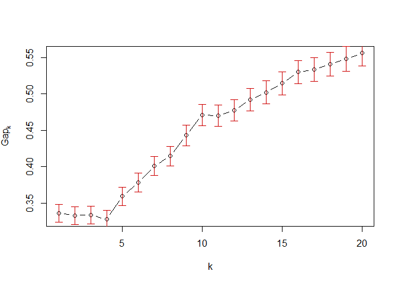
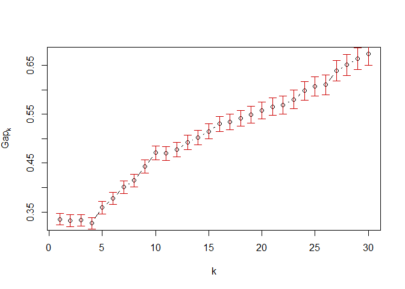
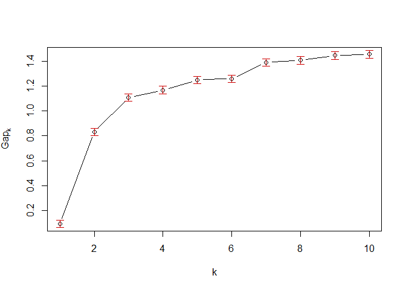

# Connectivity scores
Pieter Moris  
`r format(Sys.Date())`  


## Unraveling the connection between chemical structure and gene expression.

The aim of this analysis is to investigate the association between the structure of chemical compounds (or their predicted biological activity) and the effects they induce in a gene expression assay. We will group compounds with a similar structure (*chemical fingerprint*) or predicted bioactivity (*target prediction*) using clustering methods. Subsequently the *gene expression profiles* of the compounds within a cluster will be contrasted with each other using a connectivity score approach based on the work of @lamb_connectivity_2006 and @zhang_simple_2008 on the [Connectivity Map](https://www.broadinstitute.org/cmap/). 

Their methods enable us to contrast a number of query expression profiles with a set of reference profiles and assess the *connectivity* between compounds in terms of which genes are regulated up or down. The connection between the query and reference data can be both positive and negative. In the former case, highly up-regulated genes in one set will also be up-regulated in the other set, and vice versa for down-regulated genes. In the latter case, genes with a high expression in one assay, might be strongly down-regulated in the other one. Both situations imply that the two compounds interfere with the same biological processes. If two sets are weakly connected, there is no correlation or overlap between the top genes of either set.

We will use an extension of these methods that scores the connectivity between gene expression profiles using *multiple factor analysis* (MFA).

*To do: description and origins of dataset + further explanation of MFA*

## Clustering chemical compounds based on chemical fingerprints
We will employ hierarchical clustering to group the chemical compounds based on their fingerprints or target predictions. In either case we are dealing with a 0/1 matrix where the rows correspond to different compounds. For the chemical fingerprints the columns indicate the presence or absence of specific chemical structures. Together this sequence of ones and zeros describes the entire molecular scaffolding of the compound. In essence we are dealing with a bit string for each compound.

*To do: add description of bioactivity matrix + describe dimensions of data.*

Let's take a look at the chemical fingerprints first. Here is a sneak peak at the data:


```
##                  -2147375257 -2147119955 -2146474760 -2145840573
## metformin                  0           0           0           0
## phenformin                 0           0           0           0
## phenyl biguanide           0           0           0           0
## estradiol                  0           0           0           0
## dexamethasone              0           0           0           0
## verapamil                  0           0           0           0
```

To properly cluster objects based on binary attributes, we need to define an adequate measure of similarity The *Tanimoto coefficient* (sometimes called the *Jaccard coefficient*) is often used for this purpose in cheminformatics [[@maccuish_clustering_2011]](#chem). It contrasts two objects *x* and *y* of dimension *k* in terms of the number of common attributes, *c*, with the number of attributes unique to either object, *a* and *b*. $$s = \frac{c}{a+b-c}$$

*To do: difference in definitions of Tanimoto, jaccard and soergel distance!*

***

http://www.sequentix.de/gelquest/help/distance_measures.htm

https://en.wikipedia.org/wiki/Jaccard_index Various forms of functions described as Tanimoto similarity and Tanimoto distance occur in the literature and on the Internet. Most of these are synonyms for Jaccard similarity and Jaccard distance, but some are mathematically different. 

https://books.google.be/books?id=ZDDNBQAAQBAJ&pg=PA41&lpg=PA41&dq=tanimoto+clustering&source=bl&ots=vsLen2ZmS5&sig=N16boAKkB5NWLJjeteC4shM6Brc&hl=en&sa=X&ved=0ahUKEwiaiZvsx4vLAhWBfxoKHf-9DrwQ6AEISzAH#v=onepage&q=tanimoto%20clustering&f=false Soergel distance

https://docs.tibco.com/pub/spotfire/6.0.0-november-2013/userguide-webhelp/hc/hc_tanimoto_coefficient.htm another different formula!

***

Its complement ($1-s$), the *Soergel distance* is what we will use for our clustering approach. This is what the distance matrix of the compounds will look like:

*To do: R's dist function using binary seems to provide almost the same result! Again, difference between jaccard/tanimoto definitions?*


```r
tanimoto = function(m){
  S = matrix(0,nrow=dim(m)[1],ncol=dim(m)[1])
  m=as.matrix(m)
  N.C=m %*% t(m)
  N.A=m %*% (1-t(m))
  N.B=(1-m) %*% t(m)
  S=N.C/(N.A+N.B+N.C)
  D = 1 - S
  return(D)
}
dist.fingerprintMat <- tanimoto(fingerprintMat)
head(dist.fingerprintMat[,1:4])
```

```
##                  metformin phenformin phenyl biguanide estradiol
## metformin        0.0000000  0.7727273        0.8095238 0.9696970
## phenformin       0.7727273  0.0000000        0.5217391 0.8684211
## phenyl biguanide 0.8095238  0.5217391        0.0000000 0.9210526
## estradiol        0.9696970  0.8684211        0.9210526 0.0000000
## dexamethasone    0.9473684  0.8863636        0.9318182 0.6976744
## verapamil        0.9090909  0.8461538        0.9250000 0.7906977
```

```r
# alternative?
test.dist.fingerprintMat <- as.matrix(dist(fingerprintMat,method = 'binary'))
# test.dist.fingerprintMat == dist.fingerprintMat
```

Now we can go ahead and try to cluster these compounds based on their chemical fingerprints. We will use the `agnes` function provided by the `cluster` package, which implements a basic agglomerative hierarchical clustering analysis. Agglomerative hierarchical clustering attempts to form groups of similar objects from a bottom-up approach (as opposed to divisve methods). It starts by assigning each observation to its own cluster. Then, an hierarchy is created by repeatedly merging pairs of clusters at lower levels until a single cluster is reached at the top level. Not only do we need an appropriate measure of distance, like the Tanimoto distance, but we also need to choose an agglomeration method. This method will define how the distance between clusters is calculated: e.g. do we only look at the largest distance between its members or do we take the average of all pairwise distances? For this analysis we will choose the average method, which strikes a compromise between compactness and closeness of the clusters.

By applying this method to the Tanimoto distance matrix of the compound chemical fingerprints we obtain the following dendogram. Note that the height of each node signifies the dissimilarity between its daughter clusters.


```r
### Base R method:
# cluster.fingerprintMat <- hclust(as.dist(dist.fingerprintMat), method = "average")
# plot(cluster.fingerprintMat,main='Hierarchical clustering of compounds based on their chemical fingerprints',hang=-1,col = "#487AA1", col.main = "#F38630", col.lab = "#F38630", col.axis = "#7C8071",xlab="Compounds",sub="", lwd = 2)
# axis(side = 2, at = seq(0, 400, 100), col = "#F38630", labels = TRUE, lwd = 2)

library(cluster)
cluster.fingerprintMat <- agnes(as.dist(dist.fingerprintMat),method = "average")
# plot(cluster.fingerprintMat,which.plots = 2)
pltree(cluster.fingerprintMat,main='Hierarchical clustering of compounds based on their chemical fingerprints',hang=-1,col = "#487AA1", col.main = "#F38630", col.lab = "#F38630", col.axis = "#7C8071",xlab="Compounds",sub="", lwd = 2) # calls as.hclust plot method
axis(side = 2, at = seq(0, 400, 100), col = "#F38630", labels = TRUE, lwd = 2)
```


Next, we need to decide on an appropriate number of clusters and prune the tree to this size. This is different from other cluster methods, such as k-means clustering, where the number of clusters is defined beforehand. For example, let's say we opt for ten clusters in total:


```r
pltree(cluster.fingerprintMat,main='Hierarchical clustering of compounds based on their chemical fingerprints',hang=-1,col = "#487AA1", col.main = "#F38630", col.lab = "#F38630", col.axis = "#7C8071",xlab="Compounds",sub="", lwd = 2) # calls as.hclust plot method
axis(side = 2, at = seq(0, 400, 100), col = "#F38630", labels = TRUE, lwd = 2)
rect.hclust(cluster.fingerprintMat,k=10)
```


In practise it is better to define the number of clusters based on the distance between certain groups. The Gap statistic can be used to make a more informed decision about this [@hastie_elements_2009-1]. The `cluster` package provides a method to calculate the Gap statistic using a bootstrap approach. Visually we are looking for a kink or elbow in a plot of the gap statistic versus the number of clusters. This indicates that the decrease in within-cluster similarity is leveling off. More formally we will rely on the `TibshiraniSEmax` criterium.


```r
FUNcluster = function(x,k,inputcluster){
  # Function that requires the original observations (x), 
  # the number of desired clusters (k),
  # and a cluster object 
	out = list( cluster = cutree(inputcluster,k=k))
	return(out)
}
gap <- clusGap(fingerprintMat,FUNcluster = FUNcluster,inputcluster=cluster.fingerprintMat,K.max = 20,B = 500)
plot(gap)
```



```r
gapdata <- as.data.frame(gap$Tab)
maxSE(gapdata[,3],gapdata[,4],"Tibs2001SEmax")
```

```
## [1] 1
```

```r
gap <- clusGap(fingerprintMat,FUNcluster = FUNcluster,inputcluster=cluster.fingerprintMat,K.max = 30,B = 500)
plot(gap)
```



```r
gapdata <- as.data.frame(gap$Tab)
maxSE(gapdata[,3],gapdata[,4],"Tibs2001SEmax")
```

```
## [1] 1
```

```r
maxSE(gapdata[,3],gapdata[,4],"firstSEmax")
```

```
## [1] 1
```

```r
maxSE(gapdata[,3],gapdata[,4],"globalSEmax")
```

```
## [1] 28
```

```r
maxSE(gapdata[,3],gapdata[,4],"firstmax")
```

```
## [1] 1
```

```r
maxSE(gapdata[,3],gapdata[,4],"globalmax")
```

```
## [1] 30
```

```r
iris.cluster <- agnes(iris[1:4],diss = F,metric = "euclidian",method="average")
iris.gap <- clusGap(iris[1:4],FUNcluster = FUNcluster,inputcluster=iris.cluster,K.max = 10,B = 500)
plot(iris.gap)
```



```r
iris.gapdata <- as.data.frame(iris.gap$Tab)
maxSE(iris.gapdata[,3],iris.gapdata[,4],"Tibs2001SEmax")
```

```
## [1] 5
```

We can also inspect how many entries are in each cluster for various cluster sizes.


```r
# http://www.stat.berkeley.edu/~s133/Cluster2a.html
counts = sapply(2:15,function(ncl)table(cutree(cluster.fingerprintMat,ncl)))
names(counts) = 2:15
counts
```

```
## $`2`
## 
##  1  2 
## 55  1 
## 
## $`3`
## 
##  1  2  3 
##  2 53  1 
## 
## $`4`
## 
##  1  2  3  4 
##  1 53  1  1 
## 
## $`5`
## 
##  1  2  3  4  5 
##  1 31 22  1  1 
## 
## $`6`
## 
##  1  2  3  4  5  6 
##  1 31 15  7  1  1 
## 
## $`7`
## 
##  1  2  3  4  5  6  7 
##  1  8 15 23  7  1  1 
## 
## $`8`
## 
##  1  2  3  4  5  6  7  8 
##  1  8 15 17  6  7  1  1 
## 
## $`9`
## 
##  1  2  3  4  5  6  7  8  9 
##  1  8  6 17  6  9  7  1  1 
## 
## $`10`
## 
##  1  2  3  4  5  6  7  8  9 10 
##  1  8  6 10  6  7  9  7  1  1 
## 
## $`11`
## 
##  1  2  3  4  5  6  7  8  9 10 11 
##  1  8  6 10  6  7  9  6  1  1  1 
## 
## $`12`
## 
##  1  2  3  4  5  6  7  8  9 10 11 12 
##  1  8  6 10  4  7  9  6  2  1  1  1 
## 
## $`13`
## 
##  1  2  3  4  5  6  7  8  9 10 11 12 13 
##  1  8  6  5  4  7  9  5  6  2  1  1  1 
## 
## $`14`
## 
##  1  2  3  4  5  6  7  8  9 10 11 12 13 14 
##  1  8  6  5  2  7  9  5  6  2  2  1  1  1 
## 
## $`15`
## 
##  1  2  3  4  5  6  7  8  9 10 11 12 13 14 15 
##  1  6  6  5  2  7  9  5  6  2  2  2  1  1  1
```

***
**To do:**
- gap statistic suggests 1 cluster...function seems to work fine for iris dataset (5 clusters instead of 3 though), but shape looks OK.
- alternative clustering methods: https://stat.ethz.ch/R-manual/R-devel/library/cluster/html/mona.html
- chemmineR
***

## Connectivity scoring using multiple factor analysis

Now that we have identified clusters of compounds that are similar in their structure (chemical fingerprint), we will investigate whether or not they are also similar according to the gene expression profiles they induce *in vitro*. To do this, we will use MFA to compare the gene expression profile of a certain compound (the query) with the profiles of all the other compounds in its cluster (the reference database), i.e. a leave-one-out approach. This will be done once for each compound in a cluster, for every cluster we defined earlier. Afterwards, it might also be interesting to contrast entire clusters with one another, i.e. by using one cluster as a query dataset and comparing it with the other clusters, i.e. a leave-one-cluster-out method.

**Question isn't just if compounds in a cluster are similar, but if they are similar because the same genes are being regulated in the same way!**

**Using k = 13 for now...**


```r
library(CSFA)
cut.cluster.fingerprintMat <- cutree(cluster.fingerprintMat,k=13)

# fingerprintMat[cut.cluster.fingerprintMat==2,]
# 
# clusterCols <- rainbow(length(unique(cut.cluster.fingerprintMat)))
# 
# myClusterSideBar <- clusterCols[cut.cluster.fingerprintMat]
# 
# fingerprintMat[,cut.cluster.fingerprintMat]
```

## Promising reading materials

- [Use of chemical similarity in drug discovery](http://mcc.irb.hr/mcc_04/presentations/butina_d_mcc04_2.pdf)
- [ChemmineR](https://www.bioconductor.org/packages/3.3/bioc/vignettes/ChemmineR/inst/doc/ChemmineR.html#introduction) and [tutorial](http://chemmine.ucr.edu/help/): 
    + contains modules for similarity searching of chemical compounds (Tanimoto coefficient)
    + clustering of compounds by structural and physicochemical similarities is a powerful approach for correlating structural features of compounds with their activities
- [textbook on clustering in drug discovery](https://books.google.be/books?id=ZDDNBQAAQBAJ&pg=PA41&lpg=PA41&dq=tanimoto+clustering&source=bl&ots=vsLen2ZmS5&sig=N16boAKkB5NWLJjeteC4shM6Brc&hl=en&sa=X&ved=0ahUKEwiaiZvsx4vLAhWBfxoKHf-9DrwQ6AEISzAH#v=onepage&q=tanimoto%20clustering&f=false)
- Some cross-validated links:
    + [frequent item set better than clustering?](https://stats.stackexchange.com/questions/86318/clustering-a-binary-matrix)
    + [ordinal vs nominal binary](https://stats.stackexchange.com/questions/116856/hierarchical-or-two-step-cluster-analysis-for-binary-data?rq=1) does the simultaneous absence of both attributes convey any information?
    + [hierarchical clustering](https://stats.stackexchange.com/questions/2717/clustering-with-a-distance-matrix?rq=1)
    + [more clustering options for boolean](https://stats.stackexchange.com/questions/70113/cluster-large-boolean-dataset?rq=1)
- References for clustering:
    + http://handsondatascience.com/ClustersO.pdf

# References
