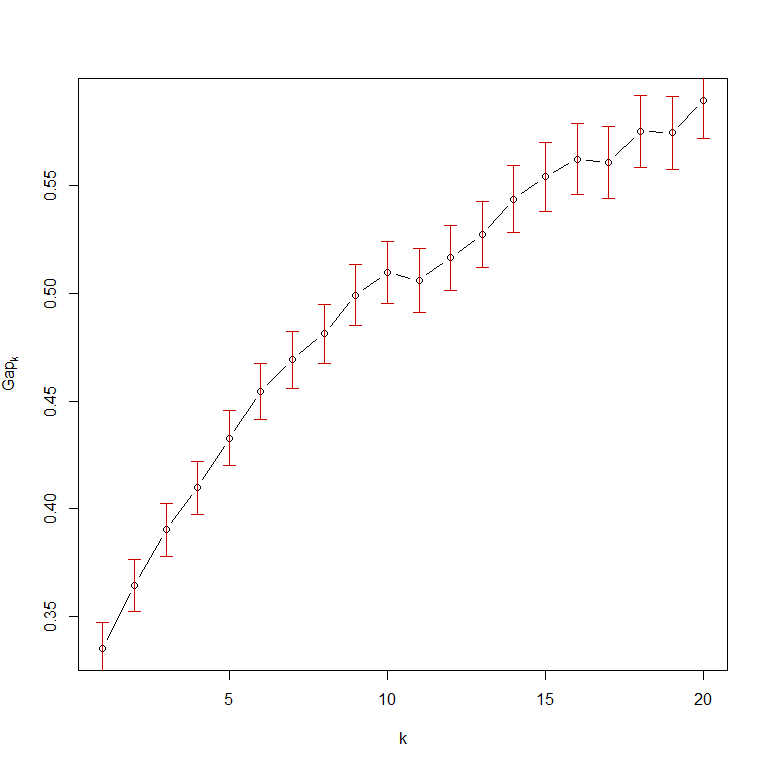
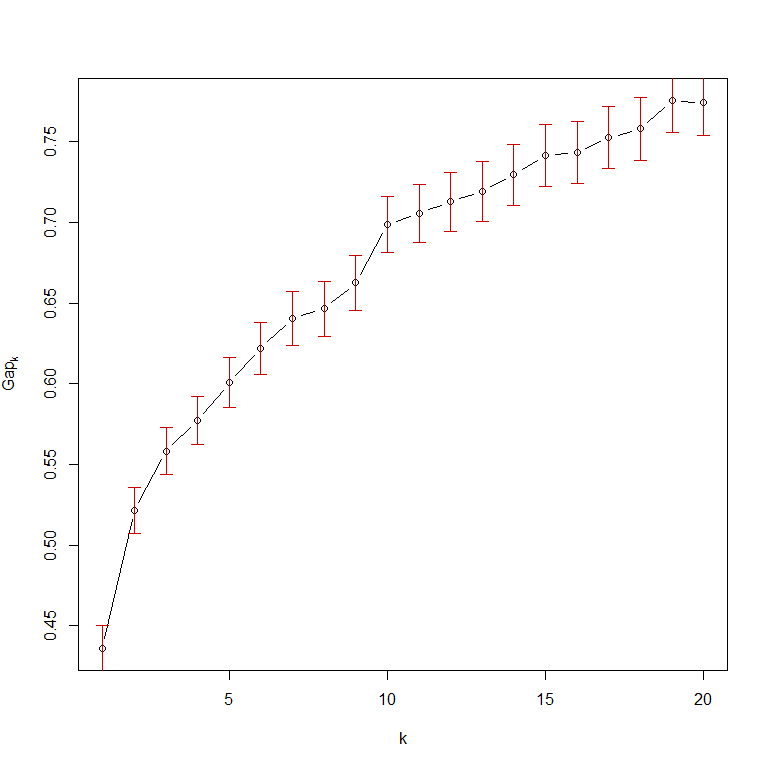

# Integration of connectivity scores of gene expression data and clustering on other data sources
Pieter Moris  
`r format(Sys.Date())`  


<!-- http://kbroman.org/knitr_knutshell/pages/Rmarkdown.html -->
<!-- https://github.com/jeromyanglim/rmarkdown-rmeetup-2012/issues/14 -->
<!-- http://yihui.name/knitr/demo/output/ -->

## Unraveling the connection between chemical structure and gene expression.

The aim of this analysis is to investigate the association between the structure of chemical compounds (or their predicted biological activity) and the effects they induce in a gene expression assay. We will group compounds with a similar structure (*chemical fingerprint*) or predicted bio-activity (*target prediction*) using clustering methods. Subsequently the *gene expression profiles* of the compounds within a cluster will be contrasted with each other using a connectivity score approach based on the work of @lamb_connectivity_2006 and @zhang_simple_2008 on the [Connectivity Map](https://www.broadinstitute.org/cmap/). 

Their methods enable us to contrast a number of query expression profiles with a set of reference profiles and assess the *connectivity* between compounds in terms of which genes are regulated up or down. The connection between the query and reference data can be both positive and negative. In the former case, highly up-regulated genes in one set will also be up-regulated in the other set, and vice versa for down-regulated genes. In the latter case, genes with a high expression in one assay, might be strongly down-regulated in the other one. Both situations imply that the two compounds interfere with the same biological processes. If two sets are weakly connected, there is no correlation or overlap between the top genes of either set. We will use an extension of these methods that scores the connectivity between gene expression profiles using *multiple factor analysis* (MFA). In a nutshell, we will look at the principal axes of variation in the gene expression profiles and we hope to find components where both the reference and the query compounds have a high contribution. 

The dataset we will focus on is the Connectivity Map's MCF-7 dataset, where the gene-wide expression profiles for a breast cancer cell line when exposed to several bio-active small molecules. The chemical fingerprints and and target predictions of these compounds was provided as well.

## Clustering chemical compounds based on chemical fingerprints
We will employ hierarchical clustering to group the chemical compounds based on their fingerprints or target predictions. In either case we are dealing with a 0/1 matrix where the rows correspond to different compounds. For the chemical fingerprints the columns indicate the presence or absence of specific chemical structures. Together this sequence of ones and zeros describes the entire molecular scaffolding of the compound. In essence we are dealing with a bit string for each compound.

Similarly, the binary target prediction matrix indicates whether or not a certain compound is predicted to bind to a certain molecular target, such as enzymes.

Let's take a look at the chemical fingerprints first. Here is a sneak peek of the data:


```
##                  -2147375257 -2147119955 -2146474760 -2145840573
## metformin                  0           0           0           0
## phenformin                 0           0           0           0
## phenyl biguanide           0           0           0           0
## estradiol                  0           0           0           0
## dexamethasone              0           0           0           0
## verapamil                  0           0           0           0
```

To properly cluster objects based on binary attributes, we need to define an adequate measure of similarity. The *Tanimoto coefficient* (sometimes called the *Jaccard coefficient*) is often used for this purpose in cheminformatics [[@maccuish_clustering_2011]](#chem). It contrasts two objects *x* and *y* of dimension *k* in terms of the number of common attributes, *c* versus the number of attributes unique to either object, *a* and *b*. $$s = \frac{c}{a+b-c}$$

*To do: difference in definitions of Tanimoto, jaccard and soergel distance!*

<!-- *** -->

<!-- http://www.sequentix.de/gelquest/help/distance_measures.htm -->

<!-- https://en.wikipedia.org/wiki/Jaccard_index Various forms of functions described as Tanimoto similarity and Tanimoto distance occur in the literature and on the Internet. Most of these are synonyms for Jaccard similarity and Jaccard distance, but some are mathematically different.  -->

<!-- https://books.google.be/books?id=ZDDNBQAAQBAJ&pg=PA41&lpg=PA41&dq=tanimoto+clustering&source=bl&ots=vsLen2ZmS5&sig=N16boAKkB5NWLJjeteC4shM6Brc&hl=en&sa=X&ved=0ahUKEwiaiZvsx4vLAhWBfxoKHf-9DrwQ6AEISzAH#v=onepage&q=tanimoto%20clustering&f=false Soergel distance -->

<!-- https://docs.tibco.com/pub/spotfire/6.0.0-november-2013/userguide-webhelp/hc/hc_tanimoto_coefficient.htm another different formula! -->

<!-- *** -->

Its complement ($1-s$), the *Soergel distance*, is what we will use for our clustering approach. This is what the distance matrix of the compounds based on their fingerprints will look like:

<!-- *To do: R's dist function using binary seems to provide almost the same result! Again, difference between jaccard/tanimoto definitions?* -->


```r
tanimoto = function(m){
  S = matrix(0,nrow=dim(m)[1],ncol=dim(m)[1])
  m=as.matrix(m)
  N.C=m %*% t(m)
  N.A=m %*% (1-t(m))
  N.B=(1-m) %*% t(m)
  S=N.C/(N.A+N.B+N.C)
  D = 1 - S
  return(D)
}
dist.fingerprintMat <- tanimoto(fingerprintMat)
head(dist.fingerprintMat[,1:4])
```

```
##                  metformin phenformin phenyl biguanide estradiol
## metformin        0.0000000  0.7727273        0.8095238 0.9696970
## phenformin       0.7727273  0.0000000        0.5217391 0.8684211
## phenyl biguanide 0.8095238  0.5217391        0.0000000 0.9210526
## estradiol        0.9696970  0.8684211        0.9210526 0.0000000
## dexamethasone    0.9473684  0.8863636        0.9318182 0.6976744
## verapamil        0.9090909  0.8461538        0.9250000 0.7906977
```

```r
# alternative in base r?
# test.dist.fingerprintMat <- as.matrix(dist(fingerprintMat,method = 'binary'))
# test.dist.fingerprintMat == dist.fingerprintMat
```

Now we can go ahead and try to cluster these compounds based on their (dis)similarity in chemical fingerprints. We will use the `agnes` function provided by the `cluster` package, which implements a basic agglomerative hierarchical clustering analysis. Agglomerative hierarchical clustering attempts to form groups of similar objects through a bottom-up approach (as opposed to divisive methods). It starts by assigning each observation to its own cluster. Then, an hierarchy is created by repeatedly merging pairs of similar clusters at lower levels (i.e. those that are close according to our *distance* measure), until a single cluster is formed at the top level. Not only do we require an appropriate measure of distance, like the Tanimoto distance, but we also need to choose an agglomeration method. This method will define how the distance between clusters is calculated: e.g. do we only look at the largest distance between its members or do we take the average of all pairwise distances? We will try both the average method, which strikes a compromise between compactness and closeness of the clusters, and the flexible-Beta, a method often used in ecology (with $\alpha = 0.625$). 

<!-- For this analysis we will choose the average method, which strikes a compromise between compactness and closeness of the clusters. -->

By applying this method to the Tanimoto distance matrix of the compound chemical fingerprints we obtain the following dendogram. Note that the height of each node signifies the dissimilarity between its daughter clusters.


```r
### Base R method:
# cluster.fingerprintMat <- hclust(as.dist(dist.fingerprintMat), method = "average")
# plot(cluster.fingerprintMat,main='Hierarchical clustering of compounds based on their chemical fingerprints',hang=-1,col = "#487AA1", col.main = "#F38630", col.lab = "#F38630", col.axis = "#7C8071",xlab="Compounds",sub="", lwd = 2)
# axis(side = 2, at = seq(0, 400, 100), col = "#F38630", labels = TRUE, lwd = 2)

library(cluster)
cluster.a.fingerprintMat <- agnes(as.dist(dist.fingerprintMat),method = "average")
# plot(cluster.a.fingerprintMat,which.plots = 2)
pltree(cluster.a.fingerprintMat,main='Hierarchical clustering of compounds based on their chemical fingerprints',col = "#487AA1", col.main = "#F38630", col.lab = "#F38630", col.axis = "#7C8071",xlab="Compounds",sub="", lwd = 2) # calls as.hclust plot method (,hang=-1)
axis(side = 2, at = seq(0, 400, 100), col = "#F38630", labels = TRUE, lwd = 2)
```


Next, we need to decide on an appropriate number of clusters and prune the tree to this size. This is different from other cluster methods, such as k-means clustering, where the number of clusters is defined beforehand. We could eyeball it by looking at the dendogram, but in practise it is more appropriate to define the number of clusters based on the distance between certain groups. The Gap statistic can be used to make a more informed decision about this [@hastie_elements_2009-1]. The `cluster` package provides a method to calculate the Gap statistic using a bootstrap approach. Visually we are looking for a kink or elbow in a plot of the gap statistic versus the number of clusters. This indicates that the decrease in within-cluster similarity is levelling off. More formally we will rely on the `TibshiraniSEmax` criterium.


```r
FUNcluster = function(x,k,inputcluster){
  # Function that requires the original observations (x), 
  # the number of desired clusters (k),
  # and a cluster object 
	out = list( cluster = cutree(inputcluster,k=k))
	return(out)
}
gap <- clusGap(fingerprintMat,FUNcluster = FUNcluster,inputcluster=cluster.a.fingerprintMat,K.max = 20,B = 500)
plot(gap)
```


```r
gapdata <- as.data.frame(gap$Tab)
maxSE(gapdata[,3],gapdata[,4],"Tibs2001SEmax")
```

```
## [1] 1
```


Unfortunately, the criteria suggests that we should only utilise one cluster. This can also be seen in the dendogram, where most splits tend to occur at a similar level of distance. 

Now let's try the flexible beta agglomeration method.


```r
cluster.fingerprintMat <- agnes(as.dist(dist.fingerprintMat),method = "flexible",par.method = 0.625)
pltree(cluster.fingerprintMat,main='Hierarchical clustering of compounds based on their chemical fingerprints',col = "#487AA1", col.main = "#F38630", col.lab = "#F38630", col.axis = "#7C8071",xlab="Compounds",sub="", lwd = 2) # calls as.hclust plot method
axis(side = 2, at = seq(0, 400, 100), col = "#F38630", labels = TRUE, lwd = 2)
```


```r
gap <- clusGap(fingerprintMat,FUNcluster = FUNcluster,inputcluster=cluster.fingerprintMat,K.max = 20,B = 500)
plot(gap)
```



```r
gapdata <- as.data.frame(gap$Tab)
k.fingerprint <- maxSE(gapdata[,3],gapdata[,4],"Tibs2001SEmax")
k.fingerprint
```

```
## [1] 7
```

It's already obvious from the dendogram that some of the splits happen at much larger distances than others, which makes it easier to decide on appropriate groups. The `TibshiraniSEmax` suggests that seven clusters is optimal.


```r
pltree(cluster.fingerprintMat,main='Hierarchical clustering of compounds based on their chemical fingerprints',hang=-1,col = "#487AA1", col.main = "#F38630", col.lab = "#F38630", col.axis = "#7C8071",xlab="Compounds",sub="", lwd = 2) # calls as.hclust plot method
axis(side = 2, at = seq(0, 400, 100), col = "#F38630", labels = TRUE, lwd = 2)
rect.hclust(cluster.fingerprintMat,k=k.fingerprint)
```


Here is a list of the clusters we obtained:


```r
cut.cluster.fingerprintMat <- cutree(cluster.fingerprintMat,k=k.fingerprint) # get vector with cluster membership for compounds
sapply(unique(cut.cluster.fingerprintMat), function(x) colnames(geneMat)[cut.cluster.fingerprintMat==x])
```

```
## [[1]]
## [1] "metformin"              "phenformin"            
## [3] "phenyl biguanide"       "tetraethylenepentamine"
## [5] "tioguanine"            
## 
## [[2]]
## [1] "estradiol"                 "nordihydroguaiaretic acid"
## [3] "genistein"                 "fulvestrant"              
## [5] "dopamine"                  "probucol"                 
## [7] "resveratrol"               "butein"                   
## 
## [[3]]
## [1] "dexamethasone"   "exemestane"      "prednisolone"    "fludrocortisone"
## 
## [[4]]
##  [1] "verapamil"     "rofecoxib"     "amitriptyline" "raloxifene"   
##  [5] "celecoxib"     "LM-1685"       "SC-58125"      "LY-294002"    
##  [9] "indometacin"   "MK-886"        "sulindac"      "exisulind"    
## [13] "staurosporine" "fasudil"       "imatinib"      "clozapine"    
## [17] "haloperidol"   "W-13"          "quinpirole"    "calmidazolium"
## [21] "nocodazole"   
## 
## [[5]]
## [1] "15-delta prostaglandin J2"   "tomelukast"                 
## [3] "ciclosporin"                 "arachidonyltrifluoromethane"
## [5] "trichostatin A"              "valproic acid"              
## [7] "arachidonic acid"            "bucladesine"                
## [9] "benserazide"                
## 
## [[6]]
## [1] "flufenamic acid"          "N-phenylanthranilic acid"
## [3] "diclofenac"               "4,5-dianilinophthalimide"
## 
## [[7]]
## [1] "thioridazine"     "chlorpromazine"   "trifluoperazine" 
## [4] "prochlorperazine" "fluphenazine"
```

<!-- We can also inspect how many entries are in each cluster for various cluster sizes. Fortunately 7 clusters does not lead to any clusters of just one or two compounds, because this could complicate things later on. -->

<!-- ```{r} -->
<!-- # http://www.stat.berkeley.edu/~s133/Cluster2a.html -->
<!-- counts = sapply(2:15,function(ncl)table(cutree(cluster.fingerprintMat,ncl))) -->
<!-- names(counts) = 2:15 -->
<!-- counts -->
<!-- ``` -->

Finally, we will repeat the same procedure for the target predictions.


```r
dist.targetMat <- tanimoto(targetMat)
cluster.targetMat <- agnes(as.dist(dist.targetMat),method = "flexible",par.method = 0.625)

gap <- clusGap(targetMat,FUNcluster = FUNcluster,inputcluster=cluster.targetMat,K.max = 20,B = 500)
plot(gap)
```



```r
gapdata <- as.data.frame(gap$Tab)
k.target <- maxSE(gapdata[,3],gapdata[,4],"Tibs2001SEmax")

pltree(cluster.targetMat,main='Hierarchical clustering of compounds based on their target predictions',col = "#487AA1", col.main = "#F38630", col.lab = "#F38630", col.axis = "#7C8071",xlab="Compounds",sub="", lwd = 2) # calls as.hclust plot method
rect.hclust(cluster.targetMat,k=k.target)
```


```r
cut.cluster.targetMat <- cutree(cluster.targetMat,k=k.target)
sapply(unique(cut.cluster.targetMat), function(x) colnames(geneMat)[cut.cluster.targetMat==x])
```

```
## [[1]]
## [1] "metformin"              "phenformin"            
## [3] "phenyl biguanide"       "celecoxib"             
## [5] "tetraethylenepentamine" "W-13"                  
## 
## [[2]]
## [1] "estradiol"       "dexamethasone"   "exemestane"      "prednisolone"   
## [5] "fludrocortisone" "fulvestrant"    
## 
## [[3]]
## [1] "verapamil"        "amitriptyline"    "clozapine"       
## [4] "thioridazine"     "haloperidol"      "chlorpromazine"  
## [7] "trifluoperazine"  "prochlorperazine" "fluphenazine"    
## 
## [[4]]
##  [1] "rofecoxib"                "LM-1685"                 
##  [3] "SC-58125"                 "indometacin"             
##  [5] "MK-886"                   "sulindac"                
##  [7] "exisulind"                "flufenamic acid"         
##  [9] "N-phenylanthranilic acid" "diclofenac"              
## [11] "4,5-dianilinophthalimide"
## 
## [[5]]
## [1] "15-delta prostaglandin J2"   "tomelukast"                 
## [3] "arachidonyltrifluoromethane" "valproic acid"              
## [5] "arachidonic acid"           
## 
## [[6]]
## [1] "raloxifene"                "nordihydroguaiaretic acid"
## [3] "genistein"                 "quinpirole"               
## [5] "dopamine"                  "probucol"                 
## [7] "resveratrol"               "butein"                   
## [9] "benserazide"              
## 
## [[7]]
##  [1] "LY-294002"      "ciclosporin"    "staurosporine"  "trichostatin A"
##  [5] "fasudil"        "imatinib"       "calmidazolium"  "bucladesine"   
##  [9] "nocodazole"     "tioguanine"
```

## Connectivity scoring using multiple factor analysis

Now that we have identified clusters of compounds that are similar in terms of their structure (chemical fingerprint or target prediction), we will investigate whether or not they are also similar according to the gene expression profiles they induce *in vitro*. To do this, we will use MFA to compare the gene expression profile of a certain compound (the query) with the profiles of all the other compounds in its cluster (the reference database), i.e. a leave-one-out approach. This will be done once for each compound in a cluster, for every cluster we defined earlier. Afterwards, it might also be interesting to contrast entire clusters with one another, i.e. by using one cluster as a query dataset and comparing it with the other clusters, i.e. a leave-one-cluster-out method.

**The question we are interested in is if the same genes are being regulated in the same or opposite way for the compounds in a cluster, i.e. if there is a connection between chemical structure and biological effects.**

### Within cluster connectivity

#### Demo for first cluster

As a proof of concept, we shall perform the leave-one-out procedure on the first cluster.


```r
colnames(geneMat)[cut.cluster.fingerprintMat == 1]
```

```
## [1] "metformin"              "phenformin"            
## [3] "phenyl biguanide"       "tetraethylenepentamine"
## [5] "tioguanine"
```

We define the set of reference profiles as all the compounds in the cluster, except for one (*metformin* in this example). Next, the query set contains all the compounds in the cluster. This can be thought of conceptually as treating the reference set as the known profile or the profile of interest, and searching for similar profiles in the query set. For the MFA, it is important to keep in mind that the compounds are treated as variables or features, whereas the genes are observations. The genes are shared between the reference and query set, but the variables will differ. 


```r
refMat <- geneMat[,cut.cluster.fingerprintMat==1][,-c(1)]
querMat <- geneMat[,cut.cluster.fingerprintMat==1]
colnames(refMat)
```

```
## [1] "phenformin"             "phenyl biguanide"      
## [3] "tetraethylenepentamine" "tioguanine"
```

```r
colnames(querMat)
```

```
## [1] "metformin"              "phenformin"            
## [3] "phenyl biguanide"       "tetraethylenepentamine"
## [5] "tioguanine"
```

In the first step, MFA will normalize both the reference and query dataset by dividing each by their first singular value. Next, a PCA is performed on the combined datasets. This will creates principal axes of variations, which are orthogonal and still explain the entire structure of the data. The principal axes, often called components or factors, are linear combinations of the original variables (or compounds in our setting). We are hoping to find high contributions, termed loadings, of the reference compounds to the first factor and also a high loading of the left out compound on this factor if it is also similar in gene expression. The factor loadings are the actual connectivity scores we are interested in.

We will repeat the MFA, each time leaving out another compound of the cluster in the reference set. Afterwards, we will average the connectivity scores of the left-out compounds, and use this as the global connectivity score within the cluster.


```r
library(CSFA)
# MFA.fingerprint <- CSanalysis(refMat, querMat,"CSmfa",which = c(1:7))
# 2 = principal components for reference compounds
# 3 = factor scores for genes (1vs2) + compound loadings (1v2)
# 4 = factor scores for genes (pc1) interactive
# 5 = compound loadings (pc1)
# 6 = interactive (crash?)
# 7 = CS rank score
factor1.out_MFA <-  CSanalysis(refMat, querMat,"CSmfa",which=c(2,3),factor.plot=1,plot.type='sweave')
```


Already things have become a bit more complex. As you can see in the first plot showing the loadings for the different factors, there is no single factor with high loadings for all of the compounds, which is what we would expect if all the reference compounds are indeed inducing similar gene expression profiles. This indicates that there is no single dominating structure in the reference dataset, **rather there are multiple sub-structures, corresponding to only a few compounds of the reference set**. We call these substructures connectivity sets. 

For example, the largest structure is dominated by the compounds phenformin and phenyl biguanide, whereas the second is made up of tioguanine and **tetraethylenepentamine???**. 

**As such there are also multiple connectivity scores for the left out compound, metformin, each belonging to a different connectivity set. For example, the connectivity score for metformin for the first connectivity set is about 0.1.**


```r
factor1.out_MFA@CS$CS.query
```

```
##                           Factor1
## metformin              0.11598731
## phenformin             0.88875107
## phenyl biguanide       0.86775976
## tetraethylenepentamine 0.07421413
## tioguanine             0.18861928
```

**We could also look at the second component, which is a set consisting of tioguanine (high) and tetraethylenepentamine (low). For this connectivity set metformin scores a bit higher, with a loading around 0.6**


```r
factor2.out_MFA <-  CSanalysis(refMat, querMat,"CSmfa",which=c(),factor.plot=2,plot.type='sweave')
```


```r
factor2.out_MFA@CS$CS.query
```

```
##                           Factor2
## metformin               0.5869890
## phenformin              0.1208763
## phenyl biguanide       -0.2537779
## tetraethylenepentamine -0.6990440
## tioguanine              0.6940803
```

<!-- **Question! What are the CSrankscores? They look similar to the loadings, but small values are reduced to zero?** -->

<!-- ```{r} -->
<!-- factor1.out_MFA@CSRankScores -->
<!-- factor2.out_MFA@CSRankScores -->
<!-- ``` -->

#### Within-connectivity based on fingerprint clustering
Now we will perform this leave-one-out and average procedure for each fingerprint-based cluster, leaving out a single compound each time.


```r
n.cluster.fingerprint <- unique(cut.cluster.fingerprintMat) # number of clusters

connectivity.fingerprint <- lapply(n.cluster.fingerprint, function(x) sapply(rownames(fingerprintMat[cut.cluster.fingerprintMat==x,,drop=F]),function(y) NULL)) # initialize list to store MFA results

ptm <- proc.time()
for (i in 1:length(connectivity.fingerprint)) { # loop through clusters
  cluster.names <- rownames(fingerprintMat[cut.cluster.fingerprintMat==i,,drop=F])
  for (j in 1:length(cluster.names)) { # loop through compounds in a cluster
    connectivity.fingerprint[[i]][[j]][['refMat']] <- geneMat[,cluster.names[-c(j)]] # reference contains all but j'th compound
    connectivity.fingerprint[[i]][[j]][['querMat']] <- geneMat[,cluster.names] # query set contains all compounds in cluster
    connectivity.fingerprint[[i]][[j]]['MFA'] <- CSanalysis(connectivity.fingerprint[[i]][[j]][['refMat']],
                                                     connectivity.fingerprint[[i]][[j]][['querMat']],
                                                     "CSmfa",which=c(),factor.plot=1) # MFA analysis
  }
}
proc.time() - ptm
```

We'll take a look at the results for the first cluster, i.e. leaving out one of the compounds each time, for the first component.


```r
for (j in rownames(fingerprintMat[cut.cluster.fingerprintMat==1,,drop=F])){
  print(paste('Query compound is',j))
  print(connectivity.fingerprint[[1]][[j]][['MFA']]@CS$CS.query)
}
```

```
## [1] "Query compound is metformin"
##                           Factor1
## metformin              0.11598731
## phenformin             0.88875107
## phenyl biguanide       0.86775976
## tetraethylenepentamine 0.07421413
## tioguanine             0.18861928
## [1] "Query compound is phenformin"
##                            Factor1
## metformin               0.79666125
## phenformin              0.08757013
## phenyl biguanide       -0.31333693
## tetraethylenepentamine -0.57058029
## tioguanine              0.63276623
## [1] "Query compound is phenyl biguanide"
##                           Factor1
## metformin               0.7688766
## phenformin              0.5713239
## phenyl biguanide        0.1717391
## tetraethylenepentamine -0.4410884
## tioguanine              0.6324281
## [1] "Query compound is tetraethylenepentamine"
##                            Factor1
## metformin               0.33602329
## phenformin              0.89313511
## phenyl biguanide        0.76749299
## tetraethylenepentamine -0.03704697
## tioguanine              0.33471513
## [1] "Query compound is tioguanine"
##                           Factor1
## metformin              0.17183683
## phenformin             0.90322026
## phenyl biguanide       0.85494862
## tetraethylenepentamine 0.04266674
## tioguanine             0.13805259
```

And for the second component (note: the print-out of CSanalysis is not suppressed unfortunately):


```r
# b <- connectivity.fingerprint[[1]][[1]][['MFA']]
# a<-CSanalysis(connectivity.fingerprint[[1]][[1]][['refMat']],
#                     connectivity.fingerprint[[1]][[1]][['querMat']],
#                     "CSmfa",factor.plot=2,which=c(2,3),
#                     result.available=connectivity.fingerprint[[1]][[1]][['MFA']],plot.type='sweave')
# b@CS$CS.query
# a@CS$CS.query
# connectivity.fingerprint[[1]][[1]][['MFA']]@CS$CS.query
## Warning in .local(refMat, querMat, type, ...): CS, GS and CSRankScores Slot
## in CSresult will be overwritten due to different factor choice.

redo_MFA_fingerprint_within = function(cluster,compound,factor){
  # Plots result for already calculated MFA objects
  mfa <- CSanalysis(connectivity.fingerprint[[cluster]][[compound]][['refMat']],
                    connectivity.fingerprint[[cluster]][[compound]][['querMat']],
                    "CSmfa",factor.plot=factor,which=c(),
                    result.available=connectivity.fingerprint[[cluster]][[compound]][['MFA']],
                    plot.type='sweave')
  return(mfa)
}

for (j in rownames(fingerprintMat[cut.cluster.fingerprintMat==1,,drop=F])){
  print(paste('Query compound is',j))
  print(redo_MFA_fingerprint_within(1,j,2)@CS$CS.query)
}
```

```
## [1] "Query compound is metformin"
## Echoufier Rv Correlation:
##           Reference     Query       MFA
## Reference 1.0000000 0.9157038 0.9761933
## Query     0.9157038 1.0000000 0.9810670
## MFA       0.9761933 0.9810670 1.0000000
##                           Factor2
## metformin               0.5869890
## phenformin              0.1208763
## phenyl biguanide       -0.2537779
## tetraethylenepentamine -0.6990440
## tioguanine              0.6940803
## [1] "Query compound is phenformin"
## Echoufier Rv Correlation:
##           Reference     Query       MFA
## Reference 1.0000000 0.9179576 0.9777683
## Query     0.9179576 1.0000000 0.9807286
## MFA       0.9777683 0.9807286 1.0000000
##                          Factor2
## metformin              0.1623938
## phenformin             0.7518322
## phenyl biguanide       0.8908009
## tetraethylenepentamine 0.1721841
## tioguanine             0.3424859
## [1] "Query compound is phenyl biguanide"
## Echoufier Rv Correlation:
##           Reference     Query       MFA
## Reference 1.0000000 0.9175224 0.9769254
## Query     0.9175224 1.0000000 0.9812886
## MFA       0.9769254 0.9812886 1.0000000
##                           Factor2
## metformin              -0.2400944
## phenformin              0.7541274
## phenyl biguanide        0.7720287
## tetraethylenepentamine  0.4674535
## tioguanine             -0.1649890
## [1] "Query compound is tetraethylenepentamine"
## Echoufier Rv Correlation:
##           Reference     Query       MFA
## Reference 1.0000000 0.9150150 0.9762515
## Query     0.9150150 1.0000000 0.9806818
## MFA       0.9762515 0.9806818 1.0000000
##                           Factor2
## metformin               0.7747060
## phenformin             -0.1183784
## phenyl biguanide       -0.4993155
## tetraethylenepentamine -0.3237629
## tioguanine              0.6651523
## [1] "Query compound is tioguanine"
## Echoufier Rv Correlation:
##           Reference     Query       MFA
## Reference 1.0000000 0.9151536 0.9765328
## Query     0.9151536 1.0000000 0.9804937
## MFA       0.9765328 0.9804937 1.0000000
##                           Factor2
## metformin               0.8141635
## phenformin              0.1455314
## phenyl biguanide       -0.3124059
## tetraethylenepentamine -0.7012783
## tioguanine              0.3755571
```
**It's apparent that there is not just one main structure or connectivity set in this cluster. Both the first and second connectivity scores could be taken into account when calculating the average connectivity.**

<!-- Here are the related plots: -->

<!-- ```{r fingerprint_clust1_plots} -->
<!-- plot_MFA_fingerprint_within = function(cluster,compound,factor){ -->
<!--   # Plots result for already calculated MFA objects -->
<!--   mfa <- CSanalysis(connectivity.fingerprint[[cluster]][[compound]][['refMat']], -->
<!--                     connectivity.fingerprint[[cluster]][[compound]][['querMat']], -->
<!--                     "CSmfa",factor.plot=factor,which=c(2,3), -->
<!--                     result.available=connectivity.fingerprint[[cluster]][[compound]][['MFA']], -->
<!--                     plot.type='sweave') -->
<!--   return(mfa) -->
<!-- } -->
<!-- # plot_MFA_fingerprint_within(1,'metformin') -->
<!-- for (j in rownames(fingerprintMat[cut.cluster.fingerprintMat==1,,drop=F])){ -->
<!--   print(paste('Query compound is',j)) -->
<!--   plot_MFA_fingerprint_within(1,j,1) -->
<!-- } -->
<!-- ``` -->

Let's calculate the average connectivity for the clusters for the first and second component separately. We will use the mean of the absolute values as the connectivity measure, but it could be argued that the reverse, the absolute value of the mean is more appropriate. The difference is whether compounds with opposite effects on gene expression will be considered similar or not.

<!-- ```{r,eval=F,include=F} -->
<!-- # Test for average loop -->
<!-- test <- connectivity.fingerprint[[1]] -->
<!-- test[['metformin']][['MFA']]@CS$CS.query['metformin',] -->
<!-- test[['phenformin']][['MFA']]@CS$CS.query['phenformin',] -->

<!-- sapply(seq_along(test), function(x,n) test[[x]][['MFA']]@CS$CS.query[n[x],] ,n=names(test)) -->

<!-- test2 <- connectivity.fingerprint[[2]] -->
<!-- sapply(seq_along(test2), function(x,n) test2[[x]][['MFA']]@CS$CS.query[n[x],] ,n=names(test2)) -->
<!-- ``` -->

##### Average within-cluster connectivity plots for fingerprints

The average scores for each cluster are shown below:


```r
# inner sapply x retrieves query loading for each leave-one-out MFA: returns list of query loadings
# middle sapply y loops through clusters and returns list of query loadings for each cluster
# outer sapply z takes mean absolute value of each list
average.connectivity.fingerprint.pc1 <- sapply(sapply(connectivity.fingerprint, function(y) sapply(seq_along(y), function(x,n) y[[x]][['MFA']]@CS$CS.query[n[x],] ,n=names(y))), function(z) mean(abs(z)))

plot(average.connectivity.fingerprint.pc1,xlab='Cluster',ylab='Average connectivity score for PC1')
```


These are the results when the absolute value of the means is used: the overall pattern remains unchanged.


```r
test.average.connectivity.fingerprint.pc1 <- abs(sapply(sapply(connectivity.fingerprint, function(y) sapply(seq_along(y), function(x,n) y[[x]][['MFA']]@CS$CS.query[n[x],] ,n=names(y))), mean))

plot(test.average.connectivity.fingerprint.pc1,xlab='Cluster',ylab='Average connectivity score for PC1')
```


<!-- sweave test -->
<!-- ```{r} -->
<!-- CSanalysis(connectivity.fingerprint[[1]][[1]][['refMat']], -->
<!--                     connectivity.fingerprint[[1]][[1]][['querMat']], -->
<!--                     "CSmfa",factor.plot=1,which=c(2,3), -->
<!--                     result.available=connectivity.fingerprint[[1]][[1]][['MFA']],plot.type='sweave') -->
<!-- ``` -->

<!-- ```{r} OLD LOOP FRAMEWORK--> 
<!-- # Loop framework to use later... -->
<!-- n.cluster <- unique(cut.cluster.fingerprintMat) # number of clusters -->

<!-- connectivity.fingerprint <- vector('list',length(n.cluster)) # initialize list to store connectivity scores -->

<!-- for (i in n.cluster) { -->
<!--   compounds.in.cluster <- rownames(fingerprintMat[cut.cluster.fingerprintMat==i,,drop=F]) -->
<!--   connectivity.fingerprint[[i]] <- sapply( c('average',compounds.in.cluster), function(j) NULL) -->
<!--   connectivity.fingerprint[[i]][['compounds']] <- compounds.in.cluster -->
<!-- } -->

<!-- ptm <- proc.time() -->
<!-- for (i in 1:length(connectivity.fingerprint)) { # loop through clusters -->
<!--   sum <- 0 -->
<!--   for (j in 1:length(connectivity.fingerprint[[i]]$compounds)) { # loop through compounds in a cluster -->
<!--     refMat <- geneMat[,connectivity.fingerprint[[i]]$compounds[-c(j)]] -->
<!--     querMat <- geneMat[,connectivity.fingerprint[[i]]$compounds] -->
<!--     connectivity.fingerprint[[i]][[connectivity.fingerprint[[i]]$compounds[[j]]]] <- CSanalysis(refMat,querMat,"CSmfa",which=c(),factor.plot=1) -->
  <!--   sum <- sum + connectivity.fingerprint[[i]][[connectivity.fingerprint[[i]]$compounds[[j]]]][connectivity.fingerprint[[i]]$compounds[[j]],] -->
  <!-- } -->
  <!-- connectivity.fingerprint[[i]]$average <- sum/j -->
<!-- } -->
<!-- proc.time() - ptm -->
<!-- ``` -->

<!-- ```{r,eval=F} -->
<!-- # old plotting tool when averages were stored in list -->
<!-- plot(sapply(connectivity.fingerprint, function(x) x$average),xlab='Cluster',ylab='Average connectivity score') -->
<!-- ``` -->

Cluster 7 looks the most promising, it consists of the following compounds:


```r
colnames(geneMat)[cut.cluster.fingerprintMat == 7]
```

```
## [1] "thioridazine"     "chlorpromazine"   "trifluoperazine" 
## [4] "prochlorperazine" "fluphenazine"
```

And the query loadings are similar to the reference loadings for each leave-one-out iteration:


```r
for (j in rownames(fingerprintMat[cut.cluster.fingerprintMat==7,,drop=F])){
  print(paste('Query compound is',j))
  print(connectivity.fingerprint[[7]][[j]][['MFA']]@CS$CS.query)
}
```

```
## [1] "Query compound is thioridazine"
##                    Factor1
## thioridazine     0.8295464
## chlorpromazine   0.6257024
## trifluoperazine  0.8008189
## prochlorperazine 0.7211948
## fluphenazine     0.7523730
## [1] "Query compound is chlorpromazine"
##                    Factor1
## thioridazine     0.8810331
## chlorpromazine   0.5307206
## trifluoperazine  0.8439174
## prochlorperazine 0.7244087
## fluphenazine     0.7164179
## [1] "Query compound is trifluoperazine"
##                    Factor1
## thioridazine     0.8762605
## chlorpromazine   0.6860204
## trifluoperazine  0.7275163
## prochlorperazine 0.7027336
## fluphenazine     0.7344407
## [1] "Query compound is prochlorperazine"
##                    Factor1
## thioridazine     0.8937097
## chlorpromazine   0.6546805
## trifluoperazine  0.8074894
## prochlorperazine 0.6112374
## fluphenazine     0.7427171
## [1] "Query compound is fluphenazine"
##                    Factor1
## thioridazine     0.9036078
## chlorpromazine   0.6244616
## trifluoperazine  0.8194451
## prochlorperazine 0.7270797
## fluphenazine     0.6305510
```

<!-- The plots for cluster 7 are shown below: -->

<!-- ```{r fingerprint_within_MFA_cluster7_plots} -->
<!-- for (j in rownames(fingerprintMat[cut.cluster.fingerprintMat==7,,drop=F])){ -->
<!--   print(paste('Query compound is',j)) -->
<!--   plot_MFA_fingerprint_within(7,j,1) -->
<!-- } -->
<!-- ``` -->

These are the results when we consider the second component for each cluster.


```r
average.connectivity.fingerprint.pc2 <- sapply(sapply(seq_along(connectivity.fingerprint), 
       function(y) sapply(seq_along(connectivity.fingerprint[[y]]),
                          function(x,n) redo_MFA_fingerprint_within(y,n[x],2)@CS$CS.query[n[x],] ,
                          n=names(connectivity.fingerprint[[y]]))), function(z) mean(abs(z)))
# ## Warning in .local(refMat, querMat, type, ...): CS, GS and CSRankScores Slot
## in CSresult will be overwritten due to different factor choice.
```


```r
plot(average.connectivity.fingerprint.pc2,xlab='Cluster',ylab='Average connectivity score')
```


For the second component, which likely represents a weaker structure than the first component, the first cluster looks interesting again.


```r
colnames(geneMat)[cut.cluster.fingerprintMat == 1]
```

```
## [1] "metformin"              "phenformin"            
## [3] "phenyl biguanide"       "tetraethylenepentamine"
## [5] "tioguanine"
```

And the query loadings are similar to the reference loadings for each leave-one-out iteration:


```r
for (j in rownames(fingerprintMat[cut.cluster.fingerprintMat==1,,drop=F])){
  print(paste('Query compound is',j))
  print(redo_MFA_fingerprint_within(1,j,2)@CS$CS.query)
}
```

```
## [1] "Query compound is metformin"
## Echoufier Rv Correlation:
##           Reference     Query       MFA
## Reference 1.0000000 0.9157038 0.9761933
## Query     0.9157038 1.0000000 0.9810670
## MFA       0.9761933 0.9810670 1.0000000
##                           Factor2
## metformin               0.5869890
## phenformin              0.1208763
## phenyl biguanide       -0.2537779
## tetraethylenepentamine -0.6990440
## tioguanine              0.6940803
## [1] "Query compound is phenformin"
## Echoufier Rv Correlation:
##           Reference     Query       MFA
## Reference 1.0000000 0.9179576 0.9777683
## Query     0.9179576 1.0000000 0.9807286
## MFA       0.9777683 0.9807286 1.0000000
##                          Factor2
## metformin              0.1623938
## phenformin             0.7518322
## phenyl biguanide       0.8908009
## tetraethylenepentamine 0.1721841
## tioguanine             0.3424859
## [1] "Query compound is phenyl biguanide"
## Echoufier Rv Correlation:
##           Reference     Query       MFA
## Reference 1.0000000 0.9175224 0.9769254
## Query     0.9175224 1.0000000 0.9812886
## MFA       0.9769254 0.9812886 1.0000000
##                           Factor2
## metformin              -0.2400944
## phenformin              0.7541274
## phenyl biguanide        0.7720287
## tetraethylenepentamine  0.4674535
## tioguanine             -0.1649890
## [1] "Query compound is tetraethylenepentamine"
## Echoufier Rv Correlation:
##           Reference     Query       MFA
## Reference 1.0000000 0.9150150 0.9762515
## Query     0.9150150 1.0000000 0.9806818
## MFA       0.9762515 0.9806818 1.0000000
##                           Factor2
## metformin               0.7747060
## phenformin             -0.1183784
## phenyl biguanide       -0.4993155
## tetraethylenepentamine -0.3237629
## tioguanine              0.6651523
## [1] "Query compound is tioguanine"
## Echoufier Rv Correlation:
##           Reference     Query       MFA
## Reference 1.0000000 0.9151536 0.9765328
## Query     0.9151536 1.0000000 0.9804937
## MFA       0.9765328 0.9804937 1.0000000
##                           Factor2
## metformin               0.8141635
## phenformin              0.1455314
## phenyl biguanide       -0.3124059
## tetraethylenepentamine -0.7012783
## tioguanine              0.3755571
```

#### Within-cluster connectivity based on target predictions

Here is the same procedure for the clusters based on target prediction:

<!-- ```{r} -->
<!-- refMat <- geneMat[,cut.cluster.targetMat==3][,-c(3)] -->
<!-- querMat <- geneMat[,cut.cluster.targetMat==3] -->
<!-- factor1.out_MFA <-  CSanalysis(refMat, querMat,"CSmfa",which=c(2,3),factor.plot=1) -->
<!-- CSanalysis(refMat, querMat,"CSmfa",factor.plot=1,which=c(2,3),result.available = factor1.out_MFA,plot.type=sweave) -->

<!-- test <- vector('list',sum(cut.cluster.targetMat==3)) -->
<!-- compounds.in.cluster.target <- rownames(targetMat[cut.cluster.targetMat==3,,drop=F]) -->
<!-- test[[i]] <- sapply( c('average',compounds.in.cluster.target), function(j) NULL) -->
<!-- test[[i]][['compounds']] <- compounds.in.cluster.target -->


<!-- for (j in 1:length(test[[i]]$compounds)) { # loop through compounds in a cluster -->
<!--     refMat <- geneMat[,test[[i]]$compounds[-c(j)]] -->
<!--     querMat <- geneMat[,test[[i]]$compounds] -->
<!--     test[[i]][[test[[i]]$compounds[[j]]]] <- CSanalysis(refMat,querMat,"CSmfa",which=c(),factor.plot=1) -->
<!-- } -->


<!-- ``` -->

<!-- ```{r} -->
<!-- # OLD FRAMEWORK -->
<!-- # get_refMat = function(cluster,compound){ -->
<!-- #   refMat <- geneMat[,colnames(geneMat)[cut.cluster.targetMat == cluster][-which(colnames(geneMat)[cut.cluster.targetMat == 1] %in% compound)]] -->
<!-- # 	return(refMat) -->
<!-- # } -->
<!-- # get_querMat = function(x,k,inputcluster){ -->
<!-- #   querMat <- geneMat[,colnames(geneMat)[cut.cluster.targetMat == 1][-c(j)]] -->
<!-- # 	return(querMat) -->
<!-- # } -->
<!-- # -->
<!--       # for (j in 1:length(rownames(targetMat[cut.cluster.targetMat==i,,drop=F]))) { # loop through compounds in a cluster -->


<!--     # refMat <- geneMat[,colnames(geneMat)[cut.cluster.targetMat == 1][-c(j)]] # reference set contains all but one compound -->
<!--     # querMat <- geneMat[,colnames(geneMat)[cut.cluster.targetMat == 1]] # query set contains all compounds in cluster -->
<!--     # connectivity.target[[i]][[rownames(targetMat[cut.cluster.targetMat==i,,drop=F])[j]]] <- CSanalysis(refMat,querMat,"CSmfa",which=c(),factor.plot=1) -->
<!-- ``` -->


```r
n.cluster.target <- unique(cut.cluster.targetMat) # number of clusters
connectivity.target <- lapply(n.cluster.target, function(x) sapply(rownames(targetMat[cut.cluster.targetMat==x,,drop=F]),function(y) NULL))
# sapply(c('refMat','querMat','MFA'), function(z) NULL) does not work?
ptm <- proc.time()
for (i in 1:length(connectivity.target)) { # loop through clusters
  cluster.names <- rownames(targetMat[cut.cluster.targetMat==i,,drop=F])
  for (j in 1:length(cluster.names)) { # loop through compounds in a cluster
    connectivity.target[[i]][[j]][['refMat']] <- geneMat[,cluster.names[-c(j)]]
    connectivity.target[[i]][[j]][['querMat']] <- geneMat[,cluster.names]
    connectivity.target[[i]][[j]]['MFA'] <- CSanalysis(connectivity.target[[i]][[j]][['refMat']],
                                                     connectivity.target[[i]][[j]][['querMat']],
                                                     "CSmfa",which=c(),factor.plot=1)
  }
}
proc.time() - ptm
```

Let's check out the third cluster, which contains a number of known antipsychotic drugs:


```r
colnames(geneMat)[cut.cluster.targetMat == 3]
```

```
## [1] "verapamil"        "amitriptyline"    "clozapine"       
## [4] "thioridazine"     "haloperidol"      "chlorpromazine"  
## [7] "trifluoperazine"  "prochlorperazine" "fluphenazine"
```

The loadings for the first and second components are shown below:


```r
for (j in rownames(targetMat[cut.cluster.targetMat==3,,drop=F])){
  print(paste('Query compound is',j))
  print(connectivity.target[[3]][[j]][['MFA']]@CS$CS.query)
}
```

```
## [1] "Query compound is verapamil"
##                     Factor1
## verapamil         0.2301183
## amitriptyline    -0.1060217
## clozapine         0.6232083
## thioridazine      0.8542393
## haloperidol       0.7890572
## chlorpromazine    0.6819730
## trifluoperazine   0.7156512
## prochlorperazine  0.6357767
## fluphenazine      0.7369901
## [1] "Query compound is amitriptyline"
##                      Factor1
## verapamil         0.28276964
## amitriptyline    -0.06790912
## clozapine         0.61062537
## thioridazine      0.84418118
## haloperidol       0.80002874
## chlorpromazine    0.68917482
## trifluoperazine   0.69969726
## prochlorperazine  0.62796855
## fluphenazine      0.75191943
## [1] "Query compound is clozapine"
##                     Factor1
## verapamil         0.2988784
## amitriptyline    -0.0438679
## clozapine         0.5451605
## thioridazine      0.8426666
## haloperidol       0.8019050
## chlorpromazine    0.6810040
## trifluoperazine   0.7122881
## prochlorperazine  0.6387206
## fluphenazine      0.7705440
## [1] "Query compound is thioridazine"
##                     Factor1
## verapamil         0.3189831
## amitriptyline    -0.0643211
## clozapine         0.6127898
## thioridazine      0.7950782
## haloperidol       0.8218421
## chlorpromazine    0.6974778
## trifluoperazine   0.6706883
## prochlorperazine  0.6233163
## fluphenazine      0.7731404
## [1] "Query compound is haloperidol"
##                     Factor1
## verapamil         0.2423945
## amitriptyline    -0.1136460
## clozapine         0.6228688
## thioridazine      0.8659982
## haloperidol       0.7391792
## chlorpromazine    0.6822154
## trifluoperazine   0.7313656
## prochlorperazine  0.6558939
## fluphenazine      0.7235680
## [1] "Query compound is chlorpromazine"
##                      Factor1
## verapamil         0.25610360
## amitriptyline    -0.08803702
## clozapine         0.60641604
## thioridazine      0.85016672
## haloperidol       0.79220136
## chlorpromazine    0.62278571
## trifluoperazine   0.73323942
## prochlorperazine  0.65134217
## fluphenazine      0.75573004
## [1] "Query compound is trifluoperazine"
##                      Factor1
## verapamil         0.32269262
## amitriptyline    -0.06367886
## clozapine         0.62816375
## thioridazine      0.82144026
## haloperidol       0.82067444
## chlorpromazine    0.72066411
## trifluoperazine   0.63032144
## prochlorperazine  0.61159868
## fluphenazine      0.75388705
## [1] "Query compound is prochlorperazine"
##                     Factor1
## verapamil         0.2924497
## amitriptyline    -0.0612168
## clozapine         0.6239479
## thioridazine      0.8398695
## haloperidol       0.8147150
## chlorpromazine    0.7069467
## trifluoperazine   0.6854054
## prochlorperazine  0.5627840
## fluphenazine      0.7618211
## [1] "Query compound is fluphenazine"
##                     Factor1
## verapamil         0.2376685
## amitriptyline    -0.1304367
## clozapine         0.6457618
## thioridazine      0.8636702
## haloperidol       0.7751935
## chlorpromazine    0.6971688
## trifluoperazine   0.7083711
## prochlorperazine  0.6483128
## fluphenazine      0.6809147
```

```r
redo_MFA_target_within = function(cluster,compound,factor){
  # Plots result for already calculated MFA objects
  mfa <- CSanalysis(connectivity.target[[cluster]][[compound]][['refMat']],
                    connectivity.target[[cluster]][[compound]][['querMat']],
                    "CSmfa",factor.plot=factor,which=c(),
                    result.available=connectivity.target[[cluster]][[compound]][['MFA']],
                    plot.type='sweave')
  return(mfa)
}

for (j in rownames(targetMat)[cut.cluster.targetMat==3,drop=F]){
  print(paste('Query compound is',j))
  print(redo_MFA_target_within(3,j,2)@CS$CS.query)
}
```

```
## [1] "Query compound is verapamil"
## Echoufier Rv Correlation:
##           Reference     Query       MFA
## Reference 1.0000000 0.9736161 0.9931320
## Query     0.9736161 1.0000000 0.9936276
## MFA       0.9931320 0.9936276 1.0000000
##                     Factor2
## verapamil         0.6016608
## amitriptyline     0.8519960
## clozapine        -0.3149535
## thioridazine     -0.1402615
## haloperidol       0.3023522
## chlorpromazine    0.1339677
## trifluoperazine  -0.2075402
## prochlorperazine -0.2355622
## fluphenazine      0.4152930
## [1] "Query compound is amitriptyline"
## Echoufier Rv Correlation:
##           Reference     Query       MFA
## Reference 1.0000000 0.9734318 0.9930558
## Query     0.9734318 1.0000000 0.9936099
## MFA       0.9930558 0.9936099 1.0000000
##                     Factor2
## verapamil         0.8187729
## amitriptyline     0.5573666
## clozapine        -0.2011537
## thioridazine     -0.2673287
## haloperidol       0.2840573
## chlorpromazine    0.2129755
## trifluoperazine  -0.4215357
## prochlorperazine -0.2814581
## fluphenazine      0.3106121
## [1] "Query compound is clozapine"
## Echoufier Rv Correlation:
##           Reference     Query       MFA
## Reference 1.0000000 0.9748394 0.9936989
## Query     0.9748394 1.0000000 0.9936810
## MFA       0.9936989 0.9936810 1.0000000
##                     Factor2
## verapamil         0.7573917
## amitriptyline     0.7480350
## clozapine        -0.2231492
## thioridazine     -0.2451967
## haloperidol       0.2406253
## chlorpromazine    0.1467249
## trifluoperazine  -0.3721782
## prochlorperazine -0.2911224
## fluphenazine      0.2978278
## [1] "Query compound is thioridazine"
## Echoufier Rv Correlation:
##           Reference     Query       MFA
## Reference 1.0000000 0.9796982 0.9951418
## Query     0.9796982 1.0000000 0.9946761
## MFA       0.9951418 0.9946761 1.0000000
##                     Factor2
## verapamil         0.7361833
## amitriptyline     0.7915964
## clozapine        -0.3303180
## thioridazine     -0.2167099
## haloperidol       0.2095498
## chlorpromazine    0.1018970
## trifluoperazine  -0.3196418
## prochlorperazine -0.2665947
## fluphenazine      0.3025036
## [1] "Query compound is haloperidol"
## Echoufier Rv Correlation:
##           Reference     Query       MFA
## Reference 1.0000000 0.9781123 0.9946969
## Query     0.9781123 1.0000000 0.9943260
## MFA       0.9946969 0.9943260 1.0000000
##                     Factor2
## verapamil         0.7792319
## amitriptyline     0.7786395
## clozapine        -0.2654054
## thioridazine     -0.1436740
## haloperidol       0.2627483
## chlorpromazine    0.1767171
## trifluoperazine  -0.2433069
## prochlorperazine -0.1811226
## fluphenazine      0.3816794
## [1] "Query compound is chlorpromazine"
## Echoufier Rv Correlation:
##           Reference     Query       MFA
## Reference 1.0000000 0.9756189 0.9939806
## Query     0.9756189 1.0000000 0.9937908
## MFA       0.9939806 0.9937908 1.0000000
##                     Factor2
## verapamil         0.7596048
## amitriptyline     0.7783024
## clozapine        -0.2887913
## thioridazine     -0.1822647
## haloperidol       0.2749664
## chlorpromazine    0.1179690
## trifluoperazine  -0.2654608
## prochlorperazine -0.2071974
## fluphenazine      0.3720209
## [1] "Query compound is trifluoperazine"
## Echoufier Rv Correlation:
##           Reference     Query       MFA
## Reference 1.0000000 0.9762903 0.9941091
## Query     0.9762903 1.0000000 0.9940004
## MFA       0.9941091 0.9940004 1.0000000
##                      Factor2
## verapamil         0.72256885
## amitriptyline     0.80798083
## clozapine        -0.36842035
## thioridazine     -0.22142694
## haloperidol       0.20261982
## chlorpromazine    0.06033904
## trifluoperazine  -0.25361411
## prochlorperazine -0.24421726
## fluphenazine      0.32704946
## [1] "Query compound is prochlorperazine"
## Echoufier Rv Correlation:
##           Reference     Query       MFA
## Reference 1.0000000 0.9748365 0.9937344
## Query     0.9748365 1.0000000 0.9936439
## MFA       0.9937344 0.9936439 1.0000000
##                      Factor2
## verapamil         0.75559660
## amitriptyline     0.78035745
## clozapine        -0.33491935
## thioridazine     -0.22960226
## haloperidol       0.22135598
## chlorpromazine    0.09693498
## trifluoperazine  -0.31003991
## prochlorperazine -0.19046582
## fluphenazine      0.31952331
## [1] "Query compound is fluphenazine"
## Echoufier Rv Correlation:
##           Reference     Query       MFA
## Reference 1.0000000 0.9770641 0.9943623
## Query     0.9770641 1.0000000 0.9941355
## MFA       0.9943623 0.9941355 1.0000000
##                     Factor2
## verapamil         0.7937286
## amitriptyline     0.7574990
## clozapine        -0.2166579
## thioridazine     -0.1411361
## haloperidol       0.3049128
## chlorpromazine    0.2219998
## trifluoperazine  -0.2821651
## prochlorperazine -0.1921996
## fluphenazine      0.3315862
```

<!-- And the relevant figures: -->

<!-- ```{r pred_within_MFA_cluster3_plot} -->
<!-- plot_MFA_target_within = function(cluster,compound,factor){ -->
<!--   mfa <- CSanalysis(connectivity.target[[cluster]][[compound]][['refMat']], -->
<!--                     connectivity.target[[cluster]][[compound]][['querMat']], -->
<!--                     "CSmfa",factor.plot=factor,which=c(2,3), -->
<!--                     result.available=connectivity.target[[cluster]][[compound]][['MFA']], -->
<!--                     plot.type='sweave') -->
<!--   return(mfa) -->
<!-- } -->

<!-- for (j in rownames(targetMat[cut.cluster.targetMat==3,,drop=F])){ -->
<!--   print(paste('Query compound is',j)) -->
<!--   plot_MFA_target_within(3,j,1) -->
<!-- } -->
<!-- ``` -->

##### Average within-cluster connectivity plots for target predictions

The average connectivity scores for the first and second components are calculated below:


```r
average.connectivity.target.pc1 <- sapply(sapply(connectivity.target, function(y) sapply(seq_along(y), function(x,n) y[[x]][['MFA']]@CS$CS.query[n[x],] ,n=names(y))),  function(z) mean(abs(z)))

plot(average.connectivity.target.pc1,xlab='Cluster',ylab='Average connectivity score for PC1')
```


```r
average.connectivity.target.pc2 <- sapply(sapply(seq_along(connectivity.target), 
       function(y) sapply(seq_along(connectivity.target[[y]]),
                          function(x,n) redo_MFA_target_within(y,n[x],2)@CS$CS.query[n[x],] ,
                          n=names(connectivity.target[[y]]))),  function(z) mean(abs(z)))
```


```r
plot(average.connectivity.target.pc2,xlab='Cluster',ylab='Average connectivity score target prediction PC2')
```


Cluster 3 looks interesting based on the first component, but when considering the structure defined by the second component, cluster 1 is most similar.


```r
for (j in rownames(targetMat)[cut.cluster.targetMat==1,drop=F]){
  print(paste('Query compound is',j))
  print(redo_MFA_target_within(1,j,2)@CS$CS.query)
}
```

```
## [1] "Query compound is metformin"
## Echoufier Rv Correlation:
##           Reference     Query       MFA
## Reference  1.000000 0.9303790 0.9811930
## Query      0.930379 1.0000000 0.9836457
## MFA        0.981193 0.9836457 1.0000000
##                            Factor2
## metformin              -0.56084278
## phenformin             -0.02512239
## phenyl biguanide        0.42899576
## celecoxib               0.09954110
## tetraethylenepentamine  0.67889621
## W-13                   -0.71707077
## [1] "Query compound is phenformin"
## Echoufier Rv Correlation:
##           Reference     Query       MFA
## Reference 1.0000000 0.9319812 0.9817247
## Query     0.9319812 1.0000000 0.9839364
## MFA       0.9817247 0.9839364 1.0000000
##                           Factor2
## metformin               0.0715512
## phenformin              0.7471837
## phenyl biguanide        0.8784638
## celecoxib              -0.3436941
## tetraethylenepentamine  0.1549901
## W-13                    0.2670389
## [1] "Query compound is phenyl biguanide"
## Echoufier Rv Correlation:
##           Reference     Query       MFA
## Reference 1.0000000 0.9313445 0.9807374
## Query     0.9313445 1.0000000 0.9845321
## MFA       0.9807374 0.9845321 1.0000000
##                            Factor2
## metformin              -0.28740221
## phenformin              0.69621126
## phenyl biguanide        0.76329219
## celecoxib              -0.29234433
## tetraethylenepentamine  0.47688774
## W-13                   -0.08821896
## [1] "Query compound is celecoxib"
## Echoufier Rv Correlation:
##           Reference     Query       MFA
## Reference 1.0000000 0.9296042 0.9809419
## Query     0.9296042 1.0000000 0.9834993
## MFA       0.9809419 0.9834993 1.0000000
##                            Factor2
## metformin              -0.53503691
## phenformin              0.42501672
## phenyl biguanide        0.78073531
## celecoxib              -0.05110332
## tetraethylenepentamine  0.50455923
## W-13                   -0.42071154
## [1] "Query compound is tetraethylenepentamine"
## Echoufier Rv Correlation:
##           Reference     Query       MFA
## Reference 1.0000000 0.9296921 0.9809131
## Query     0.9296921 1.0000000 0.9835692
## MFA       0.9809131 0.9835692 1.0000000
##                            Factor2
## metformin               0.68962041
## phenformin             -0.25614514
## phenyl biguanide       -0.68018586
## celecoxib               0.08973644
## tetraethylenepentamine -0.33393355
## W-13                    0.59581902
## [1] "Query compound is W-13"
## Echoufier Rv Correlation:
##           Reference     Query       MFA
## Reference 1.0000000 0.9301787 0.9814857
## Query     0.9301787 1.0000000 0.9832712
## MFA       0.9814857 0.9832712 1.0000000
##                            Factor2
## metformin               0.80535435
## phenformin              0.11061280
## phenyl biguanide       -0.36965701
## celecoxib               0.07905865
## tetraethylenepentamine -0.68355855
## W-13                    0.48086460
```

#### Visualisation

The following plots attempt to visualise the patterns for the third cluster based on target predictions. As we saw, the average connectivity based on the first component was quite large for this cluster. This means that all the compounds in this cluster likely induce a similar gene expression. This can be seen from the fact that the left-out cluster always has a relatively high loading compared to the references. The only deviating compounds aer verapamil and amitriptyline.


```r
# nam <- rownames(targetMat)[cut.cluster.targetMat==3,drop=F]
# names(connectivity.target[[3]])
# t<-CSanalysis(connectivity.target[[3]][[nam[1]]][['refMat']],connectivity.target[[3]][[nam[1]]][['querMat']],
#            "CSmfa",factor.plot=1,which=c(1,2,3,4,5),result.available=connectivity.target[[3]][[nam[1]]][['MFA']],
#            plot.type='sweave')
# t@CS$CS.query
# 
# plot(connectivity.target[[3]][[nam[1]]][['MFA']]@CS$CS.query$Factor1)


library(scales)
library(ggplot2)
library(ggrepel)
```

```
## Warning: package 'ggrepel' was built under R version 3.2.4
```

```r
cbPalette <- c("#999999", "#E69F00", "#56B4E9", "#009E73", "#F0E442", "#0072B2", "#D55E00", "#CC79A7")
compound.names <- rownames(targetMat[cut.cluster.targetMat==3,,drop=F])
for (i in 1:length(compound.names)){
  mfa <- CSanalysis(connectivity.target[[3]][[i]][['refMat']],
                    connectivity.target[[3]][[i]][['querMat']],
                    "CSmfa",factor.plot=1,which=c(),
                    result.available=connectivity.target[[3]][[i]][['MFA']])
  
  colour.factor <- rownames(mfa@CS$CS.query) == compound.names[i]
  
  print(ggplot(mfa@CS$CS.query,aes(x=seq_along(Factor1),y=Factor1,
                             label=rownames(mfa@CS$CS.query))) +
  # geom_point(aes(fill=colour.factor),colour='black',pch=21,size=5) +
  geom_point(aes(colour=colour.factor),size=5) +
  geom_point(colour = "black",shape=1,size=5) +
  # geom_text(vjust="inward",hjust="inward",#nudge_y = -0.01,
            # aes(colour=colour.factor),show.legend = F) +
  geom_text_repel(aes(colour=colour.factor),show.legend = F,box.padding = unit(0.8, "lines"))+
  # scale_colour_discrete(name=NULL,labels=c('Reference compound','Leave-one-out compound')) +
  scale_colour_brewer(name=NULL,palette='Set1',
                      labels=c('Reference compound','Leave-one-out compound')) +
  scale_x_continuous(breaks=pretty_breaks(),name="Compound Index") + 
  scale_y_continuous(name="Compound Loadings - Factor 1") +
  ggtitle(paste("Cluster",3,"- Left out compound",compound.names[i])) + theme_bw() )
}
```


We can do the same for the first cluster and the second component:


```r
compound.names <- rownames(targetMat[cut.cluster.targetMat==1,,drop=F])
for (i in 1:length(compound.names)){
  mfa <- CSanalysis(connectivity.target[[1]][[i]][['refMat']],
                    connectivity.target[[1]][[i]][['querMat']],
                    "CSmfa",factor.plot=2,which=c(),
                    result.available=connectivity.target[[1]][[i]][['MFA']])
  
  colour.factor <- rownames(mfa@CS$CS.query) == compound.names[i]
  
  print(ggplot(mfa@CS$CS.query,aes(x=seq_along(Factor2),y=Factor2,
                             label=rownames(mfa@CS$CS.query))) +
  geom_point(aes(colour=colour.factor),size=5) +
  geom_point(colour = "black",shape=1,size=5) +
  geom_text_repel(aes(colour=colour.factor),show.legend = F,box.padding = unit(0.8, "lines")) +
  scale_colour_brewer(name=NULL,palette='Set1',
                      labels=c('Reference compound','Leave-one-out compound'))+
  scale_x_continuous(breaks=pretty_breaks(),name="Compound Index") + 
  scale_y_continuous(name="Compound Loadings - Factor 2") +
  ggtitle(paste("Cluster",2,"- Left out compound",compound.names[i]))+ theme_bw())
}
```


### Between-cluster connectivity

#### Demo for first cluster

For the between-cluster connectivity we will use a certain cluster as a reference set and contrast it with all the other clusters (the query set). In contrast to the within-cluster calculations there will no longer be any overlap between the reference and query sets.

As a demonstration, consider the seventh cluster based on the fingerprints. We chose this cluster because it had a relatively high within-cluster connectivity for the first factor, i.e. the compounds share a (local) pattern in their expression matrix.


```r
refMat <- geneMat[,cut.cluster.fingerprintMat==7]
querMat <- geneMat[,cut.cluster.fingerprintMat!=7]
colnames(refMat)
```

```
## [1] "thioridazine"     "chlorpromazine"   "trifluoperazine" 
## [4] "prochlorperazine" "fluphenazine"
```

```r
colnames(querMat)
```

```
##  [1] "metformin"                   "phenformin"                 
##  [3] "phenyl biguanide"            "estradiol"                  
##  [5] "dexamethasone"               "verapamil"                  
##  [7] "exemestane"                  "rofecoxib"                  
##  [9] "amitriptyline"               "15-delta prostaglandin J2"  
## [11] "raloxifene"                  "nordihydroguaiaretic acid"  
## [13] "celecoxib"                   "LM-1685"                    
## [15] "SC-58125"                    "tomelukast"                 
## [17] "LY-294002"                   "ciclosporin"                
## [19] "indometacin"                 "MK-886"                     
## [21] "prednisolone"                "genistein"                  
## [23] "fludrocortisone"             "sulindac"                   
## [25] "exisulind"                   "fulvestrant"                
## [27] "staurosporine"               "flufenamic acid"            
## [29] "N-phenylanthranilic acid"    "arachidonyltrifluoromethane"
## [31] "trichostatin A"              "diclofenac"                 
## [33] "fasudil"                     "valproic acid"              
## [35] "imatinib"                    "tetraethylenepentamine"     
## [37] "clozapine"                   "haloperidol"                
## [39] "W-13"                        "arachidonic acid"           
## [41] "quinpirole"                  "calmidazolium"              
## [43] "dopamine"                    "bucladesine"                
## [45] "probucol"                    "resveratrol"                
## [47] "butein"                      "nocodazole"                 
## [49] "4,5-dianilinophthalimide"    "benserazide"                
## [51] "tioguanine"
```

```r
betw.finger.factor1.demo <-  CSanalysis(refMat, querMat,"CSmfa",which=c(2,3),factor.plot=1,plot.type='sweave')
```

```
## Echoufier Rv Correlation:
##           Reference     Query       MFA
## Reference 1.0000000 0.2515774 0.7166931
## Query     0.2515774 1.0000000 0.8552625
## MFA       0.7166931 0.8552625 1.0000000
```


```r
# which = 4 gene scores for certain factor
# which =3, gene scores for both factors at once + loadings for both factors
# 5 factor 1 loadings
# 2 both loadings
# 6 expression profiles selection
```

The figure showing the compounds according to the component loadings is of most interest. We can see that the reference compounds have similar loadings in both components, which was to be expected because of the high intra-cluster similarity we observed before. Any of the query compounds or clusters that have high loadings (in either component) represent a connectivity set: a local structure in the gene expression data of the reference set.

The loadings for the queries, per cluster, for the first component are:


```r
sapply(n.cluster.fingerprint, function(y) betw.finger.factor1.demo@CS$CS.query[colnames(geneMat[,cut.cluster.fingerprintMat==y]),])
```

```
## [[1]]
## [1]  0.4543686  0.1768859 -0.1316894 -0.1236623  0.3552306
## 
## [[2]]
## [1] -0.1585565 -0.1638410 -0.2587117  0.2409015  0.2624123 -0.1953525
## [7]  0.4931024  0.2605335
## 
## [[3]]
## [1]  0.3553928  0.3329526 -0.3950779 -0.2248632
## 
## [[4]]
##  [1]  0.45537813  0.38997162  0.03046278 -0.08482926  0.06039259
##  [6]  0.56447662  0.40480833  0.25502444  0.31566105  0.10862276
## [11]  0.04572269 -0.02124679  0.31341539 -0.04901475  0.07268743
## [16]  0.48987368  0.71763685  0.43356728  0.08354278  0.41359287
## [21]  0.24269666
## 
## [[5]]
## [1]  0.02288021 -0.32013097  0.45301713 -0.04411832  0.23710863 -0.18444269
## [7] -0.20556952 -0.36296350 -0.30145194
## 
## [[6]]
## [1]  0.423432043  0.394862382 -0.008218568  0.260640317
## 
## [[7]]
## [1] NA NA NA NA NA
```

```r
loadings <- CSanalysis(refMat,querMat,"CSmfa",factor.plot=1,which=c(5),
                    result.available=betw.finger.factor1.demo,plot.type='sweave')
```

```
## Echoufier Rv Correlation:
##           Reference     Query       MFA
## Reference 1.0000000 0.2515774 0.7166931
## Query     0.2515774 1.0000000 0.8552625
## MFA       0.7166931 0.8552625 1.0000000
```


When we look at the averaged absolute values per cluster, for the first component, it seems that the third cluster is most similar to the reference cluster 7.


```r
sapply(sapply(n.cluster.fingerprint, function(y) betw.finger.factor1.demo@CS$CS.query[colnames(geneMat[,cut.cluster.fingerprintMat==y]),]),function(x) mean(abs(x)))
```

```
## [1] 0.2483673 0.2541764 0.3270716 0.2644107 0.2368537 0.2717883        NA
```

The genes that have the highest factor scores for the first component are GDF15, DDIT4 and MSMO1.


```r
genes<-CSanalysis(refMat,querMat,"CSmfa",factor.plot=1,which=c(4),
                    result.available=betw.finger.factor1.demo,plot.type='sweave')
```

```
## Echoufier Rv Correlation:
##           Reference     Query       MFA
## Reference 1.0000000 0.2515774 0.7166931
## Query     0.2515774 1.0000000 0.8552625
## MFA       0.7166931 0.8552625 1.0000000
```


When we consider the second component, the same genes and clusters still appear.


```r
betw.finger.factor2.demo <-  CSanalysis(refMat, querMat,"CSmfa",which=c(),factor.plot=2,plot.type='sweave')
```

```r
sapply(n.cluster.fingerprint, function(y) betw.finger.factor2.demo@CS$CS.query[colnames(geneMat[,cut.cluster.fingerprintMat==y]),])
```

```
## [[1]]
## [1] -0.64024562 -0.03131723  0.28669627  0.22197277 -0.17319280
## 
## [[2]]
## [1]  0.228193948  0.200867738  0.565775725 -0.004726074  0.127542689
## [6]  0.429420200  0.074232060  0.155606784
## 
## [[3]]
## [1] -0.54190609 -0.48970710  0.50439542  0.08262417
## 
## [[4]]
##  [1] -0.59250539 -0.34256322 -0.30619755  0.12219163 -0.07288025
##  [6]  0.19098711 -0.16138603  0.33363001 -0.49527198 -0.21660058
## [11]  0.23628945  0.23920763 -0.07263679  0.34704872  0.52418215
## [16]  0.12494450  0.05014243 -0.32915051  0.12873326  0.16934049
## [21] -0.03756427
## 
## [[5]]
## [1]  0.01893067  0.56922046 -0.13279231  0.53403500  0.01960834  0.37107540
## [7]  0.21761224  0.50457503  0.41910508
## 
## [[6]]
## [1] -0.30845395 -0.37896106  0.09768578 -0.40186377
## 
## [[7]]
## [1] NA NA NA NA NA
```


```r
sapply(sapply(n.cluster.fingerprint, function(y) betw.finger.factor2.demo@CS$CS.query[colnames(geneMat[,cut.cluster.fingerprintMat==y]),]),function(x) mean(abs(x)))
```

```
## [1] 0.2706849 0.2232957 0.4046582 0.2425454 0.3096616 0.2967411        NA
```

```r
genes<-CSanalysis(refMat,querMat,"CSmfa",factor.plot=2,which=c(4),
                    result.available=betw.finger.factor2.demo,plot.type='sweave')
```

```
## Echoufier Rv Correlation:
##           Reference     Query       MFA
## Reference 1.0000000 0.2515774 0.7166931
## Query     0.2515774 1.0000000 0.8552625
## MFA       0.7166931 0.8552625 1.0000000
```


#### Between-connectivity based on fingerprints

Now we will do all of this in a loop.


```r
connectivity.fingerprint.betw <- lapply(n.cluster.fingerprint, function(x) NULL)
ptm <- proc.time()
for (i in 1:length(connectivity.fingerprint.betw)) { # loop through clusters
  connectivity.fingerprint.betw[[i]][['refMat']] <- geneMat[,cut.cluster.fingerprintMat==i] # reference contains i'th cluster
  connectivity.fingerprint.betw[[i]][['querMat']] <- geneMat[,cut.cluster.fingerprintMat!=i] # query set contains all other clusters
  connectivity.fingerprint.betw[[i]][['MFA']] <- CSanalysis(connectivity.fingerprint.betw[[i]][['refMat']],
                                                     connectivity.fingerprint.betw[[i]][['querMat']],
                                                     "CSmfa",which=c(),factor.plot=1) # MFA analysis
}
proc.time() - ptm
```

We will focus on clusters 3 and 7 for the first component, because these showed the highest average within-cluster connectivity.

Note: cluster 5 and 6 show interesting sub-clusters still... 


```r
plot_MFA_fingerprint_between = function(cluster,factor){
  # Plots result for already calculated MFA objects
  mfa <- CSanalysis(connectivity.fingerprint.betw[[cluster]][['refMat']],
                    connectivity.fingerprint.betw[[cluster]][['querMat']],
                    "CSmfa",factor.plot=factor,which=c(2,3,4),
                    result.available=connectivity.fingerprint.betw[[cluster]][['MFA']],
                    plot.type='sweave')
  return(mfa)
}
# for (i in 1:length(n.cluster.fingerprint)){
#   print(paste('Reference cluster is',i))
#   plot_MFA_fingerprint_between(i,1)
# }
for (i in c(3,7)) {
  print(paste('Reference cluster is',i))
  plot_MFA_fingerprint_between(i,1)
}
```

```
## [1] "Reference cluster is 3"
## Echoufier Rv Correlation:
##           Reference     Query       MFA
## Reference 1.0000000 0.3838865 0.7820214
## Query     0.3838865 1.0000000 0.8757056
## MFA       0.7820214 0.8757056 1.0000000
```


```
## [1] "Reference cluster is 7"
## Echoufier Rv Correlation:
##           Reference     Query       MFA
## Reference 1.0000000 0.2515774 0.7166931
## Query     0.2515774 1.0000000 0.8552625
## MFA       0.7166931 0.8552625 1.0000000
```


##### Average between-cluster connectivity for fingerprints

The average connectivity between clusters based on the first component is (per cluster):


```r
# inner sapply y retrieves query loadings per cluster
# middle sapply z takes average of these per cluster
# outer ssaply does this ones for each cluster as a reference set
sapply(n.cluster.fingerprint, function(x) 
  sapply(
    sapply(n.cluster.fingerprint, function(y)
    connectivity.fingerprint.betw[[x]][['MFA']]@CS$CS.query[colnames(geneMat[,cut.cluster.fingerprintMat==y]),]),
    function(z) mean(abs(z))))
```

```
##           [,1]      [,2]      [,3]      [,4]      [,5]      [,6]      [,7]
## [1,]        NA 0.3274932 0.3212115 0.3462621 0.3677392 0.3114870 0.2483673
## [2,] 0.2626802        NA 0.2694606 0.2841706 0.2491528 0.2758107 0.2541764
## [3,] 0.4675385 0.4613610        NA 0.5022134 0.4620597 0.5080120 0.3270716
## [4,] 0.2784712 0.2651032 0.2689865        NA 0.2709914 0.2612065 0.2644107
## [5,] 0.3660819 0.3305303 0.3410710 0.3524639        NA 0.3267361 0.2368537
## [6,] 0.3700567 0.3945142 0.3974821 0.3882393 0.3656247        NA 0.2717883
## [7,] 0.2731922 0.2723131 0.2473608 0.3643615 0.2576063 0.2735159        NA
```

```r
# columns indicate reference cluster
# rows are average query loadings
```

And based on the second component:


```r
redo_MFA_fingerprint_between = function(cluster,factor){
  mfa <- CSanalysis(connectivity.fingerprint.betw[[cluster]][['refMat']],
                    connectivity.fingerprint.betw[[cluster]][['querMat']],
                    "CSmfa",factor.plot=factor,which=c(),
                    result.available=connectivity.fingerprint.betw[[cluster]][['MFA']],
                    plot.type='sweave')
  return(mfa)
}
betw.avg.connectivity.finger.pc2 <- sapply(n.cluster.fingerprint, function(x) sapply(sapply(n.cluster.fingerprint, function(y) redo_MFA_fingerprint_between(x,2)@CS$CS.query[colnames(geneMat[,cut.cluster.fingerprintMat==y]),]),function(z) mean(abs(z))))
# ## Warning in .local(refMat, querMat, type, ...): CS, GS and CSRankScores Slot
## in CSresult will be overwritten due to different factor choice.
```

```r
betw.avg.connectivity.finger.pc2
```

```
##           [,1]      [,2]      [,3]       [,4]      [,5]       [,6]
## [1,]        NA 0.1438225 0.1752034 0.17288453 0.1438013 0.10391760
## [2,] 0.1525567        NA 0.2879301 0.28621163 0.2967699 0.19671459
## [3,] 0.1321774 0.1493657        NA 0.19129994 0.1282185 0.30072075
## [4,] 0.1291917 0.2107487 0.2206895         NA 0.2231410 0.15710398
## [5,] 0.1177334 0.2215028 0.1840480 0.21149004        NA 0.13979990
## [6,] 0.1051035 0.1148145 0.1962307 0.09845516 0.1283296         NA
## [7,] 0.1335386 0.4149423 0.2562600 0.49955215 0.5005061 0.08859619
##           [,7]
## [1,] 0.2706849
## [2,] 0.2232957
## [3,] 0.4046582
## [4,] 0.2425454
## [5,] 0.3096616
## [6,] 0.2967411
## [7,]        NA
```

#### Between-connectivity based on target predictions


```r
connectivity.target.betw <- lapply(n.cluster.target, function(x) NULL)
ptm <- proc.time()
for (i in 1:length(connectivity.target.betw)) { # loop through clusters
  connectivity.target.betw[[i]][['refMat']] <- geneMat[,cut.cluster.targetMat==i] # reference contains i'th cluster
  connectivity.target.betw[[i]][['querMat']] <- geneMat[,cut.cluster.targetMat!=i] # query set contains all other clusters
  connectivity.target.betw[[i]][['MFA']] <- CSanalysis(connectivity.target.betw[[i]][['refMat']],
                                                     connectivity.target.betw[[i]][['querMat']],
                                                     "CSmfa",which=c(),factor.plot=1) # MFA analysis
}
proc.time() - ptm
```

We plot the figures for each cluster-reference set:


```r
plot_MFA_target_between = function(cluster,factor){
  # Plots result for already calculated MFA objects
  mfa <- CSanalysis(connectivity.target.betw[[cluster]][['refMat']],
                    connectivity.target.betw[[cluster]][['querMat']],
                    "CSmfa",factor.plot=factor,which=c(2,3),
                    result.available=connectivity.target.betw[[cluster]][['MFA']],
                    plot.type='sweave')
  return(mfa)
}
for (i in 1:length(n.cluster.target)){
  print(paste('Reference cluster is',i))
  plot_MFA_target_between(i,1)
}
```

```
## [1] "Reference cluster is 1"
## Echoufier Rv Correlation:
##           Reference     Query       MFA
## Reference 1.0000000 0.2867505 0.8108455
## Query     0.2867505 1.0000000 0.7931928
## MFA       0.8108455 0.7931928 1.0000000
```


```
## [1] "Reference cluster is 2"
## Echoufier Rv Correlation:
##           Reference    Query       MFA
## Reference 1.0000000 0.378437 0.8066873
## Query     0.3784370 1.000000 0.8523060
## MFA       0.8066873 0.852306 1.0000000
```


```
## [1] "Reference cluster is 3"
## Echoufier Rv Correlation:
##           Reference     Query       MFA
## Reference 1.0000000 0.2818730 0.7426472
## Query     0.2818730 1.0000000 0.8518606
## MFA       0.7426472 0.8518606 1.0000000
```


```
## [1] "Reference cluster is 4"
## Echoufier Rv Correlation:
##           Reference     Query       MFA
## Reference 1.0000000 0.3692011 0.8200426
## Query     0.3692011 1.0000000 0.8346297
## MFA       0.8200426 0.8346297 1.0000000
```


```
## [1] "Reference cluster is 5"
## Echoufier Rv Correlation:
##           Reference     Query       MFA
## Reference 1.0000000 0.2596873 0.7603781
## Query     0.2596873 1.0000000 0.8246593
## MFA       0.7603781 0.8246593 1.0000000
```


```
## [1] "Reference cluster is 6"
## Echoufier Rv Correlation:
##           Reference     Query       MFA
## Reference 1.0000000 0.3682933 0.8639050
## Query     0.3682933 1.0000000 0.7864231
## MFA       0.8639050 0.7864231 1.0000000
```


```
## [1] "Reference cluster is 7"
## Echoufier Rv Correlation:
##           Reference     Query       MFA
## Reference 1.0000000 0.3195437 0.8510042
## Query     0.3195437 1.0000000 0.7695587
## MFA       0.8510042 0.7695587 1.0000000
```


##### Average between-cluster connectivity for target predictions

The average connectivity between clusters based on the first component is (per cluster):


```r
# columns indicate reference cluster
# rows indicate comparison cluster for that reference
sapply(n.cluster.target, function(x) sapply(sapply(n.cluster.target, function(y) connectivity.target.betw[[x]][['MFA']]@CS$CS.query[colnames(geneMat[,cut.cluster.targetMat==y]),]),function(z) mean(abs(z))))
```

```
##           [,1]      [,2]      [,3]      [,4]      [,5]      [,6]      [,7]
## [1,]        NA 0.3008201 0.2935275 0.3229953 0.3451834 0.3183621 0.3206513
## [2,] 0.3806102        NA 0.3615844 0.4227133 0.3234766 0.3785199 0.3984148
## [3,] 0.3289115 0.3167904        NA 0.3552865 0.2657988 0.3201147 0.3655958
## [4,] 0.3392044 0.3453295 0.3183407        NA 0.3053993 0.3403816 0.3255025
## [5,] 0.3496888 0.2917153 0.2402079 0.2913703        NA 0.3231952 0.3049236
## [6,] 0.2528877 0.2452358 0.2630911 0.2598168 0.2562269        NA 0.2468110
## [7,] 0.2733375 0.2762951 0.2840957 0.2801179 0.2560387 0.2549403        NA
```

```r
# the outer sapply loops through cluster numbers x
# i.e. a different reference cluster each time

# inner sapply loops through cluster numbers y, for a given cluster z
# and extracts the loadings for each of the query clusters y into separate lists (NA for cluster x)
# i.e. 7 lists in total
str(sapply(n.cluster.target, function(y) connectivity.target.betw[[3]][['MFA']]@CS$CS.query[colnames(geneMat[,cut.cluster.targetMat==y]),]))
```

```
## List of 7
##  $ : num [1:6] 0.6267 0.1827 -0.1978 0.0875 -0.1687 ...
##  $ : num [1:6] -0.201 0.498 0.467 -0.529 -0.246 ...
##  $ : num [1:9] NA NA NA NA NA NA NA NA NA
##  $ : num [1:11] 0.484 0.484 0.437 0.447 0.175 ...
##  $ : num [1:5] 0.0248 -0.4616 -0.1907 -0.2682 -0.2556
##  $ : num [1:9] -0.1175 -0.2124 -0.4063 0.0286 0.2362 ...
##  $ : num [1:10] 0.141 0.477 0.32 0.228 -0.14 ...
```

```r
# next level of sapply takes the mean absolute value of each list
# by looping through each list z of the inner sapply
# i.e. 7 averages
str(sapply(sapply(n.cluster.target, function(y) connectivity.target.betw[[3]][['MFA']]@CS$CS.query[colnames(geneMat[,cut.cluster.targetMat==y]),]),function(z) mean(abs(z))))
```

```
##  num [1:7] 0.294 0.362 NA 0.318 0.24 ...
```

```r
sapply(sapply(n.cluster.fingerprint, function(y) betw.finger.factor1.demo@CS$CS.query[colnames(geneMat[,cut.cluster.fingerprintMat==y]),]),function(x) mean(abs(x)))
```

```
## [1] 0.2483673 0.2541764 0.3270716 0.2644107 0.2368537 0.2717883        NA
```

```r
connectivity.target.betw[[3]][['MFA']]@CS$CS.query
```

```
##                                 Factor1
## metformin                    0.62672418
## phenformin                   0.18272471
## phenyl biguanide            -0.19776999
## estradiol                   -0.20125000
## dexamethasone                0.49801917
## exemestane                   0.46686033
## rofecoxib                    0.48408855
## 15-delta prostaglandin J2    0.02479019
## raloxifene                  -0.11753599
## nordihydroguaiaretic acid   -0.21239078
## celecoxib                    0.08750246
## LM-1685                      0.48386674
## SC-58125                     0.43719113
## tomelukast                  -0.46164910
## LY-294002                    0.14079455
## ciclosporin                  0.47688794
## indometacin                  0.44743642
## MK-886                       0.17480256
## prednisolone                -0.52948819
## genistein                   -0.40625552
## fludrocortisone             -0.24622018
## sulindac                    -0.01395311
## exisulind                   -0.08238805
## fulvestrant                  0.22766876
## staurosporine                0.31977885
## flufenamic acid              0.50160010
## N-phenylanthranilic acid     0.47988857
## arachidonyltrifluoromethane -0.19074720
## trichostatin A               0.22751480
## diclofenac                  -0.03431434
## fasudil                     -0.13999069
## valproic acid               -0.26821196
## imatinib                    -0.08455564
## tetraethylenepentamine      -0.16873292
## W-13                         0.49771102
## arachidonic acid            -0.25564091
## quinpirole                   0.02855355
## calmidazolium                0.34490578
## dopamine                     0.23616555
## bucladesine                 -0.48100172
## probucol                    -0.30318314
## resveratrol                  0.45397556
## butein                       0.21188116
## nocodazole                   0.23728587
## 4,5-dianilinophthalimide     0.36221830
## benserazide                 -0.39787835
## tioguanine                   0.38824147
```

```r
colnames(geneMat[,cut.cluster.targetMat==3])
```

```
## [1] "verapamil"        "amitriptyline"    "clozapine"       
## [4] "thioridazine"     "haloperidol"      "chlorpromazine"  
## [7] "trifluoperazine"  "prochlorperazine" "fluphenazine"
```

```r
str(sapply(n.cluster.target, function(y) connectivity.target.betw[[3]][['MFA']]@CS$CS.query[colnames(geneMat[,cut.cluster.targetMat==y]),]))
```

```
## List of 7
##  $ : num [1:6] 0.6267 0.1827 -0.1978 0.0875 -0.1687 ...
##  $ : num [1:6] -0.201 0.498 0.467 -0.529 -0.246 ...
##  $ : num [1:9] NA NA NA NA NA NA NA NA NA
##  $ : num [1:11] 0.484 0.484 0.437 0.447 0.175 ...
##  $ : num [1:5] 0.0248 -0.4616 -0.1907 -0.2682 -0.2556
##  $ : num [1:9] -0.1175 -0.2124 -0.4063 0.0286 0.2362 ...
##  $ : num [1:10] 0.141 0.477 0.32 0.228 -0.14 ...
```

```r
sum(sapply(sapply(n.cluster.target, function(y) connectivity.target.betw[[3]][['MFA']]@CS$CS.query[colnames(geneMat[,cut.cluster.targetMat==y]),]),function(y) length(y)))
```

```
## [1] 56
```

```r
str(connectivity.target.betw[[3]][['MFA']]@CS$CS.query)
```

```
## 'data.frame':	47 obs. of  1 variable:
##  $ Factor1: num  0.627 0.183 -0.198 -0.201 0.498 ...
```

```r
mean(abs(connectivity.target.betw[[3]][['MFA']]@CS$CS.query[,1]))
```

```
## [1] 0.2945157
```

```r
# No need to loop through clusters a second time, since CS.query only contains loadings for the other (=query) clusters
# Just loop through outer clusters and retrieve all queries?
```

And based on the second component:


```r
redo_MFA_target_between = function(cluster,factor){
  mfa <- CSanalysis(connectivity.target.betw[[cluster]][['refMat']],
                    connectivity.target.betw[[cluster]][['querMat']],
                    "CSmfa",factor.plot=factor,which=c(),
                    result.available=connectivity.target.betw[[cluster]][['MFA']],
                    plot.type='sweave')
  return(mfa)
}
betw.avg.connectivity.target.pc2 <- sapply(n.cluster.target, function(x) sapply(sapply(n.cluster.target, function(y) redo_MFA_target_between(x,2)@CS$CS.query[colnames(geneMat[,cut.cluster.targetMat==y]),]),function(z) mean(abs(z))))
# ## Warning in .local(refMat, querMat, type, ...): CS, GS and CSRankScores Slot
## in CSresult will be overwritten due to different factor choice.
```

```r
betw.avg.connectivity.target.pc2
```

```
##           [,1]      [,2]      [,3]      [,4]      [,5]      [,6]      [,7]
## [1,]        NA 0.1918898 0.1907924 0.1915679 0.1511986 0.1373982 0.1466919
## [2,] 0.1291652        NA 0.2531391 0.2226864 0.1928777 0.1956543 0.1582174
## [3,] 0.1022514 0.2012839        NA 0.2936113 0.3573586 0.2436638 0.3318231
## [4,] 0.1295029 0.2398889 0.2191119        NA 0.2111399 0.1893573 0.1490255
## [5,] 0.1152626 0.2301953 0.2780195 0.2536112        NA 0.2244272 0.2514780
## [6,] 0.1555990 0.2148214 0.2313700 0.2490674 0.2507610        NA 0.2725508
## [7,] 0.1237753 0.1818474 0.2029358 0.1978347 0.2297505 0.2421406        NA
```

<!-- ```{r} -->
<!-- connectivity.target -->
<!-- plot(sapply(connectivity.target, function(x) x$average),xlab='Cluster',ylab='Average connectivity score based on target prediction') -->
<!-- ``` -->

<!-- ## Between cluster connectivity -->

<!-- To contrast clusters with each other, we can use a reference set consisting of one cluster and a query set containing all the other clusters. -->

<!-- ```{r} -->
<!-- # Loop framework to use later... -->

<!-- ptm <- proc.time() -->
<!-- for (i in 1:length(connectivity.fingerprint)) { # loop through clusters -->
<!--   refMat <- geneMat[,connectivity.fingerprint[[i]]$compounds] -->
<!--   querMat <- geneMat[,!colnames(geneMat) %in% connectivity.fingerprint[[i]]$compounds ] -->

<!--   # MFA <- CSanalysis(refMat,querMat,"CSmfa",which=c(),factor.plot=1) -->
<!--     # connectivity.fingerprint[[i]][['clusterscore']] -->
<!-- } -->
<!-- proc.time() - ptm -->
<!-- ``` -->

<!-- Testing plots... -->

<!-- ```{r} -->
<!-- CSanalysis(connectivity.target[[1]][[1]][['refMat']], -->
<!--                     connectivity.target[[1]][[1]][['querMat']], -->
<!--                     "CSmfa",factor.plot=1,which=c(2,3), -->
<!--                     result.available=connectivity.target[[1]][[1]][['MFA']],plot.type='sweave') -->
<!-- ``` -->

<!-- ptm <- proc.time() -->
<!-- for (i in 1:length(connectivity.fingerprint)) { # loop through clusters -->
<!--   for (j in i$compounds) { # loop through compounds in a cluster -->
<!--     # implement check if cluster size is 1... -->
<!--     refMat <- geneMat[,i$compounds[i$compounds!=j]] -->
<!--     querMat <- geneMat[,i$compounds] -->
<!--     j <- CSanalysis(refMat,querMat,"CSmfa",which=c(),factor.plot=1)@CS$CS.query -->
<!--     # extract relevant information and -->
<!--     # store this in list for each compound for each cluster -->
<!--   } -->
<!--   # set average -->
<!-- } -->
<!-- proc.time() - ptm -->
<!-- refMat <- geneMat[,cut.cluster.fingerprintMat==1][,-c(1)] -->
<!-- querMat <- geneMat[,cut.cluster.fingerprintMat==1] -->

<!-- # lapply(connectivity.fingerprint, function(i) connectivity.fingerprint[[i]]<- 1 ) -->
<!-- # connectivity.fingerprint -->
<!-- # -->
<!-- # sapply(n.cluster, function(i) i ) -->
<!-- # -->
<!-- # rownames(fingerprintMat[cut.cluster.fingerprintMat==2,]) -->
<!-- # -->
<!-- # clusterCols <- rainbow(length(unique(cut.cluster.fingerprintMat))) -->
<!-- # -->
<!-- # myClusterSideBar <- clusterCols[cut.cluster.fingerprintMat] -->
<!-- # -->
<!-- # fingerprintMat[,cut.cluster.fingerprintMat] -->
<!-- ``` -->

<!-- Trying out MFA... -->

<!-- ```{r} -->
<!-- library(CSFA) -->
<!-- refMat <- geneMat[,connectivity.fingerprint[[2]]$compounds[connectivity.fingerprint[[2]]$compounds!="phenformin"]] -->
<!-- querMat <- geneMat[,connectivity.fingerprint[[2]]$compounds[connectivity.fingerprint[[2]]$compounds=="phenformin"],drop=F] -->

<!-- querMat <- geneMat[,connectivity.fingerprint[[2]]$compounds[connectivity.fingerprint[[2]]$compounds=="phenformin" | connectivity.fingerprint[[2]]$compounds=="imatinib"]] -->

<!-- MFA.fingerprint <- CSanalysis(refMat,querMat,"CSmfa",which=c(),factor.plot=1) -->

<!-- library(FactoMineR) -->

<!-- # MFA2 <- MFA() -->

<!-- CSloadings_ref <- MFA.fingerprint@CS$CS.ref -->
<!-- CSloadings_query <- MFA.fingerprint@CS$CS.query -->
<!-- ``` -->

## Promising reading materials

- [Use of chemical similarity in drug discovery](http://mcc.irb.hr/mcc_04/presentations/butina_d_mcc04_2.pdf)
- [ChemmineR](https://www.bioconductor.org/packages/3.3/bioc/vignettes/ChemmineR/inst/doc/ChemmineR.html#introduction) and [tutorial](http://chemmine.ucr.edu/help/): 
    + contains modules for similarity searching of chemical compounds (Tanimoto coefficient)
    + clustering of compounds by structural and physicochemical similarities is a powerful approach for correlating structural features of compounds with their activities
- [textbook on clustering in drug discovery](https://books.google.be/books?id=ZDDNBQAAQBAJ&pg=PA41&lpg=PA41&dq=tanimoto+clustering&source=bl&ots=vsLen2ZmS5&sig=N16boAKkB5NWLJjeteC4shM6Brc&hl=en&sa=X&ved=0ahUKEwiaiZvsx4vLAhWBfxoKHf-9DrwQ6AEISzAH#v=onepage&q=tanimoto%20clustering&f=false)
- Some cross-validated links:
    + [frequent item set better than clustering?](https://stats.stackexchange.com/questions/86318/clustering-a-binary-matrix)
    + [ordinal vs nominal binary](https://stats.stackexchange.com/questions/116856/hierarchical-or-two-step-cluster-analysis-for-binary-data?rq=1) does the simultaneous absence of both attributes convey any information?
    + [hierarchical clustering](https://stats.stackexchange.com/questions/2717/clustering-with-a-distance-matrix?rq=1)
    + [more clustering options for boolean](https://stats.stackexchange.com/questions/70113/cluster-large-boolean-dataset?rq=1)
- References for clustering:
    + http://handsondatascience.com/ClustersO.pdf

# References
