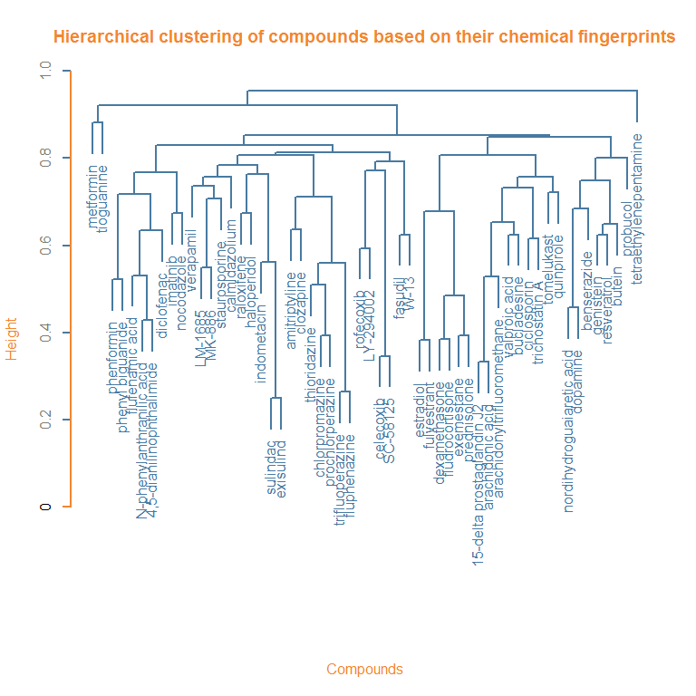

# Connectivity scores
Pieter Moris  
`r format(Sys.Date())`  


## Unraveling the connection between chemical structure and gene expression.

The aim of this analysis is to investigate the association between the structure of chemical compounds (or their predicted biological activity) and the effects they induce in a gene expression assay. We will group compounds with a similar structure (*chemical fingerprint*) or predicted bio-activity (*target prediction*) using clustering methods. Subsequently the *gene expression profiles* of the compounds within a cluster will be contrasted with each other using a connectivity score approach based on the work of @lamb_connectivity_2006 and @zhang_simple_2008 on the [Connectivity Map](https://www.broadinstitute.org/cmap/). 

Their methods enable us to contrast a number of query expression profiles with a set of reference profiles and assess the *connectivity* between compounds in terms of which genes are regulated up or down. The connection between the query and reference data can be both positive and negative. In the former case, highly up-regulated genes in one set will also be up-regulated in the other set, and vice versa for down-regulated genes. In the latter case, genes with a high expression in one assay, might be strongly down-regulated in the other one. Both situations imply that the two compounds interfere with the same biological processes. If two sets are weakly connected, there is no correlation or overlap between the top genes of either set. We will use an extension of these methods that scores the connectivity between gene expression profiles using *multiple factor analysis* (MFA). In a nutshell, we will look at the principal axes of variation in the gene expression profiles and we hope to find components where both the reference and the query compounds have a high contribution. 

The dataset we will focus on is the Connectivity Map's MCF-7 dataset, where the gene-wide expression profiles for a breast cancer cell line when exposed to several bio-active small molecules. The chemical fingerprints and and target predictions of these compounds was provided as well.

## Clustering chemical compounds based on chemical fingerprints
We will employ hierarchical clustering to group the chemical compounds based on their fingerprints or target predictions. In either case we are dealing with a 0/1 matrix where the rows correspond to different compounds. For the chemical fingerprints the columns indicate the presence or absence of specific chemical structures. Together this sequence of ones and zeros describes the entire molecular scaffolding of the compound. In essence we are dealing with a bit string for each compound.

Similarly, the binary target prediction matrix indicates whether or not a certain compound is predicted to bind to a certain molecular target, such as enzymes.

Let's take a look at the chemical fingerprints first. Here is a sneak peek of the data:


```
##                  -2147375257 -2147119955 -2146474760 -2145840573
## metformin                  0           0           0           0
## phenformin                 0           0           0           0
## phenyl biguanide           0           0           0           0
## estradiol                  0           0           0           0
## dexamethasone              0           0           0           0
## verapamil                  0           0           0           0
```

To properly cluster objects based on binary attributes, we need to define an adequate measure of similarity. The *Tanimoto coefficient* (sometimes called the *Jaccard coefficient*) is often used for this purpose in cheminformatics [[@maccuish_clustering_2011]](#chem). It contrasts two objects *x* and *y* of dimension *k* in terms of the number of common attributes, *c* versus the number of attributes unique to either object, *a* and *b*. $$s = \frac{c}{a+b-c}$$

*To do: difference in definitions of Tanimoto, jaccard and soergel distance!*

<!-- *** -->

<!-- http://www.sequentix.de/gelquest/help/distance_measures.htm -->

<!-- https://en.wikipedia.org/wiki/Jaccard_index Various forms of functions described as Tanimoto similarity and Tanimoto distance occur in the literature and on the Internet. Most of these are synonyms for Jaccard similarity and Jaccard distance, but some are mathematically different.  -->

<!-- https://books.google.be/books?id=ZDDNBQAAQBAJ&pg=PA41&lpg=PA41&dq=tanimoto+clustering&source=bl&ots=vsLen2ZmS5&sig=N16boAKkB5NWLJjeteC4shM6Brc&hl=en&sa=X&ved=0ahUKEwiaiZvsx4vLAhWBfxoKHf-9DrwQ6AEISzAH#v=onepage&q=tanimoto%20clustering&f=false Soergel distance -->

<!-- https://docs.tibco.com/pub/spotfire/6.0.0-november-2013/userguide-webhelp/hc/hc_tanimoto_coefficient.htm another different formula! -->

<!-- *** -->

Its complement ($1-s$), the *Soergel distance*, is what we will use for our clustering approach. This is what the distance matrix of the compounds based on their fingerprints will look like:

<!-- *To do: R's dist function using binary seems to provide almost the same result! Again, difference between jaccard/tanimoto definitions?* -->


```r
tanimoto = function(m){
  S = matrix(0,nrow=dim(m)[1],ncol=dim(m)[1])
  m=as.matrix(m)
  N.C=m %*% t(m)
  N.A=m %*% (1-t(m))
  N.B=(1-m) %*% t(m)
  S=N.C/(N.A+N.B+N.C)
  D = 1 - S
  return(D)
}
dist.fingerprintMat <- tanimoto(fingerprintMat)
head(dist.fingerprintMat[,1:4])
```

```
##                  metformin phenformin phenyl biguanide estradiol
## metformin        0.0000000  0.7727273        0.8095238 0.9696970
## phenformin       0.7727273  0.0000000        0.5217391 0.8684211
## phenyl biguanide 0.8095238  0.5217391        0.0000000 0.9210526
## estradiol        0.9696970  0.8684211        0.9210526 0.0000000
## dexamethasone    0.9473684  0.8863636        0.9318182 0.6976744
## verapamil        0.9090909  0.8461538        0.9250000 0.7906977
```

```r
# alternative in base r?
# test.dist.fingerprintMat <- as.matrix(dist(fingerprintMat,method = 'binary'))
# test.dist.fingerprintMat == dist.fingerprintMat
```

Now we can go ahead and try to cluster these compounds based on their (dis)similarity in chemical fingerprints. We will use the `agnes` function provided by the `cluster` package, which implements a basic agglomerative hierarchical clustering analysis. Agglomerative hierarchical clustering attempts to form groups of similar objects through a bottom-up approach (as opposed to divisive methods). It starts by assigning each observation to its own cluster. Then, an hierarchy is created by repeatedly merging pairs of similar clusters at lower levels (i.e. those that are close according to our *distance* measure), until a single cluster is formed at the top level. Not only do we require an appropriate measure of distance, like the Tanimoto distance, but we also need to choose an agglomeration method. This method will define how the distance between clusters is calculated: e.g. do we only look at the largest distance between its members or do we take the average of all pairwise distances? We will try both the average method, which strikes a compromise between compactness and closeness of the clusters, and the flexible-Beta, a method often used in ecology (with $\alpha = 0.625$). 

<!-- For this analysis we will choose the average method, which strikes a compromise between compactness and closeness of the clusters. -->

By applying this method to the Tanimoto distance matrix of the compound chemical fingerprints we obtain the following dendogram. Note that the height of each node signifies the dissimilarity between its daughter clusters.


```r
### Base R method:
# cluster.fingerprintMat <- hclust(as.dist(dist.fingerprintMat), method = "average")
# plot(cluster.fingerprintMat,main='Hierarchical clustering of compounds based on their chemical fingerprints',hang=-1,col = "#487AA1", col.main = "#F38630", col.lab = "#F38630", col.axis = "#7C8071",xlab="Compounds",sub="", lwd = 2)
# axis(side = 2, at = seq(0, 400, 100), col = "#F38630", labels = TRUE, lwd = 2)

library(cluster)
cluster.a.fingerprintMat <- agnes(as.dist(dist.fingerprintMat),method = "average")
# plot(cluster.a.fingerprintMat,which.plots = 2)
pltree(cluster.a.fingerprintMat,main='Hierarchical clustering of compounds based on their chemical fingerprints',col = "#487AA1", col.main = "#F38630", col.lab = "#F38630", col.axis = "#7C8071",xlab="Compounds",sub="", lwd = 2) # calls as.hclust plot method (,hang=-1)
axis(side = 2, at = seq(0, 400, 100), col = "#F38630", labels = TRUE, lwd = 2)
```



Next, we need to decide on an appropriate number of clusters and prune the tree to this size. This is different from other cluster methods, such as k-means clustering, where the number of clusters is defined beforehand. We could eyeball it by looking at the dendogram, but in practise it is more appropriate to define the number of clusters based on the distance between certain groups. The Gap statistic can be used to make a more informed decision about this [@hastie_elements_2009-1]. The `cluster` package provides a method to calculate the Gap statistic using a bootstrap approach. Visually we are looking for a kink or elbow in a plot of the gap statistic versus the number of clusters. This indicates that the decrease in within-cluster similarity is levelling off. More formally we will rely on the `TibshiraniSEmax` criterium.


```r
FUNcluster = function(x,k,inputcluster){
  # Function that requires the original observations (x), 
  # the number of desired clusters (k),
  # and a cluster object 
	out = list( cluster = cutree(inputcluster,k=k))
	return(out)
}
gap <- clusGap(fingerprintMat,FUNcluster = FUNcluster,inputcluster=cluster.a.fingerprintMat,K.max = 20,B = 500)
plot(gap)
```


```r
gapdata <- as.data.frame(gap$Tab)
maxSE(gapdata[,3],gapdata[,4],"Tibs2001SEmax")
```

```
## [1] 1
```


Unfortunately, the criteria suggests that we should only utilise one cluster. This can also be seen in the dendogram, where most splits tend to occur at a similar level of distance. 

Now let's try the flexible beta agglomeration method.


```r
cluster.fingerprintMat <- agnes(as.dist(dist.fingerprintMat),method = "flexible",par.method = 0.625)
pltree(cluster.fingerprintMat,main='Hierarchical clustering of compounds based on their chemical fingerprints',col = "#487AA1", col.main = "#F38630", col.lab = "#F38630", col.axis = "#7C8071",xlab="Compounds",sub="", lwd = 2) # calls as.hclust plot method
axis(side = 2, at = seq(0, 400, 100), col = "#F38630", labels = TRUE, lwd = 2)
```


```r
gap <- clusGap(fingerprintMat,FUNcluster = FUNcluster,inputcluster=cluster.fingerprintMat,K.max = 20,B = 500)
plot(gap)
```


```r
gapdata <- as.data.frame(gap$Tab)
maxSE(gapdata[,3],gapdata[,4],"Tibs2001SEmax")
```

```
## [1] 7
```

It's already obvious from the dendogram that some of the splits happen at much larger distances than others, which makes it easier to decide on appropriate groups. The `TibshiraniSEmax` suggests that seven clusters is optimal.


```r
pltree(cluster.fingerprintMat,main='Hierarchical clustering of compounds based on their chemical fingerprints',hang=-1,col = "#487AA1", col.main = "#F38630", col.lab = "#F38630", col.axis = "#7C8071",xlab="Compounds",sub="", lwd = 2) # calls as.hclust plot method
axis(side = 2, at = seq(0, 400, 100), col = "#F38630", labels = TRUE, lwd = 2)
rect.hclust(cluster.fingerprintMat,k=7)
```


We can also inspect how many entries are in each cluster for various cluster sizes. Fortunately 7 clusters does not lead to any clusters of just one or two compounds, because this could complicate things later on.


```r
# http://www.stat.berkeley.edu/~s133/Cluster2a.html
counts = sapply(2:15,function(ncl)table(cutree(cluster.fingerprintMat,ncl)))
names(counts) = 2:15
counts
```

```
## $`2`
## 
##  1  2 
## 51  5 
## 
## $`3`
## 
##  1  2  3 
## 38 13  5 
## 
## $`4`
## 
##  1  2  3  4 
##  9 29 13  5 
## 
## $`5`
## 
##  1  2  3  4  5 
##  9 29  4  9  5 
## 
## $`6`
## 
##  1  2  3  4  5  6 
##  9  8  4 21  9  5 
## 
## $`7`
## 
##  1  2  3  4  5  6  7 
##  5  8  4 21  9  4  5 
## 
## $`8`
## 
##  1  2  3  4  5  6  7  8 
##  5  8  4 19  9  2  4  5 
## 
## $`9`
## 
##  1  2  3  4  5  6  7  8  9 
##  5  8  4 11  9  8  2  4  5 
## 
## $`10`
## 
##  1  2  3  4  5  6  7  8  9 10 
##  5  3  4 11  9  8  5  2  4  5 
## 
## $`11`
## 
##  1  2  3  4  5  6  7  8  9 10 11 
##  4  3  4 11  9  8  5  2  4  1  5 
## 
## $`12`
## 
##  1  2  3  4  5  6  7  8  9 10 11 12 
##  4  3  4 11  3  8  5  2  6  4  1  5 
## 
## $`13`
## 
##  1  2  3  4  5  6  7  8  9 10 11 12 13 
##  4  3  4  4  7  3  8  5  2  6  4  1  5 
## 
## $`14`
## 
##  1  2  3  4  5  6  7  8  9 10 11 12 13 14 
##  4  3  4  4  7  3  5  5  2  6  3  4  1  5 
## 
## $`15`
## 
##  1  2  3  4  5  6  7  8  9 10 11 12 13 14 15 
##  4  3  4  4  5  3  5  5  2  6  3  4  2  1  5
```

Finally, we will repeat the same procedure for the target predictions.


```r
dist.targetMat <- tanimoto(targetMat)
cluster.targetMat <- agnes(as.dist(dist.targetMat),method = "flexible",par.method = 0.625)

gap <- clusGap(targetMat,FUNcluster = FUNcluster,inputcluster=cluster.targetMat,K.max = 20,B = 500)
plot(gap)
```


```r
gapdata <- as.data.frame(gap$Tab)
maxSE(gapdata[,3],gapdata[,4],"Tibs2001SEmax")
```

```
## [1] 7
```

```r
pltree(cluster.targetMat,main='Hierarchical clustering of compounds based on their target predictions',col = "#487AA1", col.main = "#F38630", col.lab = "#F38630", col.axis = "#7C8071",xlab="Compounds",sub="", lwd = 2) # calls as.hclust plot method
rect.hclust(cluster.targetMat,k=7)
```


## Connectivity scoring using multiple factor analysis

Now that we have identified clusters of compounds that are similar in their structure (chemical fingerprint), we will investigate whether or not they are also similar according to the gene expression profiles they induce *in vitro*. To do this, we will use MFA to compare the gene expression profile of a certain compound (the query) with the profiles of all the other compounds in its cluster (the reference database), i.e. a leave-one-out approach. This will be done once for each compound in a cluster, for every cluster we defined earlier. Afterwards, it might also be interesting to contrast entire clusters with one another, i.e. by using one cluster as a query dataset and comparing it with the other clusters, i.e. a leave-one-cluster-out method.

**The question isn't just if the compounds in a cluster are similar, but if they are similar because the same genes are being regulated in the same or opposite way!**

## Within cluster connectivity

As a proof of concept, we shall perform the leave-one-out procedure on the first cluster.


```r
library(CSFA)
cut.cluster.fingerprintMat <- cutree(cluster.fingerprintMat,k=7) # get vector with cluster membership for compounds
colnames(geneMat)[cut.cluster.fingerprintMat == 1]
```

```
## [1] "metformin"              "phenformin"            
## [3] "phenyl biguanide"       "tetraethylenepentamine"
## [5] "tioguanine"
```

We define the set of reference profiles as all the compounds in the cluster, except for one (the first one in this example). Then, the query set contains all the compounds in the cluster. This can be thought of conceptually as treating the reference set as the known profile or the profile of interest, and searching for similar profiles in the query set. For the MFA, it is important to keep in mind that the compoudns are treated as variables or features, whereas the genes are observations. The genes are shared between the reference and query set, but the variables will differ. 


```r
refMat <- geneMat[,cut.cluster.fingerprintMat==1][,-c(1)]
querMat <- geneMat[,cut.cluster.fingerprintMat==1]
```

In the first step, MFA will normalize both the reference and query dataset by dividing each by their first singular value. Next, a PCA is performed on the combined datasets. This will creates principal axes of variations, which are orthogonal and still explain the entire structure of the data. The principal axes, often called components or factors, are linear combinations of the original variables (or compounds in our setting). We are hoping to find high contributions, termed loadings, of the reference compounds to the first factor and also a high loading of the left out compound on this factor if it is also similar in gene expression. The factor loadings are the actual connectivity scores we are interested in.

**Question: let's say we do an MFA on a set of reference compounds that are entirely unrelated. Do we expect to see several factors, each with a high loading for just one compound and near zero for the others? **

We will repeat the MFA, each time leaving out another compound of the reference set. Afterwards, we will average the connectivity scores of the left-out compounds (for the first/main factors each time), and use this as the global connectivity score within the cluster.


```r
# MFA.fingerprint <- CSanalysis(refMat, querMat,"CSmfa",which = c(1:7))
factor1.out_MFA <-  CSanalysis(refMat, querMat,"CSmfa",which=c(1:7),factor.plot=1,plot.type=sweave)
```

```
## Echoufier Rv Correlation:
##           Reference     Query       MFA
## Reference 1.0000000 0.9157038 0.9761933
## Query     0.9157038 1.0000000 0.9810670
## MFA       0.9761933 0.9810670 1.0000000
```

```
## Error in plot.in(plot.type, paste0(basefilename, "_MFApercvar.pdf")): object 'sweave' not found
```

Already things have become a bit more complex. As you can see in this plot, there is no single factor with high loadings for all of the compounds, which is what we would expect if the referece compounds are indeed inducing similar gene expression profiles. **As such there are multiple connectivity scores for the left out compound, metformin, each belonging to a different connectivity set. For example, the first component consists of a subset of two out of four compounds, phenformin and phenyl biguanide. The connectivity score for metformin is only around 0.1 for this set.**


```r
factor1.out_MFA@CS$CS.query
```

```
##                           Factor1
## metformin              0.11598731
## phenformin             0.88875107
## phenyl biguanide       0.86775976
## tetraethylenepentamine 0.07421413
## tioguanine             0.18861928
```

**We could also look at the second component, which is a set consisting of tioguanine (high) and tetraethylenepentamine (low). This time metformin scores a bit higher, with a loading around 0.6**


```r
factor2.out_MFA <-  CSanalysis(refMat, querMat,"CSmfa",which=c(),factor.plot=2)
```

```
## Echoufier Rv Correlation:
##           Reference     Query       MFA
## Reference 1.0000000 0.9157038 0.9761933
## Query     0.9157038 1.0000000 0.9810670
## MFA       0.9761933 0.9810670 1.0000000
```

```r
factor2.out_MFA@CS$CS.query
```

```
##                           Factor2
## metformin               0.5869890
## phenformin              0.1208763
## phenyl biguanide       -0.2537779
## tetraethylenepentamine -0.6990440
## tioguanine              0.6940803
```

**Question! What are the CSrankscores? They look similar to the loadings, but small values are reduced to zero?**


```r
factor1.out_MFA@CSRankScores
```

```
## $Factor1
##                        CSRankScores Term1.Weighted Term1.Ref1 Term1.Ref2
## metformin                 0.0000000      0.1958297 0.13050596 0.13366293
## phenformin                0.9412925      0.8825851 1.00000000 0.97638112
## phenyl biguanide          0.9187133      0.8828933 0.97638112 1.00000000
## tetraethylenepentamine    0.0000000      0.1470064 0.08350385 0.08552382
## tioguanine                0.0000000      0.2946789 0.21222960 0.21736348
##                        Term1.Ref3 Term1.Ref4      Term2 Combine1.wmean
## metformin              0.63984698  0.6149282 -0.6737909     -0.2389806
## phenformin             0.08350385  0.2122296  1.0000000      0.9412925
## phenyl biguanide       0.08552382  0.2173635  0.9545332      0.9187133
## tetraethylenepentamine 1.00000000  0.3934600 -0.7642708     -0.3086322
## tioguanine             0.39345995  1.0000000 -0.5164715     -0.1108963
##                        Combine2.zero
## metformin                  0.0000000
## phenformin                 0.9412925
## phenyl biguanide           0.9187133
## tetraethylenepentamine     0.0000000
## tioguanine                 0.0000000
```

```r
factor2.out_MFA@CSRankScores
```

```
## $Factor2
##                        CSRankScores Term1.Weighted Term1.Ref1 Term1.Ref2
## metformin                -0.5358505      0.7402441  0.2059259  0.4323384
## phenformin                0.0000000      0.2735100  1.0000000  0.4763073
## phenyl biguanide          0.0000000      0.4632413  0.4763073  1.0000000
## tetraethylenepentamine    0.7503803      0.8492172  0.1729165  0.3630356
## tioguanine               -0.7435095      0.8496545  0.1741531  0.3656319
##                        Term1.Ref3 Term1.Ref4      Term2 Combine1.wmean
## metformin               0.8397026  0.8457077  0.3314570     0.53585053
## phenformin              0.1729165  0.1741531 -1.0000000    -0.36324501
## phenyl biguanide        0.3630356  0.3656319 -0.6203648    -0.07856179
## tetraethylenepentamine  1.0000000  0.9928993  0.6515434     0.75038025
## tioguanine              0.9928993  1.0000000  0.6373645     0.74350950
##                        Combine2.zero
## metformin                  0.5358505
## phenformin                 0.0000000
## phenyl biguanide           0.0000000
## tetraethylenepentamine     0.7503803
## tioguanine                 0.7435095
```

**Question! How can I manually plot images in CSanalysis? plot.type and which not working?**

Now we will perform this leave-one-out and average procedure for each fingerprint-based cluster.


```r
# Loop framework to use later...
n.cluster <- unique(cut.cluster.fingerprintMat) # number of clusters

connectivity.fingerprint <- vector('list',length(n.cluster)) # initialize list to store connectivity scores

for (i in n.cluster) {
  compounds.in.cluster <- rownames(fingerprintMat[cut.cluster.fingerprintMat==i,,drop=F])
  connectivity.fingerprint[[i]] <- sapply( c('average',compounds.in.cluster), function(j) NULL)
  connectivity.fingerprint[[i]][['compounds']] <- compounds.in.cluster
}

ptm <- proc.time()
for (i in 1:length(connectivity.fingerprint)) { # loop through clusters
  sum <- 0
  for (j in 1:length(connectivity.fingerprint[[i]]$compounds)) { # loop through compounds in a cluster
    refMat <- geneMat[,connectivity.fingerprint[[i]]$compounds[-c(j)]]
    querMat <- geneMat[,connectivity.fingerprint[[i]]$compounds]
    connectivity.fingerprint[[i]][[connectivity.fingerprint[[i]]$compounds[[j]]]] <- CSanalysis(refMat,querMat,"CSmfa",which=c(),factor.plot=1)@CS$CS.query
    sum <- sum + connectivity.fingerprint[[i]][[connectivity.fingerprint[[i]]$compounds[[j]]]][connectivity.fingerprint[[i]]$compounds[[j]],]
  }
  connectivity.fingerprint[[i]]$average <- sum/j
}
```

```
## Echoufier Rv Correlation:
##           Reference     Query       MFA
## Reference 1.0000000 0.9157038 0.9761933
## Query     0.9157038 1.0000000 0.9810670
## MFA       0.9761933 0.9810670 1.0000000
## Echoufier Rv Correlation:
##           Reference     Query       MFA
## Reference 1.0000000 0.9179576 0.9777683
## Query     0.9179576 1.0000000 0.9807286
## MFA       0.9777683 0.9807286 1.0000000
## Echoufier Rv Correlation:
##           Reference     Query       MFA
## Reference 1.0000000 0.9175224 0.9769254
## Query     0.9175224 1.0000000 0.9812886
## MFA       0.9769254 0.9812886 1.0000000
## Echoufier Rv Correlation:
##           Reference     Query       MFA
## Reference 1.0000000 0.9150150 0.9762515
## Query     0.9150150 1.0000000 0.9806818
## MFA       0.9762515 0.9806818 1.0000000
## Echoufier Rv Correlation:
##           Reference     Query       MFA
## Reference 1.0000000 0.9151536 0.9765328
## Query     0.9151536 1.0000000 0.9804937
## MFA       0.9765328 0.9804937 1.0000000
## Echoufier Rv Correlation:
##           Reference     Query       MFA
## Reference 1.0000000 0.9477201 0.9884935
## Query     0.9477201 1.0000000 0.9850837
## MFA       0.9884935 0.9850837 1.0000000
## Echoufier Rv Correlation:
##           Reference     Query       MFA
## Reference 1.0000000 0.9469637 0.9864615
## Query     0.9469637 1.0000000 0.9868408
## MFA       0.9864615 0.9868408 1.0000000
## Echoufier Rv Correlation:
##           Reference     Query       MFA
## Reference 1.0000000 0.9479631 0.9886251
## Query     0.9479631 1.0000000 0.9850648
## MFA       0.9886251 0.9850648 1.0000000
## Echoufier Rv Correlation:
##           Reference     Query       MFA
## Reference 1.0000000 0.9469776 0.9861777
## Query     0.9469776 1.0000000 0.9871247
## MFA       0.9861777 0.9871247 1.0000000
## Echoufier Rv Correlation:
##           Reference     Query       MFA
## Reference 1.0000000 0.9467979 0.9857547
## Query     0.9467979 1.0000000 0.9874386
## MFA       0.9857547 0.9874386 1.0000000
## Echoufier Rv Correlation:
##           Reference     Query       MFA
## Reference 1.0000000 0.9467920 0.9861291
## Query     0.9467920 1.0000000 0.9870791
## MFA       0.9861291 0.9870791 1.0000000
## Echoufier Rv Correlation:
##           Reference     Query       MFA
## Reference 1.0000000 0.9469193 0.9856485
## Query     0.9469193 1.0000000 0.9875974
## MFA       0.9856485 0.9875974 1.0000000
## Echoufier Rv Correlation:
##           Reference     Query       MFA
## Reference 1.0000000 0.9470882 0.9857566
## Query     0.9470882 1.0000000 0.9875792
## MFA       0.9857566 0.9875792 1.0000000
## Echoufier Rv Correlation:
##           Reference     Query       MFA
## Reference 1.0000000 0.9020902 0.9764677
## Query     0.9020902 1.0000000 0.9739311
## MFA       0.9764677 0.9739311 1.0000000
## Echoufier Rv Correlation:
##           Reference     Query       MFA
## Reference 1.0000000 0.9014502 0.9759247
## Query     0.9014502 1.0000000 0.9741626
## MFA       0.9759247 0.9741626 1.0000000
## Echoufier Rv Correlation:
##           Reference     Query       MFA
## Reference 1.0000000 0.8972934 0.9730376
## Query     0.8972934 1.0000000 0.9749156
## MFA       0.9730376 0.9749156 1.0000000
## Echoufier Rv Correlation:
##           Reference     Query       MFA
## Reference 1.0000000 0.8966026 0.9718603
## Query     0.8966026 1.0000000 0.9756860
## MFA       0.9718603 0.9756860 1.0000000
## Echoufier Rv Correlation:
##           Reference     Query       MFA
## Reference 1.0000000 0.9848321 0.9964058
## Query     0.9848321 1.0000000 0.9959901
## MFA       0.9964058 0.9959901 1.0000000
## Echoufier Rv Correlation:
##           Reference     Query       MFA
## Reference 1.0000000 0.9846039 0.9963667
## Query     0.9846039 1.0000000 0.9959137
## MFA       0.9963667 0.9959137 1.0000000
## Echoufier Rv Correlation:
##           Reference     Query       MFA
## Reference 1.0000000 0.9842854 0.9959986
## Query     0.9842854 1.0000000 0.9961281
## MFA       0.9959986 0.9961281 1.0000000
## Echoufier Rv Correlation:
##           Reference     Query       MFA
## Reference 1.0000000 0.9842225 0.9959515
## Query     0.9842225 1.0000000 0.9961430
## MFA       0.9959515 0.9961430 1.0000000
## Echoufier Rv Correlation:
##           Reference     Query       MFA
## Reference 1.0000000 0.9842430 0.9960131
## Query     0.9842430 1.0000000 0.9960926
## MFA       0.9960131 0.9960926 1.0000000
## Echoufier Rv Correlation:
##           Reference     Query       MFA
## Reference 1.0000000 0.9847279 0.9962094
## Query     0.9847279 1.0000000 0.9961398
## MFA       0.9962094 0.9961398 1.0000000
## Echoufier Rv Correlation:
##           Reference     Query       MFA
## Reference 1.0000000 0.9846913 0.9962808
## Query     0.9846913 1.0000000 0.9960484
## MFA       0.9962808 0.9960484 1.0000000
## Echoufier Rv Correlation:
##           Reference     Query       MFA
## Reference 1.0000000 0.9842503 0.9959552
## Query     0.9842503 1.0000000 0.9961531
## MFA       0.9959552 0.9961531 1.0000000
## Echoufier Rv Correlation:
##           Reference     Query       MFA
## Reference 1.0000000 0.9846292 0.9962317
## Query     0.9846292 1.0000000 0.9960672
## MFA       0.9962317 0.9960672 1.0000000
## Echoufier Rv Correlation:
##           Reference     Query       MFA
## Reference 1.0000000 0.9842959 0.9960207
## Query     0.9842959 1.0000000 0.9961115
## MFA       0.9960207 0.9961115 1.0000000
## Echoufier Rv Correlation:
##           Reference     Query       MFA
## Reference 1.0000000 0.9842375 0.9959504
## Query     0.9842375 1.0000000 0.9961515
## MFA       0.9959504 0.9961515 1.0000000
## Echoufier Rv Correlation:
##           Reference     Query       MFA
## Reference 1.0000000 0.9842026 0.9959657
## Query     0.9842026 1.0000000 0.9961192
## MFA       0.9959657 0.9961192 1.0000000
## Echoufier Rv Correlation:
##           Reference     Query       MFA
## Reference 1.0000000 0.9842136 0.9960402
## Query     0.9842136 1.0000000 0.9960510
## MFA       0.9960402 0.9960510 1.0000000
## Echoufier Rv Correlation:
##           Reference     Query       MFA
## Reference 1.0000000 0.9842293 0.9960051
## Query     0.9842293 1.0000000 0.9960937
## MFA       0.9960051 0.9960937 1.0000000
## Echoufier Rv Correlation:
##           Reference     Query       MFA
## Reference 1.0000000 0.9843484 0.9959677
## Query     0.9843484 1.0000000 0.9961895
## MFA       0.9959677 0.9961895 1.0000000
## Echoufier Rv Correlation:
##           Reference     Query       MFA
## Reference 1.0000000 0.9843199 0.9959985
## Query     0.9843199 1.0000000 0.9961453
## MFA       0.9959985 0.9961453 1.0000000
## Echoufier Rv Correlation:
##           Reference     Query       MFA
## Reference 1.0000000 0.9844912 0.9962598
## Query     0.9844912 1.0000000 0.9959679
## MFA       0.9962598 0.9959679 1.0000000
## Echoufier Rv Correlation:
##           Reference     Query       MFA
## Reference 1.0000000 0.9844010 0.9961962
## Query     0.9844010 1.0000000 0.9959876
## MFA       0.9961962 0.9959876 1.0000000
## Echoufier Rv Correlation:
##           Reference     Query       MFA
## Reference 1.0000000 0.9842225 0.9959530
## Query     0.9842225 1.0000000 0.9961415
## MFA       0.9959530 0.9961415 1.0000000
## Echoufier Rv Correlation:
##           Reference     Query       MFA
## Reference 1.0000000 0.9842967 0.9960367
## Query     0.9842967 1.0000000 0.9960961
## MFA       0.9960367 0.9960961 1.0000000
## Echoufier Rv Correlation:
##           Reference     Query       MFA
## Reference 1.0000000 0.9842132 0.9960176
## Query     0.9842132 1.0000000 0.9960733
## MFA       0.9960176 0.9960733 1.0000000
## Echoufier Rv Correlation:
##           Reference     Query       MFA
## Reference 1.0000000 0.9600765 0.9895096
## Query     0.9600765 1.0000000 0.9904178
## MFA       0.9895096 0.9904178 1.0000000
## Echoufier Rv Correlation:
##           Reference     Query       MFA
## Reference 1.0000000 0.9631805 0.9915296
## Query     0.9631805 1.0000000 0.9899411
## MFA       0.9915296 0.9899411 1.0000000
## Echoufier Rv Correlation:
##           Reference     Query       MFA
## Reference 1.0000000 0.9602043 0.9897574
## Query     0.9602043 1.0000000 0.9902418
## MFA       0.9897574 0.9902418 1.0000000
## Echoufier Rv Correlation:
##           Reference     Query       MFA
## Reference 1.0000000 0.9606064 0.9901235
## Query     0.9606064 1.0000000 0.9900817
## MFA       0.9901235 0.9900817 1.0000000
## Echoufier Rv Correlation:
##           Reference    Query       MFA
## Reference 1.0000000 0.960078 0.9894892
## Query     0.9600780 1.000000 0.9904380
## MFA       0.9894892 0.990438 1.0000000
## Echoufier Rv Correlation:
##           Reference     Query       MFA
## Reference 1.0000000 0.9612769 0.9906047
## Query     0.9612769 1.0000000 0.9899333
## MFA       0.9906047 0.9899333 1.0000000
## Echoufier Rv Correlation:
##           Reference     Query       MFA
## Reference 1.0000000 0.9603942 0.9899646
## Query     0.9603942 1.0000000 0.9901331
## MFA       0.9899646 0.9901331 1.0000000
## Echoufier Rv Correlation:
##           Reference     Query       MFA
## Reference 1.0000000 0.9623230 0.9911854
## Query     0.9623230 1.0000000 0.9898636
## MFA       0.9911854 0.9898636 1.0000000
## Echoufier Rv Correlation:
##           Reference     Query       MFA
## Reference 1.0000000 0.9611406 0.9905098
## Query     0.9611406 1.0000000 0.9899614
## MFA       0.9905098 0.9899614 1.0000000
## Echoufier Rv Correlation:
##           Reference     Query       MFA
## Reference 1.0000000 0.8928121 0.9734283
## Query     0.8928121 1.0000000 0.9722333
## MFA       0.9734283 0.9722333 1.0000000
## Echoufier Rv Correlation:
##           Reference     Query       MFA
## Reference 1.0000000 0.8936886 0.9763224
## Query     0.8936886 1.0000000 0.9695886
## MFA       0.9763224 0.9695886 1.0000000
## Echoufier Rv Correlation:
##           Reference     Query       MFA
## Reference 1.0000000 0.8893049 0.9684107
## Query     0.8893049 1.0000000 0.9752487
## MFA       0.9684107 0.9752487 1.0000000
## Echoufier Rv Correlation:
##           Reference     Query       MFA
## Reference 1.0000000 0.8895428 0.9702670
## Query     0.8895428 1.0000000 0.9736691
## MFA       0.9702670 0.9736691 1.0000000
## Echoufier Rv Correlation:
##           Reference     Query       MFA
## Reference 1.0000000 0.9615993 0.9907491
## Query     0.9615993 1.0000000 0.9899492
## MFA       0.9907491 0.9899492 1.0000000
## Echoufier Rv Correlation:
##           Reference     Query       MFA
## Reference 1.0000000 0.9480144 0.9866235
## Query     0.9480144 1.0000000 0.9872093
## MFA       0.9866235 0.9872093 1.0000000
## Echoufier Rv Correlation:
##           Reference     Query       MFA
## Reference 1.0000000 0.9552592 0.9888756
## Query     0.9552592 1.0000000 0.9886267
## MFA       0.9888756 0.9886267 1.0000000
## Echoufier Rv Correlation:
##           Reference     Query       MFA
## Reference 1.0000000 0.9495805 0.9872544
## Query     0.9495805 1.0000000 0.9873748
## MFA       0.9872544 0.9873748 1.0000000
## Echoufier Rv Correlation:
##           Reference     Query       MFA
## Reference 1.0000000 0.9500550 0.9874344
## Query     0.9500550 1.0000000 0.9874352
## MFA       0.9874344 0.9874352 1.0000000
```

```r
proc.time() - ptm
```

```
##    user  system elapsed 
##  196.12    0.47  202.07
```


```r
connectivity.fingerprint
```

```
## [[1]]
## [[1]]$average
## [1] 0.09526043
## 
## [[1]]$metformin
##                           Factor1
## metformin              0.11598731
## phenformin             0.88875107
## phenyl biguanide       0.86775976
## tetraethylenepentamine 0.07421413
## tioguanine             0.18861928
## 
## [[1]]$phenformin
##                            Factor1
## metformin               0.79666125
## phenformin              0.08757013
## phenyl biguanide       -0.31333693
## tetraethylenepentamine -0.57058029
## tioguanine              0.63276623
## 
## [[1]]$`phenyl biguanide`
##                           Factor1
## metformin               0.7688766
## phenformin              0.5713239
## phenyl biguanide        0.1717391
## tetraethylenepentamine -0.4410884
## tioguanine              0.6324281
## 
## [[1]]$tetraethylenepentamine
##                            Factor1
## metformin               0.33602329
## phenformin              0.89313511
## phenyl biguanide        0.76749299
## tetraethylenepentamine -0.03704697
## tioguanine              0.33471513
## 
## [[1]]$tioguanine
##                           Factor1
## metformin              0.17183683
## phenformin             0.90322026
## phenyl biguanide       0.85494862
## tetraethylenepentamine 0.04266674
## tioguanine             0.13805259
## 
## [[1]]$compounds
## [1] "metformin"              "phenformin"            
## [3] "phenyl biguanide"       "tetraethylenepentamine"
## [5] "tioguanine"            
## 
## 
## [[2]]
## [[2]]$average
## [1] 0.1951273
## 
## [[2]]$estradiol
##                               Factor1
## estradiol                  0.58906931
## nordihydroguaiaretic acid  0.58719297
## genistein                  0.82864623
## fulvestrant               -0.35857483
## dopamine                  -0.10230162
## probucol                   0.36633228
## resveratrol                0.06421401
## butein                     0.33941179
## 
## [[2]]$`nordihydroguaiaretic acid`
##                               Factor1
## estradiol                  0.80335320
## nordihydroguaiaretic acid  0.30458904
## genistein                  0.79746023
## fulvestrant               -0.50998608
## dopamine                  -0.04930359
## probucol                   0.33389823
## resveratrol               -0.06824228
## butein                     0.24647345
## 
## [[2]]$genistein
##                               Factor1
## estradiol                  0.78166462
## nordihydroguaiaretic acid  0.44244853
## genistein                  0.62611677
## fulvestrant               -0.49253770
## dopamine                   0.02600421
## probucol                   0.27042047
## resveratrol                0.10665860
## butein                     0.48275049
## 
## [[2]]$fulvestrant
##                                Factor1
## estradiol                  0.759248309
## nordihydroguaiaretic acid  0.556384160
## genistein                  0.828197462
## fulvestrant               -0.246857090
## dopamine                  -0.001056535
## probucol                   0.353122634
## resveratrol               -0.012205467
## butein                     0.252284722
## 
## [[2]]$dopamine
##                               Factor1
## estradiol                  0.77819898
## nordihydroguaiaretic acid  0.48017154
## genistein                  0.81375173
## fulvestrant               -0.40382636
## dopamine                  -0.02995854
## probucol                   0.32572763
## resveratrol               -0.03327522
## butein                     0.26978604
## 
## [[2]]$probucol
##                                Factor1
## estradiol                  0.784310771
## nordihydroguaiaretic acid  0.485942641
## genistein                  0.808419203
## fulvestrant               -0.432062429
## dopamine                  -0.053229246
## probucol                   0.205166954
## resveratrol               -0.004999088
## butein                     0.305597775
## 
## [[2]]$resveratrol
##                               Factor1
## estradiol                  0.77482200
## nordihydroguaiaretic acid  0.48199038
## genistein                  0.81383890
## fulvestrant               -0.40729513
## dopamine                  -0.04744661
## probucol                   0.32239218
## resveratrol               -0.02023115
## butein                     0.27378777
## 
## [[2]]$butein
##                               Factor1
## estradiol                  0.77724901
## nordihydroguaiaretic acid  0.47308463
## genistein                  0.82311183
## fulvestrant               -0.40257665
## dopamine                  -0.09317155
## probucol                   0.35119286
## resveratrol               -0.12908910
## butein                     0.13312332
## 
## [[2]]$compounds
## [1] "estradiol"                 "nordihydroguaiaretic acid"
## [3] "genistein"                 "fulvestrant"              
## [5] "dopamine"                  "probucol"                 
## [7] "resveratrol"               "butein"                   
## 
## 
## [[3]]
## [[3]]$average
## [1] -0.5007993
## 
## [[3]]$dexamethasone
##                    Factor1
## dexamethasone   -0.6403364
## exemestane      -0.7628710
## prednisolone     0.6896013
## fludrocortisone  0.5623848
## 
## [[3]]$exemestane
##                    Factor1
## dexamethasone   -0.7808126
## exemestane      -0.6151309
## prednisolone     0.6931566
## fludrocortisone  0.5623539
## 
## [[3]]$prednisolone
##                    Factor1
## dexamethasone    0.8436329
## exemestane       0.8322921
## prednisolone    -0.4342143
## fludrocortisone -0.4674067
## 
## [[3]]$fludrocortisone
##                    Factor1
## dexamethasone    0.8326390
## exemestane       0.8179478
## prednisolone    -0.6065010
## fludrocortisone -0.3135156
## 
## [[3]]$compounds
## [1] "dexamethasone"   "exemestane"      "prednisolone"    "fludrocortisone"
## 
## 
## [[4]]
## [[4]]$average
## [1] 0.2165276
## 
## [[4]]$verapamil
##                   Factor1
## verapamil      0.55626098
## rofecoxib      0.63665094
## amitriptyline  0.17895344
## raloxifene     0.01778109
## celecoxib      0.29729473
## LM-1685        0.64962954
## SC-58125       0.64303558
## LY-294002      0.17947894
## indometacin    0.50743954
## MK-886         0.25274661
## sulindac       0.01768206
## exisulind     -0.05979713
## staurosporine  0.31884158
## fasudil       -0.22155431
## imatinib      -0.06873867
## clozapine      0.32113647
## haloperidol    0.60257804
## W-13           0.51011413
## quinpirole    -0.01082401
## calmidazolium  0.39504006
## nocodazole     0.27563451
## 
## [[4]]$rofecoxib
##                   Factor1
## verapamil      0.68449528
## rofecoxib      0.55207899
## amitriptyline  0.24978778
## raloxifene    -0.04135452
## celecoxib      0.27622715
## LM-1685        0.54150721
## SC-58125       0.56081926
## LY-294002      0.08281831
## indometacin    0.59063093
## MK-886         0.33857840
## sulindac      -0.07821925
## exisulind     -0.08632272
## staurosporine  0.31955311
## fasudil       -0.27494693
## imatinib      -0.18516035
## clozapine      0.29261047
## haloperidol    0.59305891
## W-13           0.53461997
## quinpirole    -0.06635831
## calmidazolium  0.36564841
## nocodazole     0.27813004
## 
## [[4]]$amitriptyline
##                   Factor1
## verapamil      0.66256209
## rofecoxib      0.63979384
## amitriptyline  0.20106634
## raloxifene    -0.01908786
## celecoxib      0.27886158
## LM-1685        0.57149490
## SC-58125       0.60832196
## LY-294002      0.11992199
## indometacin    0.55652603
## MK-886         0.29997541
## sulindac      -0.02928338
## exisulind     -0.08788363
## staurosporine  0.31475826
## fasudil       -0.24991309
## imatinib      -0.14668639
## clozapine      0.29601671
## haloperidol    0.59201293
## W-13           0.52033136
## quinpirole    -0.03311511
## calmidazolium  0.35027168
## nocodazole     0.27582491
## 
## [[4]]$raloxifene
##                    Factor1
## verapamil      0.684918642
## rofecoxib      0.644698200
## amitriptyline  0.261532050
## raloxifene    -0.008186653
## celecoxib      0.278794536
## LM-1685        0.547253640
## SC-58125       0.597885561
## LY-294002      0.104726650
## indometacin    0.562343723
## MK-886         0.308288217
## sulindac      -0.048648484
## exisulind     -0.094764862
## staurosporine  0.313359756
## fasudil       -0.256244869
## imatinib      -0.177884883
## clozapine      0.261506361
## haloperidol    0.578620033
## W-13           0.524964924
## quinpirole    -0.044391647
## calmidazolium  0.335901653
## nocodazole     0.271207886
## 
## [[4]]$celecoxib
##                   Factor1
## verapamil      0.69186141
## rofecoxib      0.64326484
## amitriptyline  0.26174484
## raloxifene    -0.01650288
## celecoxib      0.22257255
## LM-1685        0.53850167
## SC-58125       0.57690805
## LY-294002      0.11329238
## indometacin    0.57515948
## MK-886         0.31656521
## sulindac      -0.03941788
## exisulind     -0.08999759
## staurosporine  0.31334360
## fasudil       -0.24670090
## imatinib      -0.19325365
## clozapine      0.26857353
## haloperidol    0.58232429
## W-13           0.54480206
## quinpirole    -0.02933488
## calmidazolium  0.33778674
## nocodazole     0.26698886
## 
## [[4]]$`LM-1685`
##                   Factor1
## verapamil      0.74673918
## rofecoxib      0.63389158
## amitriptyline  0.31796280
## raloxifene    -0.03336372
## celecoxib      0.25890639
## LM-1685        0.40877668
## SC-58125       0.54222060
## LY-294002      0.02518436
## indometacin    0.61860270
## MK-886         0.36776893
## sulindac      -0.08876848
## exisulind     -0.11059955
## staurosporine  0.29658622
## fasudil       -0.28882035
## imatinib      -0.27889137
## clozapine      0.21592178
## haloperidol    0.54951170
## W-13           0.54424808
## quinpirole    -0.06667661
## calmidazolium  0.25300302
## nocodazole     0.24981664
## 
## [[4]]$`SC-58125`
##                   Factor1
## verapamil      0.72167410
## rofecoxib      0.60993962
## amitriptyline  0.29410028
## raloxifene    -0.06223448
## celecoxib      0.22785554
## LM-1685        0.48345873
## SC-58125       0.47789444
## LY-294002      0.05562070
## indometacin    0.62621304
## MK-886         0.37322203
## sulindac      -0.06769978
## exisulind     -0.09298465
## staurosporine  0.30143676
## fasudil       -0.23732279
## imatinib      -0.24972398
## clozapine      0.24442753
## haloperidol    0.57785946
## W-13           0.56838054
## quinpirole    -0.01959282
## calmidazolium  0.32841572
## nocodazole     0.27048719
## 
## [[4]]$`LY-294002`
##                   Factor1
## verapamil      0.69281796
## rofecoxib      0.64184457
## amitriptyline  0.26724927
## raloxifene    -0.01912215
## celecoxib      0.28184043
## LM-1685        0.53417650
## SC-58125       0.59081932
## LY-294002      0.07882871
## indometacin    0.56975190
## MK-886         0.31548648
## sulindac      -0.05663200
## exisulind     -0.09708382
## staurosporine  0.30963834
## fasudil       -0.26266705
## imatinib      -0.19144651
## clozapine      0.25892498
## haloperidol    0.57757984
## W-13           0.52613995
## quinpirole    -0.04830875
## calmidazolium  0.32900401
## nocodazole     0.27014471
## 
## [[4]]$indometacin
##                   Factor1
## verapamil      0.64654507
## rofecoxib      0.66055981
## amitriptyline  0.24293448
## raloxifene     0.01915942
## celecoxib      0.30558599
## LM-1685        0.61186305
## SC-58125       0.65335468
## LY-294002      0.15227265
## indometacin    0.44306905
## MK-886         0.22270141
## sulindac      -0.04521769
## exisulind     -0.10406639
## staurosporine  0.33427810
## fasudil       -0.24443866
## imatinib      -0.09503418
## clozapine      0.28456279
## haloperidol    0.59361190
## W-13           0.48055613
## quinpirole    -0.05861222
## calmidazolium  0.37274746
## nocodazole     0.27860319
## 
## [[4]]$`MK-886`
##                    Factor1
## verapamil      0.667460811
## rofecoxib      0.654003858
## amitriptyline  0.250575528
## raloxifene     0.002393722
## celecoxib      0.286833198
## LM-1685        0.578169490
## SC-58125       0.624502478
## LY-294002      0.125658981
## indometacin    0.521654408
## MK-886         0.239384810
## sulindac      -0.035434170
## exisulind     -0.104296869
## staurosporine  0.325739074
## fasudil       -0.254508697
## imatinib      -0.142141983
## clozapine      0.271417745
## haloperidol    0.586900848
## W-13           0.517313706
## quinpirole    -0.042244148
## calmidazolium  0.350016524
## nocodazole     0.273098246
## 
## [[4]]$sulindac
##                    Factor1
## verapamil      0.681904456
## rofecoxib      0.645957564
## amitriptyline  0.257608092
## raloxifene    -0.008680384
## celecoxib      0.276991231
## LM-1685        0.549889295
## SC-58125       0.598256853
## LY-294002      0.107456196
## indometacin    0.562713141
## MK-886         0.306677814
## sulindac      -0.037770340
## exisulind     -0.090701937
## staurosporine  0.313887058
## fasudil       -0.253930078
## imatinib      -0.174447082
## clozapine      0.264297861
## haloperidol    0.581255632
## W-13           0.526270865
## quinpirole    -0.040288142
## calmidazolium  0.336620278
## nocodazole     0.270660416
## 
## [[4]]$exisulind
##                    Factor1
## verapamil      0.681685845
## rofecoxib      0.643271103
## amitriptyline  0.258660405
## raloxifene    -0.008829376
## celecoxib      0.276958575
## LM-1685        0.549377593
## SC-58125       0.596848635
## LY-294002      0.105898113
## indometacin    0.564339101
## MK-886         0.311634994
## sulindac      -0.040531180
## exisulind     -0.075579422
## staurosporine  0.311273967
## fasudil       -0.254351621
## imatinib      -0.176040167
## clozapine      0.265863344
## haloperidol    0.581710462
## W-13           0.525896871
## quinpirole    -0.041079504
## calmidazolium  0.339319952
## nocodazole     0.271947826
## 
## [[4]]$staurosporine
##                   Factor1
## verapamil      0.68777064
## rofecoxib      0.64694520
## amitriptyline  0.26361215
## raloxifene    -0.01347011
## celecoxib      0.27880011
## LM-1685        0.53941622
## SC-58125       0.59275476
## LY-294002      0.09166540
## indometacin    0.57458916
## MK-886         0.32263595
## sulindac      -0.05353925
## exisulind     -0.08799782
## staurosporine  0.25667919
## fasudil       -0.25538533
## imatinib      -0.19167083
## clozapine      0.26191010
## haloperidol    0.57696374
## W-13           0.52634068
## quinpirole    -0.04172267
## calmidazolium  0.33970490
## nocodazole     0.28043792
## 
## [[4]]$fasudil
##                   Factor1
## verapamil      0.67616519
## rofecoxib      0.65004985
## amitriptyline  0.25515967
## raloxifene    -0.01591886
## celecoxib      0.27004492
## LM-1685        0.56227297
## SC-58125       0.58988548
## LY-294002      0.12163999
## indometacin    0.55875960
## MK-886         0.30767705
## sulindac      -0.03726446
## exisulind     -0.09022198
## staurosporine  0.31263577
## fasudil       -0.20460200
## imatinib      -0.17190492
## clozapine      0.27256207
## haloperidol    0.59227036
## W-13           0.52586054
## quinpirole    -0.02632727
## calmidazolium  0.34535964
## nocodazole     0.27329586
## 
## [[4]]$imatinib
##                     Factor1
## verapamil      0.6663108856
## rofecoxib      0.6445716765
## amitriptyline  0.2410072216
## raloxifene    -0.0004182735
## celecoxib      0.2867163867
## LM-1685        0.5737084135
## SC-58125       0.6121876519
## LY-294002      0.1252766265
## indometacin    0.5421746772
## MK-886         0.2896379959
## sulindac      -0.0348524994
## exisulind     -0.0905698201
## staurosporine  0.3193352389
## fasudil       -0.2517699795
## imatinib      -0.1294547402
## clozapine      0.2745322439
## haloperidol    0.5869100054
## W-13           0.5176240194
## quinpirole    -0.0374135134
## calmidazolium  0.3520630605
## nocodazole     0.2812074344
## 
## [[4]]$clozapine
##                    Factor1
## verapamil      0.701296811
## rofecoxib      0.653093251
## amitriptyline  0.295120711
## raloxifene     0.007649226
## celecoxib      0.284125489
## LM-1685        0.527830877
## SC-58125       0.591089566
## LY-294002      0.095029661
## indometacin    0.571272903
## MK-886         0.316302689
## sulindac      -0.060571796
## exisulind     -0.104877816
## staurosporine  0.312735765
## fasudil       -0.266054733
## imatinib      -0.198401834
## clozapine      0.201700417
## haloperidol    0.552488679
## W-13           0.528619910
## quinpirole    -0.043359412
## calmidazolium  0.319673051
## nocodazole     0.276052492
## 
## [[4]]$haloperidol
##                   Factor1
## verapamil      0.70667261
## rofecoxib      0.65457008
## amitriptyline  0.30029236
## raloxifene     0.01159200
## celecoxib      0.28698443
## LM-1685        0.51680448
## SC-58125       0.59849326
## LY-294002      0.09205316
## indometacin    0.58235161
## MK-886         0.32942370
## sulindac      -0.08505559
## exisulind     -0.11618512
## staurosporine  0.30842491
## fasudil       -0.29234631
## imatinib      -0.21782469
## clozapine      0.19099606
## haloperidol    0.48107972
## W-13           0.53036668
## quinpirole    -0.06114842
## calmidazolium  0.31233273
## nocodazole     0.27804299
## 
## [[4]]$`W-13`
##                    Factor1
## verapamil      0.678461925
## rofecoxib      0.650031726
## amitriptyline  0.250169087
## raloxifene     0.006479848
## celecoxib      0.320775180
## LM-1685        0.572490659
## SC-58125       0.636893687
## LY-294002      0.111217475
## indometacin    0.522299246
## MK-886         0.293285839
## sulindac      -0.062031167
## exisulind     -0.099325930
## staurosporine  0.315366789
## fasudil       -0.257810895
## imatinib      -0.150175589
## clozapine      0.271756002
## haloperidol    0.583557772
## W-13           0.434280040
## quinpirole    -0.083265794
## calmidazolium  0.347030617
## nocodazole     0.278471986
## 
## [[4]]$quinpirole
##                   Factor1
## verapamil      0.68367968
## rofecoxib      0.64548104
## amitriptyline  0.25930024
## raloxifene    -0.01030926
## celecoxib      0.27629909
## LM-1685        0.54847845
## SC-58125       0.59553929
## LY-294002      0.10553615
## indometacin    0.56383948
## MK-886         0.30841483
## sulindac      -0.04522665
## exisulind     -0.09340657
## staurosporine  0.31290882
## fasudil       -0.25304085
## imatinib      -0.17666406
## clozapine      0.26202743
## haloperidol    0.57991736
## W-13           0.52801539
## quinpirole    -0.03475280
## calmidazolium  0.33678869
## nocodazole     0.27242646
## 
## [[4]]$calmidazolium
##                   Factor1
## verapamil      0.70681425
## rofecoxib      0.65595707
## amitriptyline  0.28087519
## raloxifene    -0.01363289
## celecoxib      0.28067250
## LM-1685        0.49963496
## SC-58125       0.59485767
## LY-294002      0.07962808
## indometacin    0.58217177
## MK-886         0.32465956
## sulindac      -0.05544286
## exisulind     -0.10774539
## staurosporine  0.31681088
## fasudil       -0.26846028
## imatinib      -0.21383401
## clozapine      0.24062883
## haloperidol    0.56753553
## W-13           0.53060360
## quinpirole    -0.05237238
## calmidazolium  0.26357289
## nocodazole     0.25662069
## 
## [[4]]$nocodazole
##                   Factor1
## verapamil      0.68670438
## rofecoxib      0.64666713
## amitriptyline  0.26674917
## raloxifene    -0.01476438
## celecoxib      0.27464744
## LM-1685        0.53810823
## SC-58125       0.59786049
## LY-294002      0.10126909
## indometacin    0.56653325
## MK-886         0.31088862
## sulindac      -0.04680803
## exisulind     -0.09765923
## staurosporine  0.32122508
## fasudil       -0.25853751
## imatinib      -0.19661593
## clozapine      0.26796907
## haloperidol    0.58211923
## W-13           0.52864450
## quinpirole    -0.05340957
## calmidazolium  0.32425321
## nocodazole     0.22018029
## 
## [[4]]$compounds
##  [1] "verapamil"     "rofecoxib"     "amitriptyline" "raloxifene"   
##  [5] "celecoxib"     "LM-1685"       "SC-58125"      "LY-294002"    
##  [9] "indometacin"   "MK-886"        "sulindac"      "exisulind"    
## [13] "staurosporine" "fasudil"       "imatinib"      "clozapine"    
## [17] "haloperidol"   "W-13"          "quinpirole"    "calmidazolium"
## [21] "nocodazole"   
## 
## 
## [[5]]
## [[5]]$average
## [1] 0.3338637
## 
## [[5]]$`15-delta prostaglandin J2`
##                                 Factor1
## 15-delta prostaglandin J2    0.07216686
## tomelukast                   0.79105515
## ciclosporin                 -0.37505192
## arachidonyltrifluoromethane  0.53175058
## trichostatin A              -0.03998585
## valproic acid                0.65259372
## arachidonic acid             0.47609279
## bucladesine                  0.74733684
## benserazide                  0.63838241
## 
## [[5]]$tomelukast
##                                 Factor1
## 15-delta prostaglandin J2    0.13045317
## tomelukast                   0.69815419
## ciclosporin                 -0.40829262
## arachidonyltrifluoromethane  0.57553910
## trichostatin A              -0.03912218
## valproic acid                0.66583534
## arachidonic acid             0.45880661
## bucladesine                  0.75925833
## benserazide                  0.63519085
## 
## [[5]]$ciclosporin
##                                  Factor1
## 15-delta prostaglandin J2    0.105587852
## tomelukast                   0.798269823
## ciclosporin                 -0.292053701
## arachidonyltrifluoromethane  0.528074904
## trichostatin A              -0.009030254
## valproic acid                0.662912449
## arachidonic acid             0.494483158
## bucladesine                  0.747466929
## benserazide                  0.638703306
## 
## [[5]]$arachidonyltrifluoromethane
##                                 Factor1
## 15-delta prostaglandin J2    0.06854394
## tomelukast                   0.80620372
## ciclosporin                 -0.36092039
## arachidonyltrifluoromethane  0.43463132
## trichostatin A              -0.01407302
## valproic acid                0.66285487
## arachidonic acid             0.49890296
## bucladesine                  0.74649024
## benserazide                  0.65744106
## 
## [[5]]$`trichostatin A`
##                                 Factor1
## 15-delta prostaglandin J2    0.09675167
## tomelukast                   0.78863436
## ciclosporin                 -0.37041346
## arachidonyltrifluoromethane  0.53454140
## trichostatin A              -0.02621943
## valproic acid                0.65643589
## arachidonic acid             0.47729087
## bucladesine                  0.74682115
## benserazide                  0.63553453
## 
## [[5]]$`valproic acid`
##                                 Factor1
## 15-delta prostaglandin J2    0.07192554
## tomelukast                   0.79397793
## ciclosporin                 -0.39227563
## arachidonyltrifluoromethane  0.54769194
## trichostatin A              -0.07208697
## valproic acid                0.55168042
## arachidonic acid             0.46869161
## bucladesine                  0.76724408
## benserazide                  0.66040227
## 
## [[5]]$`arachidonic acid`
##                                 Factor1
## 15-delta prostaglandin J2    0.09257014
## tomelukast                   0.77886895
## ciclosporin                 -0.39748678
## arachidonyltrifluoromethane  0.55453967
## trichostatin A              -0.04790203
## valproic acid                0.64941356
## arachidonic acid             0.38190172
## bucladesine                  0.76417570
## benserazide                  0.64940255
## 
## [[5]]$bucladesine
##                                 Factor1
## 15-delta prostaglandin J2    0.10051863
## tomelukast                   0.79903091
## ciclosporin                 -0.37731057
## arachidonyltrifluoromethane  0.53832847
## trichostatin A              -0.02832187
## valproic acid                0.68320307
## arachidonic acid             0.51574224
## bucladesine                  0.65279315
## benserazide                  0.63176462
## 
## [[5]]$benserazide
##                                 Factor1
## 15-delta prostaglandin J2    0.12344750
## tomelukast                   0.78643381
## ciclosporin                 -0.38121506
## arachidonyltrifluoromethane  0.56558811
## trichostatin A              -0.04079227
## valproic acid                0.67872643
## arachidonic acid             0.49924330
## bucladesine                  0.74266172
## benserazide                  0.53171914
## 
## [[5]]$compounds
## [1] "15-delta prostaglandin J2"   "tomelukast"                 
## [3] "ciclosporin"                 "arachidonyltrifluoromethane"
## [5] "trichostatin A"              "valproic acid"              
## [7] "arachidonic acid"            "bucladesine"                
## [9] "benserazide"                
## 
## 
## [[6]]
## [[6]]$average
## [1] 0.4043426
## 
## [[6]]$`flufenamic acid`
##                            Factor1
## flufenamic acid          0.5321759
## N-phenylanthranilic acid 0.8157506
## diclofenac               0.4112626
## 4,5-dianilinophthalimide 0.6656711
## 
## [[6]]$`N-phenylanthranilic acid`
##                            Factor1
## flufenamic acid          0.7958735
## N-phenylanthranilic acid 0.6580518
## diclofenac               0.1609048
## 4,5-dianilinophthalimide 0.6903346
## 
## [[6]]$diclofenac
##                             Factor1
## flufenamic acid          0.81377326
## N-phenylanthranilic acid 0.84415177
## diclofenac               0.09522794
## 4,5-dianilinophthalimide 0.51915558
## 
## [[6]]$`4,5-dianilinophthalimide`
##                            Factor1
## flufenamic acid          0.8476355
## N-phenylanthranilic acid 0.8804774
## diclofenac               0.1299366
## 4,5-dianilinophthalimide 0.3319148
## 
## [[6]]$compounds
## [1] "flufenamic acid"          "N-phenylanthranilic acid"
## [3] "diclofenac"               "4,5-dianilinophthalimide"
## 
## 
## [[7]]
## [[7]]$average
## [1] 0.6659143
## 
## [[7]]$thioridazine
##                    Factor1
## thioridazine     0.8295464
## chlorpromazine   0.6257024
## trifluoperazine  0.8008189
## prochlorperazine 0.7211948
## fluphenazine     0.7523730
## 
## [[7]]$chlorpromazine
##                    Factor1
## thioridazine     0.8810331
## chlorpromazine   0.5307206
## trifluoperazine  0.8439174
## prochlorperazine 0.7244087
## fluphenazine     0.7164179
## 
## [[7]]$trifluoperazine
##                    Factor1
## thioridazine     0.8762605
## chlorpromazine   0.6860204
## trifluoperazine  0.7275163
## prochlorperazine 0.7027336
## fluphenazine     0.7344407
## 
## [[7]]$prochlorperazine
##                    Factor1
## thioridazine     0.8937097
## chlorpromazine   0.6546805
## trifluoperazine  0.8074894
## prochlorperazine 0.6112374
## fluphenazine     0.7427171
## 
## [[7]]$fluphenazine
##                    Factor1
## thioridazine     0.9036078
## chlorpromazine   0.6244616
## trifluoperazine  0.8194451
## prochlorperazine 0.7270797
## fluphenazine     0.6305510
## 
## [[7]]$compounds
## [1] "thioridazine"     "chlorpromazine"   "trifluoperazine" 
## [4] "prochlorperazine" "fluphenazine"
```

The average scores for each cluster are shown below:


```r
plot(sapply(connectivity.fingerprint, function(x) x$average),xlab='Cluster',ylab='Average connectivity score')
```


Cluster 7 looks the most promising, it consists of the following compounds:


```r
colnames(geneMat)[cut.cluster.fingerprintMat == 7]
```

```
## [1] "thioridazine"     "chlorpromazine"   "trifluoperazine" 
## [4] "prochlorperazine" "fluphenazine"
```

Here is the same procedure for the clusters based on target prediction:


```r
# Loop framework to use later...
cut.cluster.targetMat <- cutree(cluster.targetMat,k=7)
n.cluster.pred <- unique(cut.cluster.targetMat) # number of clusters

connectivity.pred <- vector('list',length(n.cluster.pred)) # initialize list to store connectivity scores

for (i in n.cluster.pred) {
  compounds.in.cluster.pred <- rownames(targetMat[cut.cluster.targetMat==i,,drop=F])
  connectivity.pred[[i]] <- sapply( c('average',compounds.in.cluster.pred), function(j) NULL)
  connectivity.pred[[i]][['compounds']] <- compounds.in.cluster.pred
}

ptm <- proc.time()
for (i in 1:length(connectivity.pred)) { # loop through clusters
  sum <- 0
  for (j in 1:length(connectivity.pred[[i]]$compounds)) { # loop through compounds in a cluster
    refMat <- geneMat[,connectivity.pred[[i]]$compounds[-c(j)]]
    querMat <- geneMat[,connectivity.pred[[i]]$compounds]
    connectivity.pred[[i]][[connectivity.pred[[i]]$compounds[[j]]]] <- CSanalysis(refMat,querMat,"CSmfa",which=c(),factor.plot=1)@CS$CS.query
    sum <- sum + connectivity.pred[[i]][[connectivity.pred[[i]]$compounds[[j]]]][connectivity.pred[[i]]$compounds[[j]],]
  }
  connectivity.pred[[i]]$average <- sum/j
}
```

```
## Echoufier Rv Correlation:
##           Reference     Query       MFA
## Reference  1.000000 0.9303790 0.9811930
## Query      0.930379 1.0000000 0.9836457
## MFA        0.981193 0.9836457 1.0000000
## Echoufier Rv Correlation:
##           Reference     Query       MFA
## Reference 1.0000000 0.9319812 0.9817247
## Query     0.9319812 1.0000000 0.9839364
## MFA       0.9817247 0.9839364 1.0000000
## Echoufier Rv Correlation:
##           Reference     Query       MFA
## Reference 1.0000000 0.9313445 0.9807374
## Query     0.9313445 1.0000000 0.9845321
## MFA       0.9807374 0.9845321 1.0000000
## Echoufier Rv Correlation:
##           Reference     Query       MFA
## Reference 1.0000000 0.9296042 0.9809419
## Query     0.9296042 1.0000000 0.9834993
## MFA       0.9809419 0.9834993 1.0000000
## Echoufier Rv Correlation:
##           Reference     Query       MFA
## Reference 1.0000000 0.9296921 0.9809131
## Query     0.9296921 1.0000000 0.9835692
## MFA       0.9809131 0.9835692 1.0000000
## Echoufier Rv Correlation:
##           Reference     Query       MFA
## Reference 1.0000000 0.9301787 0.9814857
## Query     0.9301787 1.0000000 0.9832712
## MFA       0.9814857 0.9832712 1.0000000
## Echoufier Rv Correlation:
##           Reference     Query       MFA
## Reference 1.0000000 0.9334321 0.9822010
## Query     0.9334321 1.0000000 0.9842037
## MFA       0.9822010 0.9842037 1.0000000
## Echoufier Rv Correlation:
##           Reference     Query       MFA
## Reference 1.0000000 0.9355985 0.9844068
## Query     0.9355985 1.0000000 0.9831163
## MFA       0.9844068 0.9831163 1.0000000
## Echoufier Rv Correlation:
##           Reference     Query       MFA
## Reference 1.0000000 0.9352052 0.9839484
## Query     0.9352052 1.0000000 0.9833851
## MFA       0.9839484 0.9833851 1.0000000
## Echoufier Rv Correlation:
##           Reference     Query       MFA
## Reference 1.0000000 0.9338106 0.9833367
## Query     0.9338106 1.0000000 0.9832902
## MFA       0.9833367 0.9832902 1.0000000
## Echoufier Rv Correlation:
##           Reference     Query       MFA
## Reference 1.0000000 0.9340733 0.9829069
## Query     0.9340733 1.0000000 0.9838469
## MFA       0.9829069 0.9838469 1.0000000
## Echoufier Rv Correlation:
##           Reference     Query       MFA
## Reference 1.0000000 0.9341389 0.9826939
## Query     0.9341389 1.0000000 0.9840855
## MFA       0.9826939 0.9840855 1.0000000
## Echoufier Rv Correlation:
##           Reference     Query       MFA
## Reference 1.0000000 0.9736161 0.9931320
## Query     0.9736161 1.0000000 0.9936276
## MFA       0.9931320 0.9936276 1.0000000
## Echoufier Rv Correlation:
##           Reference     Query       MFA
## Reference 1.0000000 0.9734318 0.9930558
## Query     0.9734318 1.0000000 0.9936099
## MFA       0.9930558 0.9936099 1.0000000
## Echoufier Rv Correlation:
##           Reference     Query       MFA
## Reference 1.0000000 0.9748394 0.9936989
## Query     0.9748394 1.0000000 0.9936810
## MFA       0.9936989 0.9936810 1.0000000
## Echoufier Rv Correlation:
##           Reference     Query       MFA
## Reference 1.0000000 0.9796982 0.9951418
## Query     0.9796982 1.0000000 0.9946761
## MFA       0.9951418 0.9946761 1.0000000
## Echoufier Rv Correlation:
##           Reference     Query       MFA
## Reference 1.0000000 0.9781123 0.9946969
## Query     0.9781123 1.0000000 0.9943260
## MFA       0.9946969 0.9943260 1.0000000
## Echoufier Rv Correlation:
##           Reference     Query       MFA
## Reference 1.0000000 0.9756189 0.9939806
## Query     0.9756189 1.0000000 0.9937908
## MFA       0.9939806 0.9937908 1.0000000
## Echoufier Rv Correlation:
##           Reference     Query       MFA
## Reference 1.0000000 0.9762903 0.9941091
## Query     0.9762903 1.0000000 0.9940004
## MFA       0.9941091 0.9940004 1.0000000
## Echoufier Rv Correlation:
##           Reference     Query       MFA
## Reference 1.0000000 0.9748365 0.9937344
## Query     0.9748365 1.0000000 0.9936439
## MFA       0.9937344 0.9936439 1.0000000
## Echoufier Rv Correlation:
##           Reference     Query       MFA
## Reference 1.0000000 0.9770641 0.9943623
## Query     0.9770641 1.0000000 0.9941355
## MFA       0.9943623 0.9941355 1.0000000
## Echoufier Rv Correlation:
##           Reference     Query       MFA
## Reference 1.0000000 0.9695079 0.9930324
## Query     0.9695079 1.0000000 0.9916311
## MFA       0.9930324 0.9916311 1.0000000
## Echoufier Rv Correlation:
##           Reference     Query       MFA
## Reference 1.0000000 0.9683351 0.9921407
## Query     0.9683351 1.0000000 0.9919632
## MFA       0.9921407 0.9919632 1.0000000
## Echoufier Rv Correlation:
##           Reference     Query       MFA
## Reference 1.0000000 0.9690387 0.9925230
## Query     0.9690387 1.0000000 0.9919304
## MFA       0.9925230 0.9919304 1.0000000
## Echoufier Rv Correlation:
##           Reference     Query       MFA
## Reference 1.0000000 0.9688327 0.9919357
## Query     0.9688327 1.0000000 0.9924158
## MFA       0.9919357 0.9924158 1.0000000
## Echoufier Rv Correlation:
##           Reference     Query       MFA
## Reference 1.0000000 0.9682569 0.9916294
## Query     0.9682569 1.0000000 0.9924256
## MFA       0.9916294 0.9924256 1.0000000
## Echoufier Rv Correlation:
##           Reference     Query       MFA
## Reference 1.0000000 0.9680465 0.9916448
## Query     0.9680465 1.0000000 0.9923073
## MFA       0.9916448 0.9923073 1.0000000
## Echoufier Rv Correlation:
##           Reference     Query       MFA
## Reference 1.0000000 0.9680563 0.9916794
## Query     0.9680563 1.0000000 0.9922789
## MFA       0.9916794 0.9922789 1.0000000
## Echoufier Rv Correlation:
##           Reference     Query       MFA
## Reference 1.0000000 0.9687412 0.9924242
## Query     0.9687412 1.0000000 0.9918802
## MFA       0.9924242 0.9918802 1.0000000
## Echoufier Rv Correlation:
##           Reference     Query       MFA
## Reference 1.0000000 0.9692341 0.9928198
## Query     0.9692341 1.0000000 0.9917180
## MFA       0.9928198 0.9917180 1.0000000
## Echoufier Rv Correlation:
##           Reference     Query       MFA
## Reference 1.0000000 0.9681311 0.9916167
## Query     0.9681311 1.0000000 0.9923759
## MFA       0.9916167 0.9923759 1.0000000
## Echoufier Rv Correlation:
##           Reference     Query       MFA
## Reference 1.0000000 0.9682179 0.9920614
## Query     0.9682179 1.0000000 0.9919838
## MFA       0.9920614 0.9919838 1.0000000
## Echoufier Rv Correlation:
##           Reference     Query       MFA
## Reference 1.0000000 0.9161673 0.9769428
## Query     0.9161673 1.0000000 0.9806135
## MFA       0.9769428 0.9806135 1.0000000
## Echoufier Rv Correlation:
##           Reference     Query       MFA
## Reference 1.0000000 0.9194082 0.9808905
## Query     0.9194082 1.0000000 0.9783604
## MFA       0.9808905 0.9783604 1.0000000
## Echoufier Rv Correlation:
##           Reference     Query       MFA
## Reference 1.0000000 0.9167194 0.9783077
## Query     0.9167194 1.0000000 0.9795994
## MFA       0.9783077 0.9795994 1.0000000
## Echoufier Rv Correlation:
##           Reference     Query       MFA
## Reference 1.0000000 0.9184690 0.9806227
## Query     0.9184690 1.0000000 0.9781509
## MFA       0.9806227 0.9781509 1.0000000
## Echoufier Rv Correlation:
##           Reference     Query       MFA
## Reference 1.0000000 0.9172065 0.9789891
## Query     0.9172065 1.0000000 0.9791764
## MFA       0.9789891 0.9791764 1.0000000
## Echoufier Rv Correlation:
##           Reference     Query       MFA
## Reference 1.0000000 0.9535714 0.9888145
## Query     0.9535714 1.0000000 0.9878244
## MFA       0.9888145 0.9878244 1.0000000
## Echoufier Rv Correlation:
##           Reference     Query       MFA
## Reference 1.0000000 0.9541843 0.9892171
## Query     0.9541843 1.0000000 0.9877181
## MFA       0.9892171 0.9877181 1.0000000
## Echoufier Rv Correlation:
##           Reference     Query       MFA
## Reference 1.0000000 0.9529499 0.9885852
## Query     0.9529499 1.0000000 0.9877423
## MFA       0.9885852 0.9877423 1.0000000
## Echoufier Rv Correlation:
##           Reference     Query       MFA
## Reference 1.0000000 0.9527747 0.9875125
## Query     0.9527747 1.0000000 0.9887186
## MFA       0.9875125 0.9887186 1.0000000
## Echoufier Rv Correlation:
##           Reference     Query       MFA
## Reference 1.0000000 0.9527586 0.9875337
## Query     0.9527586 1.0000000 0.9886905
## MFA       0.9875337 0.9886905 1.0000000
## Echoufier Rv Correlation:
##           Reference     Query       MFA
## Reference 1.0000000 0.9528898 0.9877077
## Query     0.9528898 1.0000000 0.9885886
## MFA       0.9877077 0.9885886 1.0000000
## Echoufier Rv Correlation:
##           Reference     Query       MFA
## Reference 1.0000000 0.9528531 0.9873838
## Query     0.9528531 1.0000000 0.9888788
## MFA       0.9873838 0.9888788 1.0000000
## Echoufier Rv Correlation:
##           Reference     Query       MFA
## Reference 1.0000000 0.9529386 0.9873372
## Query     0.9529386 1.0000000 0.9889642
## MFA       0.9873372 0.9889642 1.0000000
## Echoufier Rv Correlation:
##           Reference     Query       MFA
## Reference 1.0000000 0.9528171 0.9876953
## Query     0.9528171 1.0000000 0.9885645
## MFA       0.9876953 0.9885645 1.0000000
## Echoufier Rv Correlation:
##           Reference     Query       MFA
## Reference 1.0000000 0.9564994 0.9884226
## Query     0.9564994 1.0000000 0.9896893
## MFA       0.9884226 0.9896893 1.0000000
## Echoufier Rv Correlation:
##           Reference     Query       MFA
## Reference 1.0000000 0.9566519 0.9899516
## Query     0.9566519 1.0000000 0.9882215
## MFA       0.9899516 0.9882215 1.0000000
## Echoufier Rv Correlation:
##           Reference     Query       MFA
## Reference 1.0000000 0.9564766 0.9888253
## Query     0.9564766 1.0000000 0.9892909
## MFA       0.9888253 0.9892909 1.0000000
## Echoufier Rv Correlation:
##           Reference     Query       MFA
## Reference 1.0000000 0.9565130 0.9888361
## Query     0.9565130 1.0000000 0.9892985
## MFA       0.9888361 0.9892985 1.0000000
## Echoufier Rv Correlation:
##           Reference     Query       MFA
## Reference 1.0000000 0.9564841 0.9889751
## Query     0.9564841 1.0000000 0.9891469
## MFA       0.9889751 0.9891469 1.0000000
## Echoufier Rv Correlation:
##           Reference     Query       MFA
## Reference 1.0000000 0.9565357 0.9884126
## Query     0.9565357 1.0000000 0.9897166
## MFA       0.9884126 0.9897166 1.0000000
## Echoufier Rv Correlation:
##           Reference     Query       MFA
## Reference 1.0000000 0.9564857 0.9888049
## Query     0.9564857 1.0000000 0.9893154
## MFA       0.9888049 0.9893154 1.0000000
## Echoufier Rv Correlation:
##           Reference     Query       MFA
## Reference 1.0000000 0.9567588 0.9891206
## Query     0.9567588 1.0000000 0.9891406
## MFA       0.9891206 0.9891406 1.0000000
## Echoufier Rv Correlation:
##           Reference     Query       MFA
## Reference 1.0000000 0.9564329 0.9885929
## Query     0.9564329 1.0000000 0.9894944
## MFA       0.9885929 0.9894944 1.0000000
## Echoufier Rv Correlation:
##           Reference     Query       MFA
## Reference 1.0000000 0.9566360 0.9897359
## Query     0.9566360 1.0000000 0.9884443
## MFA       0.9897359 0.9884443 1.0000000
```

```r
proc.time() - ptm
```

```
##    user  system elapsed 
##  145.02    0.33  149.73
```


```r
connectivity.pred
```

```
## [[1]]
## [[1]]$average
## [1] 0.08951999
## 
## [[1]]$metformin
##                            Factor1
## metformin               0.18938363
## phenformin              0.90182373
## phenyl biguanide        0.80227632
## celecoxib              -0.18222831
## tetraethylenepentamine -0.01534402
## W-13                    0.33614442
## 
## [[1]]$phenformin
##                           Factor1
## metformin               0.7913463
## phenformin              0.1848738
## phenyl biguanide       -0.2734230
## celecoxib              -0.0286387
## tetraethylenepentamine -0.5606539
## W-13                    0.7277518
## 
## [[1]]$`phenyl biguanide`
##                            Factor1
## metformin               0.74395006
## phenformin              0.59002200
## phenyl biguanide        0.13751599
## celecoxib              -0.09119491
## tetraethylenepentamine -0.44258975
## W-13                    0.72972143
## 
## [[1]]$celecoxib
##                            Factor1
## metformin               0.59108355
## phenformin              0.80482647
## phenyl biguanide        0.47628943
## celecoxib              -0.07590035
## tetraethylenepentamine -0.28283442
## W-13                    0.61062681
## 
## [[1]]$tetraethylenepentamine
##                           Factor1
## metformin               0.4682828
## phenformin              0.8675858
## phenyl biguanide        0.6220818
## celecoxib              -0.1455212
## tetraethylenepentamine -0.1195593
## W-13                    0.5297667
## 
## [[1]]$`W-13`
##                             Factor1
## metformin               0.207617344
## phenformin              0.908870009
## phenyl biguanide        0.829428430
## celecoxib              -0.147866581
## tetraethylenepentamine  0.001453984
## W-13                    0.220806230
## 
## [[1]]$compounds
## [1] "metformin"              "phenformin"            
## [3] "phenyl biguanide"       "celecoxib"             
## [5] "tetraethylenepentamine" "W-13"                  
## 
## 
## [[2]]
## [[2]]$average
## [1] -0.2901846
## 
## [[2]]$estradiol
##                    Factor1
## estradiol       -0.2257310
## dexamethasone    0.7520436
## exemestane       0.7076994
## prednisolone    -0.5732544
## fludrocortisone -0.5701823
## fulvestrant      0.4904674
## 
## [[2]]$dexamethasone
##                    Factor1
## estradiol        0.4114175
## dexamethasone   -0.5508775
## exemestane      -0.5975681
## prednisolone     0.5937292
## fludrocortisone  0.6227657
## fulvestrant     -0.6268283
## 
## [[2]]$exemestane
##                    Factor1
## estradiol        0.3873856
## dexamethasone   -0.6485638
## exemestane      -0.5056862
## prednisolone     0.5893343
## fludrocortisone  0.6205963
## fulvestrant     -0.6396880
## 
## [[2]]$prednisolone
##                    Factor1
## estradiol       -0.3236482
## dexamethasone    0.7434390
## exemestane       0.7028596
## prednisolone    -0.4291436
## fludrocortisone -0.5729994
## fulvestrant      0.5695699
## 
## [[2]]$fludrocortisone
##                    Factor1
## estradiol       -0.3854376
## dexamethasone    0.7715400
## exemestane       0.7384610
## prednisolone    -0.6012595
## fludrocortisone -0.3782969
## fulvestrant      0.4428805
## 
## [[2]]$fulvestrant
##                    Factor1
## estradiol       -0.2899710
## dexamethasone    0.7792770
## exemestane       0.7576279
## prednisolone    -0.6156014
## fludrocortisone -0.4759407
## fulvestrant      0.3486275
## 
## [[2]]$compounds
## [1] "estradiol"       "dexamethasone"   "exemestane"      "prednisolone"   
## [5] "fludrocortisone" "fulvestrant"    
## 
## 
## [[3]]
## [[3]]$average
## [1] 0.5264925
## 
## [[3]]$verapamil
##                     Factor1
## verapamil         0.2301183
## amitriptyline    -0.1060217
## clozapine         0.6232083
## thioridazine      0.8542393
## haloperidol       0.7890572
## chlorpromazine    0.6819730
## trifluoperazine   0.7156512
## prochlorperazine  0.6357767
## fluphenazine      0.7369901
## 
## [[3]]$amitriptyline
##                      Factor1
## verapamil         0.28276964
## amitriptyline    -0.06790912
## clozapine         0.61062537
## thioridazine      0.84418118
## haloperidol       0.80002874
## chlorpromazine    0.68917482
## trifluoperazine   0.69969726
## prochlorperazine  0.62796855
## fluphenazine      0.75191943
## 
## [[3]]$clozapine
##                     Factor1
## verapamil         0.2988784
## amitriptyline    -0.0438679
## clozapine         0.5451605
## thioridazine      0.8426666
## haloperidol       0.8019050
## chlorpromazine    0.6810040
## trifluoperazine   0.7122881
## prochlorperazine  0.6387206
## fluphenazine      0.7705440
## 
## [[3]]$thioridazine
##                     Factor1
## verapamil         0.3189831
## amitriptyline    -0.0643211
## clozapine         0.6127898
## thioridazine      0.7950782
## haloperidol       0.8218421
## chlorpromazine    0.6974778
## trifluoperazine   0.6706883
## prochlorperazine  0.6233163
## fluphenazine      0.7731404
## 
## [[3]]$haloperidol
##                     Factor1
## verapamil         0.2423945
## amitriptyline    -0.1136460
## clozapine         0.6228688
## thioridazine      0.8659982
## haloperidol       0.7391792
## chlorpromazine    0.6822154
## trifluoperazine   0.7313656
## prochlorperazine  0.6558939
## fluphenazine      0.7235680
## 
## [[3]]$chlorpromazine
##                      Factor1
## verapamil         0.25610360
## amitriptyline    -0.08803702
## clozapine         0.60641604
## thioridazine      0.85016672
## haloperidol       0.79220136
## chlorpromazine    0.62278571
## trifluoperazine   0.73323942
## prochlorperazine  0.65134217
## fluphenazine      0.75573004
## 
## [[3]]$trifluoperazine
##                      Factor1
## verapamil         0.32269262
## amitriptyline    -0.06367886
## clozapine         0.62816375
## thioridazine      0.82144026
## haloperidol       0.82067444
## chlorpromazine    0.72066411
## trifluoperazine   0.63032144
## prochlorperazine  0.61159868
## fluphenazine      0.75388705
## 
## [[3]]$prochlorperazine
##                     Factor1
## verapamil         0.2924497
## amitriptyline    -0.0612168
## clozapine         0.6239479
## thioridazine      0.8398695
## haloperidol       0.8147150
## chlorpromazine    0.7069467
## trifluoperazine   0.6854054
## prochlorperazine  0.5627840
## fluphenazine      0.7618211
## 
## [[3]]$fluphenazine
##                     Factor1
## verapamil         0.2376685
## amitriptyline    -0.1304367
## clozapine         0.6457618
## thioridazine      0.8636702
## haloperidol       0.7751935
## chlorpromazine    0.6971688
## trifluoperazine   0.7083711
## prochlorperazine  0.6483128
## fluphenazine      0.6809147
## 
## [[3]]$compounds
## [1] "verapamil"        "amitriptyline"    "clozapine"       
## [4] "thioridazine"     "haloperidol"      "chlorpromazine"  
## [7] "trifluoperazine"  "prochlorperazine" "fluphenazine"    
## 
## 
## [[4]]
## [[4]]$average
## [1] 0.3194282
## 
## [[4]]$rofecoxib
##                              Factor1
## rofecoxib                 0.65033540
## LM-1685                   0.51446190
## SC-58125                  0.62001023
## indometacin               0.50891637
## MK-886                    0.21170724
## sulindac                  0.04347423
## exisulind                -0.17220302
## flufenamic acid           0.64571676
## N-phenylanthranilic acid  0.72909847
## diclofenac                0.02616330
## 4,5-dianilinophthalimide  0.50473894
## 
## [[4]]$`LM-1685`
##                              Factor1
## rofecoxib                 0.75165390
## LM-1685                   0.41280953
## SC-58125                  0.61786753
## indometacin               0.48314670
## MK-886                    0.20193898
## sulindac                  0.06257799
## exisulind                -0.17567260
## flufenamic acid           0.64280735
## N-phenylanthranilic acid  0.73014957
## diclofenac                0.07837224
## 4,5-dianilinophthalimide  0.49959070
## 
## [[4]]$`SC-58125`
##                              Factor1
## rofecoxib                 0.72605719
## LM-1685                   0.46652868
## SC-58125                  0.52763859
## indometacin               0.52257319
## MK-886                    0.23659411
## sulindac                  0.07038487
## exisulind                -0.16962200
## flufenamic acid           0.67954141
## N-phenylanthranilic acid  0.72928444
## diclofenac                0.03486933
## 4,5-dianilinophthalimide  0.48252307
## 
## [[4]]$indometacin
##                              Factor1
## rofecoxib                 0.76953293
## LM-1685                   0.53970189
## SC-58125                  0.68719510
## indometacin               0.32029441
## MK-886                    0.06872925
## sulindac                  0.07728087
## exisulind                -0.17804238
## flufenamic acid           0.60636589
## N-phenylanthranilic acid  0.71712486
## diclofenac                0.17094688
## 4,5-dianilinophthalimide  0.46664185
## 
## [[4]]$`MK-886`
##                              Factor1
## rofecoxib                 0.75838474
## LM-1685                   0.52586133
## SC-58125                  0.66481047
## indometacin               0.41588799
## MK-886                    0.11810205
## sulindac                  0.07957231
## exisulind                -0.17116889
## flufenamic acid           0.61588006
## N-phenylanthranilic acid  0.71816438
## diclofenac                0.11041855
## 4,5-dianilinophthalimide  0.47442061
## 
## [[4]]$sulindac
##                              Factor1
## rofecoxib                 0.75254794
## LM-1685                   0.51666088
## SC-58125                  0.65360930
## indometacin               0.44959149
## MK-886                    0.17042670
## sulindac                  0.05382248
## exisulind                -0.17154474
## flufenamic acid           0.61973689
## N-phenylanthranilic acid  0.71071418
## diclofenac                0.08543032
## 4,5-dianilinophthalimide  0.48008942
## 
## [[4]]$exisulind
##                              Factor1
## rofecoxib                 0.75498261
## LM-1685                   0.52083787
## SC-58125                  0.65476397
## indometacin               0.45424968
## MK-886                    0.17522130
## sulindac                  0.09090086
## exisulind                -0.12238701
## flufenamic acid           0.61581927
## N-phenylanthranilic acid  0.71481200
## diclofenac                0.09286837
## 4,5-dianilinophthalimide  0.46885824
## 
## [[4]]$`flufenamic acid`
##                              Factor1
## rofecoxib                 0.76974811
## LM-1685                   0.54963922
## SC-58125                  0.71179703
## indometacin               0.43157570
## MK-886                    0.15031619
## sulindac                  0.08025937
## exisulind                -0.14793539
## flufenamic acid           0.50535577
## N-phenylanthranilic acid  0.68334707
## diclofenac                0.13186768
## 4,5-dianilinophthalimide  0.49123083
## 
## [[4]]$`N-phenylanthranilic acid`
##                              Factor1
## rofecoxib                 0.76883062
## LM-1685                   0.54957625
## SC-58125                  0.67843065
## indometacin               0.47341472
## MK-886                    0.21023312
## sulindac                  0.04388889
## exisulind                -0.17960332
## flufenamic acid           0.58388971
## N-phenylanthranilic acid  0.60455250
## diclofenac                0.05618906
## 4,5-dianilinophthalimide  0.49824305
## 
## [[4]]$diclofenac
##                              Factor1
## rofecoxib                 0.74995006
## LM-1685                   0.51636225
## SC-58125                  0.64873364
## indometacin               0.46361899
## MK-886                    0.17844276
## sulindac                  0.06753785
## exisulind                -0.16523242
## flufenamic acid           0.62328772
## N-phenylanthranilic acid  0.70991979
## diclofenac                0.06425836
## 4,5-dianilinophthalimide  0.47484131
## 
## [[4]]$`4,5-dianilinophthalimide`
##                              Factor1
## rofecoxib                 0.76633770
## LM-1685                   0.53906520
## SC-58125                  0.65824458
## indometacin               0.44098954
## MK-886                    0.16239401
## sulindac                  0.10457122
## exisulind                -0.13913263
## flufenamic acid           0.62953933
## N-phenylanthranilic acid  0.72313958
## diclofenac                0.08263307
## 4,5-dianilinophthalimide  0.37892771
## 
## [[4]]$compounds
##  [1] "rofecoxib"                "LM-1685"                 
##  [3] "SC-58125"                 "indometacin"             
##  [5] "MK-886"                   "sulindac"                
##  [7] "exisulind"                "flufenamic acid"         
##  [9] "N-phenylanthranilic acid" "diclofenac"              
## [11] "4,5-dianilinophthalimide"
## 
## 
## [[5]]
## [[5]]$average
## [1] 0.4365934
## 
## [[5]]$`15-delta prostaglandin J2`
##                               Factor1
## 15-delta prostaglandin J2   0.1338723
## tomelukast                  0.7920028
## arachidonyltrifluoromethane 0.5416454
## valproic acid               0.7469631
## arachidonic acid            0.6417088
## 
## [[5]]$tomelukast
##                               Factor1
## 15-delta prostaglandin J2   0.3388740
## tomelukast                  0.6069327
## arachidonyltrifluoromethane 0.6166411
## valproic acid               0.7689292
## arachidonic acid            0.6270303
## 
## [[5]]$arachidonyltrifluoromethane
##                               Factor1
## 15-delta prostaglandin J2   0.1633752
## tomelukast                  0.8001218
## arachidonyltrifluoromethane 0.3899455
## valproic acid               0.7630687
## arachidonic acid            0.6902905
## 
## [[5]]$`valproic acid`
##                               Factor1
## 15-delta prostaglandin J2   0.2118311
## tomelukast                  0.8001271
## arachidonyltrifluoromethane 0.5945539
## valproic acid               0.5902854
## arachidonic acid            0.6849718
## 
## [[5]]$`arachidonic acid`
##                               Factor1
## 15-delta prostaglandin J2   0.2498857
## tomelukast                  0.7698707
## arachidonyltrifluoromethane 0.6295355
## valproic acid               0.7763865
## arachidonic acid            0.4619309
## 
## [[5]]$compounds
## [1] "15-delta prostaglandin J2"   "tomelukast"                 
## [3] "arachidonyltrifluoromethane" "valproic acid"              
## [5] "arachidonic acid"           
## 
## 
## [[6]]
## [[6]]$average
## [1] 0.1597592
## 
## [[6]]$raloxifene
##                               Factor1
## raloxifene                 0.42269657
## nordihydroguaiaretic acid  0.65735216
## genistein                  0.68375676
## quinpirole                -0.24741641
## dopamine                  -0.19211164
## probucol                   0.56130359
## resveratrol               -0.15734671
## butein                    -0.06851913
## benserazide                0.47963060
## 
## [[6]]$`nordihydroguaiaretic acid`
##                              Factor1
## raloxifene                 0.3804787
## nordihydroguaiaretic acid  0.4222283
## genistein                  0.5502422
## quinpirole                -0.2733121
## dopamine                  -0.2548666
## probucol                   0.6114600
## resveratrol               -0.3783231
## butein                    -0.3663519
## benserazide                0.5150039
## 
## [[6]]$genistein
##                               Factor1
## raloxifene                 0.80893979
## nordihydroguaiaretic acid  0.87022226
## genistein                  0.39716178
## quinpirole                -0.15963708
## dopamine                  -0.15017807
## probucol                   0.30568506
## resveratrol               -0.06138791
## butein                    -0.02920763
## benserazide                0.26535405
## 
## [[6]]$quinpirole
##                               Factor1
## raloxifene                 0.72097587
## nordihydroguaiaretic acid  0.84147930
## genistein                  0.59157890
## quinpirole                -0.08966296
## dopamine                  -0.13183236
## probucol                   0.33741595
## resveratrol               -0.04166321
## butein                     0.02412749
## benserazide                0.32783105
## 
## [[6]]$dopamine
##                               Factor1
## raloxifene                 0.71496289
## nordihydroguaiaretic acid  0.83900712
## genistein                  0.59131259
## quinpirole                -0.14432206
## dopamine                  -0.08350228
## probucol                   0.36248073
## resveratrol               -0.03669757
## butein                     0.03916512
## benserazide                0.31705939
## 
## [[6]]$probucol
##                                Factor1
## raloxifene                 0.764603079
## nordihydroguaiaretic acid  0.880410820
## genistein                  0.563148819
## quinpirole                -0.087890615
## dopamine                  -0.136379560
## probucol                   0.202429080
## resveratrol               -0.003211006
## butein                     0.058886228
## benserazide                0.254839795
## 
## [[6]]$resveratrol
##                               Factor1
## raloxifene                 0.71231305
## nordihydroguaiaretic acid  0.83827738
## genistein                  0.59049630
## quinpirole                -0.14874057
## dopamine                  -0.13502603
## probucol                   0.35744220
## resveratrol               -0.02691908
## butein                     0.02989650
## benserazide                0.31759155
## 
## [[6]]$butein
##                                Factor1
## raloxifene                 0.709972226
## nordihydroguaiaretic acid  0.833155597
## genistein                  0.589835986
## quinpirole                -0.152800963
## dopamine                  -0.141836496
## probucol                   0.364059933
## resveratrol               -0.056519232
## butein                     0.004897265
## benserazide                0.323089615
## 
## [[6]]$benserazide
##                               Factor1
## raloxifene                 0.75184546
## nordihydroguaiaretic acid  0.86989219
## genistein                  0.56748912
## quinpirole                -0.16339758
## dopamine                  -0.12692295
## probucol                   0.30265767
## resveratrol               -0.01634252
## butein                     0.04894667
## benserazide                0.18850433
## 
## [[6]]$compounds
## [1] "raloxifene"                "nordihydroguaiaretic acid"
## [3] "genistein"                 "quinpirole"               
## [5] "dopamine"                  "probucol"                 
## [7] "resveratrol"               "butein"                   
## [9] "benserazide"              
## 
## 
## [[7]]
## [[7]]$average
## [1] 0.1168569
## 
## [[7]]$`LY-294002`
##                    Factor1
## LY-294002       0.03899302
## ciclosporin     0.65467390
## staurosporine   0.37481614
## trichostatin A  0.39490511
## fasudil        -0.45604598
## imatinib       -0.12121567
## calmidazolium   0.37489410
## bucladesine    -0.59364437
## nocodazole      0.21756534
## tioguanine      0.62830520
## 
## [[7]]$ciclosporin
##                    Factor1
## LY-294002       0.04694538
## ciclosporin     0.48300226
## staurosporine   0.38916600
## trichostatin A  0.40866324
## fasudil        -0.46995755
## imatinib       -0.17202597
## calmidazolium   0.40414428
## bucladesine    -0.63728237
## nocodazole      0.21919838
## tioguanine      0.64357236
## 
## [[7]]$staurosporine
##                     Factor1
## LY-294002       0.005430203
## ciclosporin     0.653900909
## staurosporine   0.235491362
## trichostatin A  0.338680809
## fasudil        -0.464058332
## imatinib       -0.150923129
## calmidazolium   0.392355703
## bucladesine    -0.625554515
## nocodazole      0.248157020
## tioguanine      0.650890207
## 
## [[7]]$`trichostatin A`
##                    Factor1
## LY-294002      -0.02665382
## ciclosporin     0.64978587
## staurosporine   0.31028578
## trichostatin A  0.24206196
## fasudil        -0.47330049
## imatinib       -0.16159657
## calmidazolium   0.35650388
## bucladesine    -0.64631483
## nocodazole      0.23693123
## tioguanine      0.65917876
## 
## [[7]]$fasudil
##                    Factor1
## LY-294002       0.18954639
## ciclosporin     0.65759465
## staurosporine   0.41131675
## trichostatin A  0.44730260
## fasudil        -0.27822903
## imatinib       -0.03759933
## calmidazolium   0.44849930
## bucladesine    -0.52284270
## nocodazole      0.24590499
## tioguanine      0.63926069
## 
## [[7]]$imatinib
##                    Factor1
## LY-294002       0.10432053
## ciclosporin     0.65911349
## staurosporine   0.39361327
## trichostatin A  0.41861039
## fasudil        -0.43523253
## imatinib       -0.05043816
## calmidazolium   0.40422694
## bucladesine    -0.55252021
## nocodazole      0.23639800
## tioguanine      0.62590614
## 
## [[7]]$calmidazolium
##                     Factor1
## LY-294002      -0.008380749
## ciclosporin     0.657268847
## staurosporine   0.388599466
## trichostatin A  0.380521791
## fasudil        -0.488790171
## imatinib       -0.193715134
## calmidazolium   0.228834109
## bucladesine    -0.634741863
## nocodazole      0.159831136
## tioguanine      0.616945024
## 
## [[7]]$bucladesine
##                   Factor1
## LY-294002       0.2699011
## ciclosporin     0.6493513
## staurosporine   0.4515671
## trichostatin A  0.5070316
## fasudil        -0.3544519
## imatinib        0.1336554
## calmidazolium   0.4779899
## bucladesine    -0.3107186
## nocodazole      0.2704576
## tioguanine      0.5816276
## 
## [[7]]$nocodazole
##                    Factor1
## LY-294002       0.06192956
## ciclosporin     0.65487715
## staurosporine   0.39938972
## trichostatin A  0.41784815
## fasudil        -0.45300873
## imatinib       -0.14110031
## calmidazolium   0.35488157
## bucladesine    -0.59423453
## nocodazole      0.13373961
## tioguanine      0.62463232
## 
## [[7]]$tioguanine
##                    Factor1
## LY-294002       0.10527233
## ciclosporin     0.66600504
## staurosporine   0.45694755
## trichostatin A  0.50390487
## fasudil        -0.47370480
## imatinib       -0.07270465
## calmidazolium   0.38150362
## bucladesine    -0.54888020
## nocodazole      0.21285161
## tioguanine      0.44583243
## 
## [[7]]$compounds
##  [1] "LY-294002"      "ciclosporin"    "staurosporine"  "trichostatin A"
##  [5] "fasudil"        "imatinib"       "calmidazolium"  "bucladesine"   
##  [9] "nocodazole"     "tioguanine"
```

```r
plot(sapply(connectivity.pred, function(x) x$average),xlab='Cluster',ylab='Average connectivity score based on target prediction')
```


## Between cluster connectivity

To contrast clusters with each other, we can use a reference set consisting of one cluster and a query set containing all the other clusters.


```r
# Loop framework to use later...

ptm <- proc.time()
for (i in 1:length(connectivity.fingerprint)) { # loop through clusters
  refMat <- geneMat[,connectivity.fingerprint[[i]]$compounds]
  querMat <- geneMat[,!colnames(geneMat) %in% connectivity.fingerprint[[i]]$compounds ]
  
  # MFA <- CSanalysis(refMat,querMat,"CSmfa",which=c(),factor.plot=1)
    # connectivity.fingerprint[[i]][['clusterscore']]
}
proc.time() - ptm
```

```
##    user  system elapsed 
##    0.01    0.00    0.01
```

<!-- ptm <- proc.time() -->
<!-- for (i in 1:length(connectivity.fingerprint)) { # loop through clusters -->
<!--   for (j in i$compounds) { # loop through compounds in a cluster -->
<!--     # implement check if cluster size is 1... -->
<!--     refMat <- geneMat[,i$compounds[i$compounds!=j]] -->
<!--     querMat <- geneMat[,i$compounds] -->
<!--     j <- CSanalysis(refMat,querMat,"CSmfa",which=c(),factor.plot=1)@CS$CS.query -->
<!--     # extract relevant information and -->
<!--     # store this in list for each compound for each cluster -->
<!--   } -->
<!--   # set average -->
<!-- } -->
<!-- proc.time() - ptm -->
<!-- refMat <- geneMat[,cut.cluster.fingerprintMat==1][,-c(1)] -->
<!-- querMat <- geneMat[,cut.cluster.fingerprintMat==1] -->

<!-- # lapply(connectivity.fingerprint, function(i) connectivity.fingerprint[[i]]<- 1 ) -->
<!-- # connectivity.fingerprint -->
<!-- # -->
<!-- # sapply(n.cluster, function(i) i ) -->
<!-- # -->
<!-- # rownames(fingerprintMat[cut.cluster.fingerprintMat==2,]) -->
<!-- # -->
<!-- # clusterCols <- rainbow(length(unique(cut.cluster.fingerprintMat))) -->
<!-- # -->
<!-- # myClusterSideBar <- clusterCols[cut.cluster.fingerprintMat] -->
<!-- # -->
<!-- # fingerprintMat[,cut.cluster.fingerprintMat] -->
<!-- ``` -->

<!-- Trying out MFA... -->

<!-- ```{r} -->
<!-- library(CSFA) -->
<!-- refMat <- geneMat[,connectivity.fingerprint[[2]]$compounds[connectivity.fingerprint[[2]]$compounds!="phenformin"]] -->
<!-- querMat <- geneMat[,connectivity.fingerprint[[2]]$compounds[connectivity.fingerprint[[2]]$compounds=="phenformin"],drop=F] -->

<!-- querMat <- geneMat[,connectivity.fingerprint[[2]]$compounds[connectivity.fingerprint[[2]]$compounds=="phenformin" | connectivity.fingerprint[[2]]$compounds=="imatinib"]] -->

<!-- MFA.fingerprint <- CSanalysis(refMat,querMat,"CSmfa",which=c(),factor.plot=1) -->

<!-- library(FactoMineR) -->

<!-- # MFA2 <- MFA() -->

<!-- CSloadings_ref <- MFA.fingerprint@CS$CS.ref -->
<!-- CSloadings_query <- MFA.fingerprint@CS$CS.query -->
<!-- ``` -->

## Promising reading materials

- [Use of chemical similarity in drug discovery](http://mcc.irb.hr/mcc_04/presentations/butina_d_mcc04_2.pdf)
- [ChemmineR](https://www.bioconductor.org/packages/3.3/bioc/vignettes/ChemmineR/inst/doc/ChemmineR.html#introduction) and [tutorial](http://chemmine.ucr.edu/help/): 
    + contains modules for similarity searching of chemical compounds (Tanimoto coefficient)
    + clustering of compounds by structural and physicochemical similarities is a powerful approach for correlating structural features of compounds with their activities
- [textbook on clustering in drug discovery](https://books.google.be/books?id=ZDDNBQAAQBAJ&pg=PA41&lpg=PA41&dq=tanimoto+clustering&source=bl&ots=vsLen2ZmS5&sig=N16boAKkB5NWLJjeteC4shM6Brc&hl=en&sa=X&ved=0ahUKEwiaiZvsx4vLAhWBfxoKHf-9DrwQ6AEISzAH#v=onepage&q=tanimoto%20clustering&f=false)
- Some cross-validated links:
    + [frequent item set better than clustering?](https://stats.stackexchange.com/questions/86318/clustering-a-binary-matrix)
    + [ordinal vs nominal binary](https://stats.stackexchange.com/questions/116856/hierarchical-or-two-step-cluster-analysis-for-binary-data?rq=1) does the simultaneous absence of both attributes convey any information?
    + [hierarchical clustering](https://stats.stackexchange.com/questions/2717/clustering-with-a-distance-matrix?rq=1)
    + [more clustering options for boolean](https://stats.stackexchange.com/questions/70113/cluster-large-boolean-dataset?rq=1)
- References for clustering:
    + http://handsondatascience.com/ClustersO.pdf

# References
