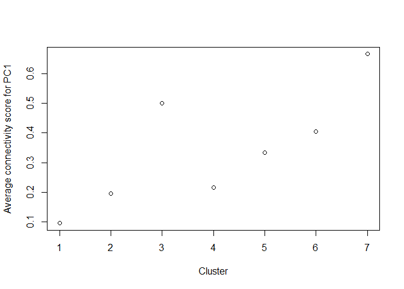
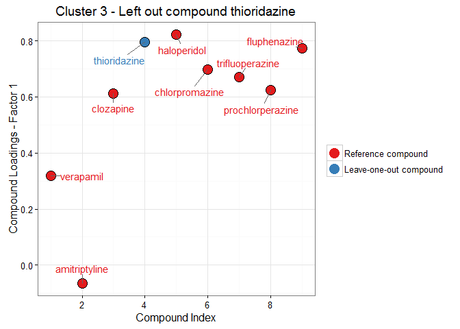
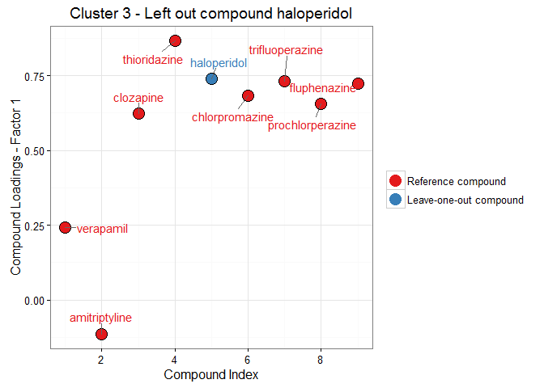
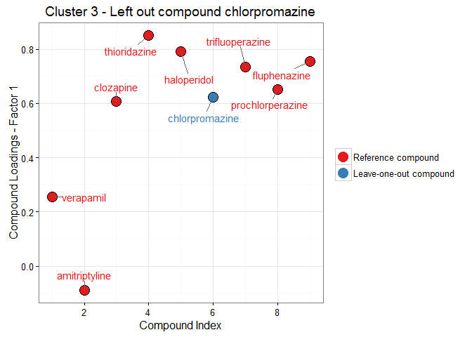

# Integration of connectivity scores of gene expression data and clustering on other data sources
Pieter Moris  
`r format(Sys.Date())`  


<!-- http://kbroman.org/knitr_knutshell/pages/Rmarkdown.html -->
<!-- https://github.com/jeromyanglim/rmarkdown-rmeetup-2012/issues/14 -->
<!-- http://yihui.name/knitr/demo/output/ -->

## Unraveling the connection between chemical structure and gene expression.

The aim of this analysis is to investigate the association between the structure of chemical compounds (or their predicted biological activity) and the effects they induce in a gene expression assay. We will group compounds with a similar structure (*chemical fingerprint*) or predicted bio-activity (*target prediction*) using clustering methods. Subsequently the *gene expression profiles* of the compounds within a cluster will be contrasted with each other using a connectivity score approach based on the work of @lamb_connectivity_2006 and @zhang_simple_2008 on the [Connectivity Map](https://www.broadinstitute.org/cmap/). 

Their methods enable us to contrast a number of query expression profiles with a set of reference profiles and assess the *connectivity* between compounds in terms of which genes are regulated up or down. The connection between the query and reference data can be both positive and negative. In the former case, highly up-regulated genes in one set will also be up-regulated in the other set, and vice versa for down-regulated genes. In the latter case, genes with a high expression in one assay, might be strongly down-regulated in the other one. Both situations imply that the two compounds interfere with the same biological processes. If two sets are weakly connected, there is no correlation or overlap between the top genes of either set. We will use an extension of these methods that scores the connectivity between gene expression profiles using *multiple factor analysis* (MFA). In a nutshell, we will look at the principal axes of variation in the gene expression profiles and we hope to find components where both the reference and the query compounds have a high contribution. 

The dataset we will focus on is the Connectivity Map's MCF-7 dataset, where the gene-wide expression profiles for a breast cancer cell line when exposed to several bio-active small molecules. The chemical fingerprints and and target predictions of these compounds was provided as well.

## Clustering chemical compounds based on chemical fingerprints
We will employ hierarchical clustering to group the chemical compounds based on their fingerprints or target predictions. In either case we are dealing with a 0/1 matrix where the rows correspond to different compounds. For the chemical fingerprints the columns indicate the presence or absence of specific chemical structures. Together this sequence of ones and zeros describes the entire molecular scaffolding of the compound. In essence we are dealing with a bit string for each compound.

Similarly, the binary target prediction matrix indicates whether or not a certain compound is predicted to bind to a certain molecular target, such as enzymes.

Let's take a look at the chemical fingerprints first. Here is a sneak peek of the data:


```
##                  -2147375257 -2147119955 -2146474760 -2145840573
## metformin                  0           0           0           0
## phenformin                 0           0           0           0
## phenyl biguanide           0           0           0           0
## estradiol                  0           0           0           0
## dexamethasone              0           0           0           0
## verapamil                  0           0           0           0
```

To properly cluster objects based on binary attributes, we need to define an adequate measure of similarity. The *Tanimoto coefficient* (sometimes called the *Jaccard coefficient*) is often used for this purpose in cheminformatics [[@maccuish_clustering_2011]](#chem). It contrasts two objects *x* and *y* of dimension *k* in terms of the number of common attributes, *c* versus the number of attributes unique to either object, *a* and *b*. $$s = \frac{c}{a+b-c}$$

*To do: difference in definitions of Tanimoto, jaccard and soergel distance!*

<!-- *** -->

<!-- http://www.sequentix.de/gelquest/help/distance_measures.htm -->

<!-- https://en.wikipedia.org/wiki/Jaccard_index Various forms of functions described as Tanimoto similarity and Tanimoto distance occur in the literature and on the Internet. Most of these are synonyms for Jaccard similarity and Jaccard distance, but some are mathematically different.  -->

<!-- https://books.google.be/books?id=ZDDNBQAAQBAJ&pg=PA41&lpg=PA41&dq=tanimoto+clustering&source=bl&ots=vsLen2ZmS5&sig=N16boAKkB5NWLJjeteC4shM6Brc&hl=en&sa=X&ved=0ahUKEwiaiZvsx4vLAhWBfxoKHf-9DrwQ6AEISzAH#v=onepage&q=tanimoto%20clustering&f=false Soergel distance -->

<!-- https://docs.tibco.com/pub/spotfire/6.0.0-november-2013/userguide-webhelp/hc/hc_tanimoto_coefficient.htm another different formula! -->

<!-- *** -->

Its complement ($1-s$), the *Soergel distance*, is what we will use for our clustering approach. This is what the distance matrix of the compounds based on their fingerprints will look like:

<!-- *To do: R's dist function using binary seems to provide almost the same result! Again, difference between jaccard/tanimoto definitions?* -->


```r
tanimoto = function(m){
  S = matrix(0,nrow=dim(m)[1],ncol=dim(m)[1])
  m=as.matrix(m)
  N.C=m %*% t(m)
  N.A=m %*% (1-t(m))
  N.B=(1-m) %*% t(m)
  S=N.C/(N.A+N.B+N.C)
  D = 1 - S
  return(D)
}
dist.fingerprintMat <- tanimoto(fingerprintMat)
head(dist.fingerprintMat[,1:4])
```

```
##                  metformin phenformin phenyl biguanide estradiol
## metformin        0.0000000  0.7727273        0.8095238 0.9696970
## phenformin       0.7727273  0.0000000        0.5217391 0.8684211
## phenyl biguanide 0.8095238  0.5217391        0.0000000 0.9210526
## estradiol        0.9696970  0.8684211        0.9210526 0.0000000
## dexamethasone    0.9473684  0.8863636        0.9318182 0.6976744
## verapamil        0.9090909  0.8461538        0.9250000 0.7906977
```

```r
# alternative in base r?
# test.dist.fingerprintMat <- as.matrix(dist(fingerprintMat,method = 'binary'))
# test.dist.fingerprintMat == dist.fingerprintMat
```

Now we can go ahead and try to cluster these compounds based on their (dis)similarity in chemical fingerprints. We will use the `agnes` function provided by the `cluster` package, which implements a basic agglomerative hierarchical clustering analysis. Agglomerative hierarchical clustering attempts to form groups of similar objects through a bottom-up approach (as opposed to divisive methods). It starts by assigning each observation to its own cluster. Then, an hierarchy is created by repeatedly merging pairs of similar clusters at lower levels (i.e. those that are close according to our *distance* measure), until a single cluster is formed at the top level. Not only do we require an appropriate measure of distance, like the Tanimoto distance, but we also need to choose an agglomeration method. This method will define how the distance between clusters is calculated: e.g. do we only look at the largest distance between its members or do we take the average of all pairwise distances? We will try both the average method, which strikes a compromise between compactness and closeness of the clusters, and the flexible-Beta, a method often used in ecology (with $\alpha = 0.625$). 

<!-- For this analysis we will choose the average method, which strikes a compromise between compactness and closeness of the clusters. -->

By applying this method to the Tanimoto distance matrix of the compound chemical fingerprints we obtain the following dendogram. Note that the height of each node signifies the dissimilarity between its daughter clusters.


```r
### Base R method:
# cluster.fingerprintMat <- hclust(as.dist(dist.fingerprintMat), method = "average")
# plot(cluster.fingerprintMat,main='Hierarchical clustering of compounds based on their chemical fingerprints',hang=-1,col = "#487AA1", col.main = "#F38630", col.lab = "#F38630", col.axis = "#7C8071",xlab="Compounds",sub="", lwd = 2)
# axis(side = 2, at = seq(0, 400, 100), col = "#F38630", labels = TRUE, lwd = 2)

library(cluster)
cluster.a.fingerprintMat <- agnes(as.dist(dist.fingerprintMat),method = "average")
# plot(cluster.a.fingerprintMat,which.plots = 2)
pltree(cluster.a.fingerprintMat,main='Hierarchical clustering of compounds based on their chemical fingerprints',col = "#487AA1", col.main = "#F38630", col.lab = "#F38630", col.axis = "#7C8071",xlab="Compounds",sub="", lwd = 2) # calls as.hclust plot method (,hang=-1)
axis(side = 2, at = seq(0, 400, 100), col = "#F38630", labels = TRUE, lwd = 2)
```


Next, we need to decide on an appropriate number of clusters and prune the tree to this size. This is different from other cluster methods, such as k-means clustering, where the number of clusters is defined beforehand. We could eyeball it by looking at the dendogram, but in practise it is more appropriate to define the number of clusters based on the distance between certain groups. The Gap statistic can be used to make a more informed decision about this [@hastie_elements_2009-1]. The `cluster` package provides a method to calculate the Gap statistic using a bootstrap approach. Visually we are looking for a kink or elbow in a plot of the gap statistic versus the number of clusters. This indicates that the decrease in within-cluster similarity is levelling off. More formally we will rely on the `TibshiraniSEmax` criterium.


```r
FUNcluster = function(x,k,inputcluster){
  # Function that requires the original observations (x), 
  # the number of desired clusters (k),
  # and a cluster object 
	out = list( cluster = cutree(inputcluster,k=k))
	return(out)
}
gap <- clusGap(fingerprintMat,FUNcluster = FUNcluster,inputcluster=cluster.a.fingerprintMat,K.max = 20,B = 500)
plot(gap)
```


```r
gapdata <- as.data.frame(gap$Tab)
maxSE(gapdata[,3],gapdata[,4],"Tibs2001SEmax")
```

```
## [1] 1
```


Unfortunately, the criteria suggests that we should only utilise one cluster. This can also be seen in the dendogram, where most splits tend to occur at a similar level of distance. 

Now let's try the flexible beta agglomeration method.


```r
cluster.fingerprintMat <- agnes(as.dist(dist.fingerprintMat),method = "flexible",par.method = 0.625)
pltree(cluster.fingerprintMat,main='Hierarchical clustering of compounds based on their chemical fingerprints',col = "#487AA1", col.main = "#F38630", col.lab = "#F38630", col.axis = "#7C8071",xlab="Compounds",sub="", lwd = 2) # calls as.hclust plot method
axis(side = 2, at = seq(0, 400, 100), col = "#F38630", labels = TRUE, lwd = 2)
```


```r
gap <- clusGap(fingerprintMat,FUNcluster = FUNcluster,inputcluster=cluster.fingerprintMat,K.max = 20,B = 500)
plot(gap)
```


```r
gapdata <- as.data.frame(gap$Tab)
k.fingerprint <- maxSE(gapdata[,3],gapdata[,4],"Tibs2001SEmax")
k.fingerprint
```

```
## [1] 7
```

It's already obvious from the dendogram that some of the splits happen at much larger distances than others, which makes it easier to decide on appropriate groups. The `TibshiraniSEmax` suggests that seven clusters is optimal.


```r
pltree(cluster.fingerprintMat,main='Hierarchical clustering of compounds based on their chemical fingerprints',hang=-1,col = "#487AA1", col.main = "#F38630", col.lab = "#F38630", col.axis = "#7C8071",xlab="Compounds",sub="", lwd = 2) # calls as.hclust plot method
axis(side = 2, at = seq(0, 400, 100), col = "#F38630", labels = TRUE, lwd = 2)
rect.hclust(cluster.fingerprintMat,k=k.fingerprint)
```


Here is a list of the clusters we obtained:


```r
cut.cluster.fingerprintMat <- cutree(cluster.fingerprintMat,k=k.fingerprint) # get vector with cluster membership for compounds
sapply(unique(cut.cluster.fingerprintMat), function(x) colnames(geneMat)[cut.cluster.fingerprintMat==x])
```

```
## [[1]]
## [1] "metformin"              "phenformin"            
## [3] "phenyl biguanide"       "tetraethylenepentamine"
## [5] "tioguanine"            
## 
## [[2]]
## [1] "estradiol"                 "nordihydroguaiaretic acid"
## [3] "genistein"                 "fulvestrant"              
## [5] "dopamine"                  "probucol"                 
## [7] "resveratrol"               "butein"                   
## 
## [[3]]
## [1] "dexamethasone"   "exemestane"      "prednisolone"    "fludrocortisone"
## 
## [[4]]
##  [1] "verapamil"     "rofecoxib"     "amitriptyline" "raloxifene"   
##  [5] "celecoxib"     "LM-1685"       "SC-58125"      "LY-294002"    
##  [9] "indometacin"   "MK-886"        "sulindac"      "exisulind"    
## [13] "staurosporine" "fasudil"       "imatinib"      "clozapine"    
## [17] "haloperidol"   "W-13"          "quinpirole"    "calmidazolium"
## [21] "nocodazole"   
## 
## [[5]]
## [1] "15-delta prostaglandin J2"   "tomelukast"                 
## [3] "ciclosporin"                 "arachidonyltrifluoromethane"
## [5] "trichostatin A"              "valproic acid"              
## [7] "arachidonic acid"            "bucladesine"                
## [9] "benserazide"                
## 
## [[6]]
## [1] "flufenamic acid"          "N-phenylanthranilic acid"
## [3] "diclofenac"               "4,5-dianilinophthalimide"
## 
## [[7]]
## [1] "thioridazine"     "chlorpromazine"   "trifluoperazine" 
## [4] "prochlorperazine" "fluphenazine"
```

<!-- We can also inspect how many entries are in each cluster for various cluster sizes. Fortunately 7 clusters does not lead to any clusters of just one or two compounds, because this could complicate things later on. -->

<!-- ```{r} -->
<!-- # http://www.stat.berkeley.edu/~s133/Cluster2a.html -->
<!-- counts = sapply(2:15,function(ncl)table(cutree(cluster.fingerprintMat,ncl))) -->
<!-- names(counts) = 2:15 -->
<!-- counts -->
<!-- ``` -->

Finally, we will repeat the same procedure for the target predictions.


```r
dist.targetMat <- tanimoto(targetMat)
cluster.targetMat <- agnes(as.dist(dist.targetMat),method = "flexible",par.method = 0.625)

gap <- clusGap(targetMat,FUNcluster = FUNcluster,inputcluster=cluster.targetMat,K.max = 20,B = 500)
plot(gap)
```


```r
gapdata <- as.data.frame(gap$Tab)
k.target <- maxSE(gapdata[,3],gapdata[,4],"Tibs2001SEmax")

pltree(cluster.targetMat,main='Hierarchical clustering of compounds based on their target predictions',col = "#487AA1", col.main = "#F38630", col.lab = "#F38630", col.axis = "#7C8071",xlab="Compounds",sub="", lwd = 2) # calls as.hclust plot method
rect.hclust(cluster.targetMat,k=k.target)
```


```r
cut.cluster.targetMat <- cutree(cluster.targetMat,k=k.target)
sapply(unique(cut.cluster.targetMat), function(x) colnames(geneMat)[cut.cluster.targetMat==x])
```

```
## [[1]]
## [1] "metformin"              "phenformin"            
## [3] "phenyl biguanide"       "celecoxib"             
## [5] "tetraethylenepentamine" "W-13"                  
## 
## [[2]]
## [1] "estradiol"       "dexamethasone"   "exemestane"      "prednisolone"   
## [5] "fludrocortisone" "fulvestrant"    
## 
## [[3]]
## [1] "verapamil"        "amitriptyline"    "clozapine"       
## [4] "thioridazine"     "haloperidol"      "chlorpromazine"  
## [7] "trifluoperazine"  "prochlorperazine" "fluphenazine"    
## 
## [[4]]
##  [1] "rofecoxib"                "LM-1685"                 
##  [3] "SC-58125"                 "indometacin"             
##  [5] "MK-886"                   "sulindac"                
##  [7] "exisulind"                "flufenamic acid"         
##  [9] "N-phenylanthranilic acid" "diclofenac"              
## [11] "4,5-dianilinophthalimide"
## 
## [[5]]
## [1] "15-delta prostaglandin J2"   "tomelukast"                 
## [3] "arachidonyltrifluoromethane" "valproic acid"              
## [5] "arachidonic acid"           
## 
## [[6]]
## [1] "raloxifene"                "nordihydroguaiaretic acid"
## [3] "genistein"                 "quinpirole"               
## [5] "dopamine"                  "probucol"                 
## [7] "resveratrol"               "butein"                   
## [9] "benserazide"              
## 
## [[7]]
##  [1] "LY-294002"      "ciclosporin"    "staurosporine"  "trichostatin A"
##  [5] "fasudil"        "imatinib"       "calmidazolium"  "bucladesine"   
##  [9] "nocodazole"     "tioguanine"
```

## Connectivity scoring using multiple factor analysis

Now that we have identified clusters of compounds that are similar in terms of their structure (chemical fingerprint or target prediction), we will investigate whether or not they are also similar according to the gene expression profiles they induce *in vitro*. To do this, we will use MFA to compare the gene expression profile of a certain compound (the query) with the profiles of all the other compounds in its cluster (the reference database), i.e. a leave-one-out approach. This will be done once for each compound in a cluster, for every cluster we defined earlier. Afterwards, it might also be interesting to contrast entire clusters with one another, i.e. by using one cluster as a query dataset and comparing it with the other clusters, i.e. a leave-one-cluster-out method.

**The question we are interested in is if the same genes are being regulated in the same or opposite way for the compounds in a cluster, i.e. if there is a connection between chemical structure and biological effects.**

### Within cluster connectivity

#### Demo for first cluster

As a proof of concept, we shall perform the leave-one-out procedure on the first cluster.


```r
colnames(geneMat)[cut.cluster.fingerprintMat == 1]
```

```
## [1] "metformin"              "phenformin"            
## [3] "phenyl biguanide"       "tetraethylenepentamine"
## [5] "tioguanine"
```

We define the set of reference profiles as all the compounds in the cluster, except for one (*metformin* in this example). Next, the query set contains all the compounds in the cluster. This can be thought of conceptually as treating the reference set as the known profile or the profile of interest, and searching for similar profiles in the query set. For the MFA, it is important to keep in mind that the compounds are treated as variables or features, whereas the genes are observations. The genes are shared between the reference and query set, but the variables will differ. 


```r
refMat <- geneMat[,cut.cluster.fingerprintMat==1][,-c(1)]
querMat <- geneMat[,cut.cluster.fingerprintMat==1]
colnames(refMat)
```

```
## [1] "phenformin"             "phenyl biguanide"      
## [3] "tetraethylenepentamine" "tioguanine"
```

```r
colnames(querMat)
```

```
## [1] "metformin"              "phenformin"            
## [3] "phenyl biguanide"       "tetraethylenepentamine"
## [5] "tioguanine"
```

In the first step, MFA will normalize both the reference and query dataset by dividing each by their first singular value. Next, a PCA is performed on the combined datasets. This will creates principal axes of variations, which are orthogonal and still explain the entire structure of the data. The principal axes, often called components or factors, are linear combinations of the original variables (or compounds in our setting). We are hoping to find high contributions, termed loadings, of the reference compounds to the first factor and also a high loading of the left out compound on this factor if it is also similar in gene expression. The factor loadings are the actual connectivity scores we are interested in.

We will repeat the MFA, each time leaving out another compound of the cluster in the reference set. Afterwards, we will average the connectivity scores of the left-out compounds, and use this as the global connectivity score within the cluster.


```r
library(CSFA)
# MFA.fingerprint <- CSanalysis(refMat, querMat,"CSmfa",which = c(1:7))
# 2 = principal components for reference compounds
# 3 = factor scores for genes (1vs2) + compound loadings (1v2)
# 4 = factor scores for genes (pc1) interactive
# 5 = compound loadings (pc1)
# 6 = interactive (crash?)
# 7 = CS rank score
factor1.out_MFA <-  CSanalysis(refMat, querMat,"CSmfa",which=c(2,3),factor.plot=1,plot.type='sweave')
```


Already things have become a bit more complex. As you can see in the first plot showing the loadings for the different factors, there is no single factor with high loadings for all of the compounds, which is what we would expect if all the reference compounds are indeed inducing similar gene expression profiles. This indicates that there is no single dominating structure in the reference dataset, **rather there are multiple sub-structures, corresponding to only a few compounds of the reference set**. We call these substructures connectivity sets. 

For example, the largest structure is dominated by the compounds phenformin and phenyl biguanide, whereas the second is made up of tioguanine and **tetraethylenepentamine???**. 

**As such there are also multiple connectivity scores for the left out compound, metformin, each belonging to a different connectivity set. For example, the connectivity score for metformin for the first connectivity set is about 0.1.**


```r
factor1.out_MFA@CS$CS.query
```

```
##                           Factor1
## metformin              0.11598731
## phenformin             0.88875107
## phenyl biguanide       0.86775976
## tetraethylenepentamine 0.07421413
## tioguanine             0.18861928
```

**We could also look at the second component, which is a set consisting of tioguanine (high) and tetraethylenepentamine (low). For this connectivity set metformin scores a bit higher, with a loading around 0.6**


```r
factor2.out_MFA <-  CSanalysis(refMat, querMat,"CSmfa",which=c(),factor.plot=2,plot.type='sweave')
```


```r
factor2.out_MFA@CS$CS.query
```

```
##                           Factor2
## metformin               0.5869890
## phenformin              0.1208763
## phenyl biguanide       -0.2537779
## tetraethylenepentamine -0.6990440
## tioguanine              0.6940803
```

<!-- **Question! What are the CSrankscores? They look similar to the loadings, but small values are reduced to zero?** -->

<!-- ```{r} -->
<!-- factor1.out_MFA@CSRankScores -->
<!-- factor2.out_MFA@CSRankScores -->
<!-- ``` -->

#### Within-connectivity based on fingerprint clustering
Now we will perform this leave-one-out and average procedure for each fingerprint-based cluster, leaving out a single compound each time.


```r
n.cluster.fingerprint <- unique(cut.cluster.fingerprintMat) # number of clusters

connectivity.fingerprint <- lapply(n.cluster.fingerprint, function(x) sapply(rownames(fingerprintMat[cut.cluster.fingerprintMat==x,,drop=F]),function(y) NULL)) # initialize list to store MFA results

ptm <- proc.time()
for (i in 1:length(connectivity.fingerprint)) { # loop through clusters
  cluster.names <- rownames(fingerprintMat[cut.cluster.fingerprintMat==i,,drop=F])
  for (j in 1:length(cluster.names)) { # loop through compounds in a cluster
    connectivity.fingerprint[[i]][[j]][['refMat']] <- geneMat[,cluster.names[-c(j)]] # reference contains all but j'th compound
    connectivity.fingerprint[[i]][[j]][['querMat']] <- geneMat[,cluster.names] # query set contains all compounds in cluster
    connectivity.fingerprint[[i]][[j]]['MFA'] <- CSanalysis(connectivity.fingerprint[[i]][[j]][['refMat']],
                                                     connectivity.fingerprint[[i]][[j]][['querMat']],
                                                     "CSmfa",which=c(),factor.plot=1) # MFA analysis
  }
}
proc.time() - ptm
```

We'll take a look at the results for the first cluster, i.e. leaving out one of the compounds each time, for the first component.


```r
for (j in rownames(fingerprintMat[cut.cluster.fingerprintMat==1,,drop=F])){
  print(paste('Query compound is',j))
  print(connectivity.fingerprint[[1]][[j]][['MFA']]@CS$CS.query)
}
```

```
## [1] "Query compound is metformin"
##                           Factor1
## metformin              0.11598731
## phenformin             0.88875107
## phenyl biguanide       0.86775976
## tetraethylenepentamine 0.07421413
## tioguanine             0.18861928
## [1] "Query compound is phenformin"
##                            Factor1
## metformin               0.79666125
## phenformin              0.08757013
## phenyl biguanide       -0.31333693
## tetraethylenepentamine -0.57058029
## tioguanine              0.63276623
## [1] "Query compound is phenyl biguanide"
##                           Factor1
## metformin               0.7688766
## phenformin              0.5713239
## phenyl biguanide        0.1717391
## tetraethylenepentamine -0.4410884
## tioguanine              0.6324281
## [1] "Query compound is tetraethylenepentamine"
##                            Factor1
## metformin               0.33602329
## phenformin              0.89313511
## phenyl biguanide        0.76749299
## tetraethylenepentamine -0.03704697
## tioguanine              0.33471513
## [1] "Query compound is tioguanine"
##                           Factor1
## metformin              0.17183683
## phenformin             0.90322026
## phenyl biguanide       0.85494862
## tetraethylenepentamine 0.04266674
## tioguanine             0.13805259
```

And for the second component (note: the print-out of CSanalysis is not suppressed unfortunately):


```r
# b <- connectivity.fingerprint[[1]][[1]][['MFA']]
# a<-CSanalysis(connectivity.fingerprint[[1]][[1]][['refMat']],
#                     connectivity.fingerprint[[1]][[1]][['querMat']],
#                     "CSmfa",factor.plot=2,which=c(2,3),
#                     result.available=connectivity.fingerprint[[1]][[1]][['MFA']],plot.type='sweave')
# b@CS$CS.query
# a@CS$CS.query
# connectivity.fingerprint[[1]][[1]][['MFA']]@CS$CS.query
## Warning in .local(refMat, querMat, type, ...): CS, GS and CSRankScores Slot
## in CSresult will be overwritten due to different factor choice.

redo_MFA_fingerprint_within = function(cluster,compound,factor){
  # Plots result for already calculated MFA objects
  mfa <- CSanalysis(connectivity.fingerprint[[cluster]][[compound]][['refMat']],
                    connectivity.fingerprint[[cluster]][[compound]][['querMat']],
                    "CSmfa",factor.plot=factor,which=c(),
                    result.available=connectivity.fingerprint[[cluster]][[compound]][['MFA']],
                    plot.type='sweave')
  return(mfa)
}

for (j in rownames(fingerprintMat[cut.cluster.fingerprintMat==1,,drop=F])){
  print(paste('Query compound is',j))
  print(redo_MFA_fingerprint_within(1,j,2)@CS$CS.query)
}
```

```
## [1] "Query compound is metformin"
## Echoufier Rv Correlation:
##           Reference     Query       MFA
## Reference 1.0000000 0.9157038 0.9761933
## Query     0.9157038 1.0000000 0.9810670
## MFA       0.9761933 0.9810670 1.0000000
##                           Factor2
## metformin               0.5869890
## phenformin              0.1208763
## phenyl biguanide       -0.2537779
## tetraethylenepentamine -0.6990440
## tioguanine              0.6940803
## [1] "Query compound is phenformin"
## Echoufier Rv Correlation:
##           Reference     Query       MFA
## Reference 1.0000000 0.9179576 0.9777683
## Query     0.9179576 1.0000000 0.9807286
## MFA       0.9777683 0.9807286 1.0000000
##                          Factor2
## metformin              0.1623938
## phenformin             0.7518322
## phenyl biguanide       0.8908009
## tetraethylenepentamine 0.1721841
## tioguanine             0.3424859
## [1] "Query compound is phenyl biguanide"
## Echoufier Rv Correlation:
##           Reference     Query       MFA
## Reference 1.0000000 0.9175224 0.9769254
## Query     0.9175224 1.0000000 0.9812886
## MFA       0.9769254 0.9812886 1.0000000
##                           Factor2
## metformin              -0.2400944
## phenformin              0.7541274
## phenyl biguanide        0.7720287
## tetraethylenepentamine  0.4674535
## tioguanine             -0.1649890
## [1] "Query compound is tetraethylenepentamine"
## Echoufier Rv Correlation:
##           Reference     Query       MFA
## Reference 1.0000000 0.9150150 0.9762515
## Query     0.9150150 1.0000000 0.9806818
## MFA       0.9762515 0.9806818 1.0000000
##                           Factor2
## metformin               0.7747060
## phenformin             -0.1183784
## phenyl biguanide       -0.4993155
## tetraethylenepentamine -0.3237629
## tioguanine              0.6651523
## [1] "Query compound is tioguanine"
## Echoufier Rv Correlation:
##           Reference     Query       MFA
## Reference 1.0000000 0.9151536 0.9765328
## Query     0.9151536 1.0000000 0.9804937
## MFA       0.9765328 0.9804937 1.0000000
##                           Factor2
## metformin               0.8141635
## phenformin              0.1455314
## phenyl biguanide       -0.3124059
## tetraethylenepentamine -0.7012783
## tioguanine              0.3755571
```
**It's apparent that there is not just one main structure or connectivity set in this cluster. Both the first and second connectivity scores could be taken into account when calculating the average connectivity.**

<!-- Here are the related plots: -->

<!-- ```{r fingerprint_clust1_plots} -->
<!-- plot_MFA_fingerprint_within = function(cluster,compound,factor){ -->
<!--   # Plots result for already calculated MFA objects -->
<!--   mfa <- CSanalysis(connectivity.fingerprint[[cluster]][[compound]][['refMat']], -->
<!--                     connectivity.fingerprint[[cluster]][[compound]][['querMat']], -->
<!--                     "CSmfa",factor.plot=factor,which=c(2,3), -->
<!--                     result.available=connectivity.fingerprint[[cluster]][[compound]][['MFA']], -->
<!--                     plot.type='sweave') -->
<!--   return(mfa) -->
<!-- } -->
<!-- # plot_MFA_fingerprint_within(1,'metformin') -->
<!-- for (j in rownames(fingerprintMat[cut.cluster.fingerprintMat==1,,drop=F])){ -->
<!--   print(paste('Query compound is',j)) -->
<!--   plot_MFA_fingerprint_within(1,j,1) -->
<!-- } -->
<!-- ``` -->

Let's calculate the average connectivity for the clusters for the first and second component separately. We will use the mean of the absolute values as the connectivity measure, but it could be argued that the reverse, the absolute value of the mean is more appropriate. The difference is whether compounds with opposite effects on gene expression will be considered similar or not.

<!-- ```{r,eval=F,include=F} -->
<!-- # Test for average loop -->
<!-- test <- connectivity.fingerprint[[1]] -->
<!-- test[['metformin']][['MFA']]@CS$CS.query['metformin',] -->
<!-- test[['phenformin']][['MFA']]@CS$CS.query['phenformin',] -->

<!-- sapply(seq_along(test), function(x,n) test[[x]][['MFA']]@CS$CS.query[n[x],] ,n=names(test)) -->

<!-- test2 <- connectivity.fingerprint[[2]] -->
<!-- sapply(seq_along(test2), function(x,n) test2[[x]][['MFA']]@CS$CS.query[n[x],] ,n=names(test2)) -->
<!-- ``` -->

##### Average within-cluster connectivity plots for fingerprints

The average scores for each cluster are shown below:


```r
# inner sapply x retrieves query loading for each leave-one-out MFA: returns list of query loadings
# middle sapply y loops through clusters and returns list of query loadings for each cluster
# outer sapply z takes mean absolute value of each list
average.connectivity.fingerprint.pc1 <- sapply(sapply(connectivity.fingerprint, function(y) sapply(seq_along(y), function(x,n) y[[x]][['MFA']]@CS$CS.query[n[x],] ,n=names(y))), function(z) mean(abs(z)))

plot(average.connectivity.fingerprint.pc1,xlab='Cluster',ylab='Average connectivity score for PC1')
```


These are the results when the absolute value of the means is used: the overall pattern remains unchanged.


```r
test.average.connectivity.fingerprint.pc1 <- abs(sapply(sapply(connectivity.fingerprint, function(y) sapply(seq_along(y), function(x,n) y[[x]][['MFA']]@CS$CS.query[n[x],] ,n=names(y))), mean))

plot(test.average.connectivity.fingerprint.pc1,xlab='Cluster',ylab='Average connectivity score for PC1')
```



<!-- sweave test -->
<!-- ```{r} -->
<!-- CSanalysis(connectivity.fingerprint[[1]][[1]][['refMat']], -->
<!--                     connectivity.fingerprint[[1]][[1]][['querMat']], -->
<!--                     "CSmfa",factor.plot=1,which=c(2,3), -->
<!--                     result.available=connectivity.fingerprint[[1]][[1]][['MFA']],plot.type='sweave') -->
<!-- ``` -->

<!-- ```{r} OLD LOOP FRAMEWORK--> 
<!-- # Loop framework to use later... -->
<!-- n.cluster <- unique(cut.cluster.fingerprintMat) # number of clusters -->

<!-- connectivity.fingerprint <- vector('list',length(n.cluster)) # initialize list to store connectivity scores -->

<!-- for (i in n.cluster) { -->
<!--   compounds.in.cluster <- rownames(fingerprintMat[cut.cluster.fingerprintMat==i,,drop=F]) -->
<!--   connectivity.fingerprint[[i]] <- sapply( c('average',compounds.in.cluster), function(j) NULL) -->
<!--   connectivity.fingerprint[[i]][['compounds']] <- compounds.in.cluster -->
<!-- } -->

<!-- ptm <- proc.time() -->
<!-- for (i in 1:length(connectivity.fingerprint)) { # loop through clusters -->
<!--   sum <- 0 -->
<!--   for (j in 1:length(connectivity.fingerprint[[i]]$compounds)) { # loop through compounds in a cluster -->
<!--     refMat <- geneMat[,connectivity.fingerprint[[i]]$compounds[-c(j)]] -->
<!--     querMat <- geneMat[,connectivity.fingerprint[[i]]$compounds] -->
<!--     connectivity.fingerprint[[i]][[connectivity.fingerprint[[i]]$compounds[[j]]]] <- CSanalysis(refMat,querMat,"CSmfa",which=c(),factor.plot=1) -->
  <!--   sum <- sum + connectivity.fingerprint[[i]][[connectivity.fingerprint[[i]]$compounds[[j]]]][connectivity.fingerprint[[i]]$compounds[[j]],] -->
  <!-- } -->
  <!-- connectivity.fingerprint[[i]]$average <- sum/j -->
<!-- } -->
<!-- proc.time() - ptm -->
<!-- ``` -->

<!-- ```{r,eval=F} -->
<!-- # old plotting tool when averages were stored in list -->
<!-- plot(sapply(connectivity.fingerprint, function(x) x$average),xlab='Cluster',ylab='Average connectivity score') -->
<!-- ``` -->

Cluster 7 looks the most promising, it consists of the following compounds:


```r
colnames(geneMat)[cut.cluster.fingerprintMat == 7]
```

```
## [1] "thioridazine"     "chlorpromazine"   "trifluoperazine" 
## [4] "prochlorperazine" "fluphenazine"
```

And the query loadings are similar to the reference loadings for each leave-one-out iteration:


```r
for (j in rownames(fingerprintMat[cut.cluster.fingerprintMat==7,,drop=F])){
  print(paste('Query compound is',j))
  print(connectivity.fingerprint[[7]][[j]][['MFA']]@CS$CS.query)
}
```

```
## [1] "Query compound is thioridazine"
##                    Factor1
## thioridazine     0.8295464
## chlorpromazine   0.6257024
## trifluoperazine  0.8008189
## prochlorperazine 0.7211948
## fluphenazine     0.7523730
## [1] "Query compound is chlorpromazine"
##                    Factor1
## thioridazine     0.8810331
## chlorpromazine   0.5307206
## trifluoperazine  0.8439174
## prochlorperazine 0.7244087
## fluphenazine     0.7164179
## [1] "Query compound is trifluoperazine"
##                    Factor1
## thioridazine     0.8762605
## chlorpromazine   0.6860204
## trifluoperazine  0.7275163
## prochlorperazine 0.7027336
## fluphenazine     0.7344407
## [1] "Query compound is prochlorperazine"
##                    Factor1
## thioridazine     0.8937097
## chlorpromazine   0.6546805
## trifluoperazine  0.8074894
## prochlorperazine 0.6112374
## fluphenazine     0.7427171
## [1] "Query compound is fluphenazine"
##                    Factor1
## thioridazine     0.9036078
## chlorpromazine   0.6244616
## trifluoperazine  0.8194451
## prochlorperazine 0.7270797
## fluphenazine     0.6305510
```

<!-- The plots for cluster 7 are shown below: -->

<!-- ```{r fingerprint_within_MFA_cluster7_plots} -->
<!-- for (j in rownames(fingerprintMat[cut.cluster.fingerprintMat==7,,drop=F])){ -->
<!--   print(paste('Query compound is',j)) -->
<!--   plot_MFA_fingerprint_within(7,j,1) -->
<!-- } -->
<!-- ``` -->

These are the results when we consider the second component for each cluster.


```r
average.connectivity.fingerprint.pc2 <- sapply(sapply(seq_along(connectivity.fingerprint), 
       function(y) sapply(seq_along(connectivity.fingerprint[[y]]),
                          function(x,n) redo_MFA_fingerprint_within(y,n[x],2)@CS$CS.query[n[x],] ,
                          n=names(connectivity.fingerprint[[y]]))), function(z) mean(abs(z)))
# ## Warning in .local(refMat, querMat, type, ...): CS, GS and CSRankScores Slot
## in CSresult will be overwritten due to different factor choice.
```


```r
plot(average.connectivity.fingerprint.pc2,xlab='Cluster',ylab='Average connectivity score')
```


For the second component, which likely represents a weaker structure than the first component, the first cluster looks interesting again.


```r
colnames(geneMat)[cut.cluster.fingerprintMat == 1]
```

```
## [1] "metformin"              "phenformin"            
## [3] "phenyl biguanide"       "tetraethylenepentamine"
## [5] "tioguanine"
```

And the query loadings are similar to the reference loadings for each leave-one-out iteration:


```r
for (j in rownames(fingerprintMat[cut.cluster.fingerprintMat==1,,drop=F])){
  print(paste('Query compound is',j))
  print(redo_MFA_fingerprint_within(1,j,2)@CS$CS.query)
}
```

```
## [1] "Query compound is metformin"
## Echoufier Rv Correlation:
##           Reference     Query       MFA
## Reference 1.0000000 0.9157038 0.9761933
## Query     0.9157038 1.0000000 0.9810670
## MFA       0.9761933 0.9810670 1.0000000
##                           Factor2
## metformin               0.5869890
## phenformin              0.1208763
## phenyl biguanide       -0.2537779
## tetraethylenepentamine -0.6990440
## tioguanine              0.6940803
## [1] "Query compound is phenformin"
## Echoufier Rv Correlation:
##           Reference     Query       MFA
## Reference 1.0000000 0.9179576 0.9777683
## Query     0.9179576 1.0000000 0.9807286
## MFA       0.9777683 0.9807286 1.0000000
##                          Factor2
## metformin              0.1623938
## phenformin             0.7518322
## phenyl biguanide       0.8908009
## tetraethylenepentamine 0.1721841
## tioguanine             0.3424859
## [1] "Query compound is phenyl biguanide"
## Echoufier Rv Correlation:
##           Reference     Query       MFA
## Reference 1.0000000 0.9175224 0.9769254
## Query     0.9175224 1.0000000 0.9812886
## MFA       0.9769254 0.9812886 1.0000000
##                           Factor2
## metformin              -0.2400944
## phenformin              0.7541274
## phenyl biguanide        0.7720287
## tetraethylenepentamine  0.4674535
## tioguanine             -0.1649890
## [1] "Query compound is tetraethylenepentamine"
## Echoufier Rv Correlation:
##           Reference     Query       MFA
## Reference 1.0000000 0.9150150 0.9762515
## Query     0.9150150 1.0000000 0.9806818
## MFA       0.9762515 0.9806818 1.0000000
##                           Factor2
## metformin               0.7747060
## phenformin             -0.1183784
## phenyl biguanide       -0.4993155
## tetraethylenepentamine -0.3237629
## tioguanine              0.6651523
## [1] "Query compound is tioguanine"
## Echoufier Rv Correlation:
##           Reference     Query       MFA
## Reference 1.0000000 0.9151536 0.9765328
## Query     0.9151536 1.0000000 0.9804937
## MFA       0.9765328 0.9804937 1.0000000
##                           Factor2
## metformin               0.8141635
## phenformin              0.1455314
## phenyl biguanide       -0.3124059
## tetraethylenepentamine -0.7012783
## tioguanine              0.3755571
```

#### Within-cluster connectivity based on target predictions

Here is the same procedure for the clusters based on target prediction:

<!-- ```{r} -->
<!-- refMat <- geneMat[,cut.cluster.targetMat==3][,-c(3)] -->
<!-- querMat <- geneMat[,cut.cluster.targetMat==3] -->
<!-- factor1.out_MFA <-  CSanalysis(refMat, querMat,"CSmfa",which=c(2,3),factor.plot=1) -->
<!-- CSanalysis(refMat, querMat,"CSmfa",factor.plot=1,which=c(2,3),result.available = factor1.out_MFA,plot.type=sweave) -->

<!-- test <- vector('list',sum(cut.cluster.targetMat==3)) -->
<!-- compounds.in.cluster.target <- rownames(targetMat[cut.cluster.targetMat==3,,drop=F]) -->
<!-- test[[i]] <- sapply( c('average',compounds.in.cluster.target), function(j) NULL) -->
<!-- test[[i]][['compounds']] <- compounds.in.cluster.target -->


<!-- for (j in 1:length(test[[i]]$compounds)) { # loop through compounds in a cluster -->
<!--     refMat <- geneMat[,test[[i]]$compounds[-c(j)]] -->
<!--     querMat <- geneMat[,test[[i]]$compounds] -->
<!--     test[[i]][[test[[i]]$compounds[[j]]]] <- CSanalysis(refMat,querMat,"CSmfa",which=c(),factor.plot=1) -->
<!-- } -->


<!-- ``` -->

<!-- ```{r} -->
<!-- # OLD FRAMEWORK -->
<!-- # get_refMat = function(cluster,compound){ -->
<!-- #   refMat <- geneMat[,colnames(geneMat)[cut.cluster.targetMat == cluster][-which(colnames(geneMat)[cut.cluster.targetMat == 1] %in% compound)]] -->
<!-- # 	return(refMat) -->
<!-- # } -->
<!-- # get_querMat = function(x,k,inputcluster){ -->
<!-- #   querMat <- geneMat[,colnames(geneMat)[cut.cluster.targetMat == 1][-c(j)]] -->
<!-- # 	return(querMat) -->
<!-- # } -->
<!-- # -->
<!--       # for (j in 1:length(rownames(targetMat[cut.cluster.targetMat==i,,drop=F]))) { # loop through compounds in a cluster -->


<!--     # refMat <- geneMat[,colnames(geneMat)[cut.cluster.targetMat == 1][-c(j)]] # reference set contains all but one compound -->
<!--     # querMat <- geneMat[,colnames(geneMat)[cut.cluster.targetMat == 1]] # query set contains all compounds in cluster -->
<!--     # connectivity.target[[i]][[rownames(targetMat[cut.cluster.targetMat==i,,drop=F])[j]]] <- CSanalysis(refMat,querMat,"CSmfa",which=c(),factor.plot=1) -->
<!-- ``` -->


```r
n.cluster.target <- unique(cut.cluster.targetMat) # number of clusters
connectivity.target <- lapply(n.cluster.target, function(x) sapply(rownames(targetMat[cut.cluster.targetMat==x,,drop=F]),function(y) NULL))
# sapply(c('refMat','querMat','MFA'), function(z) NULL) does not work?
ptm <- proc.time()
for (i in 1:length(connectivity.target)) { # loop through clusters
  cluster.names <- rownames(targetMat[cut.cluster.targetMat==i,,drop=F])
  for (j in 1:length(cluster.names)) { # loop through compounds in a cluster
    connectivity.target[[i]][[j]][['refMat']] <- geneMat[,cluster.names[-c(j)]]
    connectivity.target[[i]][[j]][['querMat']] <- geneMat[,cluster.names]
    connectivity.target[[i]][[j]]['MFA'] <- CSanalysis(connectivity.target[[i]][[j]][['refMat']],
                                                     connectivity.target[[i]][[j]][['querMat']],
                                                     "CSmfa",which=c(),factor.plot=1)
  }
}
proc.time() - ptm
```

Let's check out the third cluster, which contains a number of known antipsychotic drugs:


```r
colnames(geneMat)[cut.cluster.targetMat == 3]
```

```
## [1] "verapamil"        "amitriptyline"    "clozapine"       
## [4] "thioridazine"     "haloperidol"      "chlorpromazine"  
## [7] "trifluoperazine"  "prochlorperazine" "fluphenazine"
```

The loadings for the first and second components are shown below:


```r
for (j in rownames(targetMat[cut.cluster.targetMat==3,,drop=F])){
  print(paste('Query compound is',j))
  print(connectivity.target[[3]][[j]][['MFA']]@CS$CS.query)
}
```

```
## [1] "Query compound is verapamil"
##                     Factor1
## verapamil         0.2301183
## amitriptyline    -0.1060217
## clozapine         0.6232083
## thioridazine      0.8542393
## haloperidol       0.7890572
## chlorpromazine    0.6819730
## trifluoperazine   0.7156512
## prochlorperazine  0.6357767
## fluphenazine      0.7369901
## [1] "Query compound is amitriptyline"
##                      Factor1
## verapamil         0.28276964
## amitriptyline    -0.06790912
## clozapine         0.61062537
## thioridazine      0.84418118
## haloperidol       0.80002874
## chlorpromazine    0.68917482
## trifluoperazine   0.69969726
## prochlorperazine  0.62796855
## fluphenazine      0.75191943
## [1] "Query compound is clozapine"
##                     Factor1
## verapamil         0.2988784
## amitriptyline    -0.0438679
## clozapine         0.5451605
## thioridazine      0.8426666
## haloperidol       0.8019050
## chlorpromazine    0.6810040
## trifluoperazine   0.7122881
## prochlorperazine  0.6387206
## fluphenazine      0.7705440
## [1] "Query compound is thioridazine"
##                     Factor1
## verapamil         0.3189831
## amitriptyline    -0.0643211
## clozapine         0.6127898
## thioridazine      0.7950782
## haloperidol       0.8218421
## chlorpromazine    0.6974778
## trifluoperazine   0.6706883
## prochlorperazine  0.6233163
## fluphenazine      0.7731404
## [1] "Query compound is haloperidol"
##                     Factor1
## verapamil         0.2423945
## amitriptyline    -0.1136460
## clozapine         0.6228688
## thioridazine      0.8659982
## haloperidol       0.7391792
## chlorpromazine    0.6822154
## trifluoperazine   0.7313656
## prochlorperazine  0.6558939
## fluphenazine      0.7235680
## [1] "Query compound is chlorpromazine"
##                      Factor1
## verapamil         0.25610360
## amitriptyline    -0.08803702
## clozapine         0.60641604
## thioridazine      0.85016672
## haloperidol       0.79220136
## chlorpromazine    0.62278571
## trifluoperazine   0.73323942
## prochlorperazine  0.65134217
## fluphenazine      0.75573004
## [1] "Query compound is trifluoperazine"
##                      Factor1
## verapamil         0.32269262
## amitriptyline    -0.06367886
## clozapine         0.62816375
## thioridazine      0.82144026
## haloperidol       0.82067444
## chlorpromazine    0.72066411
## trifluoperazine   0.63032144
## prochlorperazine  0.61159868
## fluphenazine      0.75388705
## [1] "Query compound is prochlorperazine"
##                     Factor1
## verapamil         0.2924497
## amitriptyline    -0.0612168
## clozapine         0.6239479
## thioridazine      0.8398695
## haloperidol       0.8147150
## chlorpromazine    0.7069467
## trifluoperazine   0.6854054
## prochlorperazine  0.5627840
## fluphenazine      0.7618211
## [1] "Query compound is fluphenazine"
##                     Factor1
## verapamil         0.2376685
## amitriptyline    -0.1304367
## clozapine         0.6457618
## thioridazine      0.8636702
## haloperidol       0.7751935
## chlorpromazine    0.6971688
## trifluoperazine   0.7083711
## prochlorperazine  0.6483128
## fluphenazine      0.6809147
```

```r
redo_MFA_target_within = function(cluster,compound,factor){
  # Plots result for already calculated MFA objects
  mfa <- CSanalysis(connectivity.target[[cluster]][[compound]][['refMat']],
                    connectivity.target[[cluster]][[compound]][['querMat']],
                    "CSmfa",factor.plot=factor,which=c(),
                    result.available=connectivity.target[[cluster]][[compound]][['MFA']],
                    plot.type='sweave')
  return(mfa)
}

for (j in rownames(targetMat)[cut.cluster.targetMat==3,drop=F]){
  print(paste('Query compound is',j))
  print(redo_MFA_target_within(3,j,2)@CS$CS.query)
}
```

```
## [1] "Query compound is verapamil"
## Echoufier Rv Correlation:
##           Reference     Query       MFA
## Reference 1.0000000 0.9736161 0.9931320
## Query     0.9736161 1.0000000 0.9936276
## MFA       0.9931320 0.9936276 1.0000000
##                     Factor2
## verapamil         0.6016608
## amitriptyline     0.8519960
## clozapine        -0.3149535
## thioridazine     -0.1402615
## haloperidol       0.3023522
## chlorpromazine    0.1339677
## trifluoperazine  -0.2075402
## prochlorperazine -0.2355622
## fluphenazine      0.4152930
## [1] "Query compound is amitriptyline"
## Echoufier Rv Correlation:
##           Reference     Query       MFA
## Reference 1.0000000 0.9734318 0.9930558
## Query     0.9734318 1.0000000 0.9936099
## MFA       0.9930558 0.9936099 1.0000000
##                     Factor2
## verapamil         0.8187729
## amitriptyline     0.5573666
## clozapine        -0.2011537
## thioridazine     -0.2673287
## haloperidol       0.2840573
## chlorpromazine    0.2129755
## trifluoperazine  -0.4215357
## prochlorperazine -0.2814581
## fluphenazine      0.3106121
## [1] "Query compound is clozapine"
## Echoufier Rv Correlation:
##           Reference     Query       MFA
## Reference 1.0000000 0.9748394 0.9936989
## Query     0.9748394 1.0000000 0.9936810
## MFA       0.9936989 0.9936810 1.0000000
##                     Factor2
## verapamil         0.7573917
## amitriptyline     0.7480350
## clozapine        -0.2231492
## thioridazine     -0.2451967
## haloperidol       0.2406253
## chlorpromazine    0.1467249
## trifluoperazine  -0.3721782
## prochlorperazine -0.2911224
## fluphenazine      0.2978278
## [1] "Query compound is thioridazine"
## Echoufier Rv Correlation:
##           Reference     Query       MFA
## Reference 1.0000000 0.9796982 0.9951418
## Query     0.9796982 1.0000000 0.9946761
## MFA       0.9951418 0.9946761 1.0000000
##                     Factor2
## verapamil         0.7361833
## amitriptyline     0.7915964
## clozapine        -0.3303180
## thioridazine     -0.2167099
## haloperidol       0.2095498
## chlorpromazine    0.1018970
## trifluoperazine  -0.3196418
## prochlorperazine -0.2665947
## fluphenazine      0.3025036
## [1] "Query compound is haloperidol"
## Echoufier Rv Correlation:
##           Reference     Query       MFA
## Reference 1.0000000 0.9781123 0.9946969
## Query     0.9781123 1.0000000 0.9943260
## MFA       0.9946969 0.9943260 1.0000000
##                     Factor2
## verapamil         0.7792319
## amitriptyline     0.7786395
## clozapine        -0.2654054
## thioridazine     -0.1436740
## haloperidol       0.2627483
## chlorpromazine    0.1767171
## trifluoperazine  -0.2433069
## prochlorperazine -0.1811226
## fluphenazine      0.3816794
## [1] "Query compound is chlorpromazine"
## Echoufier Rv Correlation:
##           Reference     Query       MFA
## Reference 1.0000000 0.9756189 0.9939806
## Query     0.9756189 1.0000000 0.9937908
## MFA       0.9939806 0.9937908 1.0000000
##                     Factor2
## verapamil         0.7596048
## amitriptyline     0.7783024
## clozapine        -0.2887913
## thioridazine     -0.1822647
## haloperidol       0.2749664
## chlorpromazine    0.1179690
## trifluoperazine  -0.2654608
## prochlorperazine -0.2071974
## fluphenazine      0.3720209
## [1] "Query compound is trifluoperazine"
## Echoufier Rv Correlation:
##           Reference     Query       MFA
## Reference 1.0000000 0.9762903 0.9941091
## Query     0.9762903 1.0000000 0.9940004
## MFA       0.9941091 0.9940004 1.0000000
##                      Factor2
## verapamil         0.72256885
## amitriptyline     0.80798083
## clozapine        -0.36842035
## thioridazine     -0.22142694
## haloperidol       0.20261982
## chlorpromazine    0.06033904
## trifluoperazine  -0.25361411
## prochlorperazine -0.24421726
## fluphenazine      0.32704946
## [1] "Query compound is prochlorperazine"
## Echoufier Rv Correlation:
##           Reference     Query       MFA
## Reference 1.0000000 0.9748365 0.9937344
## Query     0.9748365 1.0000000 0.9936439
## MFA       0.9937344 0.9936439 1.0000000
##                      Factor2
## verapamil         0.75559660
## amitriptyline     0.78035745
## clozapine        -0.33491935
## thioridazine     -0.22960226
## haloperidol       0.22135598
## chlorpromazine    0.09693498
## trifluoperazine  -0.31003991
## prochlorperazine -0.19046582
## fluphenazine      0.31952331
## [1] "Query compound is fluphenazine"
## Echoufier Rv Correlation:
##           Reference     Query       MFA
## Reference 1.0000000 0.9770641 0.9943623
## Query     0.9770641 1.0000000 0.9941355
## MFA       0.9943623 0.9941355 1.0000000
##                     Factor2
## verapamil         0.7937286
## amitriptyline     0.7574990
## clozapine        -0.2166579
## thioridazine     -0.1411361
## haloperidol       0.3049128
## chlorpromazine    0.2219998
## trifluoperazine  -0.2821651
## prochlorperazine -0.1921996
## fluphenazine      0.3315862
```

<!-- And the relevant figures: -->

<!-- ```{r pred_within_MFA_cluster3_plot} -->
<!-- plot_MFA_target_within = function(cluster,compound,factor){ -->
<!--   mfa <- CSanalysis(connectivity.target[[cluster]][[compound]][['refMat']], -->
<!--                     connectivity.target[[cluster]][[compound]][['querMat']], -->
<!--                     "CSmfa",factor.plot=factor,which=c(2,3), -->
<!--                     result.available=connectivity.target[[cluster]][[compound]][['MFA']], -->
<!--                     plot.type='sweave') -->
<!--   return(mfa) -->
<!-- } -->

<!-- for (j in rownames(targetMat[cut.cluster.targetMat==3,,drop=F])){ -->
<!--   print(paste('Query compound is',j)) -->
<!--   plot_MFA_target_within(3,j,1) -->
<!-- } -->
<!-- ``` -->

##### Average within-cluster connectivity plots for target predictions

The average connectivity scores for the first and second components are calculated below:


```r
average.connectivity.target.pc1 <- sapply(sapply(connectivity.target, function(y) sapply(seq_along(y), function(x,n) y[[x]][['MFA']]@CS$CS.query[n[x],] ,n=names(y))),  function(z) mean(abs(z)))

plot(average.connectivity.target.pc1,xlab='Cluster',ylab='Average connectivity score for PC1')
```


```r
average.connectivity.target.pc2 <- sapply(sapply(seq_along(connectivity.target), 
       function(y) sapply(seq_along(connectivity.target[[y]]),
                          function(x,n) redo_MFA_target_within(y,n[x],2)@CS$CS.query[n[x],] ,
                          n=names(connectivity.target[[y]]))),  function(z) mean(abs(z)))
```


```r
plot(average.connectivity.target.pc2,xlab='Cluster',ylab='Average connectivity score target prediction PC2')
```


Cluster 3 looks interesting based on the first component, but when considering the structure defined by the second component, cluster 1 is most similar.


```r
for (j in rownames(targetMat)[cut.cluster.targetMat==1,drop=F]){
  print(paste('Query compound is',j))
  print(redo_MFA_target_within(1,j,2)@CS$CS.query)
}
```

```
## [1] "Query compound is metformin"
## Echoufier Rv Correlation:
##           Reference     Query       MFA
## Reference  1.000000 0.9303790 0.9811930
## Query      0.930379 1.0000000 0.9836457
## MFA        0.981193 0.9836457 1.0000000
##                            Factor2
## metformin              -0.56084278
## phenformin             -0.02512239
## phenyl biguanide        0.42899576
## celecoxib               0.09954110
## tetraethylenepentamine  0.67889621
## W-13                   -0.71707077
## [1] "Query compound is phenformin"
## Echoufier Rv Correlation:
##           Reference     Query       MFA
## Reference 1.0000000 0.9319812 0.9817247
## Query     0.9319812 1.0000000 0.9839364
## MFA       0.9817247 0.9839364 1.0000000
##                           Factor2
## metformin               0.0715512
## phenformin              0.7471837
## phenyl biguanide        0.8784638
## celecoxib              -0.3436941
## tetraethylenepentamine  0.1549901
## W-13                    0.2670389
## [1] "Query compound is phenyl biguanide"
## Echoufier Rv Correlation:
##           Reference     Query       MFA
## Reference 1.0000000 0.9313445 0.9807374
## Query     0.9313445 1.0000000 0.9845321
## MFA       0.9807374 0.9845321 1.0000000
##                            Factor2
## metformin              -0.28740221
## phenformin              0.69621126
## phenyl biguanide        0.76329219
## celecoxib              -0.29234433
## tetraethylenepentamine  0.47688774
## W-13                   -0.08821896
## [1] "Query compound is celecoxib"
## Echoufier Rv Correlation:
##           Reference     Query       MFA
## Reference 1.0000000 0.9296042 0.9809419
## Query     0.9296042 1.0000000 0.9834993
## MFA       0.9809419 0.9834993 1.0000000
##                            Factor2
## metformin              -0.53503691
## phenformin              0.42501672
## phenyl biguanide        0.78073531
## celecoxib              -0.05110332
## tetraethylenepentamine  0.50455923
## W-13                   -0.42071154
## [1] "Query compound is tetraethylenepentamine"
## Echoufier Rv Correlation:
##           Reference     Query       MFA
## Reference 1.0000000 0.9296921 0.9809131
## Query     0.9296921 1.0000000 0.9835692
## MFA       0.9809131 0.9835692 1.0000000
##                            Factor2
## metformin               0.68962041
## phenformin             -0.25614514
## phenyl biguanide       -0.68018586
## celecoxib               0.08973644
## tetraethylenepentamine -0.33393355
## W-13                    0.59581902
## [1] "Query compound is W-13"
## Echoufier Rv Correlation:
##           Reference     Query       MFA
## Reference 1.0000000 0.9301787 0.9814857
## Query     0.9301787 1.0000000 0.9832712
## MFA       0.9814857 0.9832712 1.0000000
##                            Factor2
## metformin               0.80535435
## phenformin              0.11061280
## phenyl biguanide       -0.36965701
## celecoxib               0.07905865
## tetraethylenepentamine -0.68355855
## W-13                    0.48086460
```

#### Visualisation

The following plots attempt to visualise the patterns for the third cluster based on target predictions. As we saw, the average connectivity based on the first component was quite large for this cluster. This means that all the compounds in this cluster likely induce a similar gene expression. This can be seen from the fact that the left-out cluster always has a relatively high loading compared to the references. The only deviating compounds aer verapamil and amitriptyline.


```r
# nam <- rownames(targetMat)[cut.cluster.targetMat==3,drop=F]
# names(connectivity.target[[3]])
# t<-CSanalysis(connectivity.target[[3]][[nam[1]]][['refMat']],connectivity.target[[3]][[nam[1]]][['querMat']],
#            "CSmfa",factor.plot=1,which=c(1,2,3,4,5),result.available=connectivity.target[[3]][[nam[1]]][['MFA']],
#            plot.type='sweave')
# t@CS$CS.query
# 
# plot(connectivity.target[[3]][[nam[1]]][['MFA']]@CS$CS.query$Factor1)


library(scales)
library(ggplot2)
compound.names <- rownames(targetMat[cut.cluster.targetMat==3,,drop=F])
for (i in 1:length(compound.names)){
  mfa <- CSanalysis(connectivity.target[[3]][[i]][['refMat']],
                    connectivity.target[[3]][[i]][['querMat']],
                    "CSmfa",factor.plot=1,which=c(),
                    result.available=connectivity.target[[3]][[i]][['MFA']])
  
  colour.factor <- rownames(mfa@CS$CS.query) == compound.names[i]
  
  print(ggplot(mfa@CS$CS.query,aes(x=seq_along(Factor1),y=Factor1,
                             label=rownames(mfa@CS$CS.query))) +
  geom_point(aes(colour=colour.factor)) + 
  geom_text(vjust="inward",hjust="inward",#nudge_y = -0.01,
            aes(colour=colour.factor),show.legend = F) +
  scale_colour_discrete(name=NULL,labels=c('Reference compound','Leave-one-out compound')) +
  scale_x_continuous(breaks=pretty_breaks(),name="Compound Index") + 
  scale_y_continuous(name="Compound Loadings - Factor 1") +
  ggtitle(paste("Cluster",3,"- Left out compound",compound.names[i])))
}
```



We can do the same for the first cluster and the second component:


```r
compound.names <- rownames(targetMat[cut.cluster.targetMat==1,,drop=F])
for (i in 1:length(compound.names)){
  mfa <- CSanalysis(connectivity.target[[1]][[i]][['refMat']],
                    connectivity.target[[1]][[i]][['querMat']],
                    "CSmfa",factor.plot=2,which=c(),
                    result.available=connectivity.target[[1]][[i]][['MFA']])
  
  colour.factor <- rownames(mfa@CS$CS.query) == compound.names[i]
  
  print(ggplot(mfa@CS$CS.query,aes(x=seq_along(Factor2),y=Factor2,
                             label=rownames(mfa@CS$CS.query))) +
  geom_point(aes(colour=colour.factor)) + 
  geom_text(vjust="inward",hjust="inward",#nudge_y = -0.01,
            aes(colour=colour.factor),show.legend = F) +
  scale_colour_discrete(name=NULL,labels=c('Reference compound','Leave-one-out compound')) +
  scale_x_continuous(breaks=pretty_breaks(),name="Compound Index") + 
  scale_y_continuous(name="Compound Loadings - Factor 2") +
  ggtitle(paste("Cluster",1,"- Left out compound",compound.names[i])))
}
```


### Between-cluster connectivity

#### Demo for first cluster

For the between-cluster connectivity we will use a certain cluster as a reference set and contrast it with all the other clusters (the query set). In contrast to the within-cluster calculations there will no longer be any overlap between the reference and query sets.

As a demonstration, consider the seventh cluster based on the fingerprints. We chose this cluster because it had a relatively high within-cluster connectivity for the first factor, i.e. the compounds share a (local) pattern in their expression matrix.


```r
refMat <- geneMat[,cut.cluster.fingerprintMat==7]
querMat <- geneMat[,cut.cluster.fingerprintMat!=7]
colnames(refMat)
```

```
## [1] "thioridazine"     "chlorpromazine"   "trifluoperazine" 
## [4] "prochlorperazine" "fluphenazine"
```

```r
colnames(querMat)
```

```
##  [1] "metformin"                   "phenformin"                 
##  [3] "phenyl biguanide"            "estradiol"                  
##  [5] "dexamethasone"               "verapamil"                  
##  [7] "exemestane"                  "rofecoxib"                  
##  [9] "amitriptyline"               "15-delta prostaglandin J2"  
## [11] "raloxifene"                  "nordihydroguaiaretic acid"  
## [13] "celecoxib"                   "LM-1685"                    
## [15] "SC-58125"                    "tomelukast"                 
## [17] "LY-294002"                   "ciclosporin"                
## [19] "indometacin"                 "MK-886"                     
## [21] "prednisolone"                "genistein"                  
## [23] "fludrocortisone"             "sulindac"                   
## [25] "exisulind"                   "fulvestrant"                
## [27] "staurosporine"               "flufenamic acid"            
## [29] "N-phenylanthranilic acid"    "arachidonyltrifluoromethane"
## [31] "trichostatin A"              "diclofenac"                 
## [33] "fasudil"                     "valproic acid"              
## [35] "imatinib"                    "tetraethylenepentamine"     
## [37] "clozapine"                   "haloperidol"                
## [39] "W-13"                        "arachidonic acid"           
## [41] "quinpirole"                  "calmidazolium"              
## [43] "dopamine"                    "bucladesine"                
## [45] "probucol"                    "resveratrol"                
## [47] "butein"                      "nocodazole"                 
## [49] "4,5-dianilinophthalimide"    "benserazide"                
## [51] "tioguanine"
```

```r
betw.finger.factor1.demo <-  CSanalysis(refMat, querMat,"CSmfa",which=c(2,3),factor.plot=1,plot.type='sweave')
```

```
## Echoufier Rv Correlation:
##           Reference     Query       MFA
## Reference 1.0000000 0.2515774 0.7166931
## Query     0.2515774 1.0000000 0.8552625
## MFA       0.7166931 0.8552625 1.0000000
```


```r
# which = 4 gene scores for certain factor
# which =3, gene scores for both factors at once + loadings for both factors
# 5 factor 1 loadings
# 2 both loadings
# 6 expression profiles selection
```

The figure showing the compounds according to the component loadings is of most interest. We can see that the reference compounds have similar loadings in both components, which was to be expected because of the high intra-cluster similarity we observed before. Any of the query compounds or clusters that have high loadings (in either component) represent a connectivity set: a local structure in the gene expression data of the reference set.

The loadings for the queries, per cluster, for the first component are:


```r
sapply(n.cluster.fingerprint, function(y) betw.finger.factor1.demo@CS$CS.query[colnames(geneMat[,cut.cluster.fingerprintMat==y]),])
```

```
## [[1]]
## [1]  0.4543686  0.1768859 -0.1316894 -0.1236623  0.3552306
## 
## [[2]]
## [1] -0.1585565 -0.1638410 -0.2587117  0.2409015  0.2624123 -0.1953525
## [7]  0.4931024  0.2605335
## 
## [[3]]
## [1]  0.3553928  0.3329526 -0.3950779 -0.2248632
## 
## [[4]]
##  [1]  0.45537813  0.38997162  0.03046278 -0.08482926  0.06039259
##  [6]  0.56447662  0.40480833  0.25502444  0.31566105  0.10862276
## [11]  0.04572269 -0.02124679  0.31341539 -0.04901475  0.07268743
## [16]  0.48987368  0.71763685  0.43356728  0.08354278  0.41359287
## [21]  0.24269666
## 
## [[5]]
## [1]  0.02288021 -0.32013097  0.45301713 -0.04411832  0.23710863 -0.18444269
## [7] -0.20556952 -0.36296350 -0.30145194
## 
## [[6]]
## [1]  0.423432043  0.394862382 -0.008218568  0.260640317
## 
## [[7]]
## [1] NA NA NA NA NA
```

```r
CSanalysis(refMat,querMat,"CSmfa",factor.plot=1,which=c(5),
                    result.available=betw.finger.factor1.demo,plot.type='sweave')
```

```
## Echoufier Rv Correlation:
##           Reference     Query       MFA
## Reference 1.0000000 0.2515774 0.7166931
## Query     0.2515774 1.0000000 0.8552625
## MFA       0.7166931 0.8552625 1.0000000
```


```
## An object of class "CSresult"
## Slot "type":
## [1] "CSmfa"
## 
## Slot "CS":
## $CS.query
##                                  Factor1
## metformin                    0.454368555
## phenformin                   0.176885859
## phenyl biguanide            -0.131689362
## estradiol                   -0.158556496
## dexamethasone                0.355392789
## verapamil                    0.455378133
## exemestane                   0.332952641
## rofecoxib                    0.389971624
## amitriptyline                0.030462778
## 15-delta prostaglandin J2    0.022880211
## raloxifene                  -0.084829264
## nordihydroguaiaretic acid   -0.163840996
## celecoxib                    0.060392593
## LM-1685                      0.564476625
## SC-58125                     0.404808334
## tomelukast                  -0.320130968
## LY-294002                    0.255024441
## ciclosporin                  0.453017125
## indometacin                  0.315661054
## MK-886                       0.108622755
## prednisolone                -0.395077899
## genistein                   -0.258711707
## fludrocortisone             -0.224863240
## sulindac                     0.045722691
## exisulind                   -0.021246789
## fulvestrant                  0.240901473
## staurosporine                0.313415392
## flufenamic acid              0.423432043
## N-phenylanthranilic acid     0.394862382
## arachidonyltrifluoromethane -0.044118321
## trichostatin A               0.237108628
## diclofenac                  -0.008218568
## fasudil                     -0.049014751
## valproic acid               -0.184442686
## imatinib                     0.072687427
## tetraethylenepentamine      -0.123662292
## clozapine                    0.489873684
## haloperidol                  0.717636845
## W-13                         0.433567281
## arachidonic acid            -0.205569516
## quinpirole                   0.083542781
## calmidazolium                0.413592875
## dopamine                     0.262412253
## bucladesine                 -0.362963500
## probucol                    -0.195352508
## resveratrol                  0.493102417
## butein                       0.260533517
## nocodazole                   0.242696662
## 4,5-dianilinophthalimide     0.260640317
## benserazide                 -0.301451943
## tioguanine                   0.355230559
## 
## $CS.ref
##                    Factor1
## thioridazine     0.7680242
## chlorpromazine   0.6621489
## trifluoperazine  0.5650697
## prochlorperazine 0.6252740
## fluphenazine     0.7246863
## 
## 
## Slot "GS":
##                    Factor1
## MED6         -0.6720128144
## LOC100129361 -0.5488463530
## PDCD6IP      -0.0641129460
## TOMM6         1.0458974896
## SH2B3        -0.1646853903
## LOC100293516  0.2278777759
## TOM1L1        0.2277149788
## HMGXB4        0.0944015651
## SPATA1        0.4179921228
## LOC100505761  0.4201359449
## LOC100506168 -0.7081011975
## LOC100506469 -0.4922752580
## LOC100506963  0.4198663097
## MICA          0.5676662774
## LOC100507619  0.0368504835
## SMC4         -1.4713442767
## UBA2         -1.7766253652
## SAE1          0.1778508820
## ATP9A        -0.8671045218
## PQBP1         0.0319712773
## ARPC5        -1.1183497559
## TSPAN5        0.3973000511
## CDH11         0.5313619014
## TSPAN1        0.4198562684
## PPIF         -4.4693232236
## KIF20A       -0.5884221207
## ARL4C         0.4199390776
## RASGRP1      -0.5076071772
## LRPPRC       -1.9802075797
## PDIA6        -0.6452681215
## BCAP31        0.9492932956
## NAMPT         0.4201774655
## TOB1         -3.8890767635
## AKAP9         0.4200824886
## FAM13A        0.4200983682
## CEBPZ        -1.6182591850
## LPAR6         0.4187639167
## DHRS9         0.4199955244
## CNIH         -2.3236553484
## RBM7          0.1383937271
## RBM5         -0.4711089611
## TXNDC9       -1.0389324333
## PRMT3        -1.4675517901
## MPHOSPH10    -0.7831805948
## CDK4         -0.3524753682
## DHRS2        -0.6771327705
## TRIM13        0.2501788438
## USPL1         0.4200283763
## EIF1          1.9470015561
## FLOT1         0.4827193522
## TRIB1         2.3922523220
## CDK7          2.5007018512
## HNRNPR       -1.4909887993
## MRPS31       -0.9805231384
## POP7          0.2257956471
## SPRY1         0.4200509542
## SPRY2         0.5053385684
## HCG9          0.4198314985
## SF3B4         0.0307387612
## CDK2AP2       1.1466297463
## IRX5         -0.1382210682
## ZMPSTE24     -1.0277568682
## CDKN1A        1.7530458974
## STAG1        -0.7003030268
## NET1         -1.2055261387
## CDKN1B       -1.4759674184
## BET1          0.7980490086
## BCAS2        -1.4503886427
## RGS19        -0.7949992174
## EIF1B        -0.7423571229
## DLEU1         0.4200401858
## SNAPC5        0.4199449386
## ZNF267       -0.7043511823
## TCIRG1       -0.3061653293
## RTN3          0.9668641114
## CDKN2C        0.1202470179
## IKZF1         0.4229277744
## CNPY2         0.4200067272
## TRIM22        0.7643378378
## HMG20B        0.5847061991
## CITED2        0.5523476816
## IRF9          0.6358728090
## TUBB3        -0.1398776518
## TUBB4         0.7079157732
## TUBB2C       -2.0672188279
## BTN2A2        0.4200971575
## MYL12B        0.4199543343
## NDRG1         0.9141710537
## GNB2L1        0.3441893536
## CDR2         -0.5436221085
## NDC80        -1.0748679549
## SPAG11B       0.4198866439
## BASP1        -0.3221340836
## PRMT5        -1.5211268321
## SEC24B       -0.8455729322
## LYPLA1       -1.5789137910
## EMG1         -0.8586409961
## IFI30         2.6004678100
## VAV3          0.4971804118
## GPNMB         0.5292561119
## BAIAP2        0.4200320410
## TACC3        -0.2938333531
## PPIH         -2.5921179725
## ZNHIT1        0.4202017847
## FST           0.5798739588
## PFDN6         0.3582650064
## SLC9A6       -0.8174944028
## CLGN          0.4078485170
## EIF3M        -1.3721590078
## NXF1         -0.1225500232
## CREB3         0.5811395692
## SYNCRIP      -1.9435628732
## SEMA4D        0.3516903403
## CEBPA        -1.6666466269
## APPBP2       -1.9370387376
## CEBPB         2.4988881844
## ZNF211        0.4202532308
## HYOU1         0.4548113519
## IPO7         -0.4720440850
## CEBPD        -0.9163160036
## GLRX3         0.4200450212
## ANP32B       -1.1391000450
## PRDX4        -0.6771120249
## CEBPG         0.6075489056
## AGR2          0.6681445099
## ARPC1A        1.7652351787
## RPP38        -0.2099135659
## SLC19A2      -1.6629525431
## IFI44         0.4200268599
## RABAC1        1.1347494585
## CEL           0.4199715142
## CCT7         -0.2261433416
## CCT2         -1.2466454534
## NPC2          2.4837663632
## IFITM2        0.9726013785
## DRAP1         0.0042492580
## CENPA        -0.9061313862
## AHSA1         0.3637942440
## USP16        -1.0121818555
## CDC42EP3      0.2531424968
## PAICS         0.2304623972
## CENPC1       -0.1570450357
## HEXIM1        0.4199879244
## SPAG5         0.5184288957
## IVNS1ABP     -1.8704097745
## MYL12A       -1.3767733490
## TXNIP         1.8320767386
## CENPE        -0.4731830113
## RAD51AP1     -1.1055543906
## EXOC5        -1.0563634894
## IGF2BP3       0.4254756965
## CTCF         -2.5734568727
## CGRRF1        0.1677454455
## DCTN6         0.4200039954
## GNA13        -0.5676031698
## CCT8          0.3313256315
## CETN2         0.4700550272
## CETN3        -1.4810274695
## POLD3        -0.0232569695
## SLC12A7       0.4200938132
## NFAT5         0.5289414589
## NUDC         -1.3245270032
## PTGES3       -0.0556068685
## YME1L1       -0.7546234066
## TCFL5        -1.8497612095
## STAG3         0.4200166564
## STAG2         0.2353432415
## NES           0.4187443753
## KDM5B         0.7906830382
## PLK2         -1.2408971749
## ZNF274        0.2080565711
## MTHFD2        1.7619389008
## RPP40        -1.7101997289
## HSPH1        -0.4232250905
## CGA           0.8256642942
## CYP46A1       0.5180770022
## LILRB1        2.9651777852
## NMU          -0.4497905512
## FGL2          0.3957767197
## MRPS30       -0.9732604079
## WDR3         -2.9427298131
## MALT1         0.3472842770
## BLCAP        -1.8236712613
## TRAFD1        0.6359849035
## TCERG1       -2.6283157410
## DBF4         -3.4413227065
## SPIN1        -0.2154837956
## RALBP1       -0.1349469988
## PRDX3        -0.5112830044
## EHD1         -1.0571671022
## KDELR1        0.1215180022
## BTG3          0.6437624767
## PDIA5         0.6325441072
## PNRC1         5.2294747126
## TMED2        -0.9457192897
## MLLT11        0.0714209415
## STIP1        -1.0482283203
## IFI44L        0.4200346325
## RAB40B       -0.1229992992
## UQCR11        1.5976080605
## CLP1          0.5724459315
## FERMT2       -0.9550554784
## MAPRE2        0.4456895953
## CCNI          2.1735905370
## COPS5        -1.3297506631
## IL24          0.4199977482
## GLIPR1        0.8399322230
## TLK2          0.3439668298
## RCBTB2        0.4599131987
## RAB31        -0.5656317180
## B3GNT1        0.4198603377
## PAPD7        -0.6079889189
## RCC1          0.4199663715
## WWP1         -3.1503528801
## CHD1         -2.4474106621
## UBE2C        -0.0978511471
## DUSP14        0.4200154726
## TOPBP1       -1.2609543176
## DNAJB4        0.4214387983
## PRSS23        0.1718457145
## BTN2A1        0.4199502524
## PWP1         -0.5699891117
## TBC1D8        0.3586369918
## CDC37         0.4200699906
## CORO1A        0.2508609942
## FICD          0.4199348592
## CHI3L1        1.0376145725
## BAZ1A        -1.8519905411
## ZNF277        0.3481685052
## RASSF1        0.4425423094
## SUPT16H      -1.8046632242
## AKAP11       -2.8264612513
## DUSP10        0.7384074847
## MRPL3        -0.5744184410
## GALNT6        0.1403466505
## POLG2        -0.1230780414
## PDCD10       -0.6090641291
## RNF139       -0.7024690580
## PADI2         0.8758261542
## PMF1          0.4200658712
## ERI2         -0.6413899132
## PACSIN2       0.1240492236
## FILIP1L       0.4200820378
## XPOT          1.6877393280
## MGAT4B        0.6352728280
## VPS45         0.2140247607
## LYPLA2        1.7618547986
## AHNAK2        1.2035054912
## CD300A        0.3991360464
## PARK7         0.2223919686
## COPE          1.4855172909
## GPN1          0.4201513450
## LARP4        -2.2845508308
## VSIG4         0.4200216333
## CBX3         -0.1997022934
## EXOSC8       -0.5258999135
## RNF13         1.1404592798
## ADCY7         0.3297202207
## MCM3AP-AS1    0.4499571657
## OSBPL8       -1.6573504057
## OSBPL9       -1.0319701628
## OSBPL11      -0.6042654508
## MRFAP1L1     -0.9003750269
## KCTD12        0.4157189920
## TBCB          1.1189565496
## DHRS1         0.4199554381
## CKM           0.4198888072
## OSR2         -0.5770234577
## FAM129A       0.4720665728
## CKS2          5.0604369223
## AGAP1        -0.2374496192
## AP2M1        -0.5752388436
## AP1S1         0.0722256694
## AP2S1         1.0290926312
## CLU           0.2697919424
## CLIC1         0.1307891822
## CLK1          0.3762160198
## CLK2          0.4201415711
## ADD3          0.0415220722
## CLTC         -0.1593616398
## CCR1          0.7111845401
## PLIN2         0.2067725915
## SPATA2L      -1.6232305546
## IRGQ          0.4200506460
## C19orf28      0.1006039436
## CNN3          0.2977988527
## COL5A2        0.4556865179
## COL6A3        1.0997246552
## DCBLD2        0.0610601615
## KLF6          1.0827238212
## SLC31A1       0.2995868998
## PRRC1         0.6657032260
## ADM           0.5175373227
## COX6B1        0.9158751985
## COX6C         1.5619528083
## COX7A2       -0.3680424471
## COX8A         0.4199630220
## CPD           0.5723957770
## CLDN4         0.3873878777
## CLDN3        -0.0721866314
## CPM           0.4199646272
## ADORA2B       0.2342397604
## HGSNAT        0.3284427644
## NACC2        -2.9605890720
## CREM          0.4431030261
## CRIP2        -0.2508288082
## ASB7          0.4199765938
## NEK7         -2.2836779049
## CRY1         -0.6328427931
## SREK1        -0.6668776754
## ADORA3        0.4198932438
## CRYAB         0.4199322941
## CRYZ          0.1973412155
## PARP1        -0.6073936064
## CSE1L        -1.6029396673
## CSF2          0.4199515821
## CSH1          1.4880452609
## SLC38A6      -0.8663261624
## CSNK2B        0.8242523428
## VCAN          0.4200665803
## CSRP2         0.5889128782
## B3GNTL1       0.4852990754
## CST3          2.3667991731
## CSTB          1.5978782516
## CSTF1        -0.3894779709
## CSTF3         0.2877304308
## CTBP2         0.0508281295
## CTGF          0.1680012652
## CTH           0.4201267295
## SIK1          0.2908166315
## CTPS         -2.2966586961
## LINC00342     0.8252434288
## CTSB          0.4199932412
## CTSD         -0.1152914296
## LOC151162    -0.2329814685
## CTSL2         0.4200866786
## PPP4R2       -0.2004897710
## CTSZ          0.0947098465
## CXADR         0.5404905213
## CYBA         -0.5366774515
## CYC1         -2.0333141517
## CYP1A1        1.9757883248
## CYP1B1       -0.0234738890
## CYP2A7        1.2849662514
## ADRB2         0.6088344121
## NSUN5P1       0.4801819063
## ANKRD46      -1.0531506038
## CYP17A1       0.4201076618
## MOSPD2        0.4198108898
## ADSL         -0.6870413042
## CYP26A1       1.1556987010
## ADSS         -1.5807838619
## CD55          2.4172700474
## TMEM30B      -0.8103259587
## DENND1B      -0.5855315129
## TOR1AIP2      0.4199684109
## AKR1C1        0.2321806444
## AKR1C2        0.3588950476
## GADD45A       1.0414309631
## DDIT3         2.0269532916
## AP1G1         0.1156073914
## DDT          -1.4200719423
## DDX3X        -0.8106563988
## DDX10         0.4200095604
## DHX15        -1.7851940003
## AARS          1.7989692897
## ZNF675        0.4200952626
## ABHD3        -0.1704030659
## DHCR24        0.4745428880
## NQO1         -0.6360972768
## DKC1         -1.7237421853
## DLST          0.1998169502
## DNMT3B       -0.1788775510
## DPYSL2        0.3922994286
## RCAN1         0.4201215628
## DSG2         -0.0034180314
## JAG1          0.4092722350
## TSC22D3       1.7975178511
## SLC26A2       0.3043115946
## HBEGF         0.4865792927
## DUSP1         0.5817287834
## DUSP2         0.4200673018
## DUSP4         2.1774350916
## DUSP5         0.5901008083
## DUSP6         0.6391347707
## DUSP8         0.4199816042
## DUSP9         0.5140921959
## GPR183        0.4699050190
## TYMP          0.1312777646
## ECH1          1.8074233091
## ECT2         -2.1771760013
## LPAR1         0.6347875858
## EDN1          0.4199034629
## PHC2         -0.1973870647
## EEF1A2       -0.2220632250
## AHCY          0.2406312817
## EEF1D        -0.0556911334
## EEF2         -0.6928208568
## EFNA1         0.6617140135
## EFNA4        -0.4546118212
## EFNB2        -0.8575358722
## EGR1          0.7563633112
## EGR2          0.4199328197
## EGR3          1.1848019548
## EGR4          0.4199386346
## EIF1AX       -2.6794543532
## EPHA2         0.8987939022
## AHR           0.2246610111
## EIF4A2       -3.3492108654
## EIF4EBP1      0.8525806583
## EIF5         -1.2721662882
## EIF5A        -2.2479919858
## ELANE         0.9231577486
## SERPINB1      0.1862910737
## ABCA1         0.4200774654
## ELF4         -1.0936831031
## PIKFYVE       0.1511754852
## STRA13       -0.4738934886
## EMP1          0.5198972241
## EMP3          0.8571107840
## ENO2          0.5913714137
## AIM1         -0.6027753903
## TUBB          0.2378004736
## STOM          0.1687418363
## EPHA4        -0.1955029667
## EPHX1        -0.0418981832
## EPS8         -0.7473306118
## ERBB3         0.4404811164
## ERH          -1.8562510686
## ETS2          0.3885980143
## ALAS1        -0.2329385851
## EVI2A         0.6782764178
## EVI2B         0.0623230447
## EXT1         -0.2382891180
## EXTL2         1.0761314583
## F2RL1         0.8640754536
## F12          -2.5998165322
## FABP4         0.5206276995
## ACSL1         0.7724705242
## ACSL3        -0.2807160826
## BPTF          0.4201742897
## FAT1         -0.2009372561
## ZCCHC24       0.5066371624
## FAU           0.9869709469
## FBN2          0.7286813672
## FBP1         -0.4311248455
## ALDH1A3      -2.3022253395
## JMJD1C        0.0223518107
## FCGR2B        0.4200837033
## FDXR          0.1971372527
## FGF7          0.4199482268
## FGR           0.5460481378
## FHL2         -0.4277683660
## COG2          0.4199034791
## TFEC          0.4406279217
## ATF5          0.4343367906
## COPG         -0.4154329220
## PHLDA1        1.0823527698
## HSPA4L       -0.5815607349
## PUF60        -0.3986298653
## SCAF8        -1.3951592686
## ZNF652       -1.3802971789
## RHOBTB3      -1.2195625250
## RNF44         0.4119807382
## PPM1E         1.3143700531
## DOLK         -0.9698336496
## ADNP2        -0.2518046632
## CHSY1        -1.1064195488
## FNDC3A        0.3678005157
## R3HDM2        0.4201302212
## FASTKD2      -2.0971396554
## ZHX2         -0.5668658448
## KIAA0907     -0.0672546132
## FKBP4         0.0489952603
## ZNF365        0.3990467273
## DENND3        0.6356524004
## FKBP5         0.4200127910
## CARD8         0.4957475078
## SACM1L       -1.0208503808
## WDR47        -0.2923444069
## KIFAP3        0.2830928291
## SEPHS2       -2.1298534655
## RPIA         -0.2635281228
## SNW1         -0.2059138177
## DKK1         -0.2909828975
## KIN          -0.6436192608
## CCT5          0.0362606319
## TRIM32       -0.4111820903
## TPX2         -1.1198002613
## PAXIP1       -0.8373160160
## DIP2C        -0.2051380536
## DAAM1        -0.9357077341
## STK38L        0.4201534223
## GOLGA8A      -0.1399357461
## PALLD        -0.1747359261
## PHLPP2       -0.3223241281
## XPO7          0.4200478822
## KIF21B        0.5998145960
## PDS5B         0.0741083406
## NCOA6         0.1823171790
## WAPAL        -1.1866786539
## SETX          0.3186037911
## SETD1B       -0.1064614031
## MYCBP2       -0.1096816572
## PPRC1        -0.6482308072
## KIF1B         0.3884262231
## FOXO3         3.0504144724
## ALDOC         0.7277012271
## TBC1D2B      -0.6106629300
## RAP1GAP2      0.4201036134
## FAM179B       0.3688397977
## POGZ          0.2976539000
## ATG2A         0.5477668550
## KDM6B         0.4200140498
## EPB41L3       1.0725326533
## GRAMD4        0.2357070043
## TBC1D9        0.6376220401
## WDR43         0.4200794515
## NUP205       -1.5333284470
## GPD1L        -0.0716992901
## FAM175B       0.4199249226
## LPIN1         3.5896552074
## RGL1          0.3500272147
## LARP4B       -0.5969996797
## RCOR1        -1.7284600516
## GANAB         0.4199703527
## KIAA0182     -1.1466326287
## AKR1B1        0.0235756229
## ARL6IP1      -1.7843918141
## ACSBG1        0.7229343765
## ZC3H4        -2.1335430637
## RRS1         -1.9099429996
## PRRC2C        0.4200075842
## FBXO28       -0.6205542753
## DTX4          0.2060937252
## FLT3          0.6396493460
## SEL1L3        0.4200507708
## ARC           0.4201039632
## ANKRD28       0.4200646230
## RPRD2         0.4201443980
## CCDC165       0.8132641531
## DNMBP         1.0736471871
## MGA           0.2456614269
## TSPYL4       -3.4358521212
## CSTF2T       -0.3591731369
## ANKS1A        0.4200241954
## KIAA0930     -0.4106374665
## NEDD4L        0.4199667089
## DPY19L1       0.3467169817
## WDR7          0.4657491852
## SYNM          0.4200647745
## SUN1         -1.0141092106
## FNBP4        -0.8016096433
## LARP1        -0.0596368162
## PUM2         -0.4975200634
## KIAA0947     -0.8461900227
## SIK3          0.4199540852
## MED13L        0.4200596337
## ADNP         -3.6463996176
## DICER1       -2.4853259677
## COTL1        -2.1658359242
## SIRT1         0.3869365035
## COMMD3        0.0653835794
## RYBP         -1.3287162279
## HEY1          0.5769555040
## CBX6          0.4201140435
## SEC11A        0.0947708181
## TMEM131      -1.2382954316
## SUZ12        -2.3674903699
## MORC3         0.3909694073
## SLC39A14      0.0695753159
## RPL13A        0.5994536482
## KAT6B        -0.8215059142
## HMHA1         0.8291054066
## ACAP2        -2.4013135778
## ZNF281        0.2510827219
## MMD          -0.0861288720
## ADAT1        -3.2619876313
## FOS           0.7074667763
## FOSB          0.4200936330
## FPR1          0.2497061716
## DDX58         0.4200082863
## CARHSP1       0.3046606507
## LEMD3        -0.0128283304
## OPN3          0.0853107523
## ACOT9         0.3730659920
## CLEC5A        1.0597976628
## ZMYND8       -2.8432442823
## SSBP2         0.3675415051
## NUP62        -0.7485230676
## RABGAP1       0.4070644147
## PPP1R15A      0.7132131051
## SLC7A11       4.1170516416
## STX12         0.2976543926
## SH3BP4       -0.5103950369
## CADM1         0.3299477221
## GSPT2         0.4501918451
## GABARAPL1     1.3920403010
## SDF2L1        0.4455856516
## PITPNB        0.4200842603
## MAFF          1.9287544063
## IL17RA        0.2751016339
## FLRT3         0.4198377201
## ABCF1         0.4199508009
## IFIT5         0.4201793426
## FJX1         -1.3991697643
## ALOX5AP       1.3436301156
## FTH1         -0.4428504788
## FTL           1.3872686112
## FUCA1         0.0247769864
## FUT4          0.4551630113
## FUT8          0.1390800745
## SERHL2        1.7018221658
## FZD2          0.2377047510
## IFI6          1.5665749937
## YTHDF3       -2.5546636964
## RALGAPA1     -1.5997950488
## KCTD13        0.4201382097
## G6PD          0.0444141808
## GABPB1       -0.5201242236
## SERINC5      -0.5661178983
## SLC39A6      -1.3620839080
## GCA          -1.0410997586
## SPDEF        -0.4973312899
## LSM4          1.1753390473
## BAMBI        -0.8198019910
## SAMM50       -0.9207243626
## NIPBL         0.4200555542
## ABTB2         0.4201272628
## ASF1A        -0.7718986597
## ANAPC13      -1.3627989591
## TMEM186       0.4231459553
## TRIM58        0.5282766995
## CCDC28A       0.4124271717
## TMEM158       0.4655151799
## GALNT3       -0.2792733156
## SGMS1        -0.3089933084
## ASPM         -1.1777790485
## NOL11        -2.8475945410
## WWTR1        -0.1382817188
## KBTBD2        0.4199770191
## PNISR         0.0069509793
## C2CD2        -0.1974689708
## UNC50        -0.0655806540
## TIPARP        1.7511425917
## NECAP1        0.4198959091
## GAPDH         0.4200796640
## NGDN         -0.3060252169
## TSKU          2.8815566660
## HIGD1A       -1.1878898612
## REXO2        -0.4726791138
## ABL1          0.4201385791
## ZZZ3          0.0832202180
## IPCEF1        0.4396333549
## GLCE          0.1781687729
## UBXN7         0.2910605284
## LTN1         -0.8909555372
## ANKRD17      -0.0064445148
## C10orf137    -0.4521218622
## WSB1         -0.8356403319
## GAPVD1       -0.2870136019
## TES           0.6559442420
## RSL1D1        0.4198380712
## C14orf109    -2.0558563051
## GARS          0.0598711311
## PTPN22        0.5644413975
## PITPNC1       0.4200462130
## ARL5A        -2.4584885822
## PHGDH         0.6755854798
## GATA3        -2.0429299917
## FBXO9        -0.2501075988
## FBXO5        -3.0281529818
## FBXO3         0.1425171396
## SACS         -1.7151198348
## GATA6         0.4197724947
## ARFGAP3       0.4199368452
## AMD1         -1.1830812449
## GBE1         -0.4619678197
## GBP2          0.4200000397
## HSPB8        -0.0168327904
## GNL3          0.0055135604
## FAM162A      -0.0196858439
## GBX2          0.2925717930
## GCDH          0.4197943747
## GCH1         -2.4633874996
## NUPR1         0.5260921199
## NARF         -0.4432206506
## MYOF         -0.9553611786
## CHIC2         0.8253309815
## INTS6        -0.7521719188
## TIMM13        0.2564589170
## TIMM9        -0.3237135290
## TIMM8B        0.2403423340
## CKAP2        -0.1853650041
## TBL2          0.4201073747
## GEM           0.6736840130
## GFI1          1.1021326952
## GFPT1         1.3122736563
## SNORA64      -0.7420522614
## GHR          -0.7775666953
## RANBP6       -1.5744376337
## HBP1          3.9146330085
## NBEA          0.0013249106
## CHORDC1       2.0304402160
## GJA1         -0.7539994285
## DNAJC2       -2.5498111510
## NPTN         -0.8162056510
## ATP2C1        0.4199950554
## LAMP3         0.4200555221
## TSPAN13      -0.2476985234
## GJB3          0.3474302215
## UQCRQ         1.9675247733
## CACNG5        0.4199468205
## ZBTB11       -1.0936300407
## GLS2          0.4199508513
## GLA           0.7927043516
## COQ2          0.4200680278
## TNFRSF21     -0.2937143317
## CHMP2A        0.1027420331
## SESN1         0.1415953719
## MMADHC        0.3410408381
## RND1          0.4201348969
## GCLC         -0.4391339010
## GCLM          1.1001429192
## ZNF638       -0.0483485102
## EIF3K         0.3235494495
## TMEM97        0.2223516587
## APOBEC3C      1.2249743419
## CECR5        -0.6118757228
## GLS           0.4200224224
## GLRX          0.7658567423
## GMFB         -0.2706835774
## GNAI2         0.3476959637
## GNB2          0.0361143080
## GNL1          0.6409244853
## GNS           0.2709775754
## ABL2          0.4200626313
## GOT1         -0.0625749941
## SFN           1.4165775906
## GPI           0.6879947478
## SLCO4A1      -0.0069147449
## NEAT1         2.6172308438
## RPL13P5       0.4201607152
## FLJ39639      1.1007885625
## GPR18         0.4959236816
## IGHV1-69      0.4199455401
## GPR37        -0.7443774223
## TRBC2         0.6956234862
## MKNK2         0.6533174757
## TRAC          0.4200188253
## GPX4          0.1526216049
## IGLV2-14      0.7464733139
## MRPS28       -0.2081533586
## GIT1          0.9188906641
## C11orf67      0.7285229209
## TMEM14A      -0.4657450174
## C13orf15      0.4744674646
## MCTS1        -0.5508130589
## SLC43A3       1.0919387506
## ATAD2        -2.4656737360
## ASAP1-IT1     0.4201506626
## C1GALT1C1     0.1233634888
## MRPL18       -0.6781344014
## NDUFAF4      -1.1989124499
## CCDC59       -1.3867556373
## METTL5       -0.8822930585
## GTPBP8       -0.4466632903
## MRPL15       -0.7605990127
## ORMDL2        1.1571324889
## DROSHA        0.4200709941
## C16orf80      0.0378531300
## NXT1         -0.0107965664
## PYCARD       -0.9743509490
## TBK1         -0.1225320483
## TAGLN3        0.4199477734
## MYLIP         0.2059964516
## ANKRD11      -0.3252509727
## CXCL1         0.3692161257
## CXCL2         0.4200297890
## CXCL3         0.4200707331
## PDIA3         1.4521521868
## GSK3B         0.0936642282
## SLC25A6      -0.1913274519
## MSH6         -2.2770952403
## GTF2B         0.4870369207
## GTF2E1       -0.6244208278
## GTF3A        -0.4005053014
## GTF3C2        0.1571097048
## OLA1         -0.2901244430
## UQCR10        0.7110815426
## GUK1          0.0082943188
## SNX10         0.3471664696
## GPSM2        -0.8914154763
## C12orf24     -1.3991634516
## HCFC2         0.4198965506
## SNX11         0.4199272687
## C18orf8      -0.1330578747
## NME7          0.2092900306
## C7orf68       0.9375135576
## SERTAD3       0.2792935300
## OSGIN1        1.2583371474
## IL19          0.5156997474
## CERS2        -1.2975002603
## SLC25A24     -1.4823765604
## GYPC          1.0712296720
## PSAT1        -0.0066707532
## UBQLN2       -1.8947204280
## NRBF2        -0.2398893074
## BAZ2B         0.3834140569
## LMCD1         0.4198278741
## GLTSCR2       0.2122709575
## H1F0         -2.2398659503
## HIST1H1C      0.7947575525
## HIST1H1D      0.4200255045
## HIST1H2AE     0.7463590200
## H2AFZ        -1.3440751336
## HIST1H2BD     0.5156639293
## ANXA1         1.1701005194
## ANXA2         0.9611329020
## HAS2          0.4016727879
## ANXA2P2       0.6224161364
## HCLS1         0.7343548106
## NCKAP1L       0.5175132255
## HGF           0.4198882440
## DNTTIP2      -0.6545333436
## PIK3R4        0.4200735781
## ANXA5         0.4459521074
## HIF1A         1.0739469378
## HIVEP1        0.4201204299
## HIVEP2        0.6043829302
## HK2          -1.4771107475
## ANXA6         0.6395980173
## HLA-A         0.4119863947
## HLA-B         1.7840974738
## HLA-C         1.4715913831
## HLA-DRA       0.4202599131
## HLX           0.5889135320
## HMGB2        -1.2820005223
## HMGCR         3.2197740236
## HMGCS1        2.2316771457
## HMMR         -0.7406170608
## HMOX1         2.2062148740
## NR4A1         0.7158376037
## FOXA1        -0.6001462470
## HNRNPA1      -1.9532372836
## HNRNPAB      -1.4498532816
## HNRNPF       -0.8450352494
## HNRNPK        0.3218788694
## HOXA1         0.4180738565
## HOXA5         0.1299835104
## HOXA10        0.4052972196
## HOXC6        -0.2440687809
## HOXC13        0.4201059424
## HPCAL1       -0.0062751500
## HPGD          0.4244600670
## HRH1          0.4200640013
## PRMT1        -0.1088528048
## HES1          0.5123999357
## HSD3B2        0.4198723942
## APEX1         0.6368228113
## BIRC2        -0.2431863482
## DNAJA1       -0.6360776541
## HSPA1A        0.7040590959
## HSPA1B       -2.0013571886
## HSPA2        -0.3633721135
## HSPA4        -1.4355963057
## HSPA5         0.9938439265
## BIRC3         0.4198681619
## HSPA6         0.7282765173
## HSPA8        -0.1535714559
## HSP90AA1     -0.8204396696
## IGSF3        -1.1582253938
## HSP90AB1      0.5494107016
## DNAJB1       -0.0130052007
## HTR2B         0.4200259116
## C1orf174     -0.9707975978
## FAM5C        -0.9166771890
## IRF8          0.5586980776
## ICT1         -1.0250157485
## ID1          -2.0013188974
## ID2          -0.8378592490
## ID3           0.5864868830
## IDH1          2.7988014984
## IDI1          8.2056176170
## IFI16         0.3045471189
## IFI27         1.0030536574
## IFI35         0.4200284838
## SP110         0.4199386620
## IFIT2         0.4201399689
## IFIT1         0.3862977611
## IFIT3         0.4199498797
## IFNA21        0.4199208436
## IFNGR2        0.4775782483
## IFRD1        -1.9615342388
## IGBP1         0.4199464482
## TUBB2B        0.4199965031
## AMIGO2        0.4652688538
## IGF1R        -0.1521113077
## IGF2R         0.2865743084
## IGFBP3        0.3056529441
## IGFBP4        2.2665133818
## IGFBP6       -0.1535351591
## CYR61         0.4438173755
## RBPJ          0.6403724175
## IL1A          0.4199223014
## IL1B          0.4200784308
## FAS          -0.0730181486
## IL6           0.5245539511
## IL6R          0.4899577843
## IL7R          0.4199876399
## IL8           0.9482744525
## IL10RA        0.4199479485
## IL11          0.4199135311
## ILF2         -1.0102705522
## AQP3          0.3759498283
## IMPA1        -0.5258484037
## IMPA2        -0.1181937064
## IMPDH1       -1.6119874482
## INHBA         0.4538286785
## INHBB        -0.6280322250
## CXCL10        0.4200211664
## INSIG1        8.3435558424
## EIF3E         0.3381764749
## IRAK1         0.1757726217
## ITGA6         0.2532294497
## IRF1          0.4199693546
## IRF6          1.6706380225
## IRF7          0.5532803051
## IRS1         -1.4598932724
## ISG20         0.4947082020
## ISL1          0.4200471800
## ITGA2         0.3464541573
## ITGAV        -1.7630108182
## ITGB2         1.0376618339
## EIF6          0.2754013851
## ARAF          0.2880991170
## STT3A        -1.9166632380
## ITPKB         0.4200244483
## ITPR1         0.4281462900
## JARID2        0.1940482248
## JUN           0.7208632401
## JUNB          1.1448716340
## MAST4         0.6628355337
## KCNJ2         0.4200346742
## ARF1         -0.1442060454
## KIF2A        -0.7212228238
## KIF5C         0.5246611168
## KIR2DL1       1.2208181873
## KIR2DL3       0.9673816652
## ARF6         -1.1736475146
## KIF11        -2.1882989263
## KIFC1         0.4698588309
## KPNB1        -3.9484466621
## KPNA2        -2.0300290772
## KPNA3         0.4201389727
## TNPO1         0.6732077452
## KRAS         -0.2015408072
## KRT6A         0.4250573695
## KRT7          0.5272211849
## KRT10         0.4089245486
## KRT14         0.4198562100
## KRT16         0.7284042837
## C6orf120     -1.3036445464
## KRT17         0.5399723583
## KRT19        -1.4741247182
## KRT34         0.4199356554
## LOC388796     0.0982530970
## RHOB         -2.9595072851
## TMEM212       0.4199292387
## KRT86         0.1628155166
## LAD1         -0.9897276637
## RHOC          1.7882424886
## LAIR1         0.7548859955
## LAMA3         1.2647773688
## RND3         -0.5067513743
## LAMB3        -0.4847115074
## LASP1         0.4202096306
## LCN2          0.8835348596
## LCP2          0.4242495907
## LDHB          1.6472696812
## LDLR          2.2109515365
## LGALS1        2.1815294021
## LGALS3       -0.3802192715
## LIF           0.4780891017
## ARHGDIB       1.3275494499
## LIPA          1.1841536333
## FADS1         0.4201356876
## LLGL2        -2.1198164987
## FAM102A       0.5789481841
## LLGL1         0.4200316366
## ACAT2         0.7658402857
## LMNB1        -3.8465736954
## LMO2         -0.0922635321
## LOXL1        -1.5932930917
## LPL           0.4254452442
## ARL2          0.7911869379
## LRMP          0.5632856986
## LTA4H         0.8004500385
## LTB           0.7783981748
## LTBP1         0.3703717626
## LYL1          1.0125361107
## LYZ           1.2537914347
## TACSTD2      -1.4518564335
## TM4SF1        0.6546651086
## CAPRIN1      -2.3137150353
## SMAD1        -0.6136105278
## SMAD7        -0.4219519241
## MAFG          0.4199691976
## MAGOH        -0.7525111150
## MAN2A1        0.3257025993
## MANBA         0.5621362680
## MAT2A        -1.1809371549
## MCL1         -1.0341434990
## MCM2         -2.1054096547
## MCM3         -1.7271686068
## MCM6         -1.3358917341
## MCM7         -0.7001869869
## CD46          0.3149130980
## DNAJB9        1.8039700950
## MDM2          0.4201021113
## ME1           0.7294666678
## MEIS2         0.4675263302
## MAP3K3        0.0080016565
## MAP3K4       -1.3293549283
## MEST         -1.2530134657
## METTL1       -0.6735561863
## MFAP1         0.1095711783
## MGAT2         0.2015735275
## MGP           1.5870160160
## MGST3         0.9552783877
## MICB          0.7946375298
## ASAH1        -0.9148895457
## MID1          0.4230956425
## MIF           0.8310008679
## MLF1          0.0887646602
## NR3C2         0.4201048566
## MMP1          0.4198761045
## MMP10         0.4199190479
## MMP13         0.4199488211
## ALDH6A1       0.9160238349
## MNAT1         0.1345528611
## MNT           1.7132507361
## MPO           0.7020298347
## ASNA1         1.2219021724
## TMEM41B       1.0493785320
## ASNS          4.5861605750
## MSH2         -1.1148614671
## ASS1         -0.4494925186
## MSN           0.6096679924
## MSX1          0.4203442504
## MSX2         -0.5493186565
## MT1F          2.1903295136
## MT1G          0.7595541987
## MT1M          0.5915166454
## MT1X          0.5819490152
## MT2A          2.6628067027
## MTIF2        -0.8932281799
## MTR          -0.7065625348
## MUC1          0.2363557887
## MX1           0.4200170590
## MX2           0.4199896522
## MXI1         -0.1420610750
## MYB          -0.4872453601
## MYBL1         0.1456644107
## MYBPH         0.4199160030
## MYC           1.7439239147
## MYD88        -1.6536444902
## GADD45B       1.4062361762
## MYL6         -0.4026100804
## PPP1R12A     -0.9625375854
## NACA         -0.3959998831
## ATF1         -1.7561807242
## HNRNPM       -2.0010955547
## NAP1L2       -0.3383341028
## NAP1L3        0.4334181829
## ATF3          1.9100569933
## NCF4          0.2080575789
## NCK1         -0.3389275203
## NDUFA3        1.2641761183
## NDUFA4        0.4200466843
## NDUFAB1       0.4362516917
## NDUFB4       -0.0960101287
## NDUFB7       -1.1431258428
## ATIC          0.1596581928
## NDUFS3        0.4202236801
## NDUFV1        0.2783859429
## NDUFS5        1.2223069478
## NDUFS6       -0.5559670647
## ATM           0.4618421497
## DRG1          0.4202196932
## SEPT2         0.5261578712
## NEU1          2.7748083588
## ATP1A1       -0.0627877004
## NFE2L2       -1.6191651621
## NFIL3         0.6795336120
## NFKB1         0.4199420445
## NFKBIA        2.9203241930
## NFKBIE        0.4200840743
## NIT1          0.4200846151
## NKTR         -0.2091144557
## NME1         -0.2467035264
## NQO2          0.6014359566
## NONO          1.2897925760
## CNOT2        -0.4198342820
## NPC1          2.2119994506
## NPM1         -0.1272641012
## NPY1R         2.7035252391
## NT5E          0.4504409788
## ATP2B1       -1.0558668838
## NUCB2         1.3627698134
## NR4A2         0.7024387738
## OAS1          0.4198046286
## OAS3          0.4199421182
## OAT          -0.6449149020
## ODC1         -4.9892952819
## OLR1          0.4199327301
## ORM1          0.5102763219
## OSM           0.4196574179
## OXA1L         0.8172227931
## OXTR          0.4410058054
## P4HA1         0.7578816101
## PA2G4        -3.0639469208
## PABPC3        0.4198081279
## G0S2          0.4976265189
## PRDX1         0.9718173107
## SERPINE1      0.1897973580
## SERPINB2      0.3094793357
## GEMIN4       -1.2092087547
## ARHGEF3       0.4201641014
## ATP5B         0.4200262759
## ASAP1         0.2768806825
## C6orf48       1.1618898255
## STMN3         0.4200004827
## HEBP1        -0.8859601461
## PCBP1        -0.1029529126
## MTERFD1      -1.6856789505
## SLMO2        -1.7008350520
## MRPS16        0.3701662445
## GLRX2         0.4684466271
## GOLT1B        0.1206801579
## GMNN         -1.5879401943
## CALHM2        0.8180396310
## RPS27L        1.7496411683
## YARS2        -0.0005115982
## NMD3         -0.2892167403
## PCK2          1.6403345981
## NOSIP         0.2325636688
## TMX2          0.3725853846
## NDUFA13       0.8104667377
## GAL           0.3349878627
## UTP18        -3.7527707086
## TFB1M         0.2343664665
## APH1A         0.4201781325
## SUV420H1      0.0382797745
## MRPS2        -2.5956264211
## PCNA         -1.3825541149
## ANGPTL4       0.8918955264
## PHF11         0.3772436625
## RNFT1        -0.6476472704
## INSIG2        0.7604364307
## CHCHD2        0.4200487211
## DYNC1LI1     -1.1645970961
## HSD17B12      0.3520213582
## MRTO4        -2.0484474069
## HN1          -0.8944071385
## ZNF580        0.2729415214
## DBR1          0.4199619404
## DCTN4         0.2735057632
## TUBD1        -1.1163255556
## PLEKHO1       0.5861863625
## WBP5          0.5726900722
## SS18L2        0.4200153539
## HERC5         0.4201622873
## CPA4          0.4200235609
## UBAP1         0.4200525731
## IER5          0.9327027641
## CDK17         0.4200857532
## ERGIC2       -0.4188886378
## FAM53C        0.0903917381
## ARMCX1        1.1289577081
## KRCC1         0.6938359322
## PLAC8         0.4055492184
## PHF21A        0.4200828425
## RSRC1        -0.5807611840
## MEX3C        -0.1140103356
## AMZ2         -1.1192358500
## WAC           0.4200529327
## TNFRSF12A    -1.3761309082
## NGRN         -1.2099162245
## TAOK3        -0.6136146108
## CHST15       -0.5205176232
## POP5         -0.6759974666
## PDE1C         0.4199899275
## ATP6V1D       0.4064887795
## EIF3L        -0.2462734103
## NIP7         -3.5658562280
## COMMD10       0.5969311534
## TRAPPC4      -0.7404223744
## AMOTL2       -2.1987798115
## PRKAG2        0.4168156927
## PDE4B         0.5632157295
## FAM8A1       -0.5156720372
## RNF138       -2.6764764237
## IP6K2         0.3776267615
## PCYOX1       -0.5407782974
## LCMT1        -0.2241897577
## REV1          0.1784380861
## UBE2J1       -0.0615174995
## LIMA1         0.0579006898
## PDE6D         0.1820545432
## NOP16        -3.0784035543
## TH1L         -0.9175896153
## C11orf73     -1.0114435376
## TRMT112       1.4275357432
## DTL          -4.3132704249
## PDE8A         0.1855660176
## IL23A         0.4199171494
## ARMCX3        2.0717129188
## TDP2         -2.0073394727
## PDGFRA        0.4199987717
## GDE1         -2.2125970417
## ESF1         -0.4318394126
## PCF11         0.4200471656
## TRIM33       -1.0620037071
## ATP5F1       -0.3724475166
## LIPT1         0.4200517595
## TAF9B        -1.6460795496
## LUC7L2       -0.6652280678
## C14orf166    -0.5809618679
## YPEL5         3.2904426964
## MRPS33        0.0811769850
## PTRH2         0.2933261023
## HSPB11        0.0428556980
## ENPP2         0.4200419204
## LSM7          0.0332064075
## TRAPPC2L      1.3429402122
## CYB5R1        0.5038891429
## ZNF44         0.4201686228
## SELT         -0.5149305399
## CAB39        -1.2215921472
## UIMC1         0.4201488943
## POLR3K       -1.0722766671
## UPB1          0.4200474112
## SEPX1         0.5880883018
## ARID4B       -0.9281284174
## CD244         0.5812834410
## PECAM1        0.3966298792
## RAB8B         0.4199681241
## SERPINF1      0.4200729974
## RSF1         -1.1468982941
## ATP5G2        0.3209100649
## ATP5G3        0.5805853098
## PFAS          0.4201863225
## PFDN2        -0.6721628130
## PFDN5         1.9828694438
## PFKFB3       -2.0352145501
## PFN1          0.3794716535
## ATP5I         1.3066163975
## PGD           0.3794416455
## PGM1          0.2451216320
## PHKG2         0.3182864013
## PHYH          0.0956619044
## PI3           1.2713047580
## SERPINB5      0.4108617815
## SERPINE2      0.4239661625
## SERPINI1      0.6544993345
## PIGC          0.0857771503
## ATP6V0C       0.1024507192
## PIK3R1       -1.9020467301
## PKM2          0.8880681844
## PLA2G4A       1.2024892942
## PLAT          0.6949327413
## PLAU          1.6879053336
## PLAUR         0.3700980714
## BCL11A        0.5548745918
## TPCN1         0.1772560867
## PLEC         -0.6502093414
## ATP6V0B       0.4242135563
## PLK1         -1.3383192234
## PLOD2        -1.0477346724
## PLP2         -0.1304404891
## PLS1         -0.2588837631
## PLSCR1       -0.1747644286
## PMAIP1        1.0115731620
## PNOC          0.4199875187
## PMP22        -0.6963466027
## PMS1         -0.7694426399
## FXYD5         1.0435378491
## GPR87         0.7360057657
## PELO         -0.1537026632
## EXOSC10      -0.2608969282
## RIPK4         0.6040873284
## POLE3        -0.6564673970
## UBL3         -1.6157001417
## CYCS          0.4200371991
## PODXL         1.0578494000
## TREM1         0.4200307567
## POLB          0.4200996875
## POLD2         0.1015032920
## POLE2        -0.3932106338
## POLH          0.4418193882
## POLR2E        0.4027137670
## POLR2G       -0.1428222421
## POLR2H        0.7417188459
## POLR2J       -0.0115395125
## SLC38A2       5.3027761672
## GAR1         -0.4258673895
## RIN2          0.7569539378
## ATAD2B       -1.2835884942
## RBM47         0.3392333542
## RHOF          0.6850823488
## EXOSC4       -0.8463854690
## PUS7         -1.6493230190
## POU2F1        0.4200734814
## NDUFB11       1.1119463617
## DDIT4        11.8927853776
## ING3         -0.3227671160
## EPB41L4B     -1.1694159224
## PPA1         -0.5638990925
## RSBN1        -0.6991996728
## ZNHIT6       -2.0266696090
## MANSC1       -2.3442420978
## PPARG         0.3246629610
## PDP1          0.5089171678
## GPN2         -0.1030707739
## SLC35F2       0.3822207041
## RNF111        0.2593554825
## PPIB          0.0439404531
## KLHL24        2.7343728902
## ZNF586        0.2803118778
## ZNF562        0.4201702757
## ZCCHC10       0.4199178606
## PPID         -0.2645128552
## ERCC6L        0.4200020893
## VPS13C       -0.1625314627
## SYTL2        -0.6543927896
## ESRP1        -1.0173019535
## ANKRD49       0.0889458492
## FAM46C        0.4199932413
## SNRK         -0.8221461609
## QRICH1        0.4200046942
## FNBP1L        0.6339343153
## DCAF16        0.4201052593
## DPP8         -2.0755119359
## BCOR          0.2194030541
## TEX10        -0.0171546383
## ANKHD1        0.1040138877
## TTC19        -0.7455187874
## C10orf18     -1.7655022043
## SEMA4C       -0.8668461232
## YTHDF1       -1.0547701462
## CHCHD3        0.5948118410
## HAUS4        -0.2807007281
## C12orf41     -0.1299745731
## RNF125        0.5405175468
## COMMD8       -1.5728399122
## TIPIN        -0.1998309532
## BANP          0.1776969810
## C9orf95       0.3390601557
## OXSM          1.0672633404
## AURKAIP1     -0.7662038170
## PPP1CA       -0.2545344472
## RMND1        -2.2701441062
## TRMT61B      -0.8428228050
## HERC6         0.4199277229
## PPP1CC       -2.7877054881
## PHIP          0.0147870783
## PPP1R1A       0.4199269572
## FBXO34        0.2851622448
## USP47         0.4200853596
## FKBP14        0.8459702658
## NOL8         -0.3129209929
## CDCA4        -1.0606486722
## TRMT12       -0.4563760235
## PPP1R2       -0.4812218928
## MRPL20       -2.9551395095
## ZWILCH       -1.0556906061
## WIPI1         0.8476915463
## OXR1         -0.6693337749
## TMEM45A       0.5823886726
## IFT57        -0.2482298862
## PPP1R3D      -1.1860575905
## WDR70         0.4201177717
## GPATCH2      -0.0615585825
## AGGF1        -0.3442975315
## PPP1R8       -1.0423085182
## FANCL        -0.4826174345
## WRAP53        0.4198275534
## ANKZF1        0.8519511273
## LRRC8D       -0.5689461223
## THAP1         0.4201702541
## RBM23         0.5976181547
## MTPAP        -0.9821370299
## PPP1R10      -0.2226038070
## RFWD3        -0.4605355761
## PPP2CA       -0.2301730641
## DNAAF2       -1.4699297732
## RNMTL1       -2.0999881159
## SMG8         -0.6635957551
## RIF1         -0.8919769450
## SLC25A36      1.9946277862
## PPP2R1A       0.7806844118
## C12orf35      0.4200981960
## RPRD1A       -1.7639741314
## GOLPH3L       0.7209660877
## SETD5         0.0503428901
## PPP2R2A       0.1684948838
## NAT10        -1.3196856676
## LRRC1        -0.4994942740
## UBA6          0.0395473696
## YY1AP1       -0.3637169707
## ASXL2        -0.4386014214
## ADI1         -1.1590023988
## C20orf20     -0.6268035626
## PSPC1        -1.1550687404
## NUDT15       -0.9248353250
## IMP3         -0.9788860313
## ZNF654        0.9308599422
## C4orf19       0.2984760546
## BRIX1        -0.9389776889
## PPP3CA       -2.3365452707
## PEF1         -1.3174177429
## RSAD1         0.4201444135
## LARP6         0.4610910186
## AGPAT5       -2.2964440545
## SYNJ2BP      -0.0002091859
## LAPTM4B       0.2969157595
## HJURP        -0.3195491574
## LGR4          0.4200635544
## PIDD          0.4199691511
## MCM10        -3.4875324536
## PPT1         -0.9574509566
## PRB1          0.8319544731
## PRCC         -1.4127394201
## ETNK1         0.4199536224
## CHST12        0.4797207180
## BATF3         0.4201114352
## SRGN          1.3632099976
## KCNQ1DN       0.4919374652
## PRG2          0.6281121388
## NAGK          0.4200828212
## PRIM1        -0.0448960410
## ZCCHC8       -0.9386025953
## DDX60         0.4200985319
## CDKN2AIP      0.1210820437
## FAM46A        1.6002972182
## TTC27         0.4201115937
## CHD7         -0.5239531662
## SYBU          0.4337989366
## RAB20         0.4199754296
## NHP2          0.1657738161
## PRKAB2        0.4200238704
## CDC37L1       0.3007652452
## SMEK1        -0.1764885156
## PRKACB       -0.5041919642
## SCYL2         0.4198125856
## MREG         -0.5286250104
## RBM22        -1.3273800004
## IARS2        -1.1375249384
## PKIA         -0.0327297747
## POLR3B        0.4200387777
## FAR2          0.6068570248
## POLR3E       -0.7144764246
## ASF1B         0.1384006981
## ATF7IP        0.6922692591
## PRKAR1A      -1.6506430481
## TMEM30A       0.7779852307
## WDR12        -0.8866379601
## H2AFJ         0.2127954981
## PRKAR2B      -1.7842412891
## RIOK2        -0.9259226427
## MCTP2         0.8918341562
## CSGALNACT1    0.4200995628
## LRIF1        -1.7852854898
## CACNA2D3      0.5331128181
## DCP1A         0.3859226956
## PRKCD        -1.0944092334
## SPATA7        0.4200266613
## UTP6         -0.2774257496
## KDM3A         2.1998382074
## TMEM111       0.3003657128
## EAF2          0.4994184859
## PSENEN        0.4984251230
## BEX1          0.6869920010
## ACTR10       -0.1339956445
## PBK          -0.6486143684
## ZNF395       -0.1829079222
## ERBB2IP      -1.6469227803
## LANCL2       -0.0496933805
## NKRF         -0.7435888638
## LIN37         0.4777681237
## BCAP29       -0.9946844904
## MAPK6         1.7087179190
## NXF3          1.0903063981
## PDGFC         0.4986289226
## MAP2K1        0.3985630268
## MAP2K3        0.4200762753
## EIF2AK2       0.4200243925
## PRKX          0.4200498801
## TEX14         0.4203202260
## MOSPD1        0.1629448794
## TMX4          0.4201351935
## MEPCE        -1.3700203051
## PRPH          1.0672122215
## METTL3        0.4199811989
## PPAN          0.1583906678
## PRPS2         0.2161789072
## PRRG1         0.4201455761
## AZGP1         0.4199154552
## PRSS3         1.2996396452
## DNAJC12       0.9380425206
## PRTN3         0.7702728396
## CYP26B1       0.5858813590
## CLDND1       -1.0970195397
## C10orf2       0.1240749214
## B2M           1.3734640924
## ZC3HAV1      -0.1094204886
## PSMA3        -0.0463354880
## PSMA5        -0.8974421032
## PSMA6         0.1747277038
## CDC42SE1     -0.8712470681
## KCMF1         0.0896098479
## PNO1         -1.8332620452
## THAP10       -0.6961286685
## STARD7       -1.0735955139
## PSMB3         1.2959241573
## LXN           0.0141174970
## PSMB4         0.4042031119
## PMEPA1       -0.1058432693
## ARNTL2        0.4363671855
## MRPS22        0.5155071473
## PSMB6         0.5518800886
## NIT2          0.0572086521
## PSMG2         0.6640246685
## C17orf48      0.4199999977
## BBX          -0.1900724006
## KIF15        -0.3909897495
## TOMM22        0.0462241776
## ADCK3         0.3735566479
## CXCR7        -1.4096219070
## AKR1B10       0.4200800145
## COQ9         -0.1324411367
## CCNL1         0.2301710274
## PSMC3        -0.8579168860
## C1orf63       0.2153748429
## ANKMY2        0.8500113635
## UTP3         -2.0636726444
## C12orf5      -2.2705103597
## PSMD4        -0.0675676278
## NUP107       -0.0854528205
## PSMD8        -0.4247755141
## PELI1         0.4199044608
## PSMD10       -0.5068546729
## ZMIZ1        -1.4802997957
## PSMD11       -0.4725889774
## THOC2         0.4199617354
## PSMD12       -1.1238404622
## ZNF248        0.2845565720
## GPR126        0.3380903876
## KIAA1199      0.4198270583
## THAP11        0.0629741106
## SMAGP         0.1672402666
## PTBP1        -1.0709609054
## CLK4         -0.1422530186
## SPC25        -1.4538434420
## PTGS2         0.4201665999
## PTHLH         0.4200816818
## LRRC47       -2.4531196064
## CNOT6        -2.0954094558
## MKL2         -2.0867457835
## MAVS          0.4197998803
## SERINC1      -0.2541902463
## USP36         0.6058683328
## PTMS          0.2631186810
## POGK         -0.7587072395
## DENND1A       0.4202255939
## PTPN1        -0.4888004823
## WDR19         0.4616506248
## PTPN3         0.0877531184
## TRIB3         5.4144402069
## ANKRA2        1.2271742056
## PTPN6         0.3756960443
## PTPN7         1.2457154475
## PTPN11       -0.7516153771
## PTPN12       -0.2681498932
## CYP4F11       0.4199878173
## ZNF410       -0.6383460312
## PTPRC         0.7148950035
## PTPRE         0.5130898207
## PTPRK         0.7692601789
## PTX3          0.3336222918
## BARD1        -1.1891552321
## PTBP2        -0.7137980360
## BAX           0.7747766116
## ABCD3        -2.2293530823
## PEX2          0.4201672790
## PCYT2         0.7486213130
## PYGL          0.3393260291
## SRPRB        -0.3454141510
## ZBED5        -0.3935732018
## MID1IP1       0.9131404008
## QARS          0.3280960148
## QDPR          0.1948643012
## RAC1         -0.8098346798
## RAC2          0.3642352704
## RAD9A         0.4201219297
## RAF1         -1.6497469686
## RAP1A        -0.4479298087
## RAP2A         0.3301508411
## RARS         -2.9714672523
## RASA1        -1.1004698783
## ARID4A        0.2375823277
## RBBP6         0.4201811685
## RBBP8        -0.7580626366
## SENP2         0.4199623217
## RCN2         -1.5956595328
## CCND1        -1.7450546484
## RDX           1.2012822533
## REL           0.0711028903
## RELB          0.9576664341
## DPF2          0.4201591419
## BCL2A1        0.5304501303
## REV3L        -0.5469474072
## RFC4         -0.4618232390
## TRIM27        0.2105441782
## RGS1          0.4199515506
## RGS2          0.3083495809
## ACTA2         0.4200824345
## RGS10         0.4200293744
## RGS16         1.1181388310
## RIT1          0.6464133282
## RNASE2        1.0136911750
## AVPI1         0.4758794745
## RNASE4        0.4201278483
## BRD2         -0.0682926317
## RNF4          0.1744047436
## TRMT11       -0.1498717716
## NIF3L1       -0.2191873778
## CCDC90B      -0.4183055394
## RNF6          0.0527541657
## ABCE1        -2.7130402291
## C12orf44      0.5627613872
## ROBO1         0.3702349431
## ACTB          0.7187950467
## RP2           0.3702480614
## RPL3         -0.2003829469
## RPL3L         0.4199174342
## RPL4          1.8005709608
## RPL5          0.8644271089
## RPL8          0.4201473581
## RPL11         0.6628967715
## RPL15         0.3581747864
## RPL22        -0.0669634560
## MRPL23        0.0767691470
## RPL30         0.4201006012
## RPL35A        0.6899750319
## RPL38         0.6835045152
## RPLP2        -1.7127344491
## MRPL12        0.4198548100
## RPS3          0.2455666697
## RPS6          1.8812972757
## RPS6KA1       0.2781963241
## RPS6KA2       0.4199323654
## RPS11         0.1233345312
## RPS16         0.9194734782
## RPS19        -0.6282588106
## RPS20         1.1816880907
## RPS21         0.4198164038
## RPS23        -0.2399700359
## RPS24        -0.0140993468
## BDH1         -0.2712693759
## RRAD          0.4200116450
## RRM2         -2.9504836391
## BDKRB2        0.4199678080
## RTN2          0.5793645812
## S100A2        0.4303630177
## S100A4        0.9032083786
## S100A6        1.5596739671
## S100A8        0.1497667968
## BDNF          0.4200443888
## S100A9        0.5567804084
## S100A10       0.0770066472
## S100A11       1.1558610634
## S100A13       0.7364053522
## S100P         3.8512193327
## SAT1          1.3939894892
## MSMO1         9.8678504524
## ATXN2         0.4200271160
## SCML1         0.0972423806
## CCL2          0.6424718283
## CCL4          0.4199093186
## CCL5          0.4964713372
## CCL20         0.4199753523
## CCL22         0.4200112651
## CXCL6         0.4024017142
## SDC2          0.4200323644
## SDC4         -1.0503206132
## SDCBP         1.1897070195
## MRPL17       -0.6211388871
## CXCL12       -0.3374794681
## UBE2O         0.4200629638
## HEATR6       -1.3383755777
## FAM111A       0.7277931891
## PRDM1         0.4199747933
## TSPYL2        0.4199926413
## GOLPH3       -1.6628924237
## SNX16         0.3370751315
## SAMSN1        0.5772077203
## MAGEF1       -1.0075700703
## MOAP1        -1.0544202089
## RRAGC         0.6831416220
## IFIH1         0.4200609911
## SEPP1         0.4199106728
## NCAPG        -0.0923611062
## SEPW1        -0.0666496039
## CARD9         0.4490936828
## SET          -1.4241061169
## BLM           0.2577412739
## TFB2M        -3.3359052157
## TOR3A        -0.8317692106
## MS4A6A        0.4286632977
## SRSF2        -2.3877033323
## RHBDF1       -0.2305768751
## ZNF323        0.4201332085
## SRSF3        -2.6623583640
## SRSF4        -0.4681646130
## NOC3L        -3.9701028042
## SRSF6        -1.2771028867
## SRSF7        -4.5774293899
## NXN           0.4229253623
## ZMAT3         0.0638549077
## AKTIP         0.4519542411
## TMEM168      -1.0401730003
## C14orf135     0.0575777777
## ACTR6        -0.7236895700
## SGK1          0.2820716858
## SCG5          0.4199880052
## SH3BGR        0.5076739259
## ALDH8A1       0.4200426898
## SH3GL3        0.8196183932
## EBF2          0.4201817429
## NUCKS1        0.8425304447
## ACBD3         0.3253012871
## MFSD1        -0.8880592721
## SMURF2       -1.4460903648
## TNS3         -1.6269656140
## PARP12        0.4200177201
## CREB3L2       0.4096846198
## S100PBP       0.0800482312
## MEAF6         0.4201193834
## FNDC3B       -0.0091593629
## CERK          0.3300242988
## RBM15        -0.4114217819
## CRTC3        -0.2149043544
## SIAH2         0.7097282040
## ST3GAL1      -0.2738045550
## MARCH7       -0.9363013510
## SPATA20       0.4311019836
## DCLRE1B      -0.1211301662
## ARMCX5        0.0399508795
## STIL         -0.5177043276
## SIM2          0.2864544857
## NT5DC2        0.6734078145
## SIX3          0.4200029899
## SKI           0.4127018641
## MRPL34       -0.5739750306
## MRPL11        0.7161771836
## SLA           0.6555386609
## BMP2          0.4198774601
## MARCKSL1     -0.6671585036
## UPF3B        -0.5119719300
## SLC1A5        0.6951585795
## RSRC2        -0.4318439641
## SLC2A3        0.3750600104
## SLC2A5        0.4201045402
## SLC3A2       -1.0378612643
## SELRC1        0.4199647440
## UBE2Z         0.1597499674
## C8orf33      -1.5696478208
## SLC5A3       -0.4598638472
## SLC6A8        0.0357166204
## SLC9A1        0.4201423584
## BMP6          0.4199281319
## SLC16A1       0.5016230558
## SLC20A1      -1.2964476716
## SLC25A1       1.5450244987
## BMPR1B        0.4199734468
## SNAI2        -0.3108739491
## HLTF         -2.0547750102
## ZBTB10       -0.4956966050
## SNAPC1        0.1692231428
## SNAPC4        0.4200436106
## SNRPB        -0.0402073565
## SNRPB2        0.4200435954
## SNTB2        -0.0108368870
## SOAT1        -0.7734752660
## SOD1         -0.2300795844
## BNIP3         0.2598459712
## SORL1        -0.1450282551
## SOX4          0.8423522527
## BNIP3L        2.6235795495
## SOX9          0.5724856576
## SP3          -2.8180652265
## SPAG1        -0.2295832076
## UAP1         -1.3483807524
## SPI1          0.7931721396
## SPP1          0.4331385550
## SPTAN1        0.6171018376
## SQLE          3.5477721970
## SREBF1        0.1164051828
## SRM          -0.0459017477
## SRP9          0.3828695829
## SRPK2         0.4200407982
## TRIM21        0.4168797325
## TROVE2        0.8127605194
## SSR2          0.7046893461
## SSX1          0.4199522507
## STAR          0.6625976588
## STAT1         0.0618690171
## STC1          0.4201217807
## HSPA13        2.0277158572
## AURKA        -1.9300402123
## STX1A         0.3356129597
## STX3          0.7588736983
## STXBP1        0.7479781864
## BSG          -0.9497149074
## SUV39H1       0.4199231050
## SNORA25       0.4200745740
## BST2          0.7071066260
## SYK           0.3961525268
## TAF2         -1.4773445503
## TAF5          0.5036259032
## TAF7         -2.8307403749
## TAF11        -0.2355867308
## TAF13         0.4201693033
## TALDO1       -0.3306651852
## KLF5          0.3705751677
## TAP1          0.4200765308
## TARBP1        0.4200348641
## TARS          0.6294498768
## BTF3          0.5597767776
## TBCC         -0.1951349304
## TBX2         -0.2322737241
## TBX3          0.5311306944
## TCF7L2       -0.3432163439
## TCF12        -0.2548133174
## VPS72         0.3621903081
## BTG1          3.2115622683
## DYNLT3        0.2471476747
## PPP1R11       0.4198996364
## DYNLT1        0.4988478508
## TEAD1         0.4198618335
## TERF2         0.4198574403
## BUB1B        -0.9639980997
## TFAP2C       -0.9597116653
## NR2F2        -2.4735605859
## TFDP1        -1.4937830130
## TFF1          1.5992750993
## TFRC         -1.7423780461
## TGFB1I1       0.4320146377
## TGFB2        -0.2703114558
## TGFBI         1.7488182228
## TGFBR3        0.4198883216
## TGIF1         1.5753501214
## THBS1        -0.7327212201
## BYSL         -0.0474859153
## TSPO          1.1277280842
## KLF10        -0.3458474141
## TIMP1         0.8782948572
## TJP1         -0.3786895590
## TKT           0.6078590578
## SEC62        -0.7747207079
## TLR2          1.0760356308
## TNF           0.5092729112
## TNFAIP3       0.7832492190
## TNFAIP6       0.4198763070
## TNFRSF1A      0.8396752172
## TOP1         -0.2510684713
## TOP2A        -1.2501132802
## TPBG         -1.8169014756
## TPT1         -0.2307513481
## HSP90B1      -0.4432339600
## C3AR1         0.4200186948
## ACTG1        -1.1795432020
## TRIP6        -0.1081995366
## TRPS1        -1.0616584120
## PHLDA2       -1.5749003948
## TST           0.7908657827
## TTK           0.0654461702
## TUBA4A        0.0263691099
## TUBB2A       -1.3404652911
## LOC728392     0.4200386750
## TUBG1        -1.4929076476
## TUFM         -2.2400647767
## TUFT1        -1.2841719913
## HIRA         -1.4823829355
## TWIST1        0.4277806575
## TXN           0.4200594452
## TXNRD1        0.6065201883
## TYMS         -1.5495656920
## TYROBP        0.8780655580
## U2AF1        -0.9823505054
## UBA52         1.0050161293
## UBC           1.0122291732
## UBA1          1.0062594384
## UBE2D1        0.4198742801
## UBE2E1       -0.9774001683
## UBE2G1       -2.6618643575
## UBE2H         1.1184258727
## UBE2I        -0.0739991746
## UBE3A         0.4201981408
## UCP2          0.6664593628
## UFD1L         0.2035601605
## UGCG         -1.1059514834
## UGDH         -1.3725505427
## UGP2          1.1006272381
## UCK2         -0.7103859398
## UNG          -3.0039151192
## UPP1          0.4704815896
## UQCRC1        0.9804352267
## USP1         -2.0053048382
## KDM6A         0.4199973980
## VEGFC         0.6836633947
## VIM           0.7509244513
## VRK2          0.4199838956
## LAT2          1.1243414807
## C11orf10      0.8596051155
## WRB          -1.5010359801
## WT1           0.4400798710
## XBP1         -2.0519325777
## XPC           0.3382807135
## XPO1         -1.4343366581
## XRCC5        -0.4755876418
## YES1         -0.1725716392
## YY1          -1.7887031261
## YWHAH        -0.5051486023
## ZFP36         0.6280826784
## ZIC1         -0.7050059740
## ZNF7          0.4199821884
## CNBP         -0.1749612015
## ZNF14         0.4199364566
## ZNF22         0.3360876855
## ZNF26         0.4200751785
## TMEM50B       0.3336003396
## CA2          -2.5921206684
## ZNF91         1.0741835727
## ZNF140        0.1909083899
## ZNF143        0.4199889336
## ZBTB16        0.4201511285
## ZNF146       -0.4531230964
## ZNF165        0.8126470870
## TRIM26        0.4201116168
## ZNF175        0.5203367878
## RNF113A       0.3643269781
## ZNF184        0.3789003763
## ZNF204P       0.4860342561
## ZFAND5       -0.5706490335
## ZNF217       -3.1282846236
## ZFP112        0.4198942352
## ZNF230        0.6346324010
## ZYX          -0.3333716621
## LRP8         -0.2591134786
## LAPTM5        1.0491787718
## BTG2          1.2925814741
## RNF103        0.2105986106
## TUBA1A        4.3525581904
## IL1R2         0.4200410134
## CXCR4         1.0899299649
## IFRD2         0.3871999203
## MANF          1.8033726338
## SLBP         -3.6328573260
## PCYOX1L       0.3236023517
## C7orf49      -0.0044417684
## VKORC1        0.3868179148
## MIS12        -0.0185858532
## DDA1          0.4968601645
## TMEM106C      0.4790242846
## NUP37        -0.8537605813
## SPATA5L1      0.4201146769
## ZFYVE21      -0.9181615226
## TSEN34       -0.8787928166
## PRRG4         0.4199385536
## TMEM223       1.0898416737
## KDELC1        0.4200460783
## ELOVL6        0.1065580508
## FASTKD3      -1.4029616351
## TMEM109       0.1200116573
## DSCC1         0.4201597348
## DCTPP1        0.0414864012
## MLPH         -0.3013955745
## CHAC1         1.5111202390
## CAD           0.4201005111
## DEK          -1.2948738681
## C7orf23      -0.0866985664
## PRR15L       -0.3385794526
## CRELD2       -0.4952249200
## BHLHE41       0.4729953078
## RDBP          0.0693666381
## LST1          1.0744302566
## HAUS3        -1.1392345918
## C16orf53     -0.4587700586
## CDC73        -0.0510386048
## MRPL24        0.5392944348
## SAP130        0.3924700498
## METTL21D     -0.5691802749
## SNRNP25      -0.2285926235
## C6orf211     -4.8439074283
## AKIRIN1      -0.2356623513
## RPAP3        -0.9943170434
## AIMP2        -1.0035184725
## NARG2        -0.5034492549
## PLEKHF2      -1.6653564421
## PARP8         1.1712946848
## C3orf52       0.3068613778
## ZCCHC6        0.4200402107
## LINC00341     0.4369083794
## QTRTD1       -1.1512618028
## YRDC          0.4197942952
## C14orf169    -0.5237422162
## MORC4         0.3307523635
## LIN28A        0.4200353210
## PALB2         0.0036554404
## E2F8         -0.9797540896
## ASB13        -0.1757107802
## MICALL2      -0.2744741186
## MTERF         0.4200419674
## ZNF408        0.4199990507
## TFPI2        -0.0099760739
## GEMIN6       -0.3485858592
## BORA         -0.2264165545
## PLBD1         0.0133424208
## LPCAT1       -0.9088267106
## GGNBP2        0.0508577560
## ATP8B4        0.5772639631
## NOL10         0.4199631017
## PAQR6         0.4199518051
## CEP76         0.0504675785
## PHF17         0.4588013911
## DENND2D      -0.5101135679
## GRHL2        -1.1972739513
## TRMT2B        0.8001177756
## ESRP2        -2.7999487899
## RMI1         -0.5522730512
## PANK2        -0.2378513195
## ARL14         0.4200368449
## NR4A3         0.4198899359
## PTGES2        0.6977845390
## PQLC1        -0.0033319282
## NAA15        -1.6028245956
## RNF34         0.4201605275
## BRD3          0.4197812617
## FBXO11       -0.2647626681
## TM2D3        -1.5014004685
## C21orf96      0.4199961703
## COQ10B        0.3978200342
## RAB11FIP1    -0.2978486882
## PAAF1        -0.9148433078
## RUFY1         0.4200835977
## CXorf21       1.3475787686
## WDR26         0.5348459047
## ZNF430        0.0672057893
## STAM         -0.4717770163
## NCOA4        -0.3271597497
## PUS1         -1.1631675801
## ULBP2         0.4730015543
## TRAF3IP3      0.4200192410
## CALM2        -0.0927147771
## FOSL1        -0.1694181918
## THUMPD2       0.4201332260
## TSEN2        -0.7899591606
## NPL           0.3954700978
## HMGA2         0.1416466009
## SLC2A10      -0.0951258996
## CALU          0.5097417146
## SLC7A5       -0.9573372572
## TAF15         0.4044754485
## SGPP1        -1.2653775464
## SLC38A1       1.1356552382
## YIPF5         0.8356874187
## FAM117A       1.6804021899
## LMAN2L        0.5729397711
## NDEL1         0.4201109157
## CSRNP2        0.4198924784
## TRIM8        -0.3357300664
## FIP1L1       -0.1311465612
## COIL         -0.3549408472
## TRMT1L        0.4201283426
## MAP1LC3B      1.9100658841
## AKAP1        -0.7906561847
## CCNL2         0.3920991593
## ISCA1        -0.0078558159
## NUAK2         0.5623414012
## NETO2        -1.4297049008
## VANGL1       -1.3222314868
## RNF146        0.4200480020
## SPRY4         0.5563560535
## RAB1B        -0.0219696975
## ZNF239       -0.0312761236
## SLIRP        -0.6636943860
## SEH1L        -4.5506374932
## CLPP          0.9419393822
## MKKS         -0.2913722651
## NCOA3        -0.8232815789
## NRIP1        -2.3576837995
## CANX         -0.0208202881
## HDHD1        -0.6145748682
## CAPN2        -0.5610650036
## UBL4A         0.4201427771
## CAPNS1        0.4136027812
## TKTL1         0.4200403524
## ARID1A       -0.3665937292
## CDC45         0.3013392469
## FZD4          0.5899747520
## FZD6         -2.0160250582
## PCDH11Y       0.4199503029
## FZD8          0.3737485465
## HIST1H2AM     0.2216243379
## HIST1H2BG     0.4941525012
## HIST1H2BF     0.4201219772
## SH3BGRL3      0.1518410133
## SF3B5         0.0986244725
## HIST1H2BH     0.2144459938
## CDCA3         0.4201780243
## HIST1H2BO     0.4199306262
## HIST2H2BE     0.6226003182
## CASP1         0.4172060454
## HIST1H3D      0.7672501449
## HIST1H3B      0.5804040233
## TMEM47        0.4200895153
## HIST1H4C      3.5447311566
## DYNLRB1       0.3532628192
## HIST1H4H      0.5693959347
## HIST1H4E      0.4200592530
## CRISPLD2      0.6832734243
## INHBE         0.4201788827
## RBM4B         0.2416460732
## NACAP1        0.4201279345
## BRIP1        -3.6866790833
## PLA2G10       0.5097474361
## C7orf64      -0.6048871661
## MAGT1        -0.8626745766
## ANKRD27       0.2653726502
## TAGLN2        0.4016618645
## ZNF394        0.4205634882
## BCAR3         0.2962528103
## ARID5B       -0.2453864979
## GINS4         0.4298982760
## CASP9         0.4201247243
## RECK          0.4199908464
## NSMAF        -0.3667303335
## GNPAT         0.0272146240
## DUSP11        0.4200943059
## MAK16        -0.6560718559
## CUL1         -0.3796288298
## MT4           0.9868691948
## TTF2         -3.9750235272
## USP32         0.2990837909
## GTPBP3       -2.2266627097
## PSRC1        -1.4744834788
## UNC119B      -0.0694951915
## PCGF1         0.5870228651
## CAT           0.6780168813
## CROCCP2      -0.2916074732
## OFD1          0.4200538061
## GEMIN2       -0.6945306810
## ADO          -0.9910169307
## FAM136A       0.4201196895
## ZNF587        0.1351332238
## MAP4K3       -1.0066999741
## PPM1D        -0.0471618128
## MFSD5        -0.9471432321
## MIR22HG       0.0032923517
## SLC43A1       0.9038863534
## PEX3         -1.5125219469
## HIST1H2BK     0.9467187173
## DGKZ         -1.5579028130
## TRIM5         0.3843987177
## PIR          -0.2448550995
## TSPYL5       -2.8576473358
## SCIN          0.6320029463
## BHLHE40       3.2289166605
## PIAS1         0.4200683744
## DEGS1        -0.1181915888
## KMO           0.4199425514
## YARS          1.1832551641
## MKNK1         0.4195527234
## PLA2G4C       0.4200515599
## RUVBL1       -0.5999247474
## PPAP2B        0.5234278147
## STC2          1.0469822773
## ASMTL        -0.5088422957
## PSMG1        -0.0844141378
## DNAH17        0.4199931883
## OASL          0.4200310827
## CBFA2T3      -1.7624484387
## AKR1C3        1.1091029386
## LAMTOR3       0.4200227696
## IRS2          1.4453789994
## EIF3I         0.5698959081
## VAMP8         0.1039866066
## SRSF9         0.4199443906
## CBLB          0.5965522225
## JRKL          0.4201748758
## B3GALNT1     -1.9679887712
## SERPINH1     -1.7102132524
## SNX3          0.1270850957
## CRADD         0.4200842495
## TNFSF14       0.7030863416
## TNFSF10       0.4199575334
## CBR3          0.2402971446
## ADAM9        -2.4671950932
## CBS          -0.1735978450
## PABPC4       -1.7393749192
## FADD         -0.2143441062
## NAPG          0.4199781087
## RIOK3        -0.2842558711
## DLK1          0.4201101239
## FPGT         -0.5485228704
## TNFRSF10B     0.4199581638
## PEX11B       -0.7400502791
## ACTN1        -0.1908916444
## TRIM24       -0.1181474774
## BANF1        -0.9600648614
## INPP4B       -0.3880147258
## NRP1          0.0036476616
## GGH          -0.8385883518
## CFLAR         0.4713005078
## HDAC3         0.4200780718
## ALKBH1       -0.2481494911
## TSC22D1       0.5874589800
## ASAP2        -1.8977986590
## IER3          5.8165908129
## CDC123       -1.5229735321
## SQSTM1        1.3112723691
## NAE1         -1.6935110581
## SLC5A6       -0.4214066041
## EIF2B3        0.4199544036
## CCNA1         0.5113677811
## CCNA2        -1.9800004671
## SGCE          1.1435566958
## BCL10         1.4681593229
## CCNB1        -1.9208282201
## HERC1         0.1142378847
## CCNC         -3.0681252745
## WASF1        -0.3111639878
## KYNU         -0.4408571913
## CCND3         0.1638210769
## H1FX          0.7756319976
## P4HA2         0.3592557868
## USP13        -0.6099166295
## NAV3          0.5029279700
## NAV2          0.3330911124
## CCNE1         0.4198209640
## CCNG1        -0.2204284351
## CCNG2         5.0020594020
## MAP3K14       0.0232541157
## CLIC3        -1.6244850636
## C5orf30       0.3990820947
## UBE2M        -0.6851458544
## IFT20         0.4591275059
## SPAG9         0.1512924075
## BTAF1        -0.3325583104
## RPL14        -0.4620971368
## GADD45GIP1   -0.0815715150
## PSTPIP2       0.1508399270
## GPRC5A        1.5861066669
## PRC1         -1.1488874487
## CLDN1         0.4200806490
## DNAJA3       -0.8749972010
## ACVR1        -0.5493868681
## MTMR6        -1.0206712802
## NMI          -0.6541618924
## ATP6V0D1     -0.0117272398
## SLC16A6      -1.8685018661
## SLC16A3       0.2289087448
## SMC3         -1.0979541561
## PRPF3        -0.5112051182
## CD1D          0.5432191298
## CCNB2        -0.2131637039
## CCNE2        -2.6142374023
## LRP5L         0.4200056777
## PDCD5        -1.7600681013
## SYNGR2        0.4635305182
## RSAD2         0.4199006512
## EBAG9        -0.0725751805
## COX7A2L       0.4200694123
## SCAF11        0.1310247426
## IL1RL1        0.4200227986
## YTHDC1       -1.2588184683
## ZNF804A       0.4200197139
## BUB3         -1.6514537071
## DDX21        -2.6093367717
## ZMYM5         0.4199414264
## FAIM3         0.4198928537
## VAPA          0.5502113162
## METTL18       0.0116646931
## CCPG1         0.0690833340
## PNMA1        -4.3122525854
## UBE2L6        0.5336174247
## DHRS3         0.4613417673
## ZNF764        0.4200579419
## STK17B        0.4201357019
## CD9           0.8450269193
## CD14          0.4577886725
## CD83          0.9260498754
## ORAI3         0.5792144756
## KLF4          0.2337983394
## C5orf13       0.1728136202
## PTER         -1.6554341389
## TRIP12       -0.0620871210
## HMGN3        -2.2685149168
## TRIP4         0.4200005666
## GTF3C4        0.1843778891
## B4GALT5       0.2204722814
## TCEAL1       -0.8032027900
## VAMP3        -0.8919030864
## RPL23         0.7029858503
## SLIT2         0.6212464193
## PPIG         -1.1104390900
## SLC9A3R1     -1.3929985149
## TM9SF2        0.2274206077
## COX5A         0.3935339815
## LPXN          0.8049133120
## SNRNP40      -0.1164664076
## ARHGAP29     -0.6414919395
## MED21        -0.4620494941
## ARHGAP12     -0.0569722623
## ZNF264        0.6423284741
## CD86          0.4201190791
## CHST2         0.4942733098
## MED17        -0.3588394032
## MED7          0.4200598917
## GSTO1         1.2085885356
## AIM2          0.6783501111
## EIF2AK3       1.1431410289
## HOMER1       -1.8330918334
## C1orf38       0.5554540496
## PGS1          0.4199248229
## KIF23        -0.7089481467
## SLC4A7        0.4201030846
## ADAMTS1       0.3710087798
## PMPCB         0.4198075355
## GDF15        15.1775929485
## TBPL1        -0.0321635664
## EEF1E1        0.2570716499
## MPDU1         0.0348761383
## BAG5         -1.6975465401
## CD38          0.4199632559
## BAG4          0.4199596272
## BAG3         -2.8880760386
## BAG2         -0.4985832341
## PTGES         0.6533882697
## TP53I3        1.0063743706
## MINPP1       -0.2589801997
## RBM39        -3.1318311174
## CREB5         0.4200882512
## MAD2L1BP      0.4199821016
## AKAP12        0.2412199116
## IER2         -0.0298553177
## CYTIP         0.4188967782
## PDIA4         0.4255670086
## NFE2L3        0.4201145164
## TRAF4         0.4334728261
## SEC24C       -0.6944225548
## ISG15         1.2397173909
## MORF4L2       0.7892880738
## CTR9         -0.9809086270
## CD58         -0.4052758456
## CD59          1.6059868176
## TGS1         -1.2506143367
## RAPGEF2       0.4202017311
## TTC35        -1.1963905410
## PUM1          0.4201258767
## CD69          0.4198696240
## HERPUD1       2.7421197696
## UTP14C       -0.6880867332
## DOCK4         0.3027893701
## HDAC9         0.4227632867
## LAPTM4A      -0.7072859585
## CD81          0.4201192654
## KIAA0513      0.3546795323
## KIAA0101     -0.7473336419
## KIAA0232     -0.3637678346
## CD151         0.2700688819
## SNX17         0.4199655275
## DLGAP5       -0.5968561045
## CDA           1.6211988081
## PTDSS1       -1.2188411326
## SERTAD2      -0.4437419662
## IST1          0.4199444522
## TOMM20       -2.2739446636
## URB2          0.4201396327
## KEAP1        -0.1174091452
## TSC22D2      -1.4704284104
## MELK         -0.3639280796
## KIAA0125      0.4867855978
## LCMT2         0.4202380107
## GINS1        -1.7616228972
## ZEB2          0.5427305885
## CDK1         -1.6363350268
## ZBTB24        0.4198505862
## EPM2AIP1     -1.6315867026
## CEP350        0.4200699294
## PSMD6        -0.9011152256
## SEC24D       -1.1655366259
## NUAK1         0.3447370393
## FIG4          0.4199627766
## SEPT7        -2.6871743369
## KLHL21        0.2649546080
## DENND4B       0.4200485533
## CDC6          0.2433804237
## ARNT2        -0.0294930001
## CDC20        -1.6484596631
## KBTBD11       0.5816212888
## KIF14        -1.4736568231
## JOSD1         0.4199099824
## KIAA0020      0.0040154364
## MAFB         -0.0425843576
## ARHGAP25      0.5679664946
## RBM8A         0.4199891134
## GFPT2         0.4200577756
## CDC25B        0.1048283860
## GOLGA5        1.3535022953
## HS3ST3A1      0.4200133710
## USP15        -0.3146970439
## MED13        -0.8996647856
## NUP153       -2.5202966327
## NR1D2         0.1049876359
## CLEC2B        0.4531048582
## RBX1         -0.2143030154
## FGFBP1        0.5506433946
## CASP8AP2     -1.9542991590
## SCO2         -1.3175689976
## NAT1         -0.9556295979
## 
## Slot "CSRankScores":
## $Factor1
##                             CSRankScores Term1.Weighted Term1.Ref1
## metformin                    0.550752867     0.67913452 0.59160711
## phenformin                   0.038971190     0.26438734 0.23031288
## phenyl biguanide             0.000000000     0.19683315 0.17146513
## estradiol                   -0.005165002     0.23699085 0.20644728
## dexamethasone                0.368204607     0.53119766 0.46273647
## verapamil                    0.552614905     0.68064351 0.59292162
## exemestane                   0.326816597     0.49765687 0.43351845
## rofecoxib                    0.431980887     0.58288187 0.50775958
## amitriptyline                0.000000000     0.04553203 0.03966383
## 15-delta prostaglandin J2    0.000000000     0.03419854 0.02979100
## raloxifene                   0.000000000     0.12679240 0.11045130
## nordihydroguaiaretic acid   -0.014911593     0.24488947 0.21332792
## celecoxib                    0.000000000     0.09026746 0.07863372
## LM-1685                      0.753833252     0.84371059 0.73497248
## SC-58125                     0.459345319     0.60505797 0.52707760
## tomelukast                  -0.303168646     0.47849260 0.41682409
## LY-294002                    0.183087906     0.38117933 0.33205263
## ciclosporin                  0.548260327     0.67711457 0.58984749
## indometacin                  0.294924456     0.47181152 0.41100407
## MK-886                       0.000000000     0.16235600 0.14143143
## prednisolone                -0.441398764     0.59051410 0.51440817
## genistein                   -0.189888600     0.38669060 0.33685360
## fludrocortisone             -0.127459391     0.33609806 0.29278147
## sulindac                     0.000000000     0.06834068 0.05953288
## exisulind                    0.000000000     0.03175710 0.02766422
## fulvestrant                  0.157039880     0.36007005 0.31366393
## staurosporine                0.290782616     0.46845498 0.40808012
## flufenamic acid              0.493694390     0.63289441 0.55132646
## N-phenylanthranilic acid     0.441001271     0.59019197 0.51412755
## arachidonyltrifluoromethane  0.000000000     0.06594267 0.05744392
## trichostatin A               0.150044458     0.35440096 0.30872548
## diclofenac                   0.000000000     0.01228411 0.01070092
## fasudil                      0.000000000     0.07326125 0.06381928
## valproic acid               -0.052908800     0.27568236 0.24015219
## imatinib                     0.000000000     0.10864427 0.09464211
## tetraethylenepentamine       0.000000000     0.18483526 0.16101354
## clozapine                    0.616237579     0.73220324 0.63783629
## haloperidol                  0.953778340     0.90755668 0.93439358
## W-13                         0.512387554     0.64804332 0.56452297
## arachidonic acid            -0.091874563     0.30726016 0.26766022
## quinpirole                   0.000000000     0.12486953 0.10877624
## calmidazolium                0.475547291     0.61818802 0.53851545
## dopamine                     0.196713788     0.39222173 0.34167187
## bucladesine                 -0.382167824     0.54251343 0.47259386
## probucol                    -0.073030585     0.29198903 0.25435724
## resveratrol                  0.622192568     0.73702916 0.64204024
## butein                       0.193248698     0.38941362 0.33922568
## nocodazole                   0.160350880     0.36275327 0.31600134
## 4,5-dianilinophthalimide     0.193445678     0.38957326 0.33936474
## benserazide                 -0.268717550     0.45057348 0.39250320
## tioguanine                   0.367905395     0.53095517 0.46252524
##                             Term1.Ref2 Term1.Ref3 Term1.Ref4 Term1.Ref5
## metformin                   0.68620302 0.80409301 0.72667116 0.62698657
## phenformin                  0.26713911 0.31303373 0.28289337 0.24408612
## phenyl biguanide            0.19888180 0.23304979 0.21061066 0.18171914
## estradiol                   0.23945747 0.28059638 0.25357924 0.21879329
## dexamethasone               0.53672641 0.62893625 0.56837932 0.49040917
## verapamil                   0.68772772 0.80587965 0.72828577 0.62837969
## exemestane                  0.50283653 0.58922407 0.53249081 0.45944384
## rofecoxib                   0.58894856 0.69013019 0.62368121 0.53812476
## amitriptyline               0.04600594 0.05390978 0.04871909 0.04203582
## 15-delta prostaglandin J2   0.03455448 0.04049096 0.03659230 0.03157257
## raloxifene                  0.12811207 0.15012178 0.13566735 0.11705654
## nordihydroguaiaretic acid   0.24743831 0.28994832 0.26203073 0.22608542
## celecoxib                   0.09120697 0.10687637 0.09658581 0.08333619
## LM-1685                     0.85249201 0.99895053 0.90276688 0.77892552
## SC-58125                    0.61135547 0.71638661 0.64740955 0.55859805
## tomelukast                  0.48347280 0.56653364 0.51198512 0.44175112
## LY-294002                   0.38514668 0.45131506 0.40786032 0.35191013
## ciclosporin                 0.68416204 0.80170139 0.72450982 0.62512172
## indometacin                 0.47672218 0.55862327 0.50483640 0.43558305
## MK-886                      0.16404582 0.19222897 0.17372026 0.14988935
## prednisolone                0.59666023 0.69916673 0.63184767 0.54517095
## genistein                   0.39071532 0.45784039 0.41375736 0.35699822
## fludrocortisone             0.33959620 0.39793898 0.35962354 0.31029047
## sulindac                    0.06905198 0.08091514 0.07312425 0.06309308
## exisulind                   0.03208763 0.03760030 0.03397997 0.02931860
## fulvestrant                 0.36381769 0.42632173 0.38527347 0.33242175
## staurosporine               0.47333070 0.55464913 0.50124491 0.43248424
## flufenamic acid             0.63948163 0.74934487 0.67719442 0.58429704
## N-phenylanthranilic acid    0.59633475 0.69878533 0.63150300 0.54487356
## arachidonyltrifluoromethane 0.06662901 0.07807590 0.07055839 0.06087920
## trichostatin A              0.35808960 0.41960956 0.37920758 0.32718797
## diclofenac                  0.01241196 0.01454434 0.01314395 0.01134086
## fasudil                     0.07402376 0.08674108 0.07838924 0.06763582
## valproic acid               0.27855169 0.32640699 0.29497900 0.25451384
## imatinib                    0.10977505 0.12863446 0.11624893 0.10030193
## tetraethylenepentamine      0.18675905 0.21884434 0.19777297 0.17064252
## clozapine                   0.73982409 0.86692620 0.78345447 0.67598036
## haloperidol                 0.92267959 0.78740334 0.87129579 0.99027245
## W-13                        0.65478822 0.76728113 0.69340370 0.59828274
## arachidonic acid            0.31045815 0.36379501 0.32876711 0.28366691
## quinpirole                  0.12616918 0.14784510 0.13360988 0.11528131
## calmidazolium               0.62462218 0.73193256 0.66145865 0.57071990
## dopamine                    0.39630401 0.46438922 0.41967564 0.36210463
## bucladesine                 0.54815996 0.64233409 0.58048715 0.50085605
## probucol                    0.29502808 0.34571403 0.31242706 0.26956839
## resveratrol                 0.74470023 0.87264006 0.78861818 0.68043571
## butein                      0.39346668 0.46106443 0.41667098 0.35951215
## nocodazole                  0.36652885 0.42949867 0.38814452 0.33489894
## 4,5-dianilinophthalimide    0.39362797 0.46125344 0.41684179 0.35965952
## benserazide                 0.45526309 0.53347750 0.48211178 0.41597579
## tioguanine                  0.53648141 0.62864916 0.56811986 0.49018531
##                                    Term2 Combine1.wmean Combine2.zero
## metformin                    0.422371214    0.550752867   0.550752867
## phenformin                  -0.186444958    0.038971190   0.038971190
## phenyl biguanide            -0.285609188   -0.044388021   0.000000000
## estradiol                   -0.226660844    0.005165002   0.005165002
## dexamethasone                0.205211558    0.368204607   0.368204607
## verapamil                    0.424586297    0.552614905   0.552614905
## exemestane                   0.155976326    0.326816597   0.326816597
## rofecoxib                    0.281079907    0.431980887   0.431980887
## amitriptyline               -0.507707294   -0.231087630   0.000000000
## 15-delta prostaglandin J2   -0.524343970   -0.245072715   0.000000000
## raloxifene                  -0.388423475   -0.130815535   0.000000000
## nordihydroguaiaretic acid   -0.215066287    0.014911593   0.014911593
## celecoxib                   -0.442039217   -0.175885879   0.000000000
## LM-1685                      0.663955913    0.753833252   0.753833252
## SC-58125                     0.313632672    0.459345319   0.459345319
## tomelukast                   0.127844691    0.303168646   0.303168646
## LY-294002                   -0.015003519    0.183087906   0.183087906
## ciclosporin                  0.419406085    0.548260327   0.548260327
## indometacin                  0.118037392    0.294924456   0.294924456
## MK-886                      -0.336218915   -0.086931456   0.000000000
## prednisolone                 0.292283426    0.441398764   0.441398764
## genistein                   -0.006913404    0.189888600   0.189888600
## fludrocortisone             -0.081179275    0.127459391   0.127459391
## sulindac                    -0.474225994   -0.202942656   0.000000000
## exisulind                   -0.527927811   -0.248085355   0.000000000
## fulvestrant                 -0.045990286    0.157039880   0.157039880
## staurosporine                0.113110254    0.290782616   0.290782616
## flufenamic acid              0.354494373    0.493694390   0.493694390
## N-phenylanthranilic acid     0.291810568    0.441001271   0.441001271
## arachidonyltrifluoromethane -0.477746091   -0.205901711   0.000000000
## trichostatin A              -0.054312049    0.150044458   0.150044458
## diclofenac                  -0.556512627   -0.272114259   0.000000000
## fasudil                     -0.467002987   -0.196870867   0.000000000
## valproic acid               -0.169864758    0.052908800   0.052908800
## imatinib                    -0.415063502   -0.153209615   0.000000000
## tetraethylenepentamine      -0.303221134   -0.059192935   0.000000000
## clozapine                    0.500271916    0.616237579   0.616237579
## haloperidol                  1.000000000    0.953778340   0.953778340
## W-13                         0.376731786    0.512387554   0.512387554
## arachidonic acid            -0.123511035    0.091874563   0.091874563
## quinpirole                  -0.391246107   -0.133188290   0.000000000
## calmidazolium                0.332906560    0.475547291   0.475547291
## dopamine                     0.001205849    0.196713788   0.196713788
## bucladesine                  0.221822220    0.382167824   0.382167824
## probucol                    -0.145927855    0.073030585   0.073030585
## resveratrol                  0.507355978    0.622192568   0.622192568
## butein                      -0.002916227    0.193248698   0.193248698
## nocodazole                  -0.042051516    0.160350880   0.160350880
## 4,5-dianilinophthalimide    -0.002681899    0.193445678   0.193445678
## benserazide                  0.086861621    0.268717550   0.268717550
## tioguanine                   0.204855615    0.367905395   0.367905395
## 
## 
## Slot "object":
## **Results of the Multiple Factor Analysis (MFA)**
## The analysis was performed on 2434 individuals, described by 56 variables
## *Results are available in the following objects :
## 
##   name                 description                                    
## 1 "$eig"               "eigenvalues"                                  
## 2 "$separate.analyses" "separate analyses for each group of variables"
## 3 "$group"             "results for all the groups"                   
## 4 "$partial.axes"      "results for the partial axes"                 
## 5 "$inertia.ratio"     "inertia ratio"                                
## 6 "$ind"               "results for the individuals"                  
## 7 "$quanti.var"        "results for the quantitative variables"       
## 8 "$summary.quanti"    "summary for the quantitative variables"       
## 9 "$global.pca"        "results for the global PCA"                   
## 
## Slot "permutation.object":
## NULL
## 
## Slot "call":
## $match.call
## CSanalysis(refMat = refMat, querMat = querMat, type = "CSmfa", 
##     factor.plot = 1, which = c(5), result.available = betw.finger.factor1.demo, 
##     plot.type = "sweave")
## 
## $analysis.pm
## $analysis.pm$ncp
## [1] 5
## 
## $analysis.pm$weight.col.mfa
## NULL
## 
## $analysis.pm$row.w
## NULL
## 
## 
## $factor.select
## [1] 1
```

When we look at the averaged absolute values per cluster, for the first component, it seems that the third cluster is most similar to the reference cluster 7.


```r
sapply(sapply(n.cluster.fingerprint, function(y) betw.finger.factor1.demo@CS$CS.query[colnames(geneMat[,cut.cluster.fingerprintMat==y]),]),function(x) mean(abs(x)))
```

```
## [1]        NA 0.2626802 0.4675385 0.2784712 0.3660819 0.3700567 0.2731922
```

The genes that have the highest factor scores for the first component are GDF15, DDIT4 and MSMO1.


```r
CSanalysis(refMat,querMat,"CSmfa",factor.plot=1,which=c(4),
                    result.available=betw.finger.factor1.demo,plot.type='sweave')
```

```
## Echoufier Rv Correlation:
##           Reference     Query       MFA
## Reference 1.0000000 0.2515774 0.7166931
## Query     0.2515774 1.0000000 0.8552625
## MFA       0.7166931 0.8552625 1.0000000
```


```
## An object of class "CSresult"
## Slot "type":
## [1] "CSmfa"
## 
## Slot "CS":
## $CS.query
##                                  Factor1
## metformin                    0.454368555
## phenformin                   0.176885859
## phenyl biguanide            -0.131689362
## estradiol                   -0.158556496
## dexamethasone                0.355392789
## verapamil                    0.455378133
## exemestane                   0.332952641
## rofecoxib                    0.389971624
## amitriptyline                0.030462778
## 15-delta prostaglandin J2    0.022880211
## raloxifene                  -0.084829264
## nordihydroguaiaretic acid   -0.163840996
## celecoxib                    0.060392593
## LM-1685                      0.564476625
## SC-58125                     0.404808334
## tomelukast                  -0.320130968
## LY-294002                    0.255024441
## ciclosporin                  0.453017125
## indometacin                  0.315661054
## MK-886                       0.108622755
## prednisolone                -0.395077899
## genistein                   -0.258711707
## fludrocortisone             -0.224863240
## sulindac                     0.045722691
## exisulind                   -0.021246789
## fulvestrant                  0.240901473
## staurosporine                0.313415392
## flufenamic acid              0.423432043
## N-phenylanthranilic acid     0.394862382
## arachidonyltrifluoromethane -0.044118321
## trichostatin A               0.237108628
## diclofenac                  -0.008218568
## fasudil                     -0.049014751
## valproic acid               -0.184442686
## imatinib                     0.072687427
## tetraethylenepentamine      -0.123662292
## clozapine                    0.489873684
## haloperidol                  0.717636845
## W-13                         0.433567281
## arachidonic acid            -0.205569516
## quinpirole                   0.083542781
## calmidazolium                0.413592875
## dopamine                     0.262412253
## bucladesine                 -0.362963500
## probucol                    -0.195352508
## resveratrol                  0.493102417
## butein                       0.260533517
## nocodazole                   0.242696662
## 4,5-dianilinophthalimide     0.260640317
## benserazide                 -0.301451943
## tioguanine                   0.355230559
## 
## $CS.ref
##                    Factor1
## thioridazine     0.7680242
## chlorpromazine   0.6621489
## trifluoperazine  0.5650697
## prochlorperazine 0.6252740
## fluphenazine     0.7246863
## 
## 
## Slot "GS":
##                    Factor1
## MED6         -0.6720128144
## LOC100129361 -0.5488463530
## PDCD6IP      -0.0641129460
## TOMM6         1.0458974896
## SH2B3        -0.1646853903
## LOC100293516  0.2278777759
## TOM1L1        0.2277149788
## HMGXB4        0.0944015651
## SPATA1        0.4179921228
## LOC100505761  0.4201359449
## LOC100506168 -0.7081011975
## LOC100506469 -0.4922752580
## LOC100506963  0.4198663097
## MICA          0.5676662774
## LOC100507619  0.0368504835
## SMC4         -1.4713442767
## UBA2         -1.7766253652
## SAE1          0.1778508820
## ATP9A        -0.8671045218
## PQBP1         0.0319712773
## ARPC5        -1.1183497559
## TSPAN5        0.3973000511
## CDH11         0.5313619014
## TSPAN1        0.4198562684
## PPIF         -4.4693232236
## KIF20A       -0.5884221207
## ARL4C         0.4199390776
## RASGRP1      -0.5076071772
## LRPPRC       -1.9802075797
## PDIA6        -0.6452681215
## BCAP31        0.9492932956
## NAMPT         0.4201774655
## TOB1         -3.8890767635
## AKAP9         0.4200824886
## FAM13A        0.4200983682
## CEBPZ        -1.6182591850
## LPAR6         0.4187639167
## DHRS9         0.4199955244
## CNIH         -2.3236553484
## RBM7          0.1383937271
## RBM5         -0.4711089611
## TXNDC9       -1.0389324333
## PRMT3        -1.4675517901
## MPHOSPH10    -0.7831805948
## CDK4         -0.3524753682
## DHRS2        -0.6771327705
## TRIM13        0.2501788438
## USPL1         0.4200283763
## EIF1          1.9470015561
## FLOT1         0.4827193522
## TRIB1         2.3922523220
## CDK7          2.5007018512
## HNRNPR       -1.4909887993
## MRPS31       -0.9805231384
## POP7          0.2257956471
## SPRY1         0.4200509542
## SPRY2         0.5053385684
## HCG9          0.4198314985
## SF3B4         0.0307387612
## CDK2AP2       1.1466297463
## IRX5         -0.1382210682
## ZMPSTE24     -1.0277568682
## CDKN1A        1.7530458974
## STAG1        -0.7003030268
## NET1         -1.2055261387
## CDKN1B       -1.4759674184
## BET1          0.7980490086
## BCAS2        -1.4503886427
## RGS19        -0.7949992174
## EIF1B        -0.7423571229
## DLEU1         0.4200401858
## SNAPC5        0.4199449386
## ZNF267       -0.7043511823
## TCIRG1       -0.3061653293
## RTN3          0.9668641114
## CDKN2C        0.1202470179
## IKZF1         0.4229277744
## CNPY2         0.4200067272
## TRIM22        0.7643378378
## HMG20B        0.5847061991
## CITED2        0.5523476816
## IRF9          0.6358728090
## TUBB3        -0.1398776518
## TUBB4         0.7079157732
## TUBB2C       -2.0672188279
## BTN2A2        0.4200971575
## MYL12B        0.4199543343
## NDRG1         0.9141710537
## GNB2L1        0.3441893536
## CDR2         -0.5436221085
## NDC80        -1.0748679549
## SPAG11B       0.4198866439
## BASP1        -0.3221340836
## PRMT5        -1.5211268321
## SEC24B       -0.8455729322
## LYPLA1       -1.5789137910
## EMG1         -0.8586409961
## IFI30         2.6004678100
## VAV3          0.4971804118
## GPNMB         0.5292561119
## BAIAP2        0.4200320410
## TACC3        -0.2938333531
## PPIH         -2.5921179725
## ZNHIT1        0.4202017847
## FST           0.5798739588
## PFDN6         0.3582650064
## SLC9A6       -0.8174944028
## CLGN          0.4078485170
## EIF3M        -1.3721590078
## NXF1         -0.1225500232
## CREB3         0.5811395692
## SYNCRIP      -1.9435628732
## SEMA4D        0.3516903403
## CEBPA        -1.6666466269
## APPBP2       -1.9370387376
## CEBPB         2.4988881844
## ZNF211        0.4202532308
## HYOU1         0.4548113519
## IPO7         -0.4720440850
## CEBPD        -0.9163160036
## GLRX3         0.4200450212
## ANP32B       -1.1391000450
## PRDX4        -0.6771120249
## CEBPG         0.6075489056
## AGR2          0.6681445099
## ARPC1A        1.7652351787
## RPP38        -0.2099135659
## SLC19A2      -1.6629525431
## IFI44         0.4200268599
## RABAC1        1.1347494585
## CEL           0.4199715142
## CCT7         -0.2261433416
## CCT2         -1.2466454534
## NPC2          2.4837663632
## IFITM2        0.9726013785
## DRAP1         0.0042492580
## CENPA        -0.9061313862
## AHSA1         0.3637942440
## USP16        -1.0121818555
## CDC42EP3      0.2531424968
## PAICS         0.2304623972
## CENPC1       -0.1570450357
## HEXIM1        0.4199879244
## SPAG5         0.5184288957
## IVNS1ABP     -1.8704097745
## MYL12A       -1.3767733490
## TXNIP         1.8320767386
## CENPE        -0.4731830113
## RAD51AP1     -1.1055543906
## EXOC5        -1.0563634894
## IGF2BP3       0.4254756965
## CTCF         -2.5734568727
## CGRRF1        0.1677454455
## DCTN6         0.4200039954
## GNA13        -0.5676031698
## CCT8          0.3313256315
## CETN2         0.4700550272
## CETN3        -1.4810274695
## POLD3        -0.0232569695
## SLC12A7       0.4200938132
## NFAT5         0.5289414589
## NUDC         -1.3245270032
## PTGES3       -0.0556068685
## YME1L1       -0.7546234066
## TCFL5        -1.8497612095
## STAG3         0.4200166564
## STAG2         0.2353432415
## NES           0.4187443753
## KDM5B         0.7906830382
## PLK2         -1.2408971749
## ZNF274        0.2080565711
## MTHFD2        1.7619389008
## RPP40        -1.7101997289
## HSPH1        -0.4232250905
## CGA           0.8256642942
## CYP46A1       0.5180770022
## LILRB1        2.9651777852
## NMU          -0.4497905512
## FGL2          0.3957767197
## MRPS30       -0.9732604079
## WDR3         -2.9427298131
## MALT1         0.3472842770
## BLCAP        -1.8236712613
## TRAFD1        0.6359849035
## TCERG1       -2.6283157410
## DBF4         -3.4413227065
## SPIN1        -0.2154837956
## RALBP1       -0.1349469988
## PRDX3        -0.5112830044
## EHD1         -1.0571671022
## KDELR1        0.1215180022
## BTG3          0.6437624767
## PDIA5         0.6325441072
## PNRC1         5.2294747126
## TMED2        -0.9457192897
## MLLT11        0.0714209415
## STIP1        -1.0482283203
## IFI44L        0.4200346325
## RAB40B       -0.1229992992
## UQCR11        1.5976080605
## CLP1          0.5724459315
## FERMT2       -0.9550554784
## MAPRE2        0.4456895953
## CCNI          2.1735905370
## COPS5        -1.3297506631
## IL24          0.4199977482
## GLIPR1        0.8399322230
## TLK2          0.3439668298
## RCBTB2        0.4599131987
## RAB31        -0.5656317180
## B3GNT1        0.4198603377
## PAPD7        -0.6079889189
## RCC1          0.4199663715
## WWP1         -3.1503528801
## CHD1         -2.4474106621
## UBE2C        -0.0978511471
## DUSP14        0.4200154726
## TOPBP1       -1.2609543176
## DNAJB4        0.4214387983
## PRSS23        0.1718457145
## BTN2A1        0.4199502524
## PWP1         -0.5699891117
## TBC1D8        0.3586369918
## CDC37         0.4200699906
## CORO1A        0.2508609942
## FICD          0.4199348592
## CHI3L1        1.0376145725
## BAZ1A        -1.8519905411
## ZNF277        0.3481685052
## RASSF1        0.4425423094
## SUPT16H      -1.8046632242
## AKAP11       -2.8264612513
## DUSP10        0.7384074847
## MRPL3        -0.5744184410
## GALNT6        0.1403466505
## POLG2        -0.1230780414
## PDCD10       -0.6090641291
## RNF139       -0.7024690580
## PADI2         0.8758261542
## PMF1          0.4200658712
## ERI2         -0.6413899132
## PACSIN2       0.1240492236
## FILIP1L       0.4200820378
## XPOT          1.6877393280
## MGAT4B        0.6352728280
## VPS45         0.2140247607
## LYPLA2        1.7618547986
## AHNAK2        1.2035054912
## CD300A        0.3991360464
## PARK7         0.2223919686
## COPE          1.4855172909
## GPN1          0.4201513450
## LARP4        -2.2845508308
## VSIG4         0.4200216333
## CBX3         -0.1997022934
## EXOSC8       -0.5258999135
## RNF13         1.1404592798
## ADCY7         0.3297202207
## MCM3AP-AS1    0.4499571657
## OSBPL8       -1.6573504057
## OSBPL9       -1.0319701628
## OSBPL11      -0.6042654508
## MRFAP1L1     -0.9003750269
## KCTD12        0.4157189920
## TBCB          1.1189565496
## DHRS1         0.4199554381
## CKM           0.4198888072
## OSR2         -0.5770234577
## FAM129A       0.4720665728
## CKS2          5.0604369223
## AGAP1        -0.2374496192
## AP2M1        -0.5752388436
## AP1S1         0.0722256694
## AP2S1         1.0290926312
## CLU           0.2697919424
## CLIC1         0.1307891822
## CLK1          0.3762160198
## CLK2          0.4201415711
## ADD3          0.0415220722
## CLTC         -0.1593616398
## CCR1          0.7111845401
## PLIN2         0.2067725915
## SPATA2L      -1.6232305546
## IRGQ          0.4200506460
## C19orf28      0.1006039436
## CNN3          0.2977988527
## COL5A2        0.4556865179
## COL6A3        1.0997246552
## DCBLD2        0.0610601615
## KLF6          1.0827238212
## SLC31A1       0.2995868998
## PRRC1         0.6657032260
## ADM           0.5175373227
## COX6B1        0.9158751985
## COX6C         1.5619528083
## COX7A2       -0.3680424471
## COX8A         0.4199630220
## CPD           0.5723957770
## CLDN4         0.3873878777
## CLDN3        -0.0721866314
## CPM           0.4199646272
## ADORA2B       0.2342397604
## HGSNAT        0.3284427644
## NACC2        -2.9605890720
## CREM          0.4431030261
## CRIP2        -0.2508288082
## ASB7          0.4199765938
## NEK7         -2.2836779049
## CRY1         -0.6328427931
## SREK1        -0.6668776754
## ADORA3        0.4198932438
## CRYAB         0.4199322941
## CRYZ          0.1973412155
## PARP1        -0.6073936064
## CSE1L        -1.6029396673
## CSF2          0.4199515821
## CSH1          1.4880452609
## SLC38A6      -0.8663261624
## CSNK2B        0.8242523428
## VCAN          0.4200665803
## CSRP2         0.5889128782
## B3GNTL1       0.4852990754
## CST3          2.3667991731
## CSTB          1.5978782516
## CSTF1        -0.3894779709
## CSTF3         0.2877304308
## CTBP2         0.0508281295
## CTGF          0.1680012652
## CTH           0.4201267295
## SIK1          0.2908166315
## CTPS         -2.2966586961
## LINC00342     0.8252434288
## CTSB          0.4199932412
## CTSD         -0.1152914296
## LOC151162    -0.2329814685
## CTSL2         0.4200866786
## PPP4R2       -0.2004897710
## CTSZ          0.0947098465
## CXADR         0.5404905213
## CYBA         -0.5366774515
## CYC1         -2.0333141517
## CYP1A1        1.9757883248
## CYP1B1       -0.0234738890
## CYP2A7        1.2849662514
## ADRB2         0.6088344121
## NSUN5P1       0.4801819063
## ANKRD46      -1.0531506038
## CYP17A1       0.4201076618
## MOSPD2        0.4198108898
## ADSL         -0.6870413042
## CYP26A1       1.1556987010
## ADSS         -1.5807838619
## CD55          2.4172700474
## TMEM30B      -0.8103259587
## DENND1B      -0.5855315129
## TOR1AIP2      0.4199684109
## AKR1C1        0.2321806444
## AKR1C2        0.3588950476
## GADD45A       1.0414309631
## DDIT3         2.0269532916
## AP1G1         0.1156073914
## DDT          -1.4200719423
## DDX3X        -0.8106563988
## DDX10         0.4200095604
## DHX15        -1.7851940003
## AARS          1.7989692897
## ZNF675        0.4200952626
## ABHD3        -0.1704030659
## DHCR24        0.4745428880
## NQO1         -0.6360972768
## DKC1         -1.7237421853
## DLST          0.1998169502
## DNMT3B       -0.1788775510
## DPYSL2        0.3922994286
## RCAN1         0.4201215628
## DSG2         -0.0034180314
## JAG1          0.4092722350
## TSC22D3       1.7975178511
## SLC26A2       0.3043115946
## HBEGF         0.4865792927
## DUSP1         0.5817287834
## DUSP2         0.4200673018
## DUSP4         2.1774350916
## DUSP5         0.5901008083
## DUSP6         0.6391347707
## DUSP8         0.4199816042
## DUSP9         0.5140921959
## GPR183        0.4699050190
## TYMP          0.1312777646
## ECH1          1.8074233091
## ECT2         -2.1771760013
## LPAR1         0.6347875858
## EDN1          0.4199034629
## PHC2         -0.1973870647
## EEF1A2       -0.2220632250
## AHCY          0.2406312817
## EEF1D        -0.0556911334
## EEF2         -0.6928208568
## EFNA1         0.6617140135
## EFNA4        -0.4546118212
## EFNB2        -0.8575358722
## EGR1          0.7563633112
## EGR2          0.4199328197
## EGR3          1.1848019548
## EGR4          0.4199386346
## EIF1AX       -2.6794543532
## EPHA2         0.8987939022
## AHR           0.2246610111
## EIF4A2       -3.3492108654
## EIF4EBP1      0.8525806583
## EIF5         -1.2721662882
## EIF5A        -2.2479919858
## ELANE         0.9231577486
## SERPINB1      0.1862910737
## ABCA1         0.4200774654
## ELF4         -1.0936831031
## PIKFYVE       0.1511754852
## STRA13       -0.4738934886
## EMP1          0.5198972241
## EMP3          0.8571107840
## ENO2          0.5913714137
## AIM1         -0.6027753903
## TUBB          0.2378004736
## STOM          0.1687418363
## EPHA4        -0.1955029667
## EPHX1        -0.0418981832
## EPS8         -0.7473306118
## ERBB3         0.4404811164
## ERH          -1.8562510686
## ETS2          0.3885980143
## ALAS1        -0.2329385851
## EVI2A         0.6782764178
## EVI2B         0.0623230447
## EXT1         -0.2382891180
## EXTL2         1.0761314583
## F2RL1         0.8640754536
## F12          -2.5998165322
## FABP4         0.5206276995
## ACSL1         0.7724705242
## ACSL3        -0.2807160826
## BPTF          0.4201742897
## FAT1         -0.2009372561
## ZCCHC24       0.5066371624
## FAU           0.9869709469
## FBN2          0.7286813672
## FBP1         -0.4311248455
## ALDH1A3      -2.3022253395
## JMJD1C        0.0223518107
## FCGR2B        0.4200837033
## FDXR          0.1971372527
## FGF7          0.4199482268
## FGR           0.5460481378
## FHL2         -0.4277683660
## COG2          0.4199034791
## TFEC          0.4406279217
## ATF5          0.4343367906
## COPG         -0.4154329220
## PHLDA1        1.0823527698
## HSPA4L       -0.5815607349
## PUF60        -0.3986298653
## SCAF8        -1.3951592686
## ZNF652       -1.3802971789
## RHOBTB3      -1.2195625250
## RNF44         0.4119807382
## PPM1E         1.3143700531
## DOLK         -0.9698336496
## ADNP2        -0.2518046632
## CHSY1        -1.1064195488
## FNDC3A        0.3678005157
## R3HDM2        0.4201302212
## FASTKD2      -2.0971396554
## ZHX2         -0.5668658448
## KIAA0907     -0.0672546132
## FKBP4         0.0489952603
## ZNF365        0.3990467273
## DENND3        0.6356524004
## FKBP5         0.4200127910
## CARD8         0.4957475078
## SACM1L       -1.0208503808
## WDR47        -0.2923444069
## KIFAP3        0.2830928291
## SEPHS2       -2.1298534655
## RPIA         -0.2635281228
## SNW1         -0.2059138177
## DKK1         -0.2909828975
## KIN          -0.6436192608
## CCT5          0.0362606319
## TRIM32       -0.4111820903
## TPX2         -1.1198002613
## PAXIP1       -0.8373160160
## DIP2C        -0.2051380536
## DAAM1        -0.9357077341
## STK38L        0.4201534223
## GOLGA8A      -0.1399357461
## PALLD        -0.1747359261
## PHLPP2       -0.3223241281
## XPO7          0.4200478822
## KIF21B        0.5998145960
## PDS5B         0.0741083406
## NCOA6         0.1823171790
## WAPAL        -1.1866786539
## SETX          0.3186037911
## SETD1B       -0.1064614031
## MYCBP2       -0.1096816572
## PPRC1        -0.6482308072
## KIF1B         0.3884262231
## FOXO3         3.0504144724
## ALDOC         0.7277012271
## TBC1D2B      -0.6106629300
## RAP1GAP2      0.4201036134
## FAM179B       0.3688397977
## POGZ          0.2976539000
## ATG2A         0.5477668550
## KDM6B         0.4200140498
## EPB41L3       1.0725326533
## GRAMD4        0.2357070043
## TBC1D9        0.6376220401
## WDR43         0.4200794515
## NUP205       -1.5333284470
## GPD1L        -0.0716992901
## FAM175B       0.4199249226
## LPIN1         3.5896552074
## RGL1          0.3500272147
## LARP4B       -0.5969996797
## RCOR1        -1.7284600516
## GANAB         0.4199703527
## KIAA0182     -1.1466326287
## AKR1B1        0.0235756229
## ARL6IP1      -1.7843918141
## ACSBG1        0.7229343765
## ZC3H4        -2.1335430637
## RRS1         -1.9099429996
## PRRC2C        0.4200075842
## FBXO28       -0.6205542753
## DTX4          0.2060937252
## FLT3          0.6396493460
## SEL1L3        0.4200507708
## ARC           0.4201039632
## ANKRD28       0.4200646230
## RPRD2         0.4201443980
## CCDC165       0.8132641531
## DNMBP         1.0736471871
## MGA           0.2456614269
## TSPYL4       -3.4358521212
## CSTF2T       -0.3591731369
## ANKS1A        0.4200241954
## KIAA0930     -0.4106374665
## NEDD4L        0.4199667089
## DPY19L1       0.3467169817
## WDR7          0.4657491852
## SYNM          0.4200647745
## SUN1         -1.0141092106
## FNBP4        -0.8016096433
## LARP1        -0.0596368162
## PUM2         -0.4975200634
## KIAA0947     -0.8461900227
## SIK3          0.4199540852
## MED13L        0.4200596337
## ADNP         -3.6463996176
## DICER1       -2.4853259677
## COTL1        -2.1658359242
## SIRT1         0.3869365035
## COMMD3        0.0653835794
## RYBP         -1.3287162279
## HEY1          0.5769555040
## CBX6          0.4201140435
## SEC11A        0.0947708181
## TMEM131      -1.2382954316
## SUZ12        -2.3674903699
## MORC3         0.3909694073
## SLC39A14      0.0695753159
## RPL13A        0.5994536482
## KAT6B        -0.8215059142
## HMHA1         0.8291054066
## ACAP2        -2.4013135778
## ZNF281        0.2510827219
## MMD          -0.0861288720
## ADAT1        -3.2619876313
## FOS           0.7074667763
## FOSB          0.4200936330
## FPR1          0.2497061716
## DDX58         0.4200082863
## CARHSP1       0.3046606507
## LEMD3        -0.0128283304
## OPN3          0.0853107523
## ACOT9         0.3730659920
## CLEC5A        1.0597976628
## ZMYND8       -2.8432442823
## SSBP2         0.3675415051
## NUP62        -0.7485230676
## RABGAP1       0.4070644147
## PPP1R15A      0.7132131051
## SLC7A11       4.1170516416
## STX12         0.2976543926
## SH3BP4       -0.5103950369
## CADM1         0.3299477221
## GSPT2         0.4501918451
## GABARAPL1     1.3920403010
## SDF2L1        0.4455856516
## PITPNB        0.4200842603
## MAFF          1.9287544063
## IL17RA        0.2751016339
## FLRT3         0.4198377201
## ABCF1         0.4199508009
## IFIT5         0.4201793426
## FJX1         -1.3991697643
## ALOX5AP       1.3436301156
## FTH1         -0.4428504788
## FTL           1.3872686112
## FUCA1         0.0247769864
## FUT4          0.4551630113
## FUT8          0.1390800745
## SERHL2        1.7018221658
## FZD2          0.2377047510
## IFI6          1.5665749937
## YTHDF3       -2.5546636964
## RALGAPA1     -1.5997950488
## KCTD13        0.4201382097
## G6PD          0.0444141808
## GABPB1       -0.5201242236
## SERINC5      -0.5661178983
## SLC39A6      -1.3620839080
## GCA          -1.0410997586
## SPDEF        -0.4973312899
## LSM4          1.1753390473
## BAMBI        -0.8198019910
## SAMM50       -0.9207243626
## NIPBL         0.4200555542
## ABTB2         0.4201272628
## ASF1A        -0.7718986597
## ANAPC13      -1.3627989591
## TMEM186       0.4231459553
## TRIM58        0.5282766995
## CCDC28A       0.4124271717
## TMEM158       0.4655151799
## GALNT3       -0.2792733156
## SGMS1        -0.3089933084
## ASPM         -1.1777790485
## NOL11        -2.8475945410
## WWTR1        -0.1382817188
## KBTBD2        0.4199770191
## PNISR         0.0069509793
## C2CD2        -0.1974689708
## UNC50        -0.0655806540
## TIPARP        1.7511425917
## NECAP1        0.4198959091
## GAPDH         0.4200796640
## NGDN         -0.3060252169
## TSKU          2.8815566660
## HIGD1A       -1.1878898612
## REXO2        -0.4726791138
## ABL1          0.4201385791
## ZZZ3          0.0832202180
## IPCEF1        0.4396333549
## GLCE          0.1781687729
## UBXN7         0.2910605284
## LTN1         -0.8909555372
## ANKRD17      -0.0064445148
## C10orf137    -0.4521218622
## WSB1         -0.8356403319
## GAPVD1       -0.2870136019
## TES           0.6559442420
## RSL1D1        0.4198380712
## C14orf109    -2.0558563051
## GARS          0.0598711311
## PTPN22        0.5644413975
## PITPNC1       0.4200462130
## ARL5A        -2.4584885822
## PHGDH         0.6755854798
## GATA3        -2.0429299917
## FBXO9        -0.2501075988
## FBXO5        -3.0281529818
## FBXO3         0.1425171396
## SACS         -1.7151198348
## GATA6         0.4197724947
## ARFGAP3       0.4199368452
## AMD1         -1.1830812449
## GBE1         -0.4619678197
## GBP2          0.4200000397
## HSPB8        -0.0168327904
## GNL3          0.0055135604
## FAM162A      -0.0196858439
## GBX2          0.2925717930
## GCDH          0.4197943747
## GCH1         -2.4633874996
## NUPR1         0.5260921199
## NARF         -0.4432206506
## MYOF         -0.9553611786
## CHIC2         0.8253309815
## INTS6        -0.7521719188
## TIMM13        0.2564589170
## TIMM9        -0.3237135290
## TIMM8B        0.2403423340
## CKAP2        -0.1853650041
## TBL2          0.4201073747
## GEM           0.6736840130
## GFI1          1.1021326952
## GFPT1         1.3122736563
## SNORA64      -0.7420522614
## GHR          -0.7775666953
## RANBP6       -1.5744376337
## HBP1          3.9146330085
## NBEA          0.0013249106
## CHORDC1       2.0304402160
## GJA1         -0.7539994285
## DNAJC2       -2.5498111510
## NPTN         -0.8162056510
## ATP2C1        0.4199950554
## LAMP3         0.4200555221
## TSPAN13      -0.2476985234
## GJB3          0.3474302215
## UQCRQ         1.9675247733
## CACNG5        0.4199468205
## ZBTB11       -1.0936300407
## GLS2          0.4199508513
## GLA           0.7927043516
## COQ2          0.4200680278
## TNFRSF21     -0.2937143317
## CHMP2A        0.1027420331
## SESN1         0.1415953719
## MMADHC        0.3410408381
## RND1          0.4201348969
## GCLC         -0.4391339010
## GCLM          1.1001429192
## ZNF638       -0.0483485102
## EIF3K         0.3235494495
## TMEM97        0.2223516587
## APOBEC3C      1.2249743419
## CECR5        -0.6118757228
## GLS           0.4200224224
## GLRX          0.7658567423
## GMFB         -0.2706835774
## GNAI2         0.3476959637
## GNB2          0.0361143080
## GNL1          0.6409244853
## GNS           0.2709775754
## ABL2          0.4200626313
## GOT1         -0.0625749941
## SFN           1.4165775906
## GPI           0.6879947478
## SLCO4A1      -0.0069147449
## NEAT1         2.6172308438
## RPL13P5       0.4201607152
## FLJ39639      1.1007885625
## GPR18         0.4959236816
## IGHV1-69      0.4199455401
## GPR37        -0.7443774223
## TRBC2         0.6956234862
## MKNK2         0.6533174757
## TRAC          0.4200188253
## GPX4          0.1526216049
## IGLV2-14      0.7464733139
## MRPS28       -0.2081533586
## GIT1          0.9188906641
## C11orf67      0.7285229209
## TMEM14A      -0.4657450174
## C13orf15      0.4744674646
## MCTS1        -0.5508130589
## SLC43A3       1.0919387506
## ATAD2        -2.4656737360
## ASAP1-IT1     0.4201506626
## C1GALT1C1     0.1233634888
## MRPL18       -0.6781344014
## NDUFAF4      -1.1989124499
## CCDC59       -1.3867556373
## METTL5       -0.8822930585
## GTPBP8       -0.4466632903
## MRPL15       -0.7605990127
## ORMDL2        1.1571324889
## DROSHA        0.4200709941
## C16orf80      0.0378531300
## NXT1         -0.0107965664
## PYCARD       -0.9743509490
## TBK1         -0.1225320483
## TAGLN3        0.4199477734
## MYLIP         0.2059964516
## ANKRD11      -0.3252509727
## CXCL1         0.3692161257
## CXCL2         0.4200297890
## CXCL3         0.4200707331
## PDIA3         1.4521521868
## GSK3B         0.0936642282
## SLC25A6      -0.1913274519
## MSH6         -2.2770952403
## GTF2B         0.4870369207
## GTF2E1       -0.6244208278
## GTF3A        -0.4005053014
## GTF3C2        0.1571097048
## OLA1         -0.2901244430
## UQCR10        0.7110815426
## GUK1          0.0082943188
## SNX10         0.3471664696
## GPSM2        -0.8914154763
## C12orf24     -1.3991634516
## HCFC2         0.4198965506
## SNX11         0.4199272687
## C18orf8      -0.1330578747
## NME7          0.2092900306
## C7orf68       0.9375135576
## SERTAD3       0.2792935300
## OSGIN1        1.2583371474
## IL19          0.5156997474
## CERS2        -1.2975002603
## SLC25A24     -1.4823765604
## GYPC          1.0712296720
## PSAT1        -0.0066707532
## UBQLN2       -1.8947204280
## NRBF2        -0.2398893074
## BAZ2B         0.3834140569
## LMCD1         0.4198278741
## GLTSCR2       0.2122709575
## H1F0         -2.2398659503
## HIST1H1C      0.7947575525
## HIST1H1D      0.4200255045
## HIST1H2AE     0.7463590200
## H2AFZ        -1.3440751336
## HIST1H2BD     0.5156639293
## ANXA1         1.1701005194
## ANXA2         0.9611329020
## HAS2          0.4016727879
## ANXA2P2       0.6224161364
## HCLS1         0.7343548106
## NCKAP1L       0.5175132255
## HGF           0.4198882440
## DNTTIP2      -0.6545333436
## PIK3R4        0.4200735781
## ANXA5         0.4459521074
## HIF1A         1.0739469378
## HIVEP1        0.4201204299
## HIVEP2        0.6043829302
## HK2          -1.4771107475
## ANXA6         0.6395980173
## HLA-A         0.4119863947
## HLA-B         1.7840974738
## HLA-C         1.4715913831
## HLA-DRA       0.4202599131
## HLX           0.5889135320
## HMGB2        -1.2820005223
## HMGCR         3.2197740236
## HMGCS1        2.2316771457
## HMMR         -0.7406170608
## HMOX1         2.2062148740
## NR4A1         0.7158376037
## FOXA1        -0.6001462470
## HNRNPA1      -1.9532372836
## HNRNPAB      -1.4498532816
## HNRNPF       -0.8450352494
## HNRNPK        0.3218788694
## HOXA1         0.4180738565
## HOXA5         0.1299835104
## HOXA10        0.4052972196
## HOXC6        -0.2440687809
## HOXC13        0.4201059424
## HPCAL1       -0.0062751500
## HPGD          0.4244600670
## HRH1          0.4200640013
## PRMT1        -0.1088528048
## HES1          0.5123999357
## HSD3B2        0.4198723942
## APEX1         0.6368228113
## BIRC2        -0.2431863482
## DNAJA1       -0.6360776541
## HSPA1A        0.7040590959
## HSPA1B       -2.0013571886
## HSPA2        -0.3633721135
## HSPA4        -1.4355963057
## HSPA5         0.9938439265
## BIRC3         0.4198681619
## HSPA6         0.7282765173
## HSPA8        -0.1535714559
## HSP90AA1     -0.8204396696
## IGSF3        -1.1582253938
## HSP90AB1      0.5494107016
## DNAJB1       -0.0130052007
## HTR2B         0.4200259116
## C1orf174     -0.9707975978
## FAM5C        -0.9166771890
## IRF8          0.5586980776
## ICT1         -1.0250157485
## ID1          -2.0013188974
## ID2          -0.8378592490
## ID3           0.5864868830
## IDH1          2.7988014984
## IDI1          8.2056176170
## IFI16         0.3045471189
## IFI27         1.0030536574
## IFI35         0.4200284838
## SP110         0.4199386620
## IFIT2         0.4201399689
## IFIT1         0.3862977611
## IFIT3         0.4199498797
## IFNA21        0.4199208436
## IFNGR2        0.4775782483
## IFRD1        -1.9615342388
## IGBP1         0.4199464482
## TUBB2B        0.4199965031
## AMIGO2        0.4652688538
## IGF1R        -0.1521113077
## IGF2R         0.2865743084
## IGFBP3        0.3056529441
## IGFBP4        2.2665133818
## IGFBP6       -0.1535351591
## CYR61         0.4438173755
## RBPJ          0.6403724175
## IL1A          0.4199223014
## IL1B          0.4200784308
## FAS          -0.0730181486
## IL6           0.5245539511
## IL6R          0.4899577843
## IL7R          0.4199876399
## IL8           0.9482744525
## IL10RA        0.4199479485
## IL11          0.4199135311
## ILF2         -1.0102705522
## AQP3          0.3759498283
## IMPA1        -0.5258484037
## IMPA2        -0.1181937064
## IMPDH1       -1.6119874482
## INHBA         0.4538286785
## INHBB        -0.6280322250
## CXCL10        0.4200211664
## INSIG1        8.3435558424
## EIF3E         0.3381764749
## IRAK1         0.1757726217
## ITGA6         0.2532294497
## IRF1          0.4199693546
## IRF6          1.6706380225
## IRF7          0.5532803051
## IRS1         -1.4598932724
## ISG20         0.4947082020
## ISL1          0.4200471800
## ITGA2         0.3464541573
## ITGAV        -1.7630108182
## ITGB2         1.0376618339
## EIF6          0.2754013851
## ARAF          0.2880991170
## STT3A        -1.9166632380
## ITPKB         0.4200244483
## ITPR1         0.4281462900
## JARID2        0.1940482248
## JUN           0.7208632401
## JUNB          1.1448716340
## MAST4         0.6628355337
## KCNJ2         0.4200346742
## ARF1         -0.1442060454
## KIF2A        -0.7212228238
## KIF5C         0.5246611168
## KIR2DL1       1.2208181873
## KIR2DL3       0.9673816652
## ARF6         -1.1736475146
## KIF11        -2.1882989263
## KIFC1         0.4698588309
## KPNB1        -3.9484466621
## KPNA2        -2.0300290772
## KPNA3         0.4201389727
## TNPO1         0.6732077452
## KRAS         -0.2015408072
## KRT6A         0.4250573695
## KRT7          0.5272211849
## KRT10         0.4089245486
## KRT14         0.4198562100
## KRT16         0.7284042837
## C6orf120     -1.3036445464
## KRT17         0.5399723583
## KRT19        -1.4741247182
## KRT34         0.4199356554
## LOC388796     0.0982530970
## RHOB         -2.9595072851
## TMEM212       0.4199292387
## KRT86         0.1628155166
## LAD1         -0.9897276637
## RHOC          1.7882424886
## LAIR1         0.7548859955
## LAMA3         1.2647773688
## RND3         -0.5067513743
## LAMB3        -0.4847115074
## LASP1         0.4202096306
## LCN2          0.8835348596
## LCP2          0.4242495907
## LDHB          1.6472696812
## LDLR          2.2109515365
## LGALS1        2.1815294021
## LGALS3       -0.3802192715
## LIF           0.4780891017
## ARHGDIB       1.3275494499
## LIPA          1.1841536333
## FADS1         0.4201356876
## LLGL2        -2.1198164987
## FAM102A       0.5789481841
## LLGL1         0.4200316366
## ACAT2         0.7658402857
## LMNB1        -3.8465736954
## LMO2         -0.0922635321
## LOXL1        -1.5932930917
## LPL           0.4254452442
## ARL2          0.7911869379
## LRMP          0.5632856986
## LTA4H         0.8004500385
## LTB           0.7783981748
## LTBP1         0.3703717626
## LYL1          1.0125361107
## LYZ           1.2537914347
## TACSTD2      -1.4518564335
## TM4SF1        0.6546651086
## CAPRIN1      -2.3137150353
## SMAD1        -0.6136105278
## SMAD7        -0.4219519241
## MAFG          0.4199691976
## MAGOH        -0.7525111150
## MAN2A1        0.3257025993
## MANBA         0.5621362680
## MAT2A        -1.1809371549
## MCL1         -1.0341434990
## MCM2         -2.1054096547
## MCM3         -1.7271686068
## MCM6         -1.3358917341
## MCM7         -0.7001869869
## CD46          0.3149130980
## DNAJB9        1.8039700950
## MDM2          0.4201021113
## ME1           0.7294666678
## MEIS2         0.4675263302
## MAP3K3        0.0080016565
## MAP3K4       -1.3293549283
## MEST         -1.2530134657
## METTL1       -0.6735561863
## MFAP1         0.1095711783
## MGAT2         0.2015735275
## MGP           1.5870160160
## MGST3         0.9552783877
## MICB          0.7946375298
## ASAH1        -0.9148895457
## MID1          0.4230956425
## MIF           0.8310008679
## MLF1          0.0887646602
## NR3C2         0.4201048566
## MMP1          0.4198761045
## MMP10         0.4199190479
## MMP13         0.4199488211
## ALDH6A1       0.9160238349
## MNAT1         0.1345528611
## MNT           1.7132507361
## MPO           0.7020298347
## ASNA1         1.2219021724
## TMEM41B       1.0493785320
## ASNS          4.5861605750
## MSH2         -1.1148614671
## ASS1         -0.4494925186
## MSN           0.6096679924
## MSX1          0.4203442504
## MSX2         -0.5493186565
## MT1F          2.1903295136
## MT1G          0.7595541987
## MT1M          0.5915166454
## MT1X          0.5819490152
## MT2A          2.6628067027
## MTIF2        -0.8932281799
## MTR          -0.7065625348
## MUC1          0.2363557887
## MX1           0.4200170590
## MX2           0.4199896522
## MXI1         -0.1420610750
## MYB          -0.4872453601
## MYBL1         0.1456644107
## MYBPH         0.4199160030
## MYC           1.7439239147
## MYD88        -1.6536444902
## GADD45B       1.4062361762
## MYL6         -0.4026100804
## PPP1R12A     -0.9625375854
## NACA         -0.3959998831
## ATF1         -1.7561807242
## HNRNPM       -2.0010955547
## NAP1L2       -0.3383341028
## NAP1L3        0.4334181829
## ATF3          1.9100569933
## NCF4          0.2080575789
## NCK1         -0.3389275203
## NDUFA3        1.2641761183
## NDUFA4        0.4200466843
## NDUFAB1       0.4362516917
## NDUFB4       -0.0960101287
## NDUFB7       -1.1431258428
## ATIC          0.1596581928
## NDUFS3        0.4202236801
## NDUFV1        0.2783859429
## NDUFS5        1.2223069478
## NDUFS6       -0.5559670647
## ATM           0.4618421497
## DRG1          0.4202196932
## SEPT2         0.5261578712
## NEU1          2.7748083588
## ATP1A1       -0.0627877004
## NFE2L2       -1.6191651621
## NFIL3         0.6795336120
## NFKB1         0.4199420445
## NFKBIA        2.9203241930
## NFKBIE        0.4200840743
## NIT1          0.4200846151
## NKTR         -0.2091144557
## NME1         -0.2467035264
## NQO2          0.6014359566
## NONO          1.2897925760
## CNOT2        -0.4198342820
## NPC1          2.2119994506
## NPM1         -0.1272641012
## NPY1R         2.7035252391
## NT5E          0.4504409788
## ATP2B1       -1.0558668838
## NUCB2         1.3627698134
## NR4A2         0.7024387738
## OAS1          0.4198046286
## OAS3          0.4199421182
## OAT          -0.6449149020
## ODC1         -4.9892952819
## OLR1          0.4199327301
## ORM1          0.5102763219
## OSM           0.4196574179
## OXA1L         0.8172227931
## OXTR          0.4410058054
## P4HA1         0.7578816101
## PA2G4        -3.0639469208
## PABPC3        0.4198081279
## G0S2          0.4976265189
## PRDX1         0.9718173107
## SERPINE1      0.1897973580
## SERPINB2      0.3094793357
## GEMIN4       -1.2092087547
## ARHGEF3       0.4201641014
## ATP5B         0.4200262759
## ASAP1         0.2768806825
## C6orf48       1.1618898255
## STMN3         0.4200004827
## HEBP1        -0.8859601461
## PCBP1        -0.1029529126
## MTERFD1      -1.6856789505
## SLMO2        -1.7008350520
## MRPS16        0.3701662445
## GLRX2         0.4684466271
## GOLT1B        0.1206801579
## GMNN         -1.5879401943
## CALHM2        0.8180396310
## RPS27L        1.7496411683
## YARS2        -0.0005115982
## NMD3         -0.2892167403
## PCK2          1.6403345981
## NOSIP         0.2325636688
## TMX2          0.3725853846
## NDUFA13       0.8104667377
## GAL           0.3349878627
## UTP18        -3.7527707086
## TFB1M         0.2343664665
## APH1A         0.4201781325
## SUV420H1      0.0382797745
## MRPS2        -2.5956264211
## PCNA         -1.3825541149
## ANGPTL4       0.8918955264
## PHF11         0.3772436625
## RNFT1        -0.6476472704
## INSIG2        0.7604364307
## CHCHD2        0.4200487211
## DYNC1LI1     -1.1645970961
## HSD17B12      0.3520213582
## MRTO4        -2.0484474069
## HN1          -0.8944071385
## ZNF580        0.2729415214
## DBR1          0.4199619404
## DCTN4         0.2735057632
## TUBD1        -1.1163255556
## PLEKHO1       0.5861863625
## WBP5          0.5726900722
## SS18L2        0.4200153539
## HERC5         0.4201622873
## CPA4          0.4200235609
## UBAP1         0.4200525731
## IER5          0.9327027641
## CDK17         0.4200857532
## ERGIC2       -0.4188886378
## FAM53C        0.0903917381
## ARMCX1        1.1289577081
## KRCC1         0.6938359322
## PLAC8         0.4055492184
## PHF21A        0.4200828425
## RSRC1        -0.5807611840
## MEX3C        -0.1140103356
## AMZ2         -1.1192358500
## WAC           0.4200529327
## TNFRSF12A    -1.3761309082
## NGRN         -1.2099162245
## TAOK3        -0.6136146108
## CHST15       -0.5205176232
## POP5         -0.6759974666
## PDE1C         0.4199899275
## ATP6V1D       0.4064887795
## EIF3L        -0.2462734103
## NIP7         -3.5658562280
## COMMD10       0.5969311534
## TRAPPC4      -0.7404223744
## AMOTL2       -2.1987798115
## PRKAG2        0.4168156927
## PDE4B         0.5632157295
## FAM8A1       -0.5156720372
## RNF138       -2.6764764237
## IP6K2         0.3776267615
## PCYOX1       -0.5407782974
## LCMT1        -0.2241897577
## REV1          0.1784380861
## UBE2J1       -0.0615174995
## LIMA1         0.0579006898
## PDE6D         0.1820545432
## NOP16        -3.0784035543
## TH1L         -0.9175896153
## C11orf73     -1.0114435376
## TRMT112       1.4275357432
## DTL          -4.3132704249
## PDE8A         0.1855660176
## IL23A         0.4199171494
## ARMCX3        2.0717129188
## TDP2         -2.0073394727
## PDGFRA        0.4199987717
## GDE1         -2.2125970417
## ESF1         -0.4318394126
## PCF11         0.4200471656
## TRIM33       -1.0620037071
## ATP5F1       -0.3724475166
## LIPT1         0.4200517595
## TAF9B        -1.6460795496
## LUC7L2       -0.6652280678
## C14orf166    -0.5809618679
## YPEL5         3.2904426964
## MRPS33        0.0811769850
## PTRH2         0.2933261023
## HSPB11        0.0428556980
## ENPP2         0.4200419204
## LSM7          0.0332064075
## TRAPPC2L      1.3429402122
## CYB5R1        0.5038891429
## ZNF44         0.4201686228
## SELT         -0.5149305399
## CAB39        -1.2215921472
## UIMC1         0.4201488943
## POLR3K       -1.0722766671
## UPB1          0.4200474112
## SEPX1         0.5880883018
## ARID4B       -0.9281284174
## CD244         0.5812834410
## PECAM1        0.3966298792
## RAB8B         0.4199681241
## SERPINF1      0.4200729974
## RSF1         -1.1468982941
## ATP5G2        0.3209100649
## ATP5G3        0.5805853098
## PFAS          0.4201863225
## PFDN2        -0.6721628130
## PFDN5         1.9828694438
## PFKFB3       -2.0352145501
## PFN1          0.3794716535
## ATP5I         1.3066163975
## PGD           0.3794416455
## PGM1          0.2451216320
## PHKG2         0.3182864013
## PHYH          0.0956619044
## PI3           1.2713047580
## SERPINB5      0.4108617815
## SERPINE2      0.4239661625
## SERPINI1      0.6544993345
## PIGC          0.0857771503
## ATP6V0C       0.1024507192
## PIK3R1       -1.9020467301
## PKM2          0.8880681844
## PLA2G4A       1.2024892942
## PLAT          0.6949327413
## PLAU          1.6879053336
## PLAUR         0.3700980714
## BCL11A        0.5548745918
## TPCN1         0.1772560867
## PLEC         -0.6502093414
## ATP6V0B       0.4242135563
## PLK1         -1.3383192234
## PLOD2        -1.0477346724
## PLP2         -0.1304404891
## PLS1         -0.2588837631
## PLSCR1       -0.1747644286
## PMAIP1        1.0115731620
## PNOC          0.4199875187
## PMP22        -0.6963466027
## PMS1         -0.7694426399
## FXYD5         1.0435378491
## GPR87         0.7360057657
## PELO         -0.1537026632
## EXOSC10      -0.2608969282
## RIPK4         0.6040873284
## POLE3        -0.6564673970
## UBL3         -1.6157001417
## CYCS          0.4200371991
## PODXL         1.0578494000
## TREM1         0.4200307567
## POLB          0.4200996875
## POLD2         0.1015032920
## POLE2        -0.3932106338
## POLH          0.4418193882
## POLR2E        0.4027137670
## POLR2G       -0.1428222421
## POLR2H        0.7417188459
## POLR2J       -0.0115395125
## SLC38A2       5.3027761672
## GAR1         -0.4258673895
## RIN2          0.7569539378
## ATAD2B       -1.2835884942
## RBM47         0.3392333542
## RHOF          0.6850823488
## EXOSC4       -0.8463854690
## PUS7         -1.6493230190
## POU2F1        0.4200734814
## NDUFB11       1.1119463617
## DDIT4        11.8927853776
## ING3         -0.3227671160
## EPB41L4B     -1.1694159224
## PPA1         -0.5638990925
## RSBN1        -0.6991996728
## ZNHIT6       -2.0266696090
## MANSC1       -2.3442420978
## PPARG         0.3246629610
## PDP1          0.5089171678
## GPN2         -0.1030707739
## SLC35F2       0.3822207041
## RNF111        0.2593554825
## PPIB          0.0439404531
## KLHL24        2.7343728902
## ZNF586        0.2803118778
## ZNF562        0.4201702757
## ZCCHC10       0.4199178606
## PPID         -0.2645128552
## ERCC6L        0.4200020893
## VPS13C       -0.1625314627
## SYTL2        -0.6543927896
## ESRP1        -1.0173019535
## ANKRD49       0.0889458492
## FAM46C        0.4199932413
## SNRK         -0.8221461609
## QRICH1        0.4200046942
## FNBP1L        0.6339343153
## DCAF16        0.4201052593
## DPP8         -2.0755119359
## BCOR          0.2194030541
## TEX10        -0.0171546383
## ANKHD1        0.1040138877
## TTC19        -0.7455187874
## C10orf18     -1.7655022043
## SEMA4C       -0.8668461232
## YTHDF1       -1.0547701462
## CHCHD3        0.5948118410
## HAUS4        -0.2807007281
## C12orf41     -0.1299745731
## RNF125        0.5405175468
## COMMD8       -1.5728399122
## TIPIN        -0.1998309532
## BANP          0.1776969810
## C9orf95       0.3390601557
## OXSM          1.0672633404
## AURKAIP1     -0.7662038170
## PPP1CA       -0.2545344472
## RMND1        -2.2701441062
## TRMT61B      -0.8428228050
## HERC6         0.4199277229
## PPP1CC       -2.7877054881
## PHIP          0.0147870783
## PPP1R1A       0.4199269572
## FBXO34        0.2851622448
## USP47         0.4200853596
## FKBP14        0.8459702658
## NOL8         -0.3129209929
## CDCA4        -1.0606486722
## TRMT12       -0.4563760235
## PPP1R2       -0.4812218928
## MRPL20       -2.9551395095
## ZWILCH       -1.0556906061
## WIPI1         0.8476915463
## OXR1         -0.6693337749
## TMEM45A       0.5823886726
## IFT57        -0.2482298862
## PPP1R3D      -1.1860575905
## WDR70         0.4201177717
## GPATCH2      -0.0615585825
## AGGF1        -0.3442975315
## PPP1R8       -1.0423085182
## FANCL        -0.4826174345
## WRAP53        0.4198275534
## ANKZF1        0.8519511273
## LRRC8D       -0.5689461223
## THAP1         0.4201702541
## RBM23         0.5976181547
## MTPAP        -0.9821370299
## PPP1R10      -0.2226038070
## RFWD3        -0.4605355761
## PPP2CA       -0.2301730641
## DNAAF2       -1.4699297732
## RNMTL1       -2.0999881159
## SMG8         -0.6635957551
## RIF1         -0.8919769450
## SLC25A36      1.9946277862
## PPP2R1A       0.7806844118
## C12orf35      0.4200981960
## RPRD1A       -1.7639741314
## GOLPH3L       0.7209660877
## SETD5         0.0503428901
## PPP2R2A       0.1684948838
## NAT10        -1.3196856676
## LRRC1        -0.4994942740
## UBA6          0.0395473696
## YY1AP1       -0.3637169707
## ASXL2        -0.4386014214
## ADI1         -1.1590023988
## C20orf20     -0.6268035626
## PSPC1        -1.1550687404
## NUDT15       -0.9248353250
## IMP3         -0.9788860313
## ZNF654        0.9308599422
## C4orf19       0.2984760546
## BRIX1        -0.9389776889
## PPP3CA       -2.3365452707
## PEF1         -1.3174177429
## RSAD1         0.4201444135
## LARP6         0.4610910186
## AGPAT5       -2.2964440545
## SYNJ2BP      -0.0002091859
## LAPTM4B       0.2969157595
## HJURP        -0.3195491574
## LGR4          0.4200635544
## PIDD          0.4199691511
## MCM10        -3.4875324536
## PPT1         -0.9574509566
## PRB1          0.8319544731
## PRCC         -1.4127394201
## ETNK1         0.4199536224
## CHST12        0.4797207180
## BATF3         0.4201114352
## SRGN          1.3632099976
## KCNQ1DN       0.4919374652
## PRG2          0.6281121388
## NAGK          0.4200828212
## PRIM1        -0.0448960410
## ZCCHC8       -0.9386025953
## DDX60         0.4200985319
## CDKN2AIP      0.1210820437
## FAM46A        1.6002972182
## TTC27         0.4201115937
## CHD7         -0.5239531662
## SYBU          0.4337989366
## RAB20         0.4199754296
## NHP2          0.1657738161
## PRKAB2        0.4200238704
## CDC37L1       0.3007652452
## SMEK1        -0.1764885156
## PRKACB       -0.5041919642
## SCYL2         0.4198125856
## MREG         -0.5286250104
## RBM22        -1.3273800004
## IARS2        -1.1375249384
## PKIA         -0.0327297747
## POLR3B        0.4200387777
## FAR2          0.6068570248
## POLR3E       -0.7144764246
## ASF1B         0.1384006981
## ATF7IP        0.6922692591
## PRKAR1A      -1.6506430481
## TMEM30A       0.7779852307
## WDR12        -0.8866379601
## H2AFJ         0.2127954981
## PRKAR2B      -1.7842412891
## RIOK2        -0.9259226427
## MCTP2         0.8918341562
## CSGALNACT1    0.4200995628
## LRIF1        -1.7852854898
## CACNA2D3      0.5331128181
## DCP1A         0.3859226956
## PRKCD        -1.0944092334
## SPATA7        0.4200266613
## UTP6         -0.2774257496
## KDM3A         2.1998382074
## TMEM111       0.3003657128
## EAF2          0.4994184859
## PSENEN        0.4984251230
## BEX1          0.6869920010
## ACTR10       -0.1339956445
## PBK          -0.6486143684
## ZNF395       -0.1829079222
## ERBB2IP      -1.6469227803
## LANCL2       -0.0496933805
## NKRF         -0.7435888638
## LIN37         0.4777681237
## BCAP29       -0.9946844904
## MAPK6         1.7087179190
## NXF3          1.0903063981
## PDGFC         0.4986289226
## MAP2K1        0.3985630268
## MAP2K3        0.4200762753
## EIF2AK2       0.4200243925
## PRKX          0.4200498801
## TEX14         0.4203202260
## MOSPD1        0.1629448794
## TMX4          0.4201351935
## MEPCE        -1.3700203051
## PRPH          1.0672122215
## METTL3        0.4199811989
## PPAN          0.1583906678
## PRPS2         0.2161789072
## PRRG1         0.4201455761
## AZGP1         0.4199154552
## PRSS3         1.2996396452
## DNAJC12       0.9380425206
## PRTN3         0.7702728396
## CYP26B1       0.5858813590
## CLDND1       -1.0970195397
## C10orf2       0.1240749214
## B2M           1.3734640924
## ZC3HAV1      -0.1094204886
## PSMA3        -0.0463354880
## PSMA5        -0.8974421032
## PSMA6         0.1747277038
## CDC42SE1     -0.8712470681
## KCMF1         0.0896098479
## PNO1         -1.8332620452
## THAP10       -0.6961286685
## STARD7       -1.0735955139
## PSMB3         1.2959241573
## LXN           0.0141174970
## PSMB4         0.4042031119
## PMEPA1       -0.1058432693
## ARNTL2        0.4363671855
## MRPS22        0.5155071473
## PSMB6         0.5518800886
## NIT2          0.0572086521
## PSMG2         0.6640246685
## C17orf48      0.4199999977
## BBX          -0.1900724006
## KIF15        -0.3909897495
## TOMM22        0.0462241776
## ADCK3         0.3735566479
## CXCR7        -1.4096219070
## AKR1B10       0.4200800145
## COQ9         -0.1324411367
## CCNL1         0.2301710274
## PSMC3        -0.8579168860
## C1orf63       0.2153748429
## ANKMY2        0.8500113635
## UTP3         -2.0636726444
## C12orf5      -2.2705103597
## PSMD4        -0.0675676278
## NUP107       -0.0854528205
## PSMD8        -0.4247755141
## PELI1         0.4199044608
## PSMD10       -0.5068546729
## ZMIZ1        -1.4802997957
## PSMD11       -0.4725889774
## THOC2         0.4199617354
## PSMD12       -1.1238404622
## ZNF248        0.2845565720
## GPR126        0.3380903876
## KIAA1199      0.4198270583
## THAP11        0.0629741106
## SMAGP         0.1672402666
## PTBP1        -1.0709609054
## CLK4         -0.1422530186
## SPC25        -1.4538434420
## PTGS2         0.4201665999
## PTHLH         0.4200816818
## LRRC47       -2.4531196064
## CNOT6        -2.0954094558
## MKL2         -2.0867457835
## MAVS          0.4197998803
## SERINC1      -0.2541902463
## USP36         0.6058683328
## PTMS          0.2631186810
## POGK         -0.7587072395
## DENND1A       0.4202255939
## PTPN1        -0.4888004823
## WDR19         0.4616506248
## PTPN3         0.0877531184
## TRIB3         5.4144402069
## ANKRA2        1.2271742056
## PTPN6         0.3756960443
## PTPN7         1.2457154475
## PTPN11       -0.7516153771
## PTPN12       -0.2681498932
## CYP4F11       0.4199878173
## ZNF410       -0.6383460312
## PTPRC         0.7148950035
## PTPRE         0.5130898207
## PTPRK         0.7692601789
## PTX3          0.3336222918
## BARD1        -1.1891552321
## PTBP2        -0.7137980360
## BAX           0.7747766116
## ABCD3        -2.2293530823
## PEX2          0.4201672790
## PCYT2         0.7486213130
## PYGL          0.3393260291
## SRPRB        -0.3454141510
## ZBED5        -0.3935732018
## MID1IP1       0.9131404008
## QARS          0.3280960148
## QDPR          0.1948643012
## RAC1         -0.8098346798
## RAC2          0.3642352704
## RAD9A         0.4201219297
## RAF1         -1.6497469686
## RAP1A        -0.4479298087
## RAP2A         0.3301508411
## RARS         -2.9714672523
## RASA1        -1.1004698783
## ARID4A        0.2375823277
## RBBP6         0.4201811685
## RBBP8        -0.7580626366
## SENP2         0.4199623217
## RCN2         -1.5956595328
## CCND1        -1.7450546484
## RDX           1.2012822533
## REL           0.0711028903
## RELB          0.9576664341
## DPF2          0.4201591419
## BCL2A1        0.5304501303
## REV3L        -0.5469474072
## RFC4         -0.4618232390
## TRIM27        0.2105441782
## RGS1          0.4199515506
## RGS2          0.3083495809
## ACTA2         0.4200824345
## RGS10         0.4200293744
## RGS16         1.1181388310
## RIT1          0.6464133282
## RNASE2        1.0136911750
## AVPI1         0.4758794745
## RNASE4        0.4201278483
## BRD2         -0.0682926317
## RNF4          0.1744047436
## TRMT11       -0.1498717716
## NIF3L1       -0.2191873778
## CCDC90B      -0.4183055394
## RNF6          0.0527541657
## ABCE1        -2.7130402291
## C12orf44      0.5627613872
## ROBO1         0.3702349431
## ACTB          0.7187950467
## RP2           0.3702480614
## RPL3         -0.2003829469
## RPL3L         0.4199174342
## RPL4          1.8005709608
## RPL5          0.8644271089
## RPL8          0.4201473581
## RPL11         0.6628967715
## RPL15         0.3581747864
## RPL22        -0.0669634560
## MRPL23        0.0767691470
## RPL30         0.4201006012
## RPL35A        0.6899750319
## RPL38         0.6835045152
## RPLP2        -1.7127344491
## MRPL12        0.4198548100
## RPS3          0.2455666697
## RPS6          1.8812972757
## RPS6KA1       0.2781963241
## RPS6KA2       0.4199323654
## RPS11         0.1233345312
## RPS16         0.9194734782
## RPS19        -0.6282588106
## RPS20         1.1816880907
## RPS21         0.4198164038
## RPS23        -0.2399700359
## RPS24        -0.0140993468
## BDH1         -0.2712693759
## RRAD          0.4200116450
## RRM2         -2.9504836391
## BDKRB2        0.4199678080
## RTN2          0.5793645812
## S100A2        0.4303630177
## S100A4        0.9032083786
## S100A6        1.5596739671
## S100A8        0.1497667968
## BDNF          0.4200443888
## S100A9        0.5567804084
## S100A10       0.0770066472
## S100A11       1.1558610634
## S100A13       0.7364053522
## S100P         3.8512193327
## SAT1          1.3939894892
## MSMO1         9.8678504524
## ATXN2         0.4200271160
## SCML1         0.0972423806
## CCL2          0.6424718283
## CCL4          0.4199093186
## CCL5          0.4964713372
## CCL20         0.4199753523
## CCL22         0.4200112651
## CXCL6         0.4024017142
## SDC2          0.4200323644
## SDC4         -1.0503206132
## SDCBP         1.1897070195
## MRPL17       -0.6211388871
## CXCL12       -0.3374794681
## UBE2O         0.4200629638
## HEATR6       -1.3383755777
## FAM111A       0.7277931891
## PRDM1         0.4199747933
## TSPYL2        0.4199926413
## GOLPH3       -1.6628924237
## SNX16         0.3370751315
## SAMSN1        0.5772077203
## MAGEF1       -1.0075700703
## MOAP1        -1.0544202089
## RRAGC         0.6831416220
## IFIH1         0.4200609911
## SEPP1         0.4199106728
## NCAPG        -0.0923611062
## SEPW1        -0.0666496039
## CARD9         0.4490936828
## SET          -1.4241061169
## BLM           0.2577412739
## TFB2M        -3.3359052157
## TOR3A        -0.8317692106
## MS4A6A        0.4286632977
## SRSF2        -2.3877033323
## RHBDF1       -0.2305768751
## ZNF323        0.4201332085
## SRSF3        -2.6623583640
## SRSF4        -0.4681646130
## NOC3L        -3.9701028042
## SRSF6        -1.2771028867
## SRSF7        -4.5774293899
## NXN           0.4229253623
## ZMAT3         0.0638549077
## AKTIP         0.4519542411
## TMEM168      -1.0401730003
## C14orf135     0.0575777777
## ACTR6        -0.7236895700
## SGK1          0.2820716858
## SCG5          0.4199880052
## SH3BGR        0.5076739259
## ALDH8A1       0.4200426898
## SH3GL3        0.8196183932
## EBF2          0.4201817429
## NUCKS1        0.8425304447
## ACBD3         0.3253012871
## MFSD1        -0.8880592721
## SMURF2       -1.4460903648
## TNS3         -1.6269656140
## PARP12        0.4200177201
## CREB3L2       0.4096846198
## S100PBP       0.0800482312
## MEAF6         0.4201193834
## FNDC3B       -0.0091593629
## CERK          0.3300242988
## RBM15        -0.4114217819
## CRTC3        -0.2149043544
## SIAH2         0.7097282040
## ST3GAL1      -0.2738045550
## MARCH7       -0.9363013510
## SPATA20       0.4311019836
## DCLRE1B      -0.1211301662
## ARMCX5        0.0399508795
## STIL         -0.5177043276
## SIM2          0.2864544857
## NT5DC2        0.6734078145
## SIX3          0.4200029899
## SKI           0.4127018641
## MRPL34       -0.5739750306
## MRPL11        0.7161771836
## SLA           0.6555386609
## BMP2          0.4198774601
## MARCKSL1     -0.6671585036
## UPF3B        -0.5119719300
## SLC1A5        0.6951585795
## RSRC2        -0.4318439641
## SLC2A3        0.3750600104
## SLC2A5        0.4201045402
## SLC3A2       -1.0378612643
## SELRC1        0.4199647440
## UBE2Z         0.1597499674
## C8orf33      -1.5696478208
## SLC5A3       -0.4598638472
## SLC6A8        0.0357166204
## SLC9A1        0.4201423584
## BMP6          0.4199281319
## SLC16A1       0.5016230558
## SLC20A1      -1.2964476716
## SLC25A1       1.5450244987
## BMPR1B        0.4199734468
## SNAI2        -0.3108739491
## HLTF         -2.0547750102
## ZBTB10       -0.4956966050
## SNAPC1        0.1692231428
## SNAPC4        0.4200436106
## SNRPB        -0.0402073565
## SNRPB2        0.4200435954
## SNTB2        -0.0108368870
## SOAT1        -0.7734752660
## SOD1         -0.2300795844
## BNIP3         0.2598459712
## SORL1        -0.1450282551
## SOX4          0.8423522527
## BNIP3L        2.6235795495
## SOX9          0.5724856576
## SP3          -2.8180652265
## SPAG1        -0.2295832076
## UAP1         -1.3483807524
## SPI1          0.7931721396
## SPP1          0.4331385550
## SPTAN1        0.6171018376
## SQLE          3.5477721970
## SREBF1        0.1164051828
## SRM          -0.0459017477
## SRP9          0.3828695829
## SRPK2         0.4200407982
## TRIM21        0.4168797325
## TROVE2        0.8127605194
## SSR2          0.7046893461
## SSX1          0.4199522507
## STAR          0.6625976588
## STAT1         0.0618690171
## STC1          0.4201217807
## HSPA13        2.0277158572
## AURKA        -1.9300402123
## STX1A         0.3356129597
## STX3          0.7588736983
## STXBP1        0.7479781864
## BSG          -0.9497149074
## SUV39H1       0.4199231050
## SNORA25       0.4200745740
## BST2          0.7071066260
## SYK           0.3961525268
## TAF2         -1.4773445503
## TAF5          0.5036259032
## TAF7         -2.8307403749
## TAF11        -0.2355867308
## TAF13         0.4201693033
## TALDO1       -0.3306651852
## KLF5          0.3705751677
## TAP1          0.4200765308
## TARBP1        0.4200348641
## TARS          0.6294498768
## BTF3          0.5597767776
## TBCC         -0.1951349304
## TBX2         -0.2322737241
## TBX3          0.5311306944
## TCF7L2       -0.3432163439
## TCF12        -0.2548133174
## VPS72         0.3621903081
## BTG1          3.2115622683
## DYNLT3        0.2471476747
## PPP1R11       0.4198996364
## DYNLT1        0.4988478508
## TEAD1         0.4198618335
## TERF2         0.4198574403
## BUB1B        -0.9639980997
## TFAP2C       -0.9597116653
## NR2F2        -2.4735605859
## TFDP1        -1.4937830130
## TFF1          1.5992750993
## TFRC         -1.7423780461
## TGFB1I1       0.4320146377
## TGFB2        -0.2703114558
## TGFBI         1.7488182228
## TGFBR3        0.4198883216
## TGIF1         1.5753501214
## THBS1        -0.7327212201
## BYSL         -0.0474859153
## TSPO          1.1277280842
## KLF10        -0.3458474141
## TIMP1         0.8782948572
## TJP1         -0.3786895590
## TKT           0.6078590578
## SEC62        -0.7747207079
## TLR2          1.0760356308
## TNF           0.5092729112
## TNFAIP3       0.7832492190
## TNFAIP6       0.4198763070
## TNFRSF1A      0.8396752172
## TOP1         -0.2510684713
## TOP2A        -1.2501132802
## TPBG         -1.8169014756
## TPT1         -0.2307513481
## HSP90B1      -0.4432339600
## C3AR1         0.4200186948
## ACTG1        -1.1795432020
## TRIP6        -0.1081995366
## TRPS1        -1.0616584120
## PHLDA2       -1.5749003948
## TST           0.7908657827
## TTK           0.0654461702
## TUBA4A        0.0263691099
## TUBB2A       -1.3404652911
## LOC728392     0.4200386750
## TUBG1        -1.4929076476
## TUFM         -2.2400647767
## TUFT1        -1.2841719913
## HIRA         -1.4823829355
## TWIST1        0.4277806575
## TXN           0.4200594452
## TXNRD1        0.6065201883
## TYMS         -1.5495656920
## TYROBP        0.8780655580
## U2AF1        -0.9823505054
## UBA52         1.0050161293
## UBC           1.0122291732
## UBA1          1.0062594384
## UBE2D1        0.4198742801
## UBE2E1       -0.9774001683
## UBE2G1       -2.6618643575
## UBE2H         1.1184258727
## UBE2I        -0.0739991746
## UBE3A         0.4201981408
## UCP2          0.6664593628
## UFD1L         0.2035601605
## UGCG         -1.1059514834
## UGDH         -1.3725505427
## UGP2          1.1006272381
## UCK2         -0.7103859398
## UNG          -3.0039151192
## UPP1          0.4704815896
## UQCRC1        0.9804352267
## USP1         -2.0053048382
## KDM6A         0.4199973980
## VEGFC         0.6836633947
## VIM           0.7509244513
## VRK2          0.4199838956
## LAT2          1.1243414807
## C11orf10      0.8596051155
## WRB          -1.5010359801
## WT1           0.4400798710
## XBP1         -2.0519325777
## XPC           0.3382807135
## XPO1         -1.4343366581
## XRCC5        -0.4755876418
## YES1         -0.1725716392
## YY1          -1.7887031261
## YWHAH        -0.5051486023
## ZFP36         0.6280826784
## ZIC1         -0.7050059740
## ZNF7          0.4199821884
## CNBP         -0.1749612015
## ZNF14         0.4199364566
## ZNF22         0.3360876855
## ZNF26         0.4200751785
## TMEM50B       0.3336003396
## CA2          -2.5921206684
## ZNF91         1.0741835727
## ZNF140        0.1909083899
## ZNF143        0.4199889336
## ZBTB16        0.4201511285
## ZNF146       -0.4531230964
## ZNF165        0.8126470870
## TRIM26        0.4201116168
## ZNF175        0.5203367878
## RNF113A       0.3643269781
## ZNF184        0.3789003763
## ZNF204P       0.4860342561
## ZFAND5       -0.5706490335
## ZNF217       -3.1282846236
## ZFP112        0.4198942352
## ZNF230        0.6346324010
## ZYX          -0.3333716621
## LRP8         -0.2591134786
## LAPTM5        1.0491787718
## BTG2          1.2925814741
## RNF103        0.2105986106
## TUBA1A        4.3525581904
## IL1R2         0.4200410134
## CXCR4         1.0899299649
## IFRD2         0.3871999203
## MANF          1.8033726338
## SLBP         -3.6328573260
## PCYOX1L       0.3236023517
## C7orf49      -0.0044417684
## VKORC1        0.3868179148
## MIS12        -0.0185858532
## DDA1          0.4968601645
## TMEM106C      0.4790242846
## NUP37        -0.8537605813
## SPATA5L1      0.4201146769
## ZFYVE21      -0.9181615226
## TSEN34       -0.8787928166
## PRRG4         0.4199385536
## TMEM223       1.0898416737
## KDELC1        0.4200460783
## ELOVL6        0.1065580508
## FASTKD3      -1.4029616351
## TMEM109       0.1200116573
## DSCC1         0.4201597348
## DCTPP1        0.0414864012
## MLPH         -0.3013955745
## CHAC1         1.5111202390
## CAD           0.4201005111
## DEK          -1.2948738681
## C7orf23      -0.0866985664
## PRR15L       -0.3385794526
## CRELD2       -0.4952249200
## BHLHE41       0.4729953078
## RDBP          0.0693666381
## LST1          1.0744302566
## HAUS3        -1.1392345918
## C16orf53     -0.4587700586
## CDC73        -0.0510386048
## MRPL24        0.5392944348
## SAP130        0.3924700498
## METTL21D     -0.5691802749
## SNRNP25      -0.2285926235
## C6orf211     -4.8439074283
## AKIRIN1      -0.2356623513
## RPAP3        -0.9943170434
## AIMP2        -1.0035184725
## NARG2        -0.5034492549
## PLEKHF2      -1.6653564421
## PARP8         1.1712946848
## C3orf52       0.3068613778
## ZCCHC6        0.4200402107
## LINC00341     0.4369083794
## QTRTD1       -1.1512618028
## YRDC          0.4197942952
## C14orf169    -0.5237422162
## MORC4         0.3307523635
## LIN28A        0.4200353210
## PALB2         0.0036554404
## E2F8         -0.9797540896
## ASB13        -0.1757107802
## MICALL2      -0.2744741186
## MTERF         0.4200419674
## ZNF408        0.4199990507
## TFPI2        -0.0099760739
## GEMIN6       -0.3485858592
## BORA         -0.2264165545
## PLBD1         0.0133424208
## LPCAT1       -0.9088267106
## GGNBP2        0.0508577560
## ATP8B4        0.5772639631
## NOL10         0.4199631017
## PAQR6         0.4199518051
## CEP76         0.0504675785
## PHF17         0.4588013911
## DENND2D      -0.5101135679
## GRHL2        -1.1972739513
## TRMT2B        0.8001177756
## ESRP2        -2.7999487899
## RMI1         -0.5522730512
## PANK2        -0.2378513195
## ARL14         0.4200368449
## NR4A3         0.4198899359
## PTGES2        0.6977845390
## PQLC1        -0.0033319282
## NAA15        -1.6028245956
## RNF34         0.4201605275
## BRD3          0.4197812617
## FBXO11       -0.2647626681
## TM2D3        -1.5014004685
## C21orf96      0.4199961703
## COQ10B        0.3978200342
## RAB11FIP1    -0.2978486882
## PAAF1        -0.9148433078
## RUFY1         0.4200835977
## CXorf21       1.3475787686
## WDR26         0.5348459047
## ZNF430        0.0672057893
## STAM         -0.4717770163
## NCOA4        -0.3271597497
## PUS1         -1.1631675801
## ULBP2         0.4730015543
## TRAF3IP3      0.4200192410
## CALM2        -0.0927147771
## FOSL1        -0.1694181918
## THUMPD2       0.4201332260
## TSEN2        -0.7899591606
## NPL           0.3954700978
## HMGA2         0.1416466009
## SLC2A10      -0.0951258996
## CALU          0.5097417146
## SLC7A5       -0.9573372572
## TAF15         0.4044754485
## SGPP1        -1.2653775464
## SLC38A1       1.1356552382
## YIPF5         0.8356874187
## FAM117A       1.6804021899
## LMAN2L        0.5729397711
## NDEL1         0.4201109157
## CSRNP2        0.4198924784
## TRIM8        -0.3357300664
## FIP1L1       -0.1311465612
## COIL         -0.3549408472
## TRMT1L        0.4201283426
## MAP1LC3B      1.9100658841
## AKAP1        -0.7906561847
## CCNL2         0.3920991593
## ISCA1        -0.0078558159
## NUAK2         0.5623414012
## NETO2        -1.4297049008
## VANGL1       -1.3222314868
## RNF146        0.4200480020
## SPRY4         0.5563560535
## RAB1B        -0.0219696975
## ZNF239       -0.0312761236
## SLIRP        -0.6636943860
## SEH1L        -4.5506374932
## CLPP          0.9419393822
## MKKS         -0.2913722651
## NCOA3        -0.8232815789
## NRIP1        -2.3576837995
## CANX         -0.0208202881
## HDHD1        -0.6145748682
## CAPN2        -0.5610650036
## UBL4A         0.4201427771
## CAPNS1        0.4136027812
## TKTL1         0.4200403524
## ARID1A       -0.3665937292
## CDC45         0.3013392469
## FZD4          0.5899747520
## FZD6         -2.0160250582
## PCDH11Y       0.4199503029
## FZD8          0.3737485465
## HIST1H2AM     0.2216243379
## HIST1H2BG     0.4941525012
## HIST1H2BF     0.4201219772
## SH3BGRL3      0.1518410133
## SF3B5         0.0986244725
## HIST1H2BH     0.2144459938
## CDCA3         0.4201780243
## HIST1H2BO     0.4199306262
## HIST2H2BE     0.6226003182
## CASP1         0.4172060454
## HIST1H3D      0.7672501449
## HIST1H3B      0.5804040233
## TMEM47        0.4200895153
## HIST1H4C      3.5447311566
## DYNLRB1       0.3532628192
## HIST1H4H      0.5693959347
## HIST1H4E      0.4200592530
## CRISPLD2      0.6832734243
## INHBE         0.4201788827
## RBM4B         0.2416460732
## NACAP1        0.4201279345
## BRIP1        -3.6866790833
## PLA2G10       0.5097474361
## C7orf64      -0.6048871661
## MAGT1        -0.8626745766
## ANKRD27       0.2653726502
## TAGLN2        0.4016618645
## ZNF394        0.4205634882
## BCAR3         0.2962528103
## ARID5B       -0.2453864979
## GINS4         0.4298982760
## CASP9         0.4201247243
## RECK          0.4199908464
## NSMAF        -0.3667303335
## GNPAT         0.0272146240
## DUSP11        0.4200943059
## MAK16        -0.6560718559
## CUL1         -0.3796288298
## MT4           0.9868691948
## TTF2         -3.9750235272
## USP32         0.2990837909
## GTPBP3       -2.2266627097
## PSRC1        -1.4744834788
## UNC119B      -0.0694951915
## PCGF1         0.5870228651
## CAT           0.6780168813
## CROCCP2      -0.2916074732
## OFD1          0.4200538061
## GEMIN2       -0.6945306810
## ADO          -0.9910169307
## FAM136A       0.4201196895
## ZNF587        0.1351332238
## MAP4K3       -1.0066999741
## PPM1D        -0.0471618128
## MFSD5        -0.9471432321
## MIR22HG       0.0032923517
## SLC43A1       0.9038863534
## PEX3         -1.5125219469
## HIST1H2BK     0.9467187173
## DGKZ         -1.5579028130
## TRIM5         0.3843987177
## PIR          -0.2448550995
## TSPYL5       -2.8576473358
## SCIN          0.6320029463
## BHLHE40       3.2289166605
## PIAS1         0.4200683744
## DEGS1        -0.1181915888
## KMO           0.4199425514
## YARS          1.1832551641
## MKNK1         0.4195527234
## PLA2G4C       0.4200515599
## RUVBL1       -0.5999247474
## PPAP2B        0.5234278147
## STC2          1.0469822773
## ASMTL        -0.5088422957
## PSMG1        -0.0844141378
## DNAH17        0.4199931883
## OASL          0.4200310827
## CBFA2T3      -1.7624484387
## AKR1C3        1.1091029386
## LAMTOR3       0.4200227696
## IRS2          1.4453789994
## EIF3I         0.5698959081
## VAMP8         0.1039866066
## SRSF9         0.4199443906
## CBLB          0.5965522225
## JRKL          0.4201748758
## B3GALNT1     -1.9679887712
## SERPINH1     -1.7102132524
## SNX3          0.1270850957
## CRADD         0.4200842495
## TNFSF14       0.7030863416
## TNFSF10       0.4199575334
## CBR3          0.2402971446
## ADAM9        -2.4671950932
## CBS          -0.1735978450
## PABPC4       -1.7393749192
## FADD         -0.2143441062
## NAPG          0.4199781087
## RIOK3        -0.2842558711
## DLK1          0.4201101239
## FPGT         -0.5485228704
## TNFRSF10B     0.4199581638
## PEX11B       -0.7400502791
## ACTN1        -0.1908916444
## TRIM24       -0.1181474774
## BANF1        -0.9600648614
## INPP4B       -0.3880147258
## NRP1          0.0036476616
## GGH          -0.8385883518
## CFLAR         0.4713005078
## HDAC3         0.4200780718
## ALKBH1       -0.2481494911
## TSC22D1       0.5874589800
## ASAP2        -1.8977986590
## IER3          5.8165908129
## CDC123       -1.5229735321
## SQSTM1        1.3112723691
## NAE1         -1.6935110581
## SLC5A6       -0.4214066041
## EIF2B3        0.4199544036
## CCNA1         0.5113677811
## CCNA2        -1.9800004671
## SGCE          1.1435566958
## BCL10         1.4681593229
## CCNB1        -1.9208282201
## HERC1         0.1142378847
## CCNC         -3.0681252745
## WASF1        -0.3111639878
## KYNU         -0.4408571913
## CCND3         0.1638210769
## H1FX          0.7756319976
## P4HA2         0.3592557868
## USP13        -0.6099166295
## NAV3          0.5029279700
## NAV2          0.3330911124
## CCNE1         0.4198209640
## CCNG1        -0.2204284351
## CCNG2         5.0020594020
## MAP3K14       0.0232541157
## CLIC3        -1.6244850636
## C5orf30       0.3990820947
## UBE2M        -0.6851458544
## IFT20         0.4591275059
## SPAG9         0.1512924075
## BTAF1        -0.3325583104
## RPL14        -0.4620971368
## GADD45GIP1   -0.0815715150
## PSTPIP2       0.1508399270
## GPRC5A        1.5861066669
## PRC1         -1.1488874487
## CLDN1         0.4200806490
## DNAJA3       -0.8749972010
## ACVR1        -0.5493868681
## MTMR6        -1.0206712802
## NMI          -0.6541618924
## ATP6V0D1     -0.0117272398
## SLC16A6      -1.8685018661
## SLC16A3       0.2289087448
## SMC3         -1.0979541561
## PRPF3        -0.5112051182
## CD1D          0.5432191298
## CCNB2        -0.2131637039
## CCNE2        -2.6142374023
## LRP5L         0.4200056777
## PDCD5        -1.7600681013
## SYNGR2        0.4635305182
## RSAD2         0.4199006512
## EBAG9        -0.0725751805
## COX7A2L       0.4200694123
## SCAF11        0.1310247426
## IL1RL1        0.4200227986
## YTHDC1       -1.2588184683
## ZNF804A       0.4200197139
## BUB3         -1.6514537071
## DDX21        -2.6093367717
## ZMYM5         0.4199414264
## FAIM3         0.4198928537
## VAPA          0.5502113162
## METTL18       0.0116646931
## CCPG1         0.0690833340
## PNMA1        -4.3122525854
## UBE2L6        0.5336174247
## DHRS3         0.4613417673
## ZNF764        0.4200579419
## STK17B        0.4201357019
## CD9           0.8450269193
## CD14          0.4577886725
## CD83          0.9260498754
## ORAI3         0.5792144756
## KLF4          0.2337983394
## C5orf13       0.1728136202
## PTER         -1.6554341389
## TRIP12       -0.0620871210
## HMGN3        -2.2685149168
## TRIP4         0.4200005666
## GTF3C4        0.1843778891
## B4GALT5       0.2204722814
## TCEAL1       -0.8032027900
## VAMP3        -0.8919030864
## RPL23         0.7029858503
## SLIT2         0.6212464193
## PPIG         -1.1104390900
## SLC9A3R1     -1.3929985149
## TM9SF2        0.2274206077
## COX5A         0.3935339815
## LPXN          0.8049133120
## SNRNP40      -0.1164664076
## ARHGAP29     -0.6414919395
## MED21        -0.4620494941
## ARHGAP12     -0.0569722623
## ZNF264        0.6423284741
## CD86          0.4201190791
## CHST2         0.4942733098
## MED17        -0.3588394032
## MED7          0.4200598917
## GSTO1         1.2085885356
## AIM2          0.6783501111
## EIF2AK3       1.1431410289
## HOMER1       -1.8330918334
## C1orf38       0.5554540496
## PGS1          0.4199248229
## KIF23        -0.7089481467
## SLC4A7        0.4201030846
## ADAMTS1       0.3710087798
## PMPCB         0.4198075355
## GDF15        15.1775929485
## TBPL1        -0.0321635664
## EEF1E1        0.2570716499
## MPDU1         0.0348761383
## BAG5         -1.6975465401
## CD38          0.4199632559
## BAG4          0.4199596272
## BAG3         -2.8880760386
## BAG2         -0.4985832341
## PTGES         0.6533882697
## TP53I3        1.0063743706
## MINPP1       -0.2589801997
## RBM39        -3.1318311174
## CREB5         0.4200882512
## MAD2L1BP      0.4199821016
## AKAP12        0.2412199116
## IER2         -0.0298553177
## CYTIP         0.4188967782
## PDIA4         0.4255670086
## NFE2L3        0.4201145164
## TRAF4         0.4334728261
## SEC24C       -0.6944225548
## ISG15         1.2397173909
## MORF4L2       0.7892880738
## CTR9         -0.9809086270
## CD58         -0.4052758456
## CD59          1.6059868176
## TGS1         -1.2506143367
## RAPGEF2       0.4202017311
## TTC35        -1.1963905410
## PUM1          0.4201258767
## CD69          0.4198696240
## HERPUD1       2.7421197696
## UTP14C       -0.6880867332
## DOCK4         0.3027893701
## HDAC9         0.4227632867
## LAPTM4A      -0.7072859585
## CD81          0.4201192654
## KIAA0513      0.3546795323
## KIAA0101     -0.7473336419
## KIAA0232     -0.3637678346
## CD151         0.2700688819
## SNX17         0.4199655275
## DLGAP5       -0.5968561045
## CDA           1.6211988081
## PTDSS1       -1.2188411326
## SERTAD2      -0.4437419662
## IST1          0.4199444522
## TOMM20       -2.2739446636
## URB2          0.4201396327
## KEAP1        -0.1174091452
## TSC22D2      -1.4704284104
## MELK         -0.3639280796
## KIAA0125      0.4867855978
## LCMT2         0.4202380107
## GINS1        -1.7616228972
## ZEB2          0.5427305885
## CDK1         -1.6363350268
## ZBTB24        0.4198505862
## EPM2AIP1     -1.6315867026
## CEP350        0.4200699294
## PSMD6        -0.9011152256
## SEC24D       -1.1655366259
## NUAK1         0.3447370393
## FIG4          0.4199627766
## SEPT7        -2.6871743369
## KLHL21        0.2649546080
## DENND4B       0.4200485533
## CDC6          0.2433804237
## ARNT2        -0.0294930001
## CDC20        -1.6484596631
## KBTBD11       0.5816212888
## KIF14        -1.4736568231
## JOSD1         0.4199099824
## KIAA0020      0.0040154364
## MAFB         -0.0425843576
## ARHGAP25      0.5679664946
## RBM8A         0.4199891134
## GFPT2         0.4200577756
## CDC25B        0.1048283860
## GOLGA5        1.3535022953
## HS3ST3A1      0.4200133710
## USP15        -0.3146970439
## MED13        -0.8996647856
## NUP153       -2.5202966327
## NR1D2         0.1049876359
## CLEC2B        0.4531048582
## RBX1         -0.2143030154
## FGFBP1        0.5506433946
## CASP8AP2     -1.9542991590
## SCO2         -1.3175689976
## NAT1         -0.9556295979
## 
## Slot "CSRankScores":
## $Factor1
##                             CSRankScores Term1.Weighted Term1.Ref1
## metformin                    0.550752867     0.67913452 0.59160711
## phenformin                   0.038971190     0.26438734 0.23031288
## phenyl biguanide             0.000000000     0.19683315 0.17146513
## estradiol                   -0.005165002     0.23699085 0.20644728
## dexamethasone                0.368204607     0.53119766 0.46273647
## verapamil                    0.552614905     0.68064351 0.59292162
## exemestane                   0.326816597     0.49765687 0.43351845
## rofecoxib                    0.431980887     0.58288187 0.50775958
## amitriptyline                0.000000000     0.04553203 0.03966383
## 15-delta prostaglandin J2    0.000000000     0.03419854 0.02979100
## raloxifene                   0.000000000     0.12679240 0.11045130
## nordihydroguaiaretic acid   -0.014911593     0.24488947 0.21332792
## celecoxib                    0.000000000     0.09026746 0.07863372
## LM-1685                      0.753833252     0.84371059 0.73497248
## SC-58125                     0.459345319     0.60505797 0.52707760
## tomelukast                  -0.303168646     0.47849260 0.41682409
## LY-294002                    0.183087906     0.38117933 0.33205263
## ciclosporin                  0.548260327     0.67711457 0.58984749
## indometacin                  0.294924456     0.47181152 0.41100407
## MK-886                       0.000000000     0.16235600 0.14143143
## prednisolone                -0.441398764     0.59051410 0.51440817
## genistein                   -0.189888600     0.38669060 0.33685360
## fludrocortisone             -0.127459391     0.33609806 0.29278147
## sulindac                     0.000000000     0.06834068 0.05953288
## exisulind                    0.000000000     0.03175710 0.02766422
## fulvestrant                  0.157039880     0.36007005 0.31366393
## staurosporine                0.290782616     0.46845498 0.40808012
## flufenamic acid              0.493694390     0.63289441 0.55132646
## N-phenylanthranilic acid     0.441001271     0.59019197 0.51412755
## arachidonyltrifluoromethane  0.000000000     0.06594267 0.05744392
## trichostatin A               0.150044458     0.35440096 0.30872548
## diclofenac                   0.000000000     0.01228411 0.01070092
## fasudil                      0.000000000     0.07326125 0.06381928
## valproic acid               -0.052908800     0.27568236 0.24015219
## imatinib                     0.000000000     0.10864427 0.09464211
## tetraethylenepentamine       0.000000000     0.18483526 0.16101354
## clozapine                    0.616237579     0.73220324 0.63783629
## haloperidol                  0.953778340     0.90755668 0.93439358
## W-13                         0.512387554     0.64804332 0.56452297
## arachidonic acid            -0.091874563     0.30726016 0.26766022
## quinpirole                   0.000000000     0.12486953 0.10877624
## calmidazolium                0.475547291     0.61818802 0.53851545
## dopamine                     0.196713788     0.39222173 0.34167187
## bucladesine                 -0.382167824     0.54251343 0.47259386
## probucol                    -0.073030585     0.29198903 0.25435724
## resveratrol                  0.622192568     0.73702916 0.64204024
## butein                       0.193248698     0.38941362 0.33922568
## nocodazole                   0.160350880     0.36275327 0.31600134
## 4,5-dianilinophthalimide     0.193445678     0.38957326 0.33936474
## benserazide                 -0.268717550     0.45057348 0.39250320
## tioguanine                   0.367905395     0.53095517 0.46252524
##                             Term1.Ref2 Term1.Ref3 Term1.Ref4 Term1.Ref5
## metformin                   0.68620302 0.80409301 0.72667116 0.62698657
## phenformin                  0.26713911 0.31303373 0.28289337 0.24408612
## phenyl biguanide            0.19888180 0.23304979 0.21061066 0.18171914
## estradiol                   0.23945747 0.28059638 0.25357924 0.21879329
## dexamethasone               0.53672641 0.62893625 0.56837932 0.49040917
## verapamil                   0.68772772 0.80587965 0.72828577 0.62837969
## exemestane                  0.50283653 0.58922407 0.53249081 0.45944384
## rofecoxib                   0.58894856 0.69013019 0.62368121 0.53812476
## amitriptyline               0.04600594 0.05390978 0.04871909 0.04203582
## 15-delta prostaglandin J2   0.03455448 0.04049096 0.03659230 0.03157257
## raloxifene                  0.12811207 0.15012178 0.13566735 0.11705654
## nordihydroguaiaretic acid   0.24743831 0.28994832 0.26203073 0.22608542
## celecoxib                   0.09120697 0.10687637 0.09658581 0.08333619
## LM-1685                     0.85249201 0.99895053 0.90276688 0.77892552
## SC-58125                    0.61135547 0.71638661 0.64740955 0.55859805
## tomelukast                  0.48347280 0.56653364 0.51198512 0.44175112
## LY-294002                   0.38514668 0.45131506 0.40786032 0.35191013
## ciclosporin                 0.68416204 0.80170139 0.72450982 0.62512172
## indometacin                 0.47672218 0.55862327 0.50483640 0.43558305
## MK-886                      0.16404582 0.19222897 0.17372026 0.14988935
## prednisolone                0.59666023 0.69916673 0.63184767 0.54517095
## genistein                   0.39071532 0.45784039 0.41375736 0.35699822
## fludrocortisone             0.33959620 0.39793898 0.35962354 0.31029047
## sulindac                    0.06905198 0.08091514 0.07312425 0.06309308
## exisulind                   0.03208763 0.03760030 0.03397997 0.02931860
## fulvestrant                 0.36381769 0.42632173 0.38527347 0.33242175
## staurosporine               0.47333070 0.55464913 0.50124491 0.43248424
## flufenamic acid             0.63948163 0.74934487 0.67719442 0.58429704
## N-phenylanthranilic acid    0.59633475 0.69878533 0.63150300 0.54487356
## arachidonyltrifluoromethane 0.06662901 0.07807590 0.07055839 0.06087920
## trichostatin A              0.35808960 0.41960956 0.37920758 0.32718797
## diclofenac                  0.01241196 0.01454434 0.01314395 0.01134086
## fasudil                     0.07402376 0.08674108 0.07838924 0.06763582
## valproic acid               0.27855169 0.32640699 0.29497900 0.25451384
## imatinib                    0.10977505 0.12863446 0.11624893 0.10030193
## tetraethylenepentamine      0.18675905 0.21884434 0.19777297 0.17064252
## clozapine                   0.73982409 0.86692620 0.78345447 0.67598036
## haloperidol                 0.92267959 0.78740334 0.87129579 0.99027245
## W-13                        0.65478822 0.76728113 0.69340370 0.59828274
## arachidonic acid            0.31045815 0.36379501 0.32876711 0.28366691
## quinpirole                  0.12616918 0.14784510 0.13360988 0.11528131
## calmidazolium               0.62462218 0.73193256 0.66145865 0.57071990
## dopamine                    0.39630401 0.46438922 0.41967564 0.36210463
## bucladesine                 0.54815996 0.64233409 0.58048715 0.50085605
## probucol                    0.29502808 0.34571403 0.31242706 0.26956839
## resveratrol                 0.74470023 0.87264006 0.78861818 0.68043571
## butein                      0.39346668 0.46106443 0.41667098 0.35951215
## nocodazole                  0.36652885 0.42949867 0.38814452 0.33489894
## 4,5-dianilinophthalimide    0.39362797 0.46125344 0.41684179 0.35965952
## benserazide                 0.45526309 0.53347750 0.48211178 0.41597579
## tioguanine                  0.53648141 0.62864916 0.56811986 0.49018531
##                                    Term2 Combine1.wmean Combine2.zero
## metformin                    0.422371214    0.550752867   0.550752867
## phenformin                  -0.186444958    0.038971190   0.038971190
## phenyl biguanide            -0.285609188   -0.044388021   0.000000000
## estradiol                   -0.226660844    0.005165002   0.005165002
## dexamethasone                0.205211558    0.368204607   0.368204607
## verapamil                    0.424586297    0.552614905   0.552614905
## exemestane                   0.155976326    0.326816597   0.326816597
## rofecoxib                    0.281079907    0.431980887   0.431980887
## amitriptyline               -0.507707294   -0.231087630   0.000000000
## 15-delta prostaglandin J2   -0.524343970   -0.245072715   0.000000000
## raloxifene                  -0.388423475   -0.130815535   0.000000000
## nordihydroguaiaretic acid   -0.215066287    0.014911593   0.014911593
## celecoxib                   -0.442039217   -0.175885879   0.000000000
## LM-1685                      0.663955913    0.753833252   0.753833252
## SC-58125                     0.313632672    0.459345319   0.459345319
## tomelukast                   0.127844691    0.303168646   0.303168646
## LY-294002                   -0.015003519    0.183087906   0.183087906
## ciclosporin                  0.419406085    0.548260327   0.548260327
## indometacin                  0.118037392    0.294924456   0.294924456
## MK-886                      -0.336218915   -0.086931456   0.000000000
## prednisolone                 0.292283426    0.441398764   0.441398764
## genistein                   -0.006913404    0.189888600   0.189888600
## fludrocortisone             -0.081179275    0.127459391   0.127459391
## sulindac                    -0.474225994   -0.202942656   0.000000000
## exisulind                   -0.527927811   -0.248085355   0.000000000
## fulvestrant                 -0.045990286    0.157039880   0.157039880
## staurosporine                0.113110254    0.290782616   0.290782616
## flufenamic acid              0.354494373    0.493694390   0.493694390
## N-phenylanthranilic acid     0.291810568    0.441001271   0.441001271
## arachidonyltrifluoromethane -0.477746091   -0.205901711   0.000000000
## trichostatin A              -0.054312049    0.150044458   0.150044458
## diclofenac                  -0.556512627   -0.272114259   0.000000000
## fasudil                     -0.467002987   -0.196870867   0.000000000
## valproic acid               -0.169864758    0.052908800   0.052908800
## imatinib                    -0.415063502   -0.153209615   0.000000000
## tetraethylenepentamine      -0.303221134   -0.059192935   0.000000000
## clozapine                    0.500271916    0.616237579   0.616237579
## haloperidol                  1.000000000    0.953778340   0.953778340
## W-13                         0.376731786    0.512387554   0.512387554
## arachidonic acid            -0.123511035    0.091874563   0.091874563
## quinpirole                  -0.391246107   -0.133188290   0.000000000
## calmidazolium                0.332906560    0.475547291   0.475547291
## dopamine                     0.001205849    0.196713788   0.196713788
## bucladesine                  0.221822220    0.382167824   0.382167824
## probucol                    -0.145927855    0.073030585   0.073030585
## resveratrol                  0.507355978    0.622192568   0.622192568
## butein                      -0.002916227    0.193248698   0.193248698
## nocodazole                  -0.042051516    0.160350880   0.160350880
## 4,5-dianilinophthalimide    -0.002681899    0.193445678   0.193445678
## benserazide                  0.086861621    0.268717550   0.268717550
## tioguanine                   0.204855615    0.367905395   0.367905395
## 
## 
## Slot "object":
## **Results of the Multiple Factor Analysis (MFA)**
## The analysis was performed on 2434 individuals, described by 56 variables
## *Results are available in the following objects :
## 
##   name                 description                                    
## 1 "$eig"               "eigenvalues"                                  
## 2 "$separate.analyses" "separate analyses for each group of variables"
## 3 "$group"             "results for all the groups"                   
## 4 "$partial.axes"      "results for the partial axes"                 
## 5 "$inertia.ratio"     "inertia ratio"                                
## 6 "$ind"               "results for the individuals"                  
## 7 "$quanti.var"        "results for the quantitative variables"       
## 8 "$summary.quanti"    "summary for the quantitative variables"       
## 9 "$global.pca"        "results for the global PCA"                   
## 
## Slot "permutation.object":
## NULL
## 
## Slot "call":
## $match.call
## CSanalysis(refMat = refMat, querMat = querMat, type = "CSmfa", 
##     factor.plot = 1, which = c(4), result.available = betw.finger.factor1.demo, 
##     plot.type = "sweave")
## 
## $analysis.pm
## $analysis.pm$ncp
## [1] 5
## 
## $analysis.pm$weight.col.mfa
## NULL
## 
## $analysis.pm$row.w
## NULL
## 
## 
## $factor.select
## [1] 1
```

When we consider the second component, the same genes and clusters still appear.


```r
betw.finger.factor2.demo <-  CSanalysis(refMat, querMat,"CSmfa",which=c(),factor.plot=2,plot.type='sweave')
```

```r
sapply(n.cluster.fingerprint, function(y) betw.finger.factor2.demo@CS$CS.query[colnames(geneMat[,cut.cluster.fingerprintMat==y]),])
```

```
## [[1]]
## [1] NA NA NA NA NA
## 
## [[2]]
## [1] 0.08737719 0.29321632 0.14984902 0.24257738 0.01501171 0.07835749
## [7] 0.24807209 0.10599240
## 
## [[3]]
## [1]  0.19534795  0.04132662  0.16399066 -0.12804426
## 
## [[4]]
##  [1] -0.06933775  0.11980845 -0.04171850  0.31099579 -0.05434418
##  [6]  0.12346104  0.12838905  0.30522396 -0.04260601  0.02006164
## [11]  0.31212666  0.30995564  0.07126951 -0.04511777  0.26187442
## [16]  0.09122301  0.06779853  0.12813833  0.04912463  0.09253885
## [21]  0.06791269
## 
## [[5]]
## [1] 0.175352894 0.128214550 0.049751069 0.104096909 0.144897299 0.002955028
## [7] 0.168467355 0.138704613 0.147160886
## 
## [[6]]
## [1] -0.06164868  0.13750829  0.08986780 -0.13138939
## 
## [[7]]
## [1] 0.21946823 0.06678213 0.21877636 0.13432879 0.02833733
```


```r
sapply(sapply(n.cluster.fingerprint, function(y) betw.finger.factor2.demo@CS$CS.query[colnames(geneMat[,cut.cluster.fingerprintMat==y]),]),function(x) mean(abs(x)))
```

```
## [1]        NA 0.1525567 0.1321774 0.1291917 0.1177334 0.1051035 0.1335386
```

```r
CSanalysis(refMat,querMat,"CSmfa",factor.plot=2,which=c(4),
                    result.available=betw.finger.factor2.demo,plot.type='sweave')
```

```
## Echoufier Rv Correlation:
##           Reference     Query       MFA
## Reference 1.0000000 0.2584674 0.7921036
## Query     0.2584674 1.0000000 0.7943786
## MFA       0.7921036 0.7943786 1.0000000
```


```
## An object of class "CSresult"
## Slot "type":
## [1] "CSmfa"
## 
## Slot "CS":
## $CS.query
##                                  Factor2
## estradiol                    0.087377194
## dexamethasone                0.195347947
## verapamil                   -0.069337754
## exemestane                   0.041326624
## rofecoxib                    0.119808453
## amitriptyline               -0.041718503
## 15-delta prostaglandin J2    0.175352894
## raloxifene                   0.310995795
## nordihydroguaiaretic acid    0.293216323
## celecoxib                   -0.054344177
## LM-1685                      0.123461043
## SC-58125                     0.128389047
## tomelukast                   0.128214550
## LY-294002                    0.305223964
## ciclosporin                  0.049751069
## indometacin                 -0.042606008
## MK-886                       0.020061637
## prednisolone                 0.163990661
## genistein                    0.149849024
## fludrocortisone             -0.128044255
## sulindac                     0.312126664
## exisulind                    0.309955643
## fulvestrant                  0.242577380
## staurosporine                0.071269507
## flufenamic acid             -0.061648684
## N-phenylanthranilic acid     0.137508293
## arachidonyltrifluoromethane  0.104096909
## trichostatin A               0.144897299
## diclofenac                   0.089867803
## fasudil                     -0.045117774
## valproic acid                0.002955028
## imatinib                     0.261874416
## clozapine                    0.091223013
## thioridazine                 0.219468229
## haloperidol                  0.067798528
## chlorpromazine               0.066782128
## trifluoperazine              0.218776358
## W-13                         0.128138332
## arachidonic acid             0.168467355
## prochlorperazine             0.134328787
## quinpirole                   0.049124634
## calmidazolium                0.092538847
## fluphenazine                 0.028337333
## dopamine                     0.015011710
## bucladesine                  0.138704613
## probucol                     0.078357492
## resveratrol                  0.248072091
## butein                       0.105992403
## nocodazole                   0.067912689
## 4,5-dianilinophthalimide    -0.131389393
## benserazide                  0.147160886
## 
## $CS.ref
##                           Factor2
## metformin              0.02101894
## phenformin             0.84009722
## phenyl biguanide       0.86435543
## tetraethylenepentamine 0.12567528
## tioguanine             0.18124303
## 
## 
## Slot "GS":
##                    Factor2
## MED6          0.3560017268
## LOC100129361  0.3199335206
## PDCD6IP      -0.7743332558
## TOMM6        -0.8527981029
## SH2B3        -0.8387167793
## LOC100293516 -0.7538927328
## TOM1L1       -0.8545998835
## HMGXB4       -0.2230548448
## SPATA1       -0.4321256659
## LOC100505761 -0.2068197437
## LOC100506168  0.1140044618
## LOC100506469 -0.2336357337
## LOC100506963 -0.2064221707
## MICA         -0.0021200370
## LOC100507619 -0.4554187858
## SMC4         -2.2902057889
## UBA2         -1.1582215475
## SAE1         -0.4913750912
## ATP9A         0.3883676484
## PQBP1        -0.5581766506
## ARPC5         4.2974293703
## TSPAN5       -1.1152855518
## CDH11        -0.4435661489
## TSPAN1       -0.2063135278
## PPIF         -1.1529511290
## KIF20A       -0.4869184395
## ARL4C        -0.2066555188
## RASGRP1       0.3272897768
## LRPPRC        0.4149541416
## PDIA6        -1.2893906285
## BCAP31        2.0802468575
## NAMPT        -0.2065941082
## TOB1         -1.0904795684
## AKAP9        -0.2064318219
## FAM13A       -0.2064511702
## CEBPZ         0.1774404158
## LPAR6        -0.2995667326
## DHRS9        -0.2066724090
## CNIH          2.2615305266
## RBM7          0.3622584738
## RBM5         -0.3317582286
## TXNDC9        0.9801545256
## PRMT3         0.7801500718
## MPHOSPH10    -0.2846687202
## CDK4         -0.2352221292
## DHRS2         0.1883294275
## TRIM13       -0.1225816214
## USPL1        -0.2063857698
## EIF1          0.7148358639
## FLOT1         0.5607016862
## TRIB1         0.1642534289
## CDK7          3.1631025580
## HNRNPR        0.1127491657
## MRPS31       -1.5147913338
## POP7          0.4013247623
## SPRY1        -0.2062763837
## SPRY2        -0.2007727024
## HCG9         -0.2059828496
## SF3B4         0.0470535823
## CDK2AP2      -0.4878848806
## IRX5          1.1156202342
## ZMPSTE24      0.9548628763
## CDKN1A        1.3750846629
## STAG1         0.3962552862
## NET1         -1.1455132433
## CDKN1B        0.4254164444
## BET1          1.0615012901
## BCAS2         0.2435195482
## RGS19         0.1556673656
## EIF1B         0.6771754446
## DLEU1        -0.2065361535
## SNAPC5       -0.2063530651
## ZNF267        0.4287689816
## TCIRG1        0.1543181210
## RTN3          0.6283279628
## CDKN2C       -0.4313910315
## IKZF1        -0.0630958976
## CNPY2        -0.2061652613
## TRIM22       -0.8286644576
## HMG20B        0.7998709707
## CITED2        2.2190120516
## IRF9          0.9442439689
## TUBB3        -0.5073361517
## TUBB4         0.2395336606
## TUBB2C        0.4908260097
## BTN2A2       -0.2064471147
## MYL12B       -0.2061164477
## NDRG1         0.7369451768
## GNB2L1       -1.5597232395
## CDR2          0.7246479538
## NDC80        -1.0963344482
## SPAG11B      -0.2065565417
## BASP1        -1.1398150071
## PRMT5         1.3476100246
## SEC24B        1.1268734893
## LYPLA1        0.7299266898
## EMG1         -0.3923375572
## IFI30         1.1824680847
## VAV3         -0.0837354589
## GPNMB        -1.2104128770
## BAIAP2       -0.2065253213
## TACC3        -2.0076328404
## PPIH          4.8157935057
## ZNHIT1       -0.2064671798
## FST          -0.4029588307
## PFDN6         0.1306493729
## SLC9A6        0.3208520341
## CLGN         -0.2910396820
## EIF3M         0.1589923630
## NXF1          0.1369304639
## CREB3         0.2699601656
## SYNCRIP      -0.3000089500
## SEMA4D        0.0376237412
## CEBPA         2.2961645700
## APPBP2        0.7970415138
## CEBPB         1.2407035842
## ZNF211       -0.2064338678
## HYOU1         0.3479432191
## IPO7          0.4708599704
## CEBPD         0.0399103006
## GLRX3        -0.2062883008
## ANP32B       -0.1903595414
## PRDX4        -0.5377029810
## CEBPG        -0.0698730278
## AGR2         -1.0174903373
## ARPC1A       -0.6330519170
## RPP38        -0.8658054896
## SLC19A2       1.8593664540
## IFI44        -0.2062112259
## RABAC1       -0.1090065929
## CEL          -0.2061896137
## CCT7          0.1939536478
## CCT2         -0.6740937495
## NPC2         -0.1081577547
## IFITM2       -0.4551146448
## DRAP1         0.3360643973
## CENPA        -1.2288453485
## AHSA1         0.1022917410
## USP16         0.5916326039
## CDC42EP3     -0.0367562147
## PAICS         0.0095537878
## CENPC1        0.1937649665
## HEXIM1       -0.2064543566
## SPAG5         0.5027630606
## IVNS1ABP      1.2419718611
## MYL12A       -1.8039131335
## TXNIP        -0.4512380051
## CENPE         0.6809946130
## RAD51AP1      0.7310373704
## EXOC5         3.9312534693
## IGF2BP3      -0.4582102211
## CTCF          0.3036152596
## CGRRF1        0.1373225759
## DCTN6        -0.2063850788
## GNA13         0.4576667310
## CCT8          2.4693993806
## CETN2         1.4927807661
## CETN3         0.0095503978
## POLD3        -1.5503813933
## SLC12A7      -0.2065927095
## NFAT5        -0.3074813963
## NUDC         -1.8738020463
## PTGES3        0.2588602468
## YME1L1       -1.1388705086
## TCFL5         0.4955607837
## STAG3        -0.2063338083
## STAG2         1.6115639746
## NES           0.0769649901
## KDM5B         1.0246905576
## PLK2         -1.1149459093
## ZNF274        0.4014751338
## MTHFD2        0.7644053755
## RPP40        -1.1818588644
## HSPH1        -0.5143410196
## CGA          -0.4840445059
## CYP46A1      -0.4693046787
## LILRB1       -1.9834111665
## NMU           4.1784116287
## FGL2         -1.3831100727
## MRPS30        3.2911128447
## WDR3         -0.0076095285
## MALT1        -0.4816893210
## BLCAP        -1.5940622627
## TRAFD1       -0.1459792399
## TCERG1        0.3478829828
## DBF4          1.5470149583
## SPIN1        -0.2969689643
## RALBP1       -0.4881540099
## PRDX3         1.1759047713
## EHD1         -0.6144892243
## KDELR1       -0.2693045887
## BTG3         -0.2777817741
## PDIA5        -0.2791528266
## PNRC1         1.8240013707
## TMED2         0.0633895095
## MLLT11        1.6202940178
## STIP1         0.8508448082
## IFI44L       -0.2062735276
## RAB40B       -0.1970109521
## UQCR11        0.8801155475
## CLP1         -0.5475448311
## FERMT2       -0.3393784975
## MAPRE2       -0.3374392807
## CCNI          1.4590904768
## COPS5         0.1033709542
## IL24         -0.2062871827
## GLIPR1        1.2040202045
## TLK2         -0.9113730521
## RCBTB2       -0.4330614951
## RAB31         1.3265474926
## B3GNT1       -0.2066800378
## PAPD7        -1.1035828581
## RCC1         -0.2065548729
## WWP1         -0.4303403466
## CHD1         -2.5645899772
## UBE2C        -2.5548977047
## DUSP14       -0.2064583099
## TOPBP1       -1.0455174420
## DNAJB4        0.1468551248
## PRSS23        0.3921286044
## BTN2A1       -0.2063690600
## PWP1          0.4351843155
## TBC1D8        0.5789852380
## CDC37        -0.2062380689
## CORO1A       -0.4055954042
## FICD         -0.2066150309
## CHI3L1       -0.7194142469
## BAZ1A         1.6164531370
## ZNF277        0.4379943064
## RASSF1       -0.2265192325
## SUPT16H      -0.4973630213
## AKAP11       -0.8189457063
## DUSP10        0.0783346338
## MRPL3        -1.2572929637
## GALNT6        0.3517466230
## POLG2        -0.7173037921
## PDCD10       -0.4353142490
## RNF139        0.2068120157
## PADI2        -0.0687264558
## PMF1         -0.2066713495
## ERI2          0.5268514040
## PACSIN2      -0.0627811168
## FILIP1L      -0.2064195202
## XPOT         -2.3982882622
## MGAT4B        0.1127618893
## VPS45         2.9813512788
## LYPLA2       -0.9067818899
## AHNAK2        1.4825722475
## CD300A       -0.2487750079
## PARK7         0.1627722519
## COPE          2.0861121849
## GPN1         -0.2066565521
## LARP4         0.9935630034
## VSIG4        -0.2061879940
## CBX3          2.2395869147
## EXOSC8        0.0671111956
## RNF13         1.9466692113
## ADCY7         0.2710052947
## MCM3AP-AS1   -0.4185401734
## OSBPL8       -0.9802101333
## OSBPL9        0.4613509102
## OSBPL11       1.9714636928
## MRFAP1L1      0.6020121554
## KCTD12       -0.0729758642
## TBCB          1.3274476459
## DHRS1        -0.2064080749
## CKM          -0.2061928036
## OSR2          1.2294970085
## FAM129A      -0.3912569303
## CKS2          3.1792306069
## AGAP1        -0.8155321138
## AP2M1        -0.6283414073
## AP1S1         3.2115331846
## AP2S1        -0.4485476432
## CLU           0.8637898069
## CLIC1         0.2788067019
## CLK1         -0.3047079474
## CLK2         -0.2064301997
## ADD3         -0.4431218440
## CLTC         -0.7641589067
## CCR1         -0.2124719328
## PLIN2        -0.9631712746
## SPATA2L      -0.6206039558
## IRGQ         -0.2064959576
## C19orf28     -0.0654276067
## CNN3         -0.2177293916
## COL5A2       -0.2960214575
## COL6A3       -2.2384976866
## DCBLD2       -0.3473109879
## KLF6         -0.3007261262
## SLC31A1       0.8994701306
## PRRC1        -0.6532048709
## ADM          -0.2808696499
## COX6B1        0.3347213477
## COX6C         1.5433616758
## COX7A2        1.1036034781
## COX8A        -0.2065415998
## CPD          -0.2101094257
## CLDN4        -0.7941373595
## CLDN3         2.4798168810
## CPM          -0.2065071769
## ADORA2B      -0.2206302994
## HGSNAT       -0.0808242150
## NACC2        -1.8341851796
## CREM         -0.1505731572
## CRIP2         2.7311885197
## ASB7         -0.2064655871
## NEK7          1.1258827231
## CRY1          1.9492393187
## SREK1         0.4359879544
## ADORA3       -0.2067589648
## CRYAB        -0.2066796825
## CRYZ         -1.0012049397
## PARP1        -1.2663017878
## CSE1L        -1.3913202097
## CSF2         -0.2061910603
## CSH1         -0.4623621224
## SLC38A6       1.7034077591
## CSNK2B        2.1023359201
## VCAN         -0.2065080093
## CSRP2        -1.0075640118
## B3GNTL1      -0.3824275745
## CST3          1.7506586389
## CSTB          1.1652553949
## CSTF1        -0.0435604136
## CSTF3         0.5898397693
## CTBP2         1.2718356889
## CTGF         -0.2405590940
## CTH          -0.2066152555
## SIK1          0.4069372711
## CTPS         -1.0073085535
## LINC00342    -0.0580131795
## CTSB         -0.2064850488
## CTSD         -0.8477235567
## LOC151162    -0.0745947358
## CTSL2        -0.2066558951
## PPP4R2        0.6673978897
## CTSZ         -0.2941175845
## CXADR        -0.3106036573
## CYBA          0.0601829431
## CYC1          1.4760519712
## CYP1A1       -1.8896664658
## CYP1B1       -0.8561979371
## CYP2A7       -1.5306938186
## ADRB2         0.1606576773
## NSUN5P1      -0.5254214937
## ANKRD46       0.6129858362
## CYP17A1      -0.2066609524
## MOSPD2       -0.2064869343
## ADSL          0.7119992618
## CYP26A1      -0.4796193498
## ADSS          3.7187969091
## CD55          1.1276270823
## TMEM30B      -0.1904235319
## DENND1B       0.2558273791
## TOR1AIP2     -0.2065213789
## AKR1C1        1.3782271198
## AKR1C2        0.1844027954
## GADD45A       0.7417742574
## DDIT3         0.9582125312
## AP1G1        -0.7927016925
## DDT          -1.8381995466
## DDX3X        -1.8877890358
## DDX10        -0.2064693980
## DHX15        -0.3457649268
## AARS         -0.1459727371
## ZNF675       -0.2067691619
## ABHD3         0.5995650736
## DHCR24       -0.8204548718
## NQO1          0.3504829798
## DKC1         -1.2760911477
## DLST         -2.0127952977
## DNMT3B       -0.6556075200
## DPYSL2       -0.8824056360
## RCAN1        -0.2064628155
## DSG2          0.0918649870
## JAG1         -0.2305071680
## TSC22D3       0.0100185293
## SLC26A2      -0.2445501879
## HBEGF        -0.1079693034
## DUSP1        -0.0177287384
## DUSP2        -0.2063759647
## DUSP4        -0.0808957484
## DUSP5        -0.1937125791
## DUSP6        -0.3625359100
## DUSP8        -0.2063276249
## DUSP9        -0.1707035037
## GPR183       -0.3967415734
## TYMP         -4.2958491282
## ECH1         -0.4636997131
## ECT2         -0.9991387822
## LPAR1        -0.2025065887
## EDN1         -0.2061709097
## PHC2          0.0801970114
## EEF1A2        1.5661175611
## AHCY          0.2732374329
## EEF1D        -0.2793487318
## EEF2          0.0249614645
## EFNA1        -0.1806213609
## EFNA4         0.0891123027
## EFNB2        -1.1426965906
## EGR1         -0.4415884037
## EGR2         -0.2065772467
## EGR3          0.2175755020
## EGR4         -0.2066861076
## EIF1AX       -2.0214993590
## EPHA2        -0.5851240491
## AHR           1.1538909708
## EIF4A2       -0.0568007761
## EIF4EBP1      0.1736164884
## EIF5         -0.8745075903
## EIF5A        -1.3735705417
## ELANE        -1.4595627990
## SERPINB1      0.6117736758
## ABCA1        -0.2063444636
## ELF4         -0.5839767785
## PIKFYVE       1.3360602870
## STRA13       -1.5547551613
## EMP1         -1.2777488666
## EMP3          1.5009713981
## ENO2         -0.2672842017
## AIM1         -1.0222971522
## TUBB          0.1023771928
## STOM          1.4511972443
## EPHA4        -1.6084915492
## EPHX1         0.1995820039
## EPS8         -0.0305714563
## ERBB3        -1.1656523341
## ERH          -0.6343457449
## ETS2         -0.2251150265
## ALAS1         0.0862942531
## EVI2A         0.7020733654
## EVI2B        -0.5740442317
## EXT1         -0.2129344030
## EXTL2        -0.9190962905
## F2RL1         0.0283608080
## F12          -0.5447341863
## FABP4        -0.6155437454
## ACSL1         0.7231042444
## ACSL3         0.3475709318
## BPTF         -0.2066066010
## FAT1         -0.6000742416
## ZCCHC24      -0.0590767428
## FAU           0.2838244837
## FBN2         -0.2852907272
## FBP1          1.3702269792
## ALDH1A3       0.4922272196
## JMJD1C        1.7936735575
## FCGR2B       -0.2065603660
## FDXR          0.3337629839
## FGF7         -0.2065352118
## FGR          -0.4639881367
## FHL2          2.2383522791
## COG2         -0.2064788550
## TFEC          0.2915811845
## ATF5         -1.1303496956
## COPG         -1.5028723004
## PHLDA1        0.3989725709
## HSPA4L        2.4538900197
## PUF60         1.9796649187
## SCAF8        -0.2608009893
## ZNF652       -0.1253064884
## RHOBTB3       0.0636585106
## RNF44         1.4833279919
## PPM1E         0.2206529772
## DOLK          0.4488464230
## ADNP2        -0.6750757774
## CHSY1        -0.0697731867
## FNDC3A       -0.0695977499
## R3HDM2       -0.2067445856
## FASTKD2      -0.1976155890
## ZHX2          0.1065087582
## KIAA0907      0.3512593410
## FKBP4        -0.5440075294
## ZNF365       -0.4048111386
## DENND3       -0.4111853408
## FKBP5        -0.2065960010
## CARD8        -0.2168039782
## SACM1L        1.8634978971
## WDR47         1.1044901472
## KIFAP3       -0.1067415204
## SEPHS2       -0.4765476765
## RPIA         -0.7935695456
## SNW1          0.5995438192
## DKK1         -0.3266641081
## KIN          -0.8155729065
## CCT5          0.2163254766
## TRIM32        0.1511407685
## TPX2         -1.6950696846
## PAXIP1       -0.6694083465
## DIP2C        -0.5625814951
## DAAM1         0.5452232012
## STK38L       -0.2064317504
## GOLGA8A      -0.5107104664
## PALLD        -0.5480012516
## PHLPP2        0.7723726534
## XPO7         -0.2063770238
## KIF21B       -0.2387274430
## PDS5B         0.7370465710
## NCOA6        -0.0824904873
## WAPAL        -0.0489996696
## SETX         -0.4778183419
## SETD1B       -0.2633753919
## MYCBP2       -0.5107483789
## PPRC1        -1.4055374198
## KIF1B         0.6626190368
## FOXO3        -0.4859528217
## ALDOC        -0.2277013302
## TBC1D2B      -0.2690357326
## RAP1GAP2     -0.2066274858
## FAM179B       1.4480399009
## POGZ         -0.1861152555
## ATG2A        -0.3254348839
## KDM6B        -0.2062633846
## EPB41L3      -0.1338099260
## GRAMD4       -0.0150656148
## TBC1D9        0.4874965856
## WDR43        -0.2064025657
## NUP205        0.0239215877
## GPD1L         0.2831693405
## FAM175B      -0.2063757034
## LPIN1         0.0873961746
## RGL1         -0.5647622858
## LARP4B       -0.4299535040
## RCOR1         1.7300022256
## GANAB        -0.2063558887
## KIAA0182     -0.6582186607
## AKR1B1       -0.6200925139
## ARL6IP1       1.9977850770
## ACSBG1        0.2632261744
## ZC3H4        -0.2196452204
## RRS1         -1.7292775712
## PRRC2C       -0.2063640909
## FBXO28       -0.6394448673
## DTX4         -1.1234022721
## FLT3         -0.1816807228
## SEL1L3       -0.2063917935
## ARC          -0.2067925838
## ANKRD28      -0.2065291947
## RPRD2        -0.2064840759
## CCDC165       0.1622346837
## DNMBP        -0.6702686976
## MGA          -0.0370025493
## TSPYL4        0.1286596488
## CSTF2T        0.0157061468
## ANKS1A       -0.2063740566
## KIAA0930     -0.5269730382
## NEDD4L       -0.2066195542
## DPY19L1       0.3808040732
## WDR7         -0.2588783049
## SYNM         -0.2065232724
## SUN1          0.7181566050
## FNBP4        -0.1364408501
## LARP1         0.0262859930
## PUM2          0.7276079209
## KIAA0947      0.2613371997
## SIK3         -0.2063596612
## MED13L       -0.2063536931
## ADNP         -1.9869078487
## DICER1        0.6349446886
## COTL1        -1.5420124063
## SIRT1        -0.9526950057
## COMMD3        0.9672877570
## RYBP          1.2430665295
## HEY1         -0.0602390757
## CBX6         -0.2064945635
## SEC11A       -0.2117548535
## TMEM131       0.0774356154
## SUZ12        -1.1328501495
## MORC3         0.0433389297
## SLC39A14     -0.3382414073
## RPL13A        1.2023728638
## KAT6B        -1.0593106134
## HMHA1        -0.3099480404
## ACAP2         0.5499085842
## ZNF281       -0.4086530060
## MMD          -0.3783328418
## ADAT1        -0.8079681391
## FOS          -0.0683031049
## FOSB         -0.2065607105
## FPR1         -0.1946133714
## DDX58        -0.2065165642
## CARHSP1      -0.2147473254
## LEMD3        -0.5633822652
## OPN3          0.6118341078
## ACOT9        -0.1220358286
## CLEC5A       -1.4074638110
## ZMYND8       -0.0066324314
## SSBP2        -0.9693196144
## NUP62        -0.7950426255
## RABGAP1      -0.1738536041
## PPP1R15A     -0.1479112017
## SLC7A11       0.8851736870
## STX12         0.3020462684
## SH3BP4        0.5225225741
## CADM1        -0.0821643989
## GSPT2        -0.1403054857
## GABARAPL1     0.4038978443
## SDF2L1       -0.6126634589
## PITPNB       -0.2065491703
## MAFF          0.1498530317
## IL17RA       -0.0674193466
## FLRT3        -0.2060967444
## ABCF1        -0.2064519808
## IFIT5        -0.2064804252
## FJX1         -0.8436410712
## ALOX5AP      -3.2045889262
## FTH1          0.3834082184
## FTL           1.5080073227
## FUCA1         0.4329601234
## FUT4         -0.9889362710
## FUT8          1.2502290233
## SERHL2       -1.6982125110
## FZD2         -0.7351894386
## IFI6          0.2750217556
## YTHDF3        0.5151472648
## RALGAPA1      2.7928847486
## KCTD13       -0.2069125997
## G6PD          1.4049321223
## GABPB1        0.1445284499
## SERINC5       0.7644624371
## SLC39A6      -0.6249969149
## GCA           1.3193672300
## SPDEF         0.1869271148
## LSM4          0.3187561285
## BAMBI         1.0370279085
## SAMM50        1.0136876181
## NIPBL        -0.2064295609
## ABTB2        -0.2063795291
## ASF1A         1.2349752239
## ANAPC13       0.8402165530
## TMEM186      -0.2227793695
## TRIM58        0.3004408183
## CCDC28A      -0.4319354164
## TMEM158      -2.0419045132
## GALNT3        1.8218356387
## SGMS1        -0.1931192025
## ASPM         -0.1101623819
## NOL11        -0.1371230343
## WWTR1        -0.2088393720
## KBTBD2       -0.2064579832
## PNISR         0.2778705237
## C2CD2        -1.0468762462
## UNC50        -1.2969076380
## TIPARP        0.2801056570
## NECAP1       -0.2062033923
## GAPDH        -0.2063907945
## NGDN          0.0842229887
## TSKU          0.4066892106
## HIGD1A       -1.4284607887
## REXO2         2.7813628068
## ABL1         -0.2063144429
## ZZZ3         -0.9865066253
## IPCEF1       -0.3515893984
## GLCE         -0.0240903545
## UBXN7        -0.5145433716
## LTN1          0.0965834403
## ANKRD17       0.1175875320
## C10orf137     0.7925012652
## WSB1          1.4400261400
## GAPVD1        0.2190912211
## TES           0.3193017657
## RSL1D1       -0.2063476182
## C14orf109     2.1181183774
## GARS         -0.8991271293
## PTPN22       -0.1057997782
## PITPNC1      -0.2063187805
## ARL5A         0.8523581550
## PHGDH        -0.4202740863
## GATA3        -0.6908660277
## FBXO9        -0.9685289685
## FBXO5         1.0852013159
## FBXO3         0.4124520552
## SACS          0.5655173493
## GATA6        -0.2069353375
## ARFGAP3      -0.2065825846
## AMD1         -0.3915247468
## GBE1          0.3259650609
## GBP2         -0.2062039369
## HSPB8         1.6403938713
## GNL3          0.4366805040
## FAM162A       0.0003071287
## GBX2         -0.1541311121
## GCDH         -0.2064360201
## GCH1         -2.5118356806
## NUPR1         0.4984098207
## NARF         -0.3222316945
## MYOF          0.4633329196
## CHIC2         0.1613880656
## INTS6         1.0667420082
## TIMM13        1.0476083874
## TIMM9         0.1145783617
## TIMM8B       -0.1558537492
## CKAP2         0.4679964142
## TBL2         -0.2066577485
## GEM           0.2963833778
## GFI1         -0.2136442864
## GFPT1        -0.1008798568
## SNORA64      -1.2155155294
## GHR          -2.0338788223
## RANBP6       -0.7181488804
## HBP1          1.0263085947
## NBEA         -0.1429984412
## CHORDC1       0.9357327327
## GJA1         -0.4517083243
## DNAJC2       -2.6318267916
## NPTN          0.5616708990
## ATP2C1       -0.2062063921
## LAMP3        -0.2065907821
## TSPAN13      -0.2426401000
## GJB3          0.1060287948
## UQCRQ         2.3400285825
## CACNG5       -0.2066252087
## ZBTB11        0.6117194758
## GLS2         -0.2064953290
## GLA           0.2506310423
## COQ2         -0.2065138313
## TNFRSF21      0.8706068300
## CHMP2A        1.6908446006
## SESN1         0.6037064280
## MMADHC       -1.3015917672
## RND1         -0.2062940730
## GCLC          0.3752673993
## GCLM          1.2642103640
## ZNF638       -0.6377327707
## EIF3K        -0.3295996786
## TMEM97       -0.4172724334
## APOBEC3C      0.8525334261
## CECR5        -0.9817314985
## GLS          -0.2064062720
## GLRX         -0.0238569916
## GMFB          2.6884335243
## GNAI2         1.2913614057
## GNB2          0.2849015499
## GNL1         -0.7778917210
## GNS           0.5024327665
## ABL2         -0.2064978198
## GOT1          1.1943973276
## SFN          -0.5004523834
## GPI           1.8810189689
## SLCO4A1      -0.1565606636
## NEAT1        -0.4388068822
## RPL13P5      -0.2064513226
## FLJ39639     -0.7602307241
## GPR18        -0.2056435146
## IGHV1-69     -0.2065512784
## GPR37        -1.7122956990
## TRBC2        -1.3976226296
## MKNK2         1.9628290866
## TRAC         -0.2064980591
## GPX4          2.1853696624
## IGLV2-14      0.4105790377
## MRPS28       -0.5408766276
## GIT1         -0.5138402973
## C11orf67     -0.2065930849
## TMEM14A       0.5907473841
## C13orf15     -0.2800301915
## MCTS1         1.0723497098
## SLC43A3      -0.9665033839
## ATAD2        -0.6386703202
## ASAP1-IT1    -0.2063091011
## C1GALT1C1     1.4612108613
## MRPL18        0.3372008116
## NDUFAF4       0.5652456845
## CCDC59        0.8256214713
## METTL5       -0.0324630874
## GTPBP8       -0.8847399866
## MRPL15       -0.4349704439
## ORMDL2        0.6406747336
## DROSHA       -0.2063596728
## C16orf80      1.7331998415
## NXT1         -1.0462071666
## PYCARD        0.2714338162
## TBK1         -0.8282859858
## TAGLN3       -0.2065552236
## MYLIP        -0.1856323911
## ANKRD11       0.2406394979
## CXCL1        -0.3979176246
## CXCL2        -0.2063411846
## CXCL3        -0.2064690753
## PDIA3        -3.0277402808
## GSK3B         0.1995200500
## SLC25A6      -0.0694232743
## MSH6         -0.1420593909
## GTF2B        -0.5237880297
## GTF2E1        0.6478129677
## GTF3A         0.3467806016
## GTF3C2       -0.2952347057
## OLA1         -0.5816010650
## UQCR10       -0.0679980069
## GUK1          1.5331570286
## SNX10         0.5483611491
## GPSM2         0.7921189285
## C12orf24     -3.0657178766
## HCFC2        -0.2065797629
## SNX11        -0.2064193775
## C18orf8      -0.2135612797
## NME7          0.8297215341
## C7orf68      -0.8812111178
## SERTAD3      -0.0484028802
## OSGIN1       -0.3922669499
## IL19         -0.1638955541
## CERS2        -0.4707389360
## SLC25A24     -1.9643925085
## GYPC         -0.2734944988
## PSAT1        -3.3759930560
## UBQLN2        1.1645780094
## NRBF2         0.8648635521
## BAZ2B        -0.0534069768
## LMCD1        -0.2064977757
## GLTSCR2       0.5421421433
## H1F0          0.2027775905
## HIST1H1C      0.1380415378
## HIST1H1D     -0.2062324592
## HIST1H2AE     0.0561364724
## H2AFZ        -1.0258230296
## HIST1H2BD     2.1448327460
## ANXA1         2.3470678561
## ANXA2         0.0764361993
## HAS2         -0.0418928331
## ANXA2P2      -0.9968408465
## HCLS1         1.0121218583
## NCKAP1L      -1.1577816887
## HGF          -0.2064781079
## DNTTIP2      -0.0736905964
## PIK3R4       -0.2065344868
## ANXA5        -0.5948907820
## HIF1A        -0.2879733146
## HIVEP1       -0.2066806893
## HIVEP2       -0.0656297045
## HK2          -2.3782951261
## ANXA6         1.6397989933
## HLA-A         1.9732429205
## HLA-B         0.5663353877
## HLA-C         1.7649029809
## HLA-DRA      -0.2068667268
## HLX          -0.6812196434
## HMGB2        -3.5779799815
## HMGCR         0.6517352002
## HMGCS1       -0.1580932270
## HMMR          0.6912735171
## HMOX1         0.3091626018
## NR4A1        -0.0441997518
## FOXA1         2.6449777699
## HNRNPA1      -1.1793472897
## HNRNPAB      -1.0245409848
## HNRNPF       -0.4981104775
## HNRNPK       -0.1778574505
## HOXA1        -0.2139939297
## HOXA5        -0.0412418889
## HOXA10       -0.1407740116
## HOXC6        -0.5960496857
## HOXC13       -0.2064824668
## HPCAL1        0.6526539697
## HPGD         -0.4383151524
## HRH1         -0.2065685005
## PRMT1         2.5468339169
## HES1         -0.3698546449
## HSD3B2       -0.2063538231
## APEX1         0.2521061518
## BIRC2         1.2528620774
## DNAJA1       -0.1016377756
## HSPA1A       -0.1770785753
## HSPA1B       -1.6710183247
## HSPA2        -1.6391571929
## HSPA4        -1.5763212268
## HSPA5         0.4023249018
## BIRC3        -0.2062640881
## HSPA6        -1.6084584349
## HSPA8        -0.8816583440
## HSP90AA1     -1.9980160795
## IGSF3         0.8990906322
## HSP90AB1      0.0005217563
## DNAJB1        0.8057832201
## HTR2B        -0.2066116347
## C1orf174     -0.2700989609
## FAM5C         1.0119683979
## IRF8         -0.9813037441
## ICT1          0.4001892132
## ID1          -0.4209370332
## ID2          -2.7825822442
## ID3           0.5556830342
## IDH1          3.6586481978
## IDI1         -0.8863142464
## IFI16        -0.7282307909
## IFI27        -0.8450169941
## IFI35        -0.2061800746
## SP110        -0.2067245876
## IFIT2        -0.2066201689
## IFIT1        -0.0696175520
## IFIT3        -0.2063564999
## IFNA21       -0.2067496602
## IFNGR2       -0.0378914239
## IFRD1         0.9639763824
## IGBP1        -0.2062018090
## TUBB2B       -0.2065285506
## AMIGO2        2.8682887341
## IGF1R        -0.4153914268
## IGF2R        -0.0298033406
## IGFBP3       -0.3886102395
## IGFBP4        3.8340067159
## IGFBP6        3.7339755274
## CYR61        -0.2866402143
## RBPJ          0.3688131843
## IL1A         -0.2063411425
## IL1B         -0.2064713385
## FAS           0.7242554352
## IL6          -0.2305781081
## IL6R          0.1153574975
## IL7R         -0.2065495001
## IL8          -0.7195615277
## IL10RA       -0.2061536677
## IL11         -0.2062090156
## ILF2          0.0740961839
## AQP3         -1.0658101704
## IMPA1         0.7282405827
## IMPA2         1.2771290278
## IMPDH1        0.3563332199
## INHBA        -0.1206093261
## INHBB         0.2874418195
## CXCL10       -0.2069673537
## INSIG1        0.7569979949
## EIF3E         2.9314472923
## IRAK1         0.9997095989
## ITGA6        -0.3535094101
## IRF1         -0.2065612411
## IRF6         -0.8411920793
## IRF7          0.1526747618
## IRS1          1.3947443744
## ISG20        -0.1794819011
## ISL1         -0.2064306652
## ITGA2         0.1258172993
## ITGAV         0.3592848268
## ITGB2        -1.2098450592
## EIF6         -0.1447773790
## ARAF         -0.2534675806
## STT3A        -4.9651162268
## ITPKB        -0.2064676660
## ITPR1        -0.2328376841
## JARID2       -0.1781786552
## JUN           0.5082965658
## JUNB          0.5953017604
## MAST4         0.0782109661
## KCNJ2        -0.2065045780
## ARF1          0.2889223768
## KIF2A        -0.5823385904
## KIF5C        -0.8248738622
## KIR2DL1       1.3022115126
## KIR2DL3      -2.8429717546
## ARF6         -0.9457524776
## KIF11        -1.7707616280
## KIFC1        -0.8522161445
## KPNB1        -1.4570482973
## KPNA2        -2.1636357305
## KPNA3        -0.2063280223
## TNPO1        -1.7659350428
## KRAS         -1.0727844657
## KRT6A        -0.1725114150
## KRT7         -0.4539103776
## KRT10         0.1922738956
## KRT14        -0.2062549266
## KRT16        -0.0885446729
## C6orf120      1.4412677987
## KRT17        -0.7570292331
## KRT19         1.0260236098
## KRT34        -0.2063907776
## LOC388796    -0.4960795025
## RHOB         -0.8016962540
## TMEM212      -0.2066519847
## KRT86        -0.0374347766
## LAD1          0.2726961413
## RHOC          3.1788140502
## LAIR1        -0.4841411125
## LAMA3        -2.0004782974
## RND3          0.2221241486
## LAMB3         1.1977138135
## LASP1        -0.2064048601
## LCN2         -2.0588612613
## LCP2         -0.0085705547
## LDHB         -1.2137679154
## LDLR         -0.6141437128
## LGALS1        3.5485181251
## LGALS3       -0.2656279062
## LIF          -0.2416081024
## ARHGDIB      -0.6333064509
## LIPA         -0.5245233246
## FADS1        -0.2068640190
## LLGL2         0.3806684641
## FAM102A       1.1564717333
## LLGL1        -0.2065691789
## ACAT2         0.3611428269
## LMNB1        -1.4056420419
## LMO2          0.5279235278
## LOXL1        -0.4614974702
## LPL          -0.9680798381
## ARL2          0.0585313152
## LRMP         -0.2701333885
## LTA4H        -0.3730573891
## LTB          -0.4715897331
## LTBP1        -0.1862349489
## LYL1          0.1891666257
## LYZ          -0.2743835506
## TACSTD2       0.9714207596
## TM4SF1       -0.2329857550
## CAPRIN1      -0.6368541033
## SMAD1        -0.0634596699
## SMAD7        -0.3452191676
## MAFG         -0.2063644439
## MAGOH         0.6137481604
## MAN2A1       -0.0963442488
## MANBA        -0.3576816117
## MAT2A        -0.9829730722
## MCL1          0.4436859210
## MCM2         -0.7764478328
## MCM3         -0.9519499275
## MCM6         -2.2663639526
## MCM7         -0.8023672099
## CD46         -0.7554384668
## DNAJB9        1.2402520635
## MDM2         -0.2065574649
## ME1           1.3875686639
## MEIS2        -0.2199254167
## MAP3K3        1.3664190803
## MAP3K4        0.3259253060
## MEST         -0.9646891693
## METTL1        1.6848188600
## MFAP1        -0.1075584439
## MGAT2         0.3177787225
## MGP           0.2207105228
## MGST3         1.2650896637
## MICB          2.9585597114
## ASAH1         2.0750413227
## MID1         -0.2389621637
## MIF           0.5779846379
## MLF1          0.1357890348
## NR3C2        -0.2066378987
## MMP1         -0.2060581251
## MMP10        -0.2065222406
## MMP13        -0.2062999465
## ALDH6A1       0.8440394933
## MNAT1         0.2892610169
## MNT           0.9114700091
## MPO          -0.7229879248
## ASNA1         0.7612757196
## TMEM41B       1.0926080750
## ASNS          1.5735646061
## MSH2         -1.5614913449
## ASS1          1.6150224705
## MSN           0.6562430162
## MSX1         -0.2063414822
## MSX2          0.7788017744
## MT1F         -0.4651819532
## MT1G         -0.5603557814
## MT1M         -1.1066251439
## MT1X         -0.9099938272
## MT2A          0.9687609149
## MTIF2        -0.5580300099
## MTR          -1.3412981218
## MUC1         -0.4158903552
## MX1          -0.2064174390
## MX2          -0.2065377224
## MXI1         -0.6544601474
## MYB           0.1115370011
## MYBL1        -0.0878313620
## MYBPH        -0.2063671057
## MYC          -0.0721811222
## MYD88         0.0132550398
## GADD45B       0.1395280419
## MYL6         -0.5772393301
## PPP1R12A      0.9665350551
## NACA         -0.6956417034
## ATF1          0.3844096433
## HNRNPM       -1.2516360391
## NAP1L2        0.5855474923
## NAP1L3       -0.1724377855
## ATF3          0.6824840529
## NCF4         -1.1023820387
## NCK1          0.4595098195
## NDUFA3        0.5961792397
## NDUFA4       -0.2063136153
## NDUFAB1      -0.1716029088
## NDUFB4       -0.2219516655
## NDUFB7        2.3294581594
## ATIC          0.9947657517
## NDUFS3       -0.2065773342
## NDUFV1       -2.3816167520
## NDUFS5       -0.0230232342
## NDUFS6       -0.4980531541
## ATM          -0.3868219801
## DRG1         -0.2065869838
## SEPT2         0.4821569237
## NEU1          2.1890817680
## ATP1A1       -0.0870712871
## NFE2L2       -0.0658097546
## NFIL3        -0.0586217906
## NFKB1        -0.2065379748
## NFKBIA       -1.0541034054
## NFKBIE       -0.2068923503
## NIT1         -0.2066255135
## NKTR         -0.5376422821
## NME1         -1.3610416633
## NQO2          1.1730388812
## NONO          1.1489962331
## CNOT2         0.8282480314
## NPC1          1.3543520655
## NPM1          0.7371160807
## NPY1R        -1.2256001195
## NT5E         -0.3377224120
## ATP2B1        0.6357572195
## NUCB2         0.0267055096
## NR4A2        -0.0776084529
## OAS1         -0.2062352189
## OAS3         -0.2066178710
## OAT           0.5692700693
## ODC1         -0.4132393167
## OLR1         -0.2062308814
## ORM1          0.3489837701
## OSM          -0.2064262222
## OXA1L        -0.0022310469
## OXTR          0.1235761894
## P4HA1         0.0816111248
## PA2G4        -2.2473420718
## PABPC3       -0.2067252576
## G0S2         -1.1375291283
## PRDX1         0.0002554030
## SERPINE1     -0.9672849144
## SERPINB2      0.0704111471
## GEMIN4        0.0872918943
## ARHGEF3      -0.2064606664
## ATP5B        -0.2065407029
## ASAP1        -0.3621635673
## C6orf48       0.3504012414
## STMN3        -0.2061669033
## HEBP1         1.6901094533
## PCBP1        -0.4309908496
## MTERFD1       0.9823711782
## SLMO2        -3.3168984840
## MRPS16       -0.5617032324
## GLRX2        -3.9493008869
## GOLT1B        0.2070145740
## GMNN         -0.3000537746
## CALHM2        0.0649836936
## RPS27L        1.6012857404
## YARS2        -0.3692551975
## NMD3         -0.9983915814
## PCK2          0.4772129894
## NOSIP         0.7917507728
## TMX2          0.8504588825
## NDUFA13       0.9002876973
## GAL          -0.1526767649
## UTP18        -5.2175556116
## TFB1M        -0.3961813195
## APH1A        -0.2063413029
## SUV420H1      0.8262453556
## MRPS2         0.3780166538
## PCNA          0.4721467695
## ANGPTL4       0.3249183994
## PHF11        -0.1390727250
## RNFT1        -0.1884131334
## INSIG2       -0.7900174056
## CHCHD2       -0.2064652295
## DYNC1LI1      0.6754220651
## HSD17B12     -0.3319366540
## MRTO4        -0.0170940013
## HN1          -0.7690645560
## ZNF580       -0.1359110376
## DBR1         -0.2062998144
## DCTN4         0.2360442831
## TUBD1        -0.5938403019
## PLEKHO1      -0.3853561277
## WBP5         -0.7344518165
## SS18L2       -0.2063219708
## HERC5        -0.2065582719
## CPA4         -0.2063848878
## UBAP1        -0.2062243571
## IER5          0.5317625772
## CDK17        -0.2066769814
## ERGIC2       -0.4886104106
## FAM53C       -0.1856236171
## ARMCX1        0.2623272995
## KRCC1         3.9643011287
## PLAC8         0.5136937063
## PHF21A       -0.2061164176
## RSRC1        -2.0076298287
## MEX3C        -0.6236986013
## AMZ2          1.5346899359
## WAC           0.7817031615
## TNFRSF12A     1.0871357834
## NGRN         -0.7034200452
## TAOK3         2.0939435608
## CHST15        0.6971677187
## POP5          1.1758067803
## PDE1C        -0.2061491659
## ATP6V1D       1.2646361073
## EIF3L         0.8727262577
## NIP7         -1.2556342400
## COMMD10       0.5232122410
## TRAPPC4       0.3804546840
## AMOTL2        0.2819228001
## PRKAG2       -0.0819664837
## PDE4B        -0.3335680399
## FAM8A1       -0.8865218824
## RNF138        0.8722107722
## IP6K2        -0.0946944134
## PCYOX1        0.1641157425
## LCMT1         0.8984201005
## REV1         -0.5690919685
## UBE2J1       -0.4089206993
## LIMA1         1.5252780417
## PDE6D         0.3786098492
## NOP16        -1.0269489236
## TH1L          0.0516101401
## C11orf73      0.2775252740
## TRMT112       0.8825072688
## DTL          -1.4244014470
## PDE8A        -0.2588080006
## IL23A        -0.2066228442
## ARMCX3        0.8283065110
## TDP2          3.1994196298
## PDGFRA       -0.2063403405
## GDE1          3.1125111202
## ESF1          0.0551902897
## PCF11        -0.2063474954
## TRIM33       -0.2163318500
## ATP5F1        0.8279402738
## LIPT1        -0.2065265884
## TAF9B         1.7993935451
## LUC7L2        0.0675942777
## C14orf166     0.2541892876
## YPEL5         2.2637601093
## MRPS33        0.7924476478
## PTRH2        -1.3320024321
## HSPB11        0.5733343528
## ENPP2        -0.2065294759
## LSM7          0.2565951466
## TRAPPC2L     -0.2498160201
## CYB5R1        0.1169391012
## ZNF44        -0.2063806402
## SELT          1.3903975926
## CAB39         0.0405163742
## UIMC1        -0.2065630312
## POLR3K       -3.1868475339
## UPB1         -0.2064906137
## SEPX1         0.2682559524
## ARID4B        0.7750134277
## CD244        -2.3189714570
## PECAM1       -0.1235859761
## RAB8B        -0.2061922534
## SERPINF1     -0.2064900669
## RSF1          0.1027833184
## ATP5G2       -0.7939282935
## ATP5G3       -1.4356053458
## PFAS         -0.2064804857
## PFDN2        -0.0722807158
## PFDN5         0.8705771306
## PFKFB3       -1.5165832715
## PFN1         -3.3413264868
## ATP5I        -0.3808342791
## PGD          -0.1277210442
## PGM1         -0.0665868017
## PHKG2        -0.0713342673
## PHYH         -0.5910309560
## PI3           0.0679050271
## SERPINB5     -0.0958118054
## SERPINE2     -0.1702825928
## SERPINI1     -0.0033767964
## PIGC         -0.2326337562
## ATP6V0C      -0.0127221804
## PIK3R1       -0.6428172203
## PKM2         -0.0619091911
## PLA2G4A       0.4700052978
## PLAT         -1.2046400116
## PLAU         -0.5122978038
## PLAUR        -0.1751990074
## BCL11A       -0.4690529247
## TPCN1        -0.2777270746
## PLEC          0.4637820611
## ATP6V0B       1.1328247450
## PLK1         -2.1758694974
## PLOD2         0.1950954539
## PLP2          1.4434716232
## PLS1          2.4827797402
## PLSCR1       -1.0994142080
## PMAIP1       -1.0304966428
## PNOC         -0.2066535629
## PMP22        -0.7825704733
## PMS1          0.5745560431
## FXYD5        -0.5193835601
## GPR87         1.5434904654
## PELO         -0.4515507833
## EXOSC10       0.6428155237
## RIPK4        -0.4836094282
## POLE3        -0.4545330849
## UBL3          0.3476306309
## CYCS         -0.2064864585
## PODXL        -0.1791956323
## TREM1        -0.2062311448
## POLB         -0.2063886330
## POLD2        -0.9384621585
## POLE2        -0.5692140599
## POLH         -0.1411183105
## POLR2E        1.2911362249
## POLR2G       -0.2253741306
## POLR2H       -0.6476682145
## POLR2J       -2.7969865164
## SLC38A2       3.0335915260
## GAR1         -0.6883052875
## RIN2          0.6809184097
## ATAD2B       -0.2123886526
## RBM47        -2.0269493080
## RHOF         -0.3213627575
## EXOSC4        0.0909765746
## PUS7         -0.9598120033
## POU2F1       -0.2063334236
## NDUFB11      -0.0484227676
## DDIT4         5.7853009894
## ING3          1.4276659619
## EPB41L4B     -0.0791495524
## PPA1          0.6513380771
## RSBN1        -0.8207742733
## ZNHIT6        2.2897805772
## MANSC1       -2.0740994172
## PPARG        -0.3407216364
## PDP1         -0.1299337339
## GPN2         -0.7115216661
## SLC35F2      -0.1456341111
## RNF111       -0.1819531136
## PPIB         -0.5098998598
## KLHL24       -0.0589580869
## ZNF586       -0.2328595797
## ZNF562       -0.2063595832
## ZCCHC10      -0.2061789795
## PPID          0.1053699168
## ERCC6L       -0.2065625003
## VPS13C        1.3785082641
## SYTL2         0.8895022892
## ESRP1        -2.6506529639
## ANKRD49       0.4159027401
## FAM46C       -0.2063336942
## SNRK          0.0768535569
## QRICH1       -0.2065137222
## FNBP1L        0.9681914698
## DCAF16       -0.2066458725
## DPP8          0.5071222956
## BCOR         -0.3925832287
## TEX10         0.1077276270
## ANKHD1       -0.1508048302
## TTC19         0.9727984659
## C10orf18     -1.0981243325
## SEMA4C       -0.8861331921
## YTHDF1       -0.6565841922
## CHCHD3       -0.7476440269
## HAUS4         0.1123483005
## C12orf41     -0.3043561923
## RNF125       -0.2171107523
## COMMD8        1.0468299158
## TIPIN        -1.3941477558
## BANP         -0.4609795204
## C9orf95      -0.1869778620
## OXSM         -0.2456755658
## AURKAIP1      0.6748764720
## PPP1CA       -0.1257136364
## RMND1        -1.6495629248
## TRMT61B      -0.2273299421
## HERC6        -0.2064224291
## PPP1CC        3.5629244860
## PHIP         -0.0177111446
## PPP1R1A      -0.2067262775
## FBXO34        0.1366144913
## USP47        -0.2066857607
## FKBP14        0.0833871337
## NOL8          0.8076382341
## CDCA4        -1.3543519911
## TRMT12        0.5709441501
## PPP1R2       -0.8486740913
## MRPL20       -2.0069709475
## ZWILCH       -1.8856043431
## WIPI1        -0.0567741951
## OXR1         -0.5437678892
## TMEM45A      -0.0251508526
## IFT57         0.1738345472
## PPP1R3D      -0.5835668064
## WDR70        -0.2061831643
## GPATCH2       1.5900404915
## AGGF1        -0.1982652224
## PPP1R8        0.2381926601
## FANCL         0.2220492846
## WRAP53       -0.2066689527
## ANKZF1       -0.3633907620
## LRRC8D       -1.3264175777
## THAP1        -0.2065106914
## RBM23        -0.2516691469
## MTPAP         0.2547190675
## PPP1R10      -0.2727611668
## RFWD3         1.5309453599
## PPP2CA        2.0514187991
## DNAAF2       -1.7779829022
## RNMTL1       -0.8744096267
## SMG8          1.4301993664
## RIF1          0.5500412303
## SLC25A36     -0.4151614046
## PPP2R1A      -0.0860807410
## C12orf35     -0.2064566648
## RPRD1A        3.2087363329
## GOLPH3L       3.1152952138
## SETD5         0.3347760540
## PPP2R2A      -0.0625615530
## NAT10        -1.3959343290
## LRRC1         0.3033417145
## UBA6          0.0705368991
## YY1AP1        0.6079021352
## ASXL2        -0.5888501940
## ADI1         -1.0915447650
## C20orf20      1.2022608496
## PSPC1        -0.4020745740
## NUDT15       -0.9391019992
## IMP3         -0.8475490880
## ZNF654       -0.8777916575
## C4orf19       0.8098556866
## BRIX1        -1.1928650473
## PPP3CA       -1.1840841038
## PEF1         -0.1552403988
## RSAD1        -0.2063612103
## LARP6        -0.2680106922
## AGPAT5       -0.2061607082
## SYNJ2BP       0.6452361513
## LAPTM4B      -0.1258971400
## HJURP        -1.1147529847
## LGR4         -0.2066755532
## PIDD         -0.2063492265
## MCM10        -2.1783722233
## PPT1         -0.3398765597
## PRB1         -0.7515902914
## PRCC          0.5403917745
## ETNK1        -0.2066879865
## CHST12       -0.0550922648
## BATF3        -0.2064212348
## SRGN         -0.9747173878
## KCNQ1DN      -0.3591114341
## PRG2          0.6046179931
## NAGK         -0.2065142207
## PRIM1        -0.6310908062
## ZCCHC8        1.2001985963
## DDX60        -0.2066078411
## CDKN2AIP     -0.5223967814
## FAM46A       -0.3299929156
## TTC27        -0.2064367400
## CHD7          0.0417320600
## SYBU         -0.1655333964
## RAB20        -0.2063969547
## NHP2          1.2208204692
## PRKAB2       -0.2058841214
## CDC37L1       0.9226709591
## SMEK1        -0.3246049884
## PRKACB       -0.6164176230
## SCYL2        -0.2065180078
## MREG          0.2956775304
## RBM22         0.7642474013
## IARS2        -1.2512528033
## PKIA          0.3750073972
## POLR3B       -0.2064828761
## FAR2         -0.3040417147
## POLR3E        0.0427990111
## ASF1B        -1.4658725730
## ATF7IP        0.3782865048
## PRKAR1A      -0.3314857425
## TMEM30A       0.4350164584
## WDR12         0.6554712641
## H2AFJ         0.0242552747
## PRKAR2B      -0.3965478055
## RIOK2         1.7666117124
## MCTP2        -0.2128985232
## CSGALNACT1   -0.2064726014
## LRIF1        -0.7735280106
## CACNA2D3     -0.6860952298
## DCP1A        -0.2499575584
## PRKCD         0.6193807402
## SPATA7       -0.2063933619
## UTP6         -0.3263523727
## KDM3A         0.7234371067
## TMEM111      -0.2052199039
## EAF2          2.4650217442
## PSENEN       -0.6049751759
## BEX1         -0.5776225076
## ACTR10        0.7872954961
## PBK           0.6989714423
## ZNF395       -0.4195774076
## ERBB2IP       0.2707366857
## LANCL2        0.6757524607
## NKRF         -0.4448845156
## LIN37         0.0123932731
## BCAP29        0.6620923431
## MAPK6        -0.6072117184
## NXF3          0.3708201945
## PDGFC        -0.0979634497
## MAP2K1       -0.3772595404
## MAP2K3       -0.2065617753
## EIF2AK2      -0.2063678635
## PRKX         -0.2065067404
## TEX14        -0.2066387630
## MOSPD1        1.8150472495
## TMX4         -0.2064685064
## MEPCE         0.2000296376
## PRPH         -0.6364143885
## METTL3       -0.2063221388
## PPAN         -0.2946695624
## PRPS2         0.8284550478
## PRRG1        -0.2068600477
## AZGP1        -0.2066481139
## PRSS3         0.2584190781
## DNAJC12       0.7527116823
## PRTN3        -0.8289164965
## CYP26B1      -0.1240650995
## CLDND1        2.4542299714
## C10orf2       0.0585322064
## B2M           0.5775021244
## ZC3HAV1      -0.1254559467
## PSMA3        -1.8495478466
## PSMA5        -1.3782216071
## PSMA6         5.5964188146
## CDC42SE1     -0.4134339046
## KCMF1         0.2510710359
## PNO1         -0.8791983892
## THAP10        0.0269273909
## STARD7       -0.5006209618
## PSMB3        -0.7676353775
## LXN           2.1987285190
## PSMB4        -0.4508260536
## PMEPA1       -1.4822651728
## ARNTL2       -1.0610293186
## MRPS22       -0.2683781170
## PSMB6        -0.4182679615
## NIT2         -0.6610857545
## PSMG2         0.4767780602
## C17orf48     -0.2062940280
## BBX           0.1780821753
## KIF15        -1.3474122138
## TOMM22       -0.9732267620
## ADCK3        -0.0572580486
## CXCR7         0.7556857566
## AKR1B10      -0.2065191210
## COQ9          0.0425820591
## CCNL1         0.0511452118
## PSMC3        -0.0821052778
## C1orf63       1.1611937013
## ANKMY2        0.8298693528
## UTP3         -0.9519531512
## C12orf5       0.7793598268
## PSMD4         0.1164409169
## NUP107       -2.4615110422
## PSMD8         1.1619155290
## PELI1        -0.2062114296
## PSMD10       -0.1053582707
## ZMIZ1        -0.0365408291
## PSMD11        0.4779553631
## THOC2        -0.2063145907
## PSMD12        4.0861601628
## ZNF248       -0.4916295499
## GPR126        2.1257422761
## KIAA1199     -0.2060684852
## THAP11       -0.3391831445
## SMAGP        -0.4753626676
## PTBP1        -0.3942330838
## CLK4          0.2561838043
## SPC25        -0.1910521099
## PTGS2        -0.2068436274
## PTHLH        -0.2060556492
## LRRC47        0.7920348102
## CNOT6        -0.1081424714
## MKL2          1.5095529339
## MAVS         -0.2061971156
## SERINC1      -0.2043920359
## USP36        -0.5247482634
## PTMS          0.9247501461
## POGK          0.2083161998
## DENND1A      -0.2068051844
## PTPN1        -1.0438720973
## WDR19        -0.3528526220
## PTPN3         0.0554207743
## TRIB3         0.7355439040
## ANKRA2        0.3896272502
## PTPN6         0.0069498436
## PTPN7        -0.0101616671
## PTPN11        0.2085378938
## PTPN12        0.5063283523
## CYP4F11      -0.2066731254
## ZNF410        1.1856439466
## PTPRC        -0.1683421479
## PTPRE        -0.2157870602
## PTPRK         1.0283899667
## PTX3         -0.2311769165
## BARD1        -0.4045954821
## PTBP2         1.5627239350
## BAX          -0.9633429090
## ABCD3         0.7595579597
## PEX2         -0.2065239909
## PCYT2        -0.4961627267
## PYGL         -0.2161455602
## SRPRB        -1.0116046411
## ZBED5         0.3307997948
## MID1IP1       0.0648024881
## QARS          1.2670786069
## QDPR         -0.2520070905
## RAC1         -0.1833108656
## RAC2          0.4040466396
## RAD9A        -0.2069446526
## RAF1         -0.3170599625
## RAP1A        -0.8589813541
## RAP2A         0.3604347449
## RARS          0.6416969703
## RASA1         0.8745155064
## ARID4A       -0.1227651213
## RBBP6        -0.2063073601
## RBBP8         1.1156830857
## SENP2        -0.2065618115
## RCN2         -1.0916861421
## CCND1        -0.5466071025
## RDX           1.1553490755
## REL          -0.9161783474
## RELB          0.0640552107
## DPF2         -0.2065144947
## BCL2A1       -0.4927782356
## REV3L         0.3300198591
## RFC4          0.5729125145
## TRIM27        0.5586638472
## RGS1         -0.2069920563
## RGS2         -0.0703997614
## ACTA2        -0.2066499346
## RGS10        -0.2062985473
## RGS16         2.0044796093
## RIT1         -0.1109248552
## RNASE2        0.1633019555
## AVPI1        -0.1972889187
## RNASE4       -0.2064737365
## BRD2         -0.2152631471
## RNF4          1.2198026959
## TRMT11       -0.6754713533
## NIF3L1        0.7424155574
## CCDC90B       1.9921506444
## RNF6          1.0813176183
## ABCE1        -0.2622063341
## C12orf44     -0.3112016225
## ROBO1        -0.4752768766
## ACTB          0.7822252218
## RP2          -0.2904688781
## RPL3          1.9050620042
## RPL3L        -0.2067224626
## RPL4          1.7026871656
## RPL5         -3.1638695206
## RPL8         -0.2062621533
## RPL11        -2.5147103792
## RPL15         1.5411559404
## RPL22        -0.6890497320
## MRPL23        1.6100556677
## RPL30        -0.2066236959
## RPL35A        0.1247673075
## RPL38         0.7274733578
## RPLP2        -1.3877649114
## MRPL12       -0.2065215895
## RPS3         -0.0664074187
## RPS6         -0.2837246162
## RPS6KA1      -0.3631535552
## RPS6KA2      -0.2064765388
## RPS11        -0.0662504511
## RPS16        -0.2610608686
## RPS19         0.6568018584
## RPS20        -1.2155627945
## RPS21        -0.2067304975
## RPS23         1.0238250361
## RPS24         0.3929189023
## BDH1         -1.1569588253
## RRAD         -0.2063228890
## RRM2         -2.4794787253
## BDKRB2       -0.2064727466
## RTN2         -0.1254318442
## S100A2       -1.4639403854
## S100A4       -0.3682020206
## S100A6        1.1445049744
## S100A8        2.5598865811
## BDNF         -0.2062935803
## S100A9       -0.9121859207
## S100A10       2.0215113449
## S100A11      -0.4624962475
## S100A13       0.9176338985
## S100P         0.3907668068
## SAT1          0.0232133481
## MSMO1         1.4319622658
## ATXN2        -0.2061932018
## SCML1         0.2878907936
## CCL2         -0.2382088179
## CCL4         -0.2065196493
## CCL5         -0.5950586753
## CCL20        -0.2065173319
## CCL22        -0.2065245962
## CXCL6        -0.2059381871
## SDC2         -0.2065228073
## SDC4          1.3061665540
## SDCBP         0.6575703541
## MRPL17        0.9562254008
## CXCL12       -0.8713244796
## UBE2O        -0.2062703278
## HEATR6        0.7488727314
## FAM111A      -0.3430912823
## PRDM1        -0.2064981912
## TSPYL2       -0.2064706863
## GOLPH3        0.2729358155
## SNX16         0.1088194156
## SAMSN1       -0.3623895367
## MAGEF1        0.1278718463
## MOAP1         0.5539386340
## RRAGC        -0.0338252921
## IFIH1        -0.2066900057
## SEPP1        -0.2067740333
## NCAPG        -1.5781086314
## SEPW1        -0.0952519727
## CARD9         0.3717284229
## SET          -1.6027740472
## BLM          -1.5177693371
## TFB2M         1.6638661738
## TOR3A        -1.6045431585
## MS4A6A       -0.2278999816
## SRSF2        -2.0247332084
## RHBDF1        0.6642635651
## ZNF323       -0.2063448931
## SRSF3         0.3339318814
## SRSF4        -1.1387505740
## NOC3L        -1.8926145634
## SRSF6        -0.4643276313
## SRSF7        -0.6031971943
## NXN          -0.5190308187
## ZMAT3         1.1733610229
## AKTIP         2.0361528972
## TMEM168      -0.1681891228
## C14orf135     0.1769817962
## ACTR6         0.2991575807
## SGK1         -0.0763104902
## SCG5         -0.2068298137
## SH3BGR       -0.0075623065
## ALDH8A1      -0.2068851703
## SH3GL3       -0.3351128248
## EBF2         -0.2062704576
## NUCKS1       -0.3290485861
## ACBD3        -1.4345577203
## MFSD1         1.0527416357
## SMURF2       -0.3429261481
## TNS3         -0.8168556827
## PARP12       -0.2065161766
## CREB3L2      -2.5286585881
## S100PBP       0.5867885194
## MEAF6        -0.2063943225
## FNDC3B        1.3559682785
## CERK         -0.7231400870
## RBM15        -0.4228286835
## CRTC3         0.9135942006
## SIAH2        -1.2496410758
## ST3GAL1      -1.6226152937
## MARCH7        1.1338176799
## SPATA20       0.0474721788
## DCLRE1B       1.8831280286
## ARMCX5       -0.1920385145
## STIL         -0.8296090527
## SIM2         -0.1586172082
## NT5DC2        2.2732046178
## SIX3         -0.2064558511
## SKI          -0.2004920204
## MRPL34        0.6352399463
## MRPL11        0.3493052167
## SLA          -0.3579258022
## BMP2         -0.2064022077
## MARCKSL1     -0.9115191216
## UPF3B        -0.7174606351
## SLC1A5       -0.0915869211
## RSRC2        -1.1041133819
## SLC2A3       -0.5482791700
## SLC2A5       -0.2067684089
## SLC3A2        0.1409367626
## SELRC1       -0.2063632654
## UBE2Z         0.0892850548
## C8orf33       1.5865668998
## SLC5A3        0.3741304402
## SLC6A8       -0.2683492602
## SLC9A1       -0.2064213180
## BMP6         -0.2063544032
## SLC16A1      -0.2212114165
## SLC20A1      -1.7383168790
## SLC25A1       3.2087408536
## BMPR1B       -0.2063310343
## SNAI2         1.9154630705
## HLTF          0.5611150817
## ZBTB10        0.9333976042
## SNAPC1        0.4904806235
## SNAPC4       -0.2066150943
## SNRPB         0.7608523866
## SNRPB2       -0.2062481191
## SNTB2         1.9404771354
## SOAT1         0.0021490874
## SOD1         -0.5260750414
## BNIP3         1.6228850318
## SORL1         0.0760391136
## SOX4          0.7388857440
## BNIP3L        0.0821503072
## SOX9         -0.8209027001
## SP3           1.0342400427
## SPAG1        -0.4205591254
## UAP1         -0.8808013468
## SPI1          0.2332101011
## SPP1         -0.4049569121
## SPTAN1       -0.3994546508
## SQLE         -0.7120199460
## SREBF1       -0.3957886989
## SRM          -0.5070403783
## SRP9         -2.2943000175
## SRPK2        -0.2064369426
## TRIM21       -0.2212769685
## TROVE2       -0.6143203324
## SSR2         -0.1795589295
## SSX1         -0.2063534554
## STAR         -0.5763648520
## STAT1        -0.1848387124
## STC1         -0.2066471248
## HSPA13        1.2621302275
## AURKA        -2.1943340727
## STX1A         0.7672260588
## STX3          1.1619228907
## STXBP1        0.5247139559
## BSG           1.4854134319
## SUV39H1      -0.2065249097
## SNORA25      -0.2064523417
## BST2         -0.3816117409
## SYK          -0.5354760974
## TAF2          0.9388782174
## TAF5         -1.2329915817
## TAF7         -1.8129276614
## TAF11         1.0420707978
## TAF13        -0.2066320520
## TALDO1        2.0632090915
## KLF5         -0.1984847204
## TAP1         -0.2063351902
## TARBP1       -0.2068160037
## TARS          0.4351534540
## BTF3         -1.0162616836
## TBCC         -0.1080034597
## TBX2          0.3772856071
## TBX3         -0.7089191546
## TCF7L2        0.0225622900
## TCF12         0.6567320915
## VPS72        -0.4725467929
## BTG1          0.9775694040
## DYNLT3        1.6346872405
## PPP1R11      -0.2064856630
## DYNLT1        1.7371983741
## TEAD1        -0.2063427561
## TERF2        -0.2064277069
## BUB1B        -1.1666586616
## TFAP2C       -1.2282049533
## NR2F2        -1.3033938046
## TFDP1        -1.4491635807
## TFF1          0.0586793865
## TFRC         -1.0351830178
## TGFB1I1      -1.2941802154
## TGFB2         0.3140266043
## TGFBI        -0.1657640743
## TGFBR3       -0.2064317518
## TGIF1         1.1074304343
## THBS1        -0.3843966455
## BYSL         -0.4561239229
## TSPO          0.4026593946
## KLF10         0.2167103835
## TIMP1         0.7692980916
## TJP1          0.0722779720
## TKT           0.2991474617
## SEC62        -0.9433189185
## TLR2         -0.0162406060
## TNF          -0.2271023181
## TNFAIP3      -0.3942633571
## TNFAIP6      -0.2063165272
## TNFRSF1A      0.0765131340
## TOP1         -2.5021565617
## TOP2A         0.0234538763
## TPBG         -0.4154910257
## TPT1         -1.4810334822
## HSP90B1       0.0403387234
## C3AR1        -0.2064926607
## ACTG1         0.2946466161
## TRIP6         0.3095924385
## TRPS1         2.0944283480
## PHLDA2        1.5385414138
## TST           1.8223727391
## TTK          -0.3569494985
## TUBA4A       -0.0103651275
## TUBB2A        0.4502529407
## LOC728392    -0.2065525439
## TUBG1         2.6151069571
## TUFM          0.7019300172
## TUFT1         1.1561582701
## HIRA          0.4591128566
## TWIST1       -0.6254498508
## TXN          -0.2063605046
## TXNRD1        0.6384936283
## TYMS         -1.0016573838
## TYROBP       -2.8698195745
## U2AF1        -0.9090581468
## UBA52         1.0654530900
## UBC           2.1740408792
## UBA1          1.2028130713
## UBE2D1       -0.2064885655
## UBE2E1        1.3539164395
## UBE2G1        0.7907329876
## UBE2H        -0.1215660079
## UBE2I         0.0856738574
## UBE3A        -0.2067230310
## UCP2          1.5384834969
## UFD1L        -1.0621074160
## UGCG          0.4539210675
## UGDH         -0.1589933187
## UGP2         -0.1059882542
## UCK2         -0.3142273230
## UNG          -0.5230479043
## UPP1         -0.3539449311
## UQCRC1        1.6530958816
## USP1          0.0625216564
## KDM6A        -0.2064145705
## VEGFC        -0.0989140040
## VIM          -2.8923524449
## VRK2         -0.2063458552
## LAT2         -2.2314773646
## C11orf10      1.0745358339
## WRB           0.8294859624
## WT1          -0.1477702781
## XBP1          1.1036781432
## XPC          -0.3724687237
## XPO1          0.1533805442
## XRCC5         0.3854036924
## YES1          0.1639964815
## YY1          -1.8481974695
## YWHAH        -0.2807339574
## ZFP36        -0.0276070843
## ZIC1          0.5882658304
## ZNF7         -0.2068965899
## CNBP         -2.2828667777
## ZNF14        -0.2063340303
## ZNF22         0.3508389653
## ZNF26        -0.2062432816
## TMEM50B       0.3517790879
## CA2          -0.0369479821
## ZNF91        -0.1501653027
## ZNF140        0.0449787215
## ZNF143       -0.2070660703
## ZBTB16       -0.2061870079
## ZNF146        0.4393676151
## ZNF165        0.0089978594
## TRIM26       -0.2061039923
## ZNF175       -0.4315942906
## RNF113A      -0.0931191884
## ZNF184       -0.1559804436
## ZNF204P      -0.1832079462
## ZFAND5       -0.1901903730
## ZNF217       -0.1045622534
## ZFP112       -0.2066747394
## ZNF230       -0.1293785072
## ZYX           1.4540290233
## LRP8         -0.6854166221
## LAPTM5       -2.0692859772
## BTG2          0.9044716581
## RNF103       -0.1075817491
## TUBA1A        1.9455643351
## IL1R2        -0.2061104184
## CXCR4         0.0076888240
## IFRD2        -0.4227364567
## MANF         -0.8249786313
## SLBP         -2.3640875937
## PCYOX1L      -0.3251043049
## C7orf49      -0.1599213828
## VKORC1       -0.4794972717
## MIS12         0.9139627445
## DDA1         -0.1832670577
## TMEM106C      1.5972991957
## NUP37        -0.7014296395
## SPATA5L1     -0.2062965208
## ZFYVE21       0.3380832092
## TSEN34        1.4384193831
## PRRG4        -0.2064948893
## TMEM223       0.7116779240
## KDELC1       -0.2065242410
## ELOVL6        1.5408384258
## FASTKD3      -0.1981225749
## TMEM109      -0.2526734014
## DSCC1        -0.2062714862
## DCTPP1        0.3968063891
## MLPH         -0.2504649528
## CHAC1        -0.0623180149
## CAD          -0.2062677403
## DEK          -0.0504233202
## C7orf23      -0.2326071211
## PRR15L       -0.7786647347
## CRELD2       -0.4580757353
## BHLHE41      -0.5929665017
## RDBP         -0.6134649265
## LST1         -0.8743304742
## HAUS3         0.5473063107
## C16orf53      0.4871735082
## CDC73         0.5042561482
## MRPL24        1.2756160058
## SAP130       -0.1650290607
## METTL21D      0.0018524511
## SNRNP25      -0.4377939934
## C6orf211     -1.2076232575
## AKIRIN1      -0.6767678726
## RPAP3         1.1718142402
## AIMP2        -0.3773051669
## NARG2        -0.2930907426
## PLEKHF2      -0.1701776964
## PARP8         0.0501553946
## C3orf52      -0.4828087804
## ZCCHC6       -0.2066596286
## LINC00341    -0.5067285750
## QTRTD1       -0.8135214401
## YRDC         -0.2063532585
## C14orf169    -0.3337657691
## MORC4        -0.6096063098
## LIN28A       -0.2063628167
## PALB2        -0.3594935629
## E2F8         -0.2839517194
## ASB13         1.1083585932
## MICALL2       0.6540616602
## MTERF        -0.2063028857
## ZNF408       -0.2062723597
## TFPI2        -0.0617510687
## GEMIN6       -0.7850962776
## BORA          1.5084441785
## PLBD1        -0.8325856279
## LPCAT1        0.0509573612
## GGNBP2        0.2122712831
## ATP8B4       -0.0078524134
## NOL10        -0.2064122432
## PAQR6        -0.2068194823
## CEP76         1.4003808983
## PHF17        -0.1586341667
## DENND2D       0.0578107224
## GRHL2         0.9989423033
## TRMT2B       -4.0658402307
## ESRP2        -0.1362472630
## RMI1         -1.6369669434
## PANK2        -0.5070744502
## ARL14        -0.2064704848
## NR4A3        -0.2058912316
## PTGES2       -0.3243284830
## PQLC1        -0.1393304209
## NAA15        -2.4647849532
## RNF34        -0.2065167366
## BRD3         -0.2063350109
## FBXO11       -0.8395792165
## TM2D3         0.8779174683
## C21orf96     -0.2063883804
## COQ10B        1.6090405836
## RAB11FIP1    -0.6270732753
## PAAF1        -0.8363688557
## RUFY1        -0.2065396696
## CXorf21       3.4281410107
## WDR26         0.8697121094
## ZNF430        0.0600452612
## STAM         -1.1658248989
## NCOA4        -0.4093108407
## PUS1          1.0530100071
## ULBP2        -0.1897657914
## TRAF3IP3     -0.2061713136
## CALM2         0.2067291999
## FOSL1         6.8111981139
## THUMPD2      -0.2063896141
## TSEN2        -0.2944019891
## NPL          -0.0241198792
## HMGA2        -0.6243167863
## SLC2A10       3.2646527218
## CALU          0.2653193834
## SLC7A5       -0.8083933986
## TAF15        -1.2127546633
## SGPP1         0.2807868641
## SLC38A1       0.3473139859
## YIPF5         0.4151658474
## FAM117A      -0.9185623097
## LMAN2L       -0.2164644558
## NDEL1        -0.2065453007
## CSRNP2       -0.2060677363
## TRIM8         0.7345529997
## FIP1L1       -0.9037439810
## COIL         -0.5477667130
## TRMT1L       -0.2066616624
## MAP1LC3B      2.3413284919
## AKAP1        -0.4822969842
## CCNL2         0.6146958060
## ISCA1         0.8499655427
## NUAK2         0.0034360094
## NETO2        -1.1976576745
## VANGL1        0.6326332396
## RNF146       -0.2062970312
## SPRY4        -0.4293674535
## RAB1B         0.0872771015
## ZNF239       -0.2184279555
## SLIRP        -1.0406683379
## SEH1L        -1.3668046424
## CLPP          0.3135258822
## MKKS          0.2648192549
## NCOA3        -1.1981020640
## NRIP1         1.5701996846
## CANX         -0.4741010216
## HDHD1         0.0328203227
## CAPN2         1.7287290687
## UBL4A        -0.2065758353
## CAPNS1       -0.1758213991
## TKTL1        -0.2064087110
## ARID1A        0.0392865014
## CDC45        -0.7795092882
## FZD4         -0.9590730255
## FZD6          0.1020640140
## PCDH11Y      -0.2064022238
## FZD8         -0.5777926043
## HIST1H2AM    -0.7883825641
## HIST1H2BG     0.0962954242
## HIST1H2BF    -0.2065156220
## SH3BGRL3      4.0502957318
## SF3B5        -0.4465288735
## HIST1H2BH    -0.7422285642
## CDCA3        -0.2067603237
## HIST1H2BO    -0.2064811546
## HIST2H2BE     4.5166372497
## CASP1        -0.9004752628
## HIST1H3D      1.7328465828
## HIST1H3B     -0.1835382735
## TMEM47       -0.2063556207
## HIST1H4C      2.3342313455
## DYNLRB1       0.7752324971
## HIST1H4H     -0.3875648910
## HIST1H4E     -0.2067570724
## CRISPLD2     -0.2635394579
## INHBE        -0.2064149208
## RBM4B        -0.0352789015
## NACAP1       -0.2065603190
## BRIP1        -3.1390871091
## PLA2G10      -0.1309846509
## C7orf64      -0.2242676755
## MAGT1         0.2650656460
## ANKRD27      -0.5634418971
## TAGLN2       -0.6513704522
## ZNF394       -0.2864528202
## BCAR3         0.0246079018
## ARID5B        0.4409221066
## GINS4        -1.5654912430
## CASP9        -0.2068370306
## RECK         -0.2065543844
## NSMAF        -0.4912130222
## GNPAT         0.0945820336
## DUSP11       -0.2063912230
## MAK16        -0.6427908434
## CUL1         -0.9037472148
## MT4          -0.5151840418
## TTF2          0.1989870257
## USP32         0.0551615950
## GTPBP3       -1.2975647466
## PSRC1        -0.5014077378
## UNC119B      -0.5130778049
## PCGF1        -0.2302086445
## CAT           0.4718506516
## CROCCP2       0.9652519350
## OFD1         -0.2066491551
## GEMIN2        0.1267692050
## ADO           0.0014465761
## FAM136A      -0.2065820797
## ZNF587       -1.1506287927
## MAP4K3        1.7549929691
## PPM1D         0.5922023543
## MFSD5        -1.2815369127
## MIR22HG      -0.8755495935
## SLC43A1      -0.2915841904
## PEX3          0.5662519278
## HIST1H2BK     5.9619214082
## DGKZ          1.9320760622
## TRIM5        -0.0326495038
## PIR          -1.9559225056
## TSPYL5       -1.5536796788
## SCIN         -0.0571908023
## BHLHE40       0.2711032536
## PIAS1        -0.2063729485
## DEGS1         1.4169298502
## KMO          -0.2066187966
## YARS         -1.6755628661
## MKNK1         0.0193600598
## PLA2G4C      -0.2064191010
## RUVBL1       -0.2085326991
## PPAP2B       -0.5995729045
## STC2          1.3128453649
## ASMTL        -0.2028474125
## PSMG1        -0.7753422248
## DNAH17       -0.2064056398
## OASL         -0.2064408281
## CBFA2T3       0.3232480820
## AKR1C3        1.5594564138
## LAMTOR3      -0.2063843771
## IRS2         -0.0337776942
## EIF3I        -0.6033228291
## VAMP8         0.2036626385
## SRSF9        -0.2063117920
## CBLB          0.1991509124
## JRKL         -0.2063044397
## B3GALNT1     -0.2870716126
## SERPINH1      0.9755371178
## SNX3          0.7104412139
## CRADD        -0.2067115567
## TNFSF14      -1.3080388150
## TNFSF10      -0.2060280482
## CBR3         -0.2638826699
## ADAM9         0.9398967324
## CBS           0.2903209480
## PABPC4       -0.6044598570
## FADD         -1.1184308673
## NAPG         -0.2067214748
## RIOK3         1.3215525385
## DLK1         -0.2063584576
## FPGT          1.5499168918
## TNFRSF10B    -0.2062065549
## PEX11B        1.3199996440
## ACTN1         1.5772223662
## TRIM24        0.2077666973
## BANF1         0.4755982879
## INPP4B        0.6574308406
## NRP1          0.4383864228
## GGH           1.1768942683
## CFLAR        -0.3040393187
## HDAC3        -0.2066839215
## ALKBH1        0.4190574911
## TSC22D1       1.0078884441
## ASAP2         2.0912601605
## IER3          0.8814923664
## CDC123        0.5983320851
## SQSTM1       -0.4584094914
## NAE1          0.6835842339
## SLC5A6       -0.6889060639
## EIF2B3       -0.2067109344
## CCNA1         0.0980499904
## CCNA2        -0.8836978659
## SGCE         -0.3639024834
## BCL10         0.0576213423
## CCNB1        -1.1668231886
## HERC1         1.3059122061
## CCNC         -0.2972130168
## WASF1         1.1430625102
## KYNU         -0.0491703682
## CCND3        -0.4262656328
## H1FX          1.2175924451
## P4HA2        -0.8280365164
## USP13         0.3460949244
## NAV3         -0.6277290587
## NAV2          0.1608251132
## CCNE1        -0.2064035292
## CCNG1         0.4016651512
## CCNG2         1.8529530446
## MAP3K14      -1.2050284390
## CLIC3         4.7670079233
## C5orf30      -0.2916160739
## UBE2M         1.0029491974
## IFT20         0.4735980971
## SPAG9        -0.1417909623
## BTAF1         0.3758277415
## RPL14         0.4315218775
## GADD45GIP1    0.7716724685
## PSTPIP2       1.1907612630
## GPRC5A        2.0954811379
## PRC1         -0.6458580580
## CLDN1        -0.2064571028
## DNAJA3       -1.3029355040
## ACVR1        -0.1272897522
## MTMR6        -0.5490656070
## NMI           1.5712992697
## ATP6V0D1      1.4848343134
## SLC16A6      -3.7935019107
## SLC16A3      -0.7467201891
## SMC3         -2.1899240487
## PRPF3         1.4909085792
## CD1D         -0.4180336548
## CCNB2         2.2844992569
## CCNE2        -0.6090786610
## LRP5L        -0.2064973477
## PDCD5        -4.8604536166
## SYNGR2        0.5379568227
## RSAD2        -0.2069537773
## EBAG9        -0.2290362420
## COX7A2L      -0.2065060838
## SCAF11       -0.1613655931
## IL1RL1       -0.2064170104
## YTHDC1        0.1971117358
## ZNF804A      -0.2062930677
## BUB3         -0.0531344819
## DDX21         1.9079827330
## ZMYM5        -0.2062436304
## FAIM3        -0.2062353378
## VAPA          0.2939097681
## METTL18       0.8765087666
## CCPG1        -0.2122897491
## PNMA1         0.4103900212
## UBE2L6       -0.2245861783
## DHRS3        -0.7419987709
## ZNF764       -0.2061598307
## STK17B       -0.2065272969
## CD9           1.0307486488
## CD14         -0.0753547950
## CD83         -0.2331566977
## ORAI3        -0.0895873820
## KLF4         -0.6197365206
## C5orf13      -0.8745075515
## PTER          1.1592200537
## TRIP12       -0.3814692526
## HMGN3         1.8655637488
## TRIP4        -0.2062562158
## GTF3C4       -0.1504553499
## B4GALT5      -0.2660990214
## TCEAL1        2.3866098588
## VAMP3         0.7084236500
## RPL23        -0.1293858618
## SLIT2        -0.1233818589
## PPIG         -0.1332661885
## SLC9A3R1     -0.3806202380
## TM9SF2       -0.1131584085
## COX5A         0.2998642310
## LPXN         -0.6651511849
## SNRNP40      -0.1743668910
## ARHGAP29      0.0690748223
## MED21         0.6266884379
## ARHGAP12      0.2912354160
## ZNF264       -0.4213800643
## CD86         -0.2064080382
## CHST2        -0.1436018338
## MED17        -0.3870943782
## MED7         -0.2066140608
## GSTO1        -2.9908081663
## AIM2         -0.5818699899
## EIF2AK3       0.9286715494
## HOMER1        2.2198298018
## C1orf38      -1.3929481479
## PGS1         -0.2064024522
## KIF23         0.5518923908
## SLC4A7       -0.2067245049
## ADAMTS1      -0.1324944335
## PMPCB        -0.2061962153
## GDF15         7.8968142638
## TBPL1         8.1549279618
## EEF1E1       -1.6130611030
## MPDU1         2.6673704555
## BAG5         -1.6651510311
## CD38         -0.2063321113
## BAG4         -0.2066115170
## BAG3         -0.7453122796
## BAG2         -0.2058018733
## PTGES        -0.1579258918
## TP53I3        0.2087649409
## MINPP1        0.1216083814
## RBM39         1.3462207224
## CREB5        -0.2064181449
## MAD2L1BP     -0.2065084842
## AKAP12        0.1995264890
## IER2          0.5998018224
## CYTIP        -0.4488802464
## PDIA4        -0.3064485485
## NFE2L3       -0.2066524208
## TRAF4        -0.6400231057
## SEC24C        1.1978568009
## ISG15         0.1550363704
## MORF4L2      -0.5495794907
## CTR9          1.0794894817
## CD58          0.8648188111
## CD59          1.7833673958
## TGS1          1.3875901714
## RAPGEF2      -0.2064473944
## TTC35         0.6999308808
## PUM1         -0.2067064859
## CD69         -0.2065032230
## HERPUD1       0.8938520796
## UTP14C        0.3749599977
## DOCK4        -0.2027434429
## HDAC9        -0.2515583698
## LAPTM4A       0.8616258060
## CD81         -0.2064133520
## KIAA0513      0.3630474088
## KIAA0101     -1.4521146437
## KIAA0232     -0.2455262286
## CD151         0.4989109848
## SNX17        -0.2067089849
## DLGAP5       -1.0462468733
## CDA          -0.5060325144
## PTDSS1        1.0646410462
## SERTAD2      -0.6261619828
## IST1         -0.2063664392
## TOMM20        0.5745321565
## URB2         -0.2063640224
## KEAP1         0.3412250261
## TSC22D2      -0.1542772230
## MELK          0.3704044414
## KIAA0125      0.9468995856
## LCMT2        -0.2065935631
## GINS1        -1.5468383429
## ZEB2          0.2397253614
## CDK1         -1.8694581985
## ZBTB24       -0.2064381022
## EPM2AIP1      0.2169496487
## CEP350       -0.2066229853
## PSMD6        -1.4455468587
## SEC24D        0.5711433670
## NUAK1        -0.2052235694
## FIG4         -0.2064951865
## SEPT7         1.6920942810
## KLHL21       -0.0587002175
## DENND4B      -0.2063521525
## CDC6          0.0509736728
## ARNT2        -0.2942278268
## CDC20        -3.7849738881
## KBTBD11      -0.1074275646
## KIF14        -1.6192376536
## JOSD1        -0.2064438108
## KIAA0020     -0.8588393274
## MAFB          0.1010212795
## ARHGAP25     -0.5556373300
## RBM8A        -0.2065526165
## GFPT2        -0.2066457377
## CDC25B        0.1786970644
## GOLGA5       -0.7807658039
## HS3ST3A1     -0.2065894487
## USP15         0.8623207645
## MED13        -0.5859376171
## NUP153       -0.6648377581
## NR1D2         1.0420088079
## CLEC2B       -0.3822445441
## RBX1         -0.4373971436
## FGFBP1        0.0453781832
## CASP8AP2      0.0398080295
## SCO2          0.2720336301
## NAT1         -0.4657779687
## 
## Slot "CSRankScores":
## $Factor2
##                             CSRankScores Term1.Weighted Term1.Ref1
## estradiol                     0.00000000    0.174457160 0.24055410
## dexamethasone                 0.33802862    0.315867563 0.10759746
## verapamil                     0.00000000    0.139600509 0.30313849
## exemestane                    0.00000000    0.086596003 0.50860535
## rofecoxib                     0.09196722    0.237612542 0.17543789
## amitriptyline                 0.00000000    0.087317862 0.50382781
## 15-delta prostaglandin J2     0.27751767    0.304395099 0.11986653
## raloxifene                    0.68875101    0.383697859 0.06758594
## nordihydroguaiaretic acid     0.63365208    0.370910630 0.07168408
## celecoxib                     0.00000000    0.110956218 0.38677451
## LM-1685                       0.10554071    0.244747623 0.17024757
## SC-58125                      0.12253508    0.251736682 0.16371289
## tomelukast                    0.12197062    0.251563792 0.16393570
## LY-294002                     0.67083392    0.379486544 0.06886400
## ciclosporin                   0.00000000    0.102285692 0.42248222
## indometacin                   0.00000000    0.088956044 0.49333283
## MK-886                        0.00000000    0.049354795 0.95445513
## prednisolone                  0.23958420    0.290779866 0.12817158
## genistein                     0.19270586    0.274502747 0.14026746
## fludrocortisone              -0.12141986    0.251395287 0.16415373
## sulindac                      0.69226467    0.384529341 0.06734107
## exisulind                     0.68552012    0.382934890 0.06781274
## fulvestrant                   0.47861236    0.338273187 0.08664840
## staurosporine                 0.00000000    0.143317469 0.29492195
## flufenamic acid               0.00000000    0.124858467 0.34094713
## N-phenylanthranilic acid      0.15218368    0.261071109 0.15285582
## arachidonyltrifluoromethane   0.03360258    0.206964087 0.20191706
## trichostatin A                0.17639736    0.269015397 0.14506097
## diclofenac                    0.00000000    0.179290044 0.23388735
## fasudil                       0.00000000    0.093615479 0.46586834
## valproic acid                 0.00000000    0.007269836 0.14058882
## imatinib                      0.53730141    0.349926171 0.08026344
## clozapine                     0.00000000    0.181921334 0.23041272
## thioridazine                  0.40917815    0.326015786 0.09577214
## haloperidol                   0.00000000    0.136642294 0.31002063
## chlorpromazine                0.00000000    0.134690687 0.31473903
## trifluoperazine               0.40711641    0.325682954 0.09607502
## W-13                          0.12172410    0.251488347 0.16403321
## arachidonic acid              0.25450449    0.296093407 0.12476567
## prochlorperazine              0.14181462    0.257752961 0.15647385
## quinpirole                    0.00000000    0.101108505 0.42786970
## calmidazolium                 0.00000000    0.184477179 0.22713642
## fluphenazine                  0.00000000    0.063442515 0.74174032
## dopamine                      0.00000000    0.036931177 0.71419912
## bucladesine                   0.15609330    0.262335917 0.15153744
## probucol                      0.00000000    0.156991617 0.26824419
## resveratrol                   0.49526559    0.341475072 0.08472917
## butein                        0.04064173    0.210657314 0.19830612
## nocodazole                    0.00000000    0.136861588 0.30949948
## 4,5-dianilinophthalimide     -0.13225822    0.254744598 0.15997442
## benserazide                   0.18384488    0.271508622 0.14282968
##                              Term1.Ref2  Term1.Ref3 Term1.Ref4 Term1.Ref5
## estradiol                   0.104008432 0.101089427  0.6952616 0.48209962
## dexamethasone               0.232530168 0.226004189  0.6433407 0.92779592
## verapamil                   0.082535392 0.080219030  0.5517215 0.38256784
## exemestane                  0.049192668 0.047812072  0.3288365 0.22801773
## rofecoxib                   0.142612604 0.138610170  0.9533176 0.66103758
## amitriptyline               0.049659137 0.048265449  0.3319547 0.23017990
## 15-delta prostaglandin J2   0.208729287 0.202871282  0.7166992 0.96750145
## raloxifene                  0.370190244 0.359800824  0.4041060 0.58278289
## nordihydroguaiaretic acid   0.349026656 0.339231194  0.4286094 0.61812053
## celecoxib                   0.064687961 0.062872489  0.4324174 0.29984147
## LM-1685                     0.146960423 0.142835967  0.9823813 0.68119058
## SC-58125                    0.152826416 0.148537330  0.9788630 0.70838061
## tomelukast                  0.152618706 0.148335449  0.9801952 0.70741783
## LY-294002                   0.363319812 0.353123211  0.4117478 0.59380340
## ciclosporin                 0.059220610 0.057558578  0.3958700 0.27449922
## indometacin                 0.050715568 0.049292232  0.3390166 0.23507667
## MK-886                      0.023880138 0.023209940  0.1596307 0.11068915
## prednisolone                0.195204385 0.189725958  0.7663563 0.90481086
## genistein                   0.178371051 0.173365053  0.8386793 0.82678504
## fludrocortisone             0.152415997 0.148138430  0.9814988 0.70647824
## sulindac                    0.371536361 0.361109162  0.4026419 0.58067141
## exisulind                   0.368952111 0.358597440  0.4054622 0.58473860
## fulvestrant                 0.288749176 0.280645407  0.5180833 0.74715552
## staurosporine               0.084834833 0.082453936  0.5670925 0.39322620
## flufenamic acid             0.073382798 0.071323304  0.4905395 0.34014376
## N-phenylanthranilic acid    0.163681404 0.159087672  0.9139469 0.75869562
## arachidonyltrifluoromethane 0.123910551 0.120432991  0.8283006 0.57434987
## trichostatin A              0.172476823 0.167636246  0.8673404 0.79946412
## diclofenac                  0.106973098 0.103970890  0.7150794 0.49584143
## fasudil                     0.053705420 0.052198173  0.3590028 0.24893522
## valproic acid               0.003517484 0.003418765  0.0235132 0.01630423
## imatinib                    0.311719180 0.302970755  0.4799067 0.69209903
## clozapine                   0.108586257 0.105538775  0.7258628 0.50331874
## thioridazine                0.261241466 0.253909703  0.5726354 0.82582809
## haloperidol                 0.080703193 0.078438251  0.5394739 0.37407523
## chlorpromazine              0.079493332 0.077262345  0.5313863 0.36846729
## trifluoperazine             0.260417906 0.253109256  0.5744464 0.82843974
## W-13                        0.152527980 0.148247270  0.9807782 0.70699730
## arachidonic acid            0.200533166 0.194905186  0.7459919 0.92951081
## prochlorperazine            0.159896717 0.155409203  0.9355797 0.74115285
## quinpirole                  0.058474939 0.056833835  0.3908854 0.27104289
## calmidazolium               0.110152545 0.107061105  0.7363329 0.51057879
## fluphenazine                0.033731016 0.032784352  0.2254806 0.15634992
## dopamine                    0.017869015 0.017367520  0.1194484 0.08282641
## bucladesine                 0.165105431 0.160471733  0.9060642 0.76529627
## probucol                    0.093271934 0.090654249  0.6234917 0.43233383
## resveratrol                 0.295289742 0.287002411  0.5066079 0.73060628
## butein                      0.126166830 0.122625947  0.8433831 0.58480816
## nocodazole                  0.080839084 0.078570328  0.5403822 0.37470511
## 4,5-dianilinophthalimide    0.156397842 0.152008524  0.9565101 0.72493488
## benserazide                 0.175171258 0.170255062  0.8539992 0.81195336
##                                    Term2 Combine1.wmean Combine2.zero
## estradiol                   -0.231363348   -0.028453094    0.00000000
## dexamethasone                0.360189675    0.338028619    0.33802862
## verapamil                   -0.330198314   -0.095298902    0.00000000
## exemestane                  -0.483666433   -0.198535215    0.00000000
## rofecoxib                   -0.053678111    0.091967215    0.09196722
## amitriptyline               -0.481519396   -0.197100767    0.00000000
## 15-delta prostaglandin J2    0.250640244    0.277517672    0.27751767
## raloxifene                   0.993804165    0.688751012    0.68875101
## nordihydroguaiaretic acid    0.896393525    0.633652077    0.63365208
## celecoxib                   -0.412345521   -0.150694651    0.00000000
## LM-1685                     -0.033666201    0.105540711    0.10554071
## SC-58125                    -0.006666524    0.122535079    0.12253508
## tomelukast                  -0.007622559    0.121970616    0.12197062
## LY-294002                    0.962181304    0.670833924    0.67083392
## ciclosporin                 -0.437510358   -0.167612333    0.00000000
## indometacin                 -0.476656911   -0.193850434    0.00000000
## MK-886                      -0.600173606   -0.275409406    0.00000000
## prednisolone                 0.188388542    0.239584204    0.23958420
## genistein                    0.110908970    0.192705859    0.19270586
## fludrocortisone             -0.008555576    0.121419855    0.12141986
## sulindac                     1.000000000    0.692264670    0.69226467
## exisulind                    0.988105353    0.685520122    0.68552012
## fulvestrant                  0.618951542    0.478612365    0.47861236
## staurosporine               -0.319614571   -0.088148551    0.00000000
## flufenamic acid             -0.372325389   -0.123733461    0.00000000
## N-phenylanthranilic acid     0.043296242    0.152183675    0.15218368
## arachidonyltrifluoromethane -0.139758932    0.033602578    0.03360258
## trichostatin A               0.083779326    0.176397362    0.17639736
## diclofenac                  -0.217717738   -0.019213847    0.00000000
## fasudil                     -0.462895381   -0.184639951    0.00000000
## valproic acid               -0.693897749   -0.343313956    0.00000000
## imatinib                     0.724676654    0.537301413    0.53730141
## clozapine                   -0.210292777   -0.014185721    0.00000000
## thioridazine                 0.492340513    0.409178149    0.40917815
## haloperidol                 -0.338631463   -0.100994584    0.00000000
## chlorpromazine              -0.344200146   -0.104754729    0.00000000
## trifluoperazine              0.488549874    0.407116414    0.40711641
## W-13                        -0.008040146    0.121724101    0.12172410
## arachidonic acid             0.212915573    0.254504490    0.25450449
## prochlorperazine             0.025876284    0.141814623    0.14181462
## quinpirole                  -0.440942490   -0.169916992    0.00000000
## calmidazolium               -0.203083548   -0.009303185    0.00000000
## fluphenazine                -0.554832507   -0.245694996    0.00000000
## dopamine                    -0.627841281   -0.295455052    0.00000000
## bucladesine                  0.049850675    0.156093296    0.15609330
## probucol                    -0.280780732   -0.061894557    0.00000000
## resveratrol                  0.649056111    0.495265591    0.49526559
## butein                      -0.129373850    0.040641732    0.04064173
## nocodazole                  -0.338005994   -0.100572203    0.00000000
## 4,5-dianilinophthalimide     0.009771850    0.132258224    0.13225822
## benserazide                  0.096181129    0.183844875    0.18384488
## 
## 
## Slot "object":
## **Results of the Multiple Factor Analysis (MFA)**
## The analysis was performed on 2434 individuals, described by 56 variables
## *Results are available in the following objects :
## 
##   name                 description                                    
## 1 "$eig"               "eigenvalues"                                  
## 2 "$separate.analyses" "separate analyses for each group of variables"
## 3 "$group"             "results for all the groups"                   
## 4 "$partial.axes"      "results for the partial axes"                 
## 5 "$inertia.ratio"     "inertia ratio"                                
## 6 "$ind"               "results for the individuals"                  
## 7 "$quanti.var"        "results for the quantitative variables"       
## 8 "$summary.quanti"    "summary for the quantitative variables"       
## 9 "$global.pca"        "results for the global PCA"                   
## 
## Slot "permutation.object":
## NULL
## 
## Slot "call":
## $match.call
## CSanalysis(refMat = refMat, querMat = querMat, type = "CSmfa", 
##     factor.plot = 2, which = c(4), result.available = betw.finger.factor2.demo, 
##     plot.type = "sweave")
## 
## $analysis.pm
## $analysis.pm$ncp
## [1] 5
## 
## $analysis.pm$weight.col.mfa
## NULL
## 
## $analysis.pm$row.w
## NULL
## 
## 
## $factor.select
## [1] 2
```

#### Between-connectivity based on fingerprints

Now we will do all of this in a loop.


```r
connectivity.fingerprint.betw <- lapply(n.cluster.fingerprint, function(x) NULL)
ptm <- proc.time()
for (i in 1:length(connectivity.fingerprint.betw)) { # loop through clusters
  connectivity.fingerprint.betw[[i]][['refMat']] <- geneMat[,cut.cluster.fingerprintMat==i] # reference contains i'th cluster
  connectivity.fingerprint.betw[[i]][['querMat']] <- geneMat[,cut.cluster.fingerprintMat!=i] # query set contains all other clusters
  connectivity.fingerprint.betw[[i]][['MFA']] <- CSanalysis(connectivity.fingerprint.betw[[i]][['refMat']],
                                                     connectivity.fingerprint.betw[[i]][['querMat']],
                                                     "CSmfa",which=c(),factor.plot=1) # MFA analysis
}
proc.time() - ptm
```

We will focus on 

We plot the figures for each cluster-reference set:


```r
plot_MFA_fingerprint_between = function(cluster,factor){
  # Plots result for already calculated MFA objects
  mfa <- CSanalysis(connectivity.fingerprint.betw[[cluster]][['refMat']],
                    connectivity.fingerprint.betw[[cluster]][['querMat']],
                    "CSmfa",factor.plot=factor,which=c(2,3),
                    result.available=connectivity.fingerprint.betw[[cluster]][['MFA']],
                    plot.type='sweave')
  return(mfa)
}
for (i in 1:length(n.cluster.fingerprint)){
  print(paste('Reference cluster is',i))
  plot_MFA_fingerprint_between(i,1)
}
```

```
## [1] "Reference cluster is 1"
## Echoufier Rv Correlation:
##           Reference     Query       MFA
## Reference 1.0000000 0.2584674 0.7921036
## Query     0.2584674 1.0000000 0.7943786
## MFA       0.7921036 0.7943786 1.0000000
```


```
## [1] "Reference cluster is 2"
## Echoufier Rv Correlation:
##           Reference     Query       MFA
## Reference 1.0000000 0.3404831 0.8455741
## Query     0.3404831 1.0000000 0.7898641
## MFA       0.8455741 0.7898641 1.0000000
```


```
## [1] "Reference cluster is 3"
## Echoufier Rv Correlation:
##           Reference     Query       MFA
## Reference 1.0000000 0.3838865 0.7820214
## Query     0.3838865 1.0000000 0.8757056
## MFA       0.7820214 0.8757056 1.0000000
```


```
## [1] "Reference cluster is 4"
## Echoufier Rv Correlation:
##           Reference     Query       MFA
## Reference 1.0000000 0.4722375 0.8845967
## Query     0.4722375 1.0000000 0.8288199
## MFA       0.8845967 0.8288199 1.0000000
```


```
## [1] "Reference cluster is 5"
## Echoufier Rv Correlation:
##           Reference     Query       MFA
## Reference 1.0000000 0.3177078 0.7814809
## Query     0.3177078 1.0000000 0.8398852
## MFA       0.7814809 0.8398852 1.0000000
```


```
## [1] "Reference cluster is 6"
## Echoufier Rv Correlation:
##           Reference     Query       MFA
## Reference 1.0000000 0.2752337 0.7618247
## Query     0.2752337 1.0000000 0.8324439
## MFA       0.7618247 0.8324439 1.0000000
```


```
## [1] "Reference cluster is 7"
## Echoufier Rv Correlation:
##           Reference     Query       MFA
## Reference 1.0000000 0.2515774 0.7166931
## Query     0.2515774 1.0000000 0.8552625
## MFA       0.7166931 0.8552625 1.0000000
```


##### Average between-cluster connectivity for fingerprints

The average connectivity between clusters based on the first component is (per cluster):


```r
sapply(n.cluster.fingerprint, function(x) sapply(sapply(n.cluster.fingerprint, function(y) connectivity.fingerprint.betw[[x]][['MFA']]@CS$CS.query[colnames(geneMat[,cut.cluster.fingerprintMat==y]),]),function(z) mean(abs(z))))
```

```
##           [,1]      [,2]      [,3]      [,4]      [,5]      [,6]      [,7]
## [1,]        NA 0.3274932 0.3212115 0.3462621 0.3677392 0.3114870 0.2483673
## [2,] 0.2626802        NA 0.2694606 0.2841706 0.2491528 0.2758107 0.2541764
## [3,] 0.4675385 0.4613610        NA 0.5022134 0.4620597 0.5080120 0.3270716
## [4,] 0.2784712 0.2651032 0.2689865        NA 0.2709914 0.2612065 0.2644107
## [5,] 0.3660819 0.3305303 0.3410710 0.3524639        NA 0.3267361 0.2368537
## [6,] 0.3700567 0.3945142 0.3974821 0.3882393 0.3656247        NA 0.2717883
## [7,] 0.2731922 0.2723131 0.2473608 0.3643615 0.2576063 0.2735159        NA
```

And based on the second component:


```r
redo_MFA_fingerprint_between = function(cluster,factor){
  mfa <- CSanalysis(connectivity.fingerprint.betw[[cluster]][['refMat']],
                    connectivity.fingerprint.betw[[cluster]][['querMat']],
                    "CSmfa",factor.plot=factor,which=c(),
                    result.available=connectivity.fingerprint.betw[[cluster]][['MFA']],
                    plot.type='sweave')
  return(mfa)
}
betw.avg.connectivity.finger.pc2 <- sapply(n.cluster.fingerprint, function(x) sapply(sapply(n.cluster.fingerprint, function(y) redo_MFA_fingerprint_between(x,2)@CS$CS.query[colnames(geneMat[,cut.cluster.fingerprintMat==y]),]),function(z) mean(abs(z))))
# ## Warning in .local(refMat, querMat, type, ...): CS, GS and CSRankScores Slot
## in CSresult will be overwritten due to different factor choice.
```

```r
betw.avg.connectivity.finger.pc2
```

```
##           [,1]      [,2]      [,3]       [,4]      [,5]       [,6]
## [1,]        NA 0.1438225 0.1752034 0.17288453 0.1438013 0.10391760
## [2,] 0.1525567        NA 0.2879301 0.28621163 0.2967699 0.19671459
## [3,] 0.1321774 0.1493657        NA 0.19129994 0.1282185 0.30072075
## [4,] 0.1291917 0.2107487 0.2206895         NA 0.2231410 0.15710398
## [5,] 0.1177334 0.2215028 0.1840480 0.21149004        NA 0.13979990
## [6,] 0.1051035 0.1148145 0.1962307 0.09845516 0.1283296         NA
## [7,] 0.1335386 0.4149423 0.2562600 0.49955215 0.5005061 0.08859619
##           [,7]
## [1,] 0.2706849
## [2,] 0.2232957
## [3,] 0.4046582
## [4,] 0.2425454
## [5,] 0.3096616
## [6,] 0.2967411
## [7,]        NA
```

#### Between-connectivity based on target predictions


```r
connectivity.target.betw <- lapply(n.cluster.target, function(x) NULL)
ptm <- proc.time()
for (i in 1:length(connectivity.target.betw)) { # loop through clusters
  connectivity.target.betw[[i]][['refMat']] <- geneMat[,cut.cluster.targetMat==i] # reference contains i'th cluster
  connectivity.target.betw[[i]][['querMat']] <- geneMat[,cut.cluster.targetMat!=i] # query set contains all other clusters
  connectivity.target.betw[[i]][['MFA']] <- CSanalysis(connectivity.target.betw[[i]][['refMat']],
                                                     connectivity.target.betw[[i]][['querMat']],
                                                     "CSmfa",which=c(),factor.plot=1) # MFA analysis
}
proc.time() - ptm
```

We plot the figures for each cluster-reference set:


```r
plot_MFA_target_between = function(cluster,factor){
  # Plots result for already calculated MFA objects
  mfa <- CSanalysis(connectivity.target.betw[[cluster]][['refMat']],
                    connectivity.target.betw[[cluster]][['querMat']],
                    "CSmfa",factor.plot=factor,which=c(2,3),
                    result.available=connectivity.target.betw[[cluster]][['MFA']],
                    plot.type='sweave')
  return(mfa)
}
for (i in 1:length(n.cluster.target)){
  print(paste('Reference cluster is',i))
  plot_MFA_target_between(i,1)
}
```

```
## [1] "Reference cluster is 1"
## Echoufier Rv Correlation:
##           Reference     Query       MFA
## Reference 1.0000000 0.2867505 0.8108455
## Query     0.2867505 1.0000000 0.7931928
## MFA       0.8108455 0.7931928 1.0000000
```


```
## [1] "Reference cluster is 2"
## Echoufier Rv Correlation:
##           Reference    Query       MFA
## Reference 1.0000000 0.378437 0.8066873
## Query     0.3784370 1.000000 0.8523060
## MFA       0.8066873 0.852306 1.0000000
```


```
## [1] "Reference cluster is 3"
## Echoufier Rv Correlation:
##           Reference     Query       MFA
## Reference 1.0000000 0.2818730 0.7426472
## Query     0.2818730 1.0000000 0.8518606
## MFA       0.7426472 0.8518606 1.0000000
```


```
## [1] "Reference cluster is 4"
## Echoufier Rv Correlation:
##           Reference     Query       MFA
## Reference 1.0000000 0.3692011 0.8200426
## Query     0.3692011 1.0000000 0.8346297
## MFA       0.8200426 0.8346297 1.0000000
```


```
## [1] "Reference cluster is 5"
## Echoufier Rv Correlation:
##           Reference     Query       MFA
## Reference 1.0000000 0.2596873 0.7603781
## Query     0.2596873 1.0000000 0.8246593
## MFA       0.7603781 0.8246593 1.0000000
```


```
## [1] "Reference cluster is 6"
## Echoufier Rv Correlation:
##           Reference     Query       MFA
## Reference 1.0000000 0.3682933 0.8639050
## Query     0.3682933 1.0000000 0.7864231
## MFA       0.8639050 0.7864231 1.0000000
```


```
## [1] "Reference cluster is 7"
## Echoufier Rv Correlation:
##           Reference     Query       MFA
## Reference 1.0000000 0.3195437 0.8510042
## Query     0.3195437 1.0000000 0.7695587
## MFA       0.8510042 0.7695587 1.0000000
```


##### Average between-cluster connectivity for target predictions

The average connectivity between clusters based on the first component is (per cluster):


```r
# columns indicate reference cluster
# rows indicate comparison cluster for that reference
sapply(n.cluster.target, function(x) sapply(sapply(n.cluster.target, function(y) connectivity.target.betw[[x]][['MFA']]@CS$CS.query[colnames(geneMat[,cut.cluster.targetMat==y]),]),function(z) mean(abs(z))))
```

```
##           [,1]      [,2]      [,3]      [,4]      [,5]      [,6]      [,7]
## [1,]        NA 0.3008201 0.2935275 0.3229953 0.3451834 0.3183621 0.3206513
## [2,] 0.3806102        NA 0.3615844 0.4227133 0.3234766 0.3785199 0.3984148
## [3,] 0.3289115 0.3167904        NA 0.3552865 0.2657988 0.3201147 0.3655958
## [4,] 0.3392044 0.3453295 0.3183407        NA 0.3053993 0.3403816 0.3255025
## [5,] 0.3496888 0.2917153 0.2402079 0.2913703        NA 0.3231952 0.3049236
## [6,] 0.2528877 0.2452358 0.2630911 0.2598168 0.2562269        NA 0.2468110
## [7,] 0.2733375 0.2762951 0.2840957 0.2801179 0.2560387 0.2549403        NA
```

```r
# the outer sapply loops through cluster numbers x
# i.e. a different reference cluster each time

# inner sapply loops through cluster numbers y, for a given cluster z
# and extracts the loadings for each of the query clusters y into separate lists (NA for cluster x)
# i.e. 7 lists in total
str(sapply(n.cluster.target, function(y) connectivity.target.betw[[3]][['MFA']]@CS$CS.query[colnames(geneMat[,cut.cluster.targetMat==y]),]))
```

```
## List of 7
##  $ : num [1:6] 0.6267 0.1827 -0.1978 0.0875 -0.1687 ...
##  $ : num [1:6] -0.201 0.498 0.467 -0.529 -0.246 ...
##  $ : num [1:9] NA NA NA NA NA NA NA NA NA
##  $ : num [1:11] 0.484 0.484 0.437 0.447 0.175 ...
##  $ : num [1:5] 0.0248 -0.4616 -0.1907 -0.2682 -0.2556
##  $ : num [1:9] -0.1175 -0.2124 -0.4063 0.0286 0.2362 ...
##  $ : num [1:10] 0.141 0.477 0.32 0.228 -0.14 ...
```

```r
# next level of sapply takes the mean absolute value of each list
# by looping through each list z of the inner sapply
# i.e. 7 averages
str(sapply(sapply(n.cluster.target, function(y) connectivity.target.betw[[3]][['MFA']]@CS$CS.query[colnames(geneMat[,cut.cluster.targetMat==y]),]),function(z) mean(abs(z))))
```

```
##  num [1:7] 0.294 0.362 NA 0.318 0.24 ...
```

```r
sapply(sapply(n.cluster.fingerprint, function(y) betw.finger.factor1.demo@CS$CS.query[colnames(geneMat[,cut.cluster.fingerprintMat==y]),]),function(x) mean(abs(x)))
```

```
## [1] 0.2483673 0.2541764 0.3270716 0.2644107 0.2368537 0.2717883        NA
```

```r
connectivity.target.betw[[3]][['MFA']]@CS$CS.query
```

```
##                                 Factor1
## metformin                    0.62672418
## phenformin                   0.18272471
## phenyl biguanide            -0.19776999
## estradiol                   -0.20125000
## dexamethasone                0.49801917
## exemestane                   0.46686033
## rofecoxib                    0.48408855
## 15-delta prostaglandin J2    0.02479019
## raloxifene                  -0.11753599
## nordihydroguaiaretic acid   -0.21239078
## celecoxib                    0.08750246
## LM-1685                      0.48386674
## SC-58125                     0.43719113
## tomelukast                  -0.46164910
## LY-294002                    0.14079455
## ciclosporin                  0.47688794
## indometacin                  0.44743642
## MK-886                       0.17480256
## prednisolone                -0.52948819
## genistein                   -0.40625552
## fludrocortisone             -0.24622018
## sulindac                    -0.01395311
## exisulind                   -0.08238805
## fulvestrant                  0.22766876
## staurosporine                0.31977885
## flufenamic acid              0.50160010
## N-phenylanthranilic acid     0.47988857
## arachidonyltrifluoromethane -0.19074720
## trichostatin A               0.22751480
## diclofenac                  -0.03431434
## fasudil                     -0.13999069
## valproic acid               -0.26821196
## imatinib                    -0.08455564
## tetraethylenepentamine      -0.16873292
## W-13                         0.49771102
## arachidonic acid            -0.25564091
## quinpirole                   0.02855355
## calmidazolium                0.34490578
## dopamine                     0.23616555
## bucladesine                 -0.48100172
## probucol                    -0.30318314
## resveratrol                  0.45397556
## butein                       0.21188116
## nocodazole                   0.23728587
## 4,5-dianilinophthalimide     0.36221830
## benserazide                 -0.39787835
## tioguanine                   0.38824147
```

```r
colnames(geneMat[,cut.cluster.targetMat==3])
```

```
## [1] "verapamil"        "amitriptyline"    "clozapine"       
## [4] "thioridazine"     "haloperidol"      "chlorpromazine"  
## [7] "trifluoperazine"  "prochlorperazine" "fluphenazine"
```

```r
str(sapply(n.cluster.target, function(y) connectivity.target.betw[[3]][['MFA']]@CS$CS.query[colnames(geneMat[,cut.cluster.targetMat==y]),]))
```

```
## List of 7
##  $ : num [1:6] 0.6267 0.1827 -0.1978 0.0875 -0.1687 ...
##  $ : num [1:6] -0.201 0.498 0.467 -0.529 -0.246 ...
##  $ : num [1:9] NA NA NA NA NA NA NA NA NA
##  $ : num [1:11] 0.484 0.484 0.437 0.447 0.175 ...
##  $ : num [1:5] 0.0248 -0.4616 -0.1907 -0.2682 -0.2556
##  $ : num [1:9] -0.1175 -0.2124 -0.4063 0.0286 0.2362 ...
##  $ : num [1:10] 0.141 0.477 0.32 0.228 -0.14 ...
```

```r
sum(sapply(sapply(n.cluster.target, function(y) connectivity.target.betw[[3]][['MFA']]@CS$CS.query[colnames(geneMat[,cut.cluster.targetMat==y]),]),function(y) length(y)))
```

```
## [1] 56
```

```r
str(connectivity.target.betw[[3]][['MFA']]@CS$CS.query)
```

```
## 'data.frame':	47 obs. of  1 variable:
##  $ Factor1: num  0.627 0.183 -0.198 -0.201 0.498 ...
```

```r
mean(abs(connectivity.target.betw[[3]][['MFA']]@CS$CS.query[,1]))
```

```
## [1] 0.2945157
```

```r
# No need to loop through clusters a second time, since CS.query only contains loadings for the other (=query) clusters
# Just loop through outer clusters and retrieve all queries?
```

And based on the second component:


```r
redo_MFA_target_between = function(cluster,factor){
  mfa <- CSanalysis(connectivity.target.betw[[cluster]][['refMat']],
                    connectivity.target.betw[[cluster]][['querMat']],
                    "CSmfa",factor.plot=factor,which=c(),
                    result.available=connectivity.target.betw[[cluster]][['MFA']],
                    plot.type='sweave')
  return(mfa)
}
betw.avg.connectivity.target.pc2 <- sapply(n.cluster.target, function(x) sapply(sapply(n.cluster.target, function(y) redo_MFA_target_between(x,2)@CS$CS.query[colnames(geneMat[,cut.cluster.targetMat==y]),]),function(z) mean(abs(z))))
# ## Warning in .local(refMat, querMat, type, ...): CS, GS and CSRankScores Slot
## in CSresult will be overwritten due to different factor choice.
```

```r
betw.avg.connectivity.target.pc2
```

```
##           [,1]      [,2]      [,3]      [,4]      [,5]      [,6]      [,7]
## [1,]        NA 0.1918898 0.1907924 0.1915679 0.1511986 0.1373982 0.1466919
## [2,] 0.1291652        NA 0.2531391 0.2226864 0.1928777 0.1956543 0.1582174
## [3,] 0.1022514 0.2012839        NA 0.2936113 0.3573586 0.2436638 0.3318231
## [4,] 0.1295029 0.2398889 0.2191119        NA 0.2111399 0.1893573 0.1490255
## [5,] 0.1152626 0.2301953 0.2780195 0.2536112        NA 0.2244272 0.2514780
## [6,] 0.1555990 0.2148214 0.2313700 0.2490674 0.2507610        NA 0.2725508
## [7,] 0.1237753 0.1818474 0.2029358 0.1978347 0.2297505 0.2421406        NA
```

<!-- ```{r} -->
<!-- connectivity.target -->
<!-- plot(sapply(connectivity.target, function(x) x$average),xlab='Cluster',ylab='Average connectivity score based on target prediction') -->
<!-- ``` -->

<!-- ## Between cluster connectivity -->

<!-- To contrast clusters with each other, we can use a reference set consisting of one cluster and a query set containing all the other clusters. -->

<!-- ```{r} -->
<!-- # Loop framework to use later... -->

<!-- ptm <- proc.time() -->
<!-- for (i in 1:length(connectivity.fingerprint)) { # loop through clusters -->
<!--   refMat <- geneMat[,connectivity.fingerprint[[i]]$compounds] -->
<!--   querMat <- geneMat[,!colnames(geneMat) %in% connectivity.fingerprint[[i]]$compounds ] -->

<!--   # MFA <- CSanalysis(refMat,querMat,"CSmfa",which=c(),factor.plot=1) -->
<!--     # connectivity.fingerprint[[i]][['clusterscore']] -->
<!-- } -->
<!-- proc.time() - ptm -->
<!-- ``` -->

<!-- Testing plots... -->

<!-- ```{r} -->
<!-- CSanalysis(connectivity.target[[1]][[1]][['refMat']], -->
<!--                     connectivity.target[[1]][[1]][['querMat']], -->
<!--                     "CSmfa",factor.plot=1,which=c(2,3), -->
<!--                     result.available=connectivity.target[[1]][[1]][['MFA']],plot.type='sweave') -->
<!-- ``` -->

<!-- ptm <- proc.time() -->
<!-- for (i in 1:length(connectivity.fingerprint)) { # loop through clusters -->
<!--   for (j in i$compounds) { # loop through compounds in a cluster -->
<!--     # implement check if cluster size is 1... -->
<!--     refMat <- geneMat[,i$compounds[i$compounds!=j]] -->
<!--     querMat <- geneMat[,i$compounds] -->
<!--     j <- CSanalysis(refMat,querMat,"CSmfa",which=c(),factor.plot=1)@CS$CS.query -->
<!--     # extract relevant information and -->
<!--     # store this in list for each compound for each cluster -->
<!--   } -->
<!--   # set average -->
<!-- } -->
<!-- proc.time() - ptm -->
<!-- refMat <- geneMat[,cut.cluster.fingerprintMat==1][,-c(1)] -->
<!-- querMat <- geneMat[,cut.cluster.fingerprintMat==1] -->

<!-- # lapply(connectivity.fingerprint, function(i) connectivity.fingerprint[[i]]<- 1 ) -->
<!-- # connectivity.fingerprint -->
<!-- # -->
<!-- # sapply(n.cluster, function(i) i ) -->
<!-- # -->
<!-- # rownames(fingerprintMat[cut.cluster.fingerprintMat==2,]) -->
<!-- # -->
<!-- # clusterCols <- rainbow(length(unique(cut.cluster.fingerprintMat))) -->
<!-- # -->
<!-- # myClusterSideBar <- clusterCols[cut.cluster.fingerprintMat] -->
<!-- # -->
<!-- # fingerprintMat[,cut.cluster.fingerprintMat] -->
<!-- ``` -->

<!-- Trying out MFA... -->

<!-- ```{r} -->
<!-- library(CSFA) -->
<!-- refMat <- geneMat[,connectivity.fingerprint[[2]]$compounds[connectivity.fingerprint[[2]]$compounds!="phenformin"]] -->
<!-- querMat <- geneMat[,connectivity.fingerprint[[2]]$compounds[connectivity.fingerprint[[2]]$compounds=="phenformin"],drop=F] -->

<!-- querMat <- geneMat[,connectivity.fingerprint[[2]]$compounds[connectivity.fingerprint[[2]]$compounds=="phenformin" | connectivity.fingerprint[[2]]$compounds=="imatinib"]] -->

<!-- MFA.fingerprint <- CSanalysis(refMat,querMat,"CSmfa",which=c(),factor.plot=1) -->

<!-- library(FactoMineR) -->

<!-- # MFA2 <- MFA() -->

<!-- CSloadings_ref <- MFA.fingerprint@CS$CS.ref -->
<!-- CSloadings_query <- MFA.fingerprint@CS$CS.query -->
<!-- ``` -->

## Promising reading materials

- [Use of chemical similarity in drug discovery](http://mcc.irb.hr/mcc_04/presentations/butina_d_mcc04_2.pdf)
- [ChemmineR](https://www.bioconductor.org/packages/3.3/bioc/vignettes/ChemmineR/inst/doc/ChemmineR.html#introduction) and [tutorial](http://chemmine.ucr.edu/help/): 
    + contains modules for similarity searching of chemical compounds (Tanimoto coefficient)
    + clustering of compounds by structural and physicochemical similarities is a powerful approach for correlating structural features of compounds with their activities
- [textbook on clustering in drug discovery](https://books.google.be/books?id=ZDDNBQAAQBAJ&pg=PA41&lpg=PA41&dq=tanimoto+clustering&source=bl&ots=vsLen2ZmS5&sig=N16boAKkB5NWLJjeteC4shM6Brc&hl=en&sa=X&ved=0ahUKEwiaiZvsx4vLAhWBfxoKHf-9DrwQ6AEISzAH#v=onepage&q=tanimoto%20clustering&f=false)
- Some cross-validated links:
    + [frequent item set better than clustering?](https://stats.stackexchange.com/questions/86318/clustering-a-binary-matrix)
    + [ordinal vs nominal binary](https://stats.stackexchange.com/questions/116856/hierarchical-or-two-step-cluster-analysis-for-binary-data?rq=1) does the simultaneous absence of both attributes convey any information?
    + [hierarchical clustering](https://stats.stackexchange.com/questions/2717/clustering-with-a-distance-matrix?rq=1)
    + [more clustering options for boolean](https://stats.stackexchange.com/questions/70113/cluster-large-boolean-dataset?rq=1)
- References for clustering:
    + http://handsondatascience.com/ClustersO.pdf

# References
